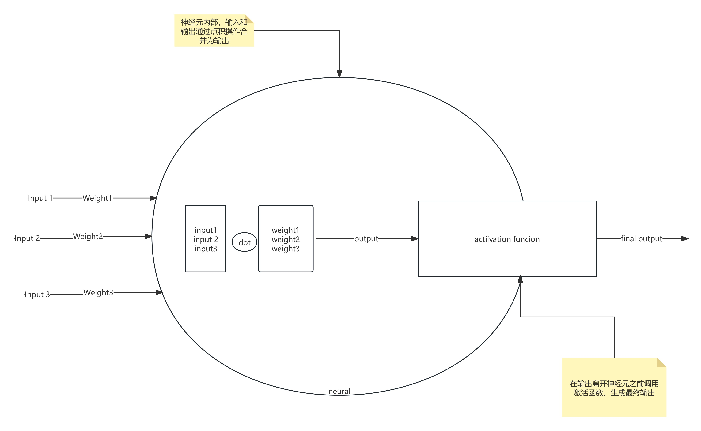
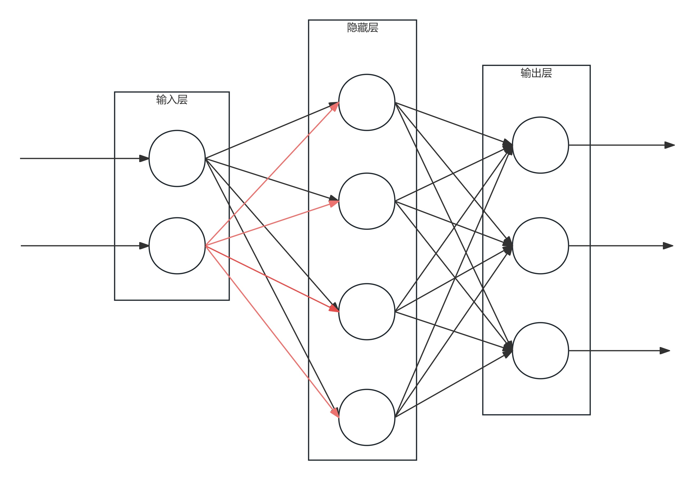
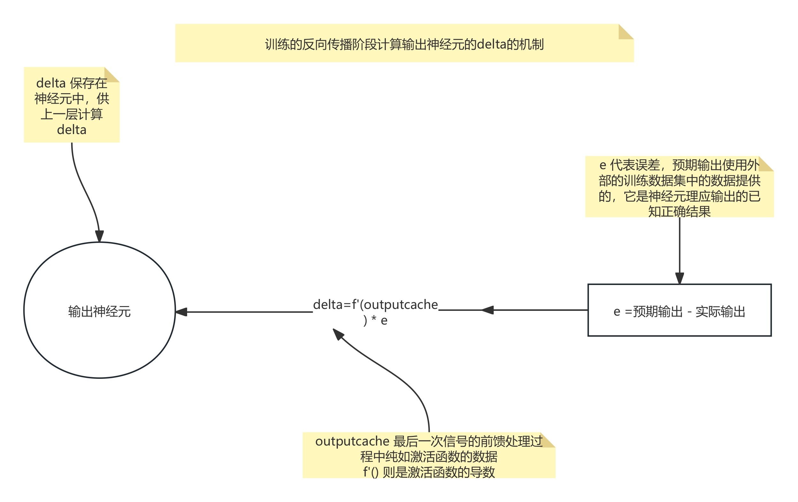
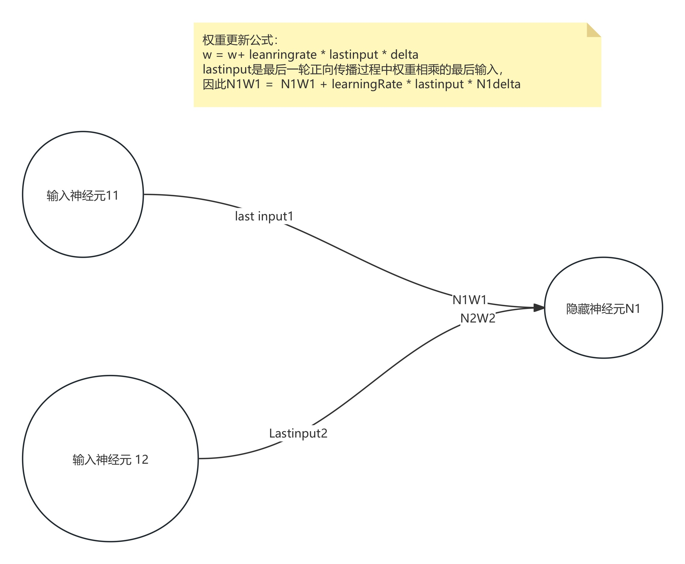
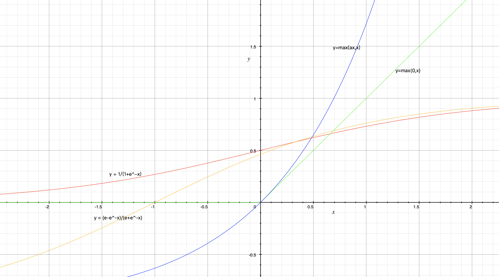

## Neural Network

Neural networks are a type of machine learning model in the field of artificial intelligence that mimics the structure and function of the human brain by processing information through connections of numerous neurons.

## Neural Network
### Basic Structure

**Input Layer:** Receives external input signals, such as pixel values of images, words in text, etc.

**Hidden Layer:** Located between the input and output layers, responsible for processing and transforming input signals. A neural network can have multiple hidden layers.

**Output Layer:** Outputs the prediction results of the neural network, such as image classification labels, sentiment orientation of text, etc.

**Neurons:** The basic units of a neural network, responsible for receiving input signals, performing calculations, and outputting results. Each neuron is connected to other neurons through connections. It has a weight vector (a string of floating-point numbers), and the input vector is passed to the neuron. The neuron combines these inputs and weights in the form of a **dot product**, then applies an **activation function** to this dot product and outputs the result.

**Connections:** Channels connecting neurons, each connection carries a weight used to adjust the strength of the signal.

**Activation Function:** A transformer for neuron output, used to introduce non-linear factors, enabling the neural network to handle complex non-linear problems.

The input layer/hidden layer/output layer are each composed of several neurons (rows/columns). Signals are transmitted unidirectionally from one layer to the next, with neurons in each layer sending their output signals as inputs to neurons in the next layer. Each neuron in each layer is connected to every neuron in the next layer.

The above figure shows the processing of a simple neuron, combining weights and input signals to generate an output signal modified by an activation function.

## Neural Network
### Classification
#### Structure Classification:

* Feedforward Neural Network: Signals flow unidirectionally in the network, from the input layer to the hidden layer to the output layer, with no feedback loops. Suitable for tasks such as classification and regression. Example: Multilayer Perceptron (MLP)
* Feedback Neural Network: Feedback loops exist in the network, allowing information to be transmitted back from later layers to earlier layers. Has memory capability and can process sequential data. Suitable for tasks such as natural language processing and speech recognition. Example: Recurrent Neural Network (RNN)

Tip: Backpropagation: **Errors are detected in the neural network's output and used to correct the neurons' errors. The greater the responsibility a neuron bears for the error, the more it will be corrected. Errors are obtained during the application phase of training the neural network.**

## Neural Network
### Classification
#### Functional Classification:

* Convolutional Neural Network (CNN)
  * **Definition:** Neural networks specifically designed for processing image data.
  * **Characteristics:** Extracts image features through convolution operations, with powerful image processing capabilities.
  * **Applications:** Image recognition, object detection, image segmentation, etc.
* **Recurrent Neural Network (RNN):**
  - **Definition:** Neural networks used for processing sequential data, such as text, speech, etc.
  - **Characteristics:** Has memory capability and can capture temporal dependencies in sequences.
  - **Applications:** Natural language processing, speech recognition, machine translation, etc.
  - **Examples:** Long Short-Term Memory (LSTM), Gated Recurrent Unit (GRU)
* **Generative Adversarial Network (GAN):**
  - **Definition:** A network composed of two neural networks (generator and discriminator) used to generate realistic data.
  - **Characteristics:** Can generate various types of data such as images, audio, video, etc.
  - **Applications:** Image generation, image restoration, super-resolution reconstruction, etc.

## Neural Network
### Backpropagation

The first step is to calculate the error between the output of the neural network for certain **inputs and the expected output**. This error exists for all neurons in the output layer (each neuron has an expected output and an actual output). Then, the derivative of the activation function of the output neuron will be applied to the output value of that neuron before its activation function was applied (a copy of the output value before applying the activation function is cached here), and the result of the derivative is multiplied by the neuron's error to find its delta (partial derivative).

Then, the delta must be calculated for each neuron in all hidden layers of the network. The responsibility that each neuron bears for the incorrect output in the output layer must be clarified. The **deltas in the output layer will be used to calculate the deltas in the previous hidden layer.** The **delta of the upper layer** can be calculated based on the **dot product of the weights of various neurons in the lower layer and the deltas already calculated in the lower layer**. Multiplying this value by the derivative of the activation function called on the neuron's final output (cached before calling the activation function) gives the delta of the current neuron.

Tip: The weights of each neuron in the network must be updated. The update method is to multiply the most recent input of each weight, the neuron's delta, and a number called the **learning rate**, and then **add the result to the existing weight**. This method of updating weights is called **gradient descent**. To give an imperfect example, it's similar to going to a place where delta is the direction of our destination, indicating that the neuron's error function is constantly approaching the point of minimum error, and the learning rate is the speed of walking, requiring constant trial and error.

Once the weights are updated, the neural network can be trained again with other inputs and expected outputs, and this process will continue to repeat.

Backpropagation is a method of adjusting weights based on the responsibility each weight bears for causing incorrect output.

## Neural Network
### Activation Functions
  * Advantages: Solves the Dead ReLU problem, simple calculation, high efficiency

  * Disadvantages: The choice of a affects the results

* Softmax Function

  * The Softmax function converts a set of real values into a probability distribution, typically used for multi-classification problems, **with the sum of all outputs equal to 1**

  * Formula:

    * $$
      Softmax(xi) = exp(xi) / Σ exp(xj)
      $$

  * Advantages: Output can be interpreted as a probability distribution, commonly used for classification problems

  * Disadvantages: When calculating, exp(xj) can easily produce excessively large values.

