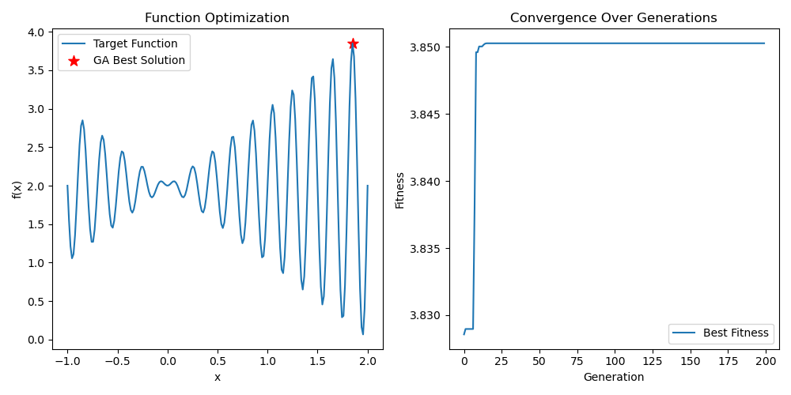

# Genetic Algorithms: Evolving Solutions for AI Optimization

Genetic algorithms (GAs) are computational models inspired by Darwinian evolution and Mendelian genetics, part of the broader family of evolutionary algorithms (EAs). They emulate “survival of the fittest” to search for optimal or near-optimal solutions in complex problem spaces by evolving a population of candidate solutions.

**Core Principles**:
- **Survival of the Fittest**: Solutions (individuals) with higher fitness are more likely to pass traits to the next generation.
- **Genetic Variation**: Offspring inherit traits from parents (via crossover) and introduce diversity through random changes (mutation).

## Table of Contents

- [1. Core Components](#1-core-components)
- [2. Workflow of Genetic Algorithms](#2-workflow-of-genetic-algorithms)
- [3. Mathematical Foundations](#3-mathematical-foundations)
- [4. Code Example: Maximizing a Function](#4-code-example-maximizing-a-function)
- [5. Applications in AI](#5-applications-in-ai)
- [6. Parameters, Strengths, and Challenges](#6-parameters-strengths-and-challenges)
- [7. Hybrid Genetic Algorithms](#7-hybrid-genetic-algorithms)
- [8. Comparison with Other Algorithms](#8-comparison-with-other-algorithms)
- [9. Visualizing Genetic Algorithms](#9-visualizing-genetic-algorithms)
- [10. Summary](#10-summary)

---

## 1. Core Components

- **Individual and Chromosome**:
  - **Individual**: A potential solution to the problem.
  - **Chromosome**: An encoded representation of an individual, often a string of genes (e.g., binary, real-valued, or integer encoding).
  - **Gene**: A single unit in the chromosome, encoding a specific feature of the solution.
- **Population**:
  - A collection of individuals, representing the current solution space.
  - **Population Size**: The number of individuals, balancing exploration (large populations) and computational efficiency (small populations).
- **Fitness Function**:
  - A function that evaluates how good a solution is. Higher fitness indicates a better solution. The design of this function is critical, as it guides the search.
- **Genetic Operators**:
  - **Selection**: Chooses individuals for reproduction based on fitness. Common methods:
    - **Roulette Wheel Selection**: Probability of selection is proportional to fitness, like spinning a weighted wheel.
    - **Tournament Selection**: Randomly picks a few individuals and selects the fittest.
    - **Rank Selection**: Assigns selection probabilities based on fitness rankings.
    - **Elitism**: Directly copies the best \( N \) individuals (the “elite”) to the next generation. This ensures high-quality solutions are not lost due to the stochastic nature of selection, crossover, or mutation, and can often accelerate convergence toward optimal or near-optimal solutions.
  - **Crossover (Recombination)**: Combines genes from two or more parents to create offspring. Common types:
    - **Single-Point Crossover**: Swaps gene segments at a random point.
    - **Two-Point Crossover**: Exchanges genes between two random points.
    - **Uniform Crossover**: Randomly swaps individual genes based on a probability.
    - **Arithmetic Crossover**: For real-valued encoding, computes a weighted average of parent genes (e.g., $\text{offspring} = \alpha \cdot \text{parent}_1 + (1 - \alpha) \cdot \text{parent}_2$ for a mixing ratio $\alpha \in [0, 1]$).
  - **Mutation**: Randomly alters genes to introduce diversity and avoid local optima. Examples:
    - **Bit Flip Mutation (Binary)**: Flips a bit (0 to 1 or vice versa).
    - **Gaussian Mutation (Real-valued)**: Adds small random perturbations, often drawn from a Gaussian distribution.

---

## 2. Workflow of Genetic Algorithms

1. **Initialization**: Generate a random initial population of individuals.
2. **Fitness Evaluation**: Compute the fitness of each individual.
3. **Evolutionary Loop**:
   - **Selection**: Choose parents based on fitness.
   - **Crossover**: Combine parent genes to produce offspring.
   - **Mutation**: Randomly modify offspring genes.
   - **Replacement**: Form a new population by replacing some or all individuals, often using elitism.
   - **Evaluate Fitness**: Recalculate fitness for the new population.
4. **Termination**: Stop when a condition is met, such as:
   - Maximum number of generations reached.
   - Fitness reaches a threshold or stops improving (convergence).
   - Time limit exceeded.
5. **Output**: Return the fittest individual as the solution.

---

## 3. Mathematical Foundations

### 3.1 Selection Probability (Roulette Wheel)
For an individual \( i \) with fitness \( f(i) \) in a population of size \( N \), the total fitness is $ F_{\text{sum}} = \sum_{j=1}^N f(j) $. The selection probability is:


$P_{\text{select}}(i) = \frac{f(i)}{F_{\text{sum}}}$

A random number $ r \in [0, 1) $ determines the selected individual by comparing it to cumulative probabilities.

### 3.2 Schema Theorem (Holland, 1975)
The schema theorem explains why GAs work by describing how “schemas” (patterns of genes) evolve.

- **Schema \( H \)**: A template with fixed genes (e.g., 0, 1) and wildcards (*). Example: \( 1*0*1 \) matches chromosomes like 10001 or 11011.
- **Order \( o(H) \)**: Number of fixed genes in \( H \). For \( 1*0*1 \), \( o(H) = 3 \).
- **Defining Length $ \delta(H) $**: Distance between the first and last fixed genes. For \( 1*0*1 \), \( \delta(H) = 5 - 1 = 4 \).
- **Schema Fitness \( f(H) \)**: Average fitness of individuals matching \( H \).

The expected number of individuals matching schema \( H \) in generation \( t+1 \), \( E[m(H, t+1)] \), is:

$E[m(H, t+1)] \geq m(H, t) \cdot \frac{f(H, t)}{f_{\text{avg}}(t)} \cdot \left[1 - P_c \cdot \frac{\delta(H)}{l-1} - o(H) \cdot P_m\right]$

Where:
- $ m(H, t) $: Number of individuals matching schema \( H \) at generation \( t \).
- $ f(H, t) $: Average fitness of individuals matching \( H \).
- $ f_{\text{avg}}(t) $: Average fitness of the population.
- $ P_c $: Crossover probability.
- $ P_m $: Mutation probability.
- $ l $: Length of the chromosome (number of genes).
- $ \delta(H) $: Defining length of the schema.
- $ o(H) $: Order of the schema.

**Key Insight (Building Block Hypothesis)**: GAs favor short, low-order, high-fitness schemas, combining them via crossover to form better solutions, driving the search toward global optima.

---

## 4. Code Example: Maximizing a Function

This example uses a GA to maximize $ f(x) = x \cdot \sin(10\pi x) + 2.0 $ over $ x \in [-1, 2] $.

**Encoding**: Binary (17 bits) for simplicity, with real-valued decoding. Real-valued encoding is also supported.

```python
import numpy as np
import matplotlib.pyplot as plt

# Problem Definition
X_BOUND = [-1, 2]  # Search range
DNA_SIZE = 17      # Binary encoding length
POP_SIZE = 100     # Population size
CROSS_RATE = 0.8   # Crossover probability
MUTATION_RATE = 0.01  # Mutation probability
N_GENERATIONS = 200   # Number of generations

def target_function(x):
    """Target function to maximize"""
    return x * np.sin(10 * np.pi * x) + 2.0

def get_fitness(pop, encoding='binary'):
    """Calculate fitness"""
    x = decode_dna(pop, encoding)
    return target_function(x)

def decode_dna(pop, encoding):
    """Decode population to x values"""
    if encoding == 'binary':
        # Binary to decimal, then map to [X_BOUND[0], X_BOUND[1]]
        decimal_val = pop.dot(2 ** np.arange(DNA_SIZE)[::-1])
        return X_BOUND[0] + decimal_val * (X_BOUND[1] - X_BOUND[0]) / (2**DNA_SIZE - 1)
    else:  # Real-valued
        return pop

def initialize_population(encoding='binary'):
    """Initialize population"""
    if encoding == 'binary':
        return np.random.randint(2, size=(POP_SIZE, DNA_SIZE))
    else:  # Real-valued
        return np.random.uniform(X_BOUND[0], X_BOUND[1], size=(POP_SIZE,))

def select(pop, fitness):
    """Roulette wheel selection"""
    fitness = np.clip(fitness - np.min(fitness) + 1e-4, 1e-4, None)  # Ensure positive fitness
    idx = np.random.choice(np.arange(POP_SIZE), size=POP_SIZE, replace=True,
                           p=fitness / np.sum(fitness))
    return pop[idx]

def crossover(parent_chromosome, population_pool, encoding='binary'):
    """
    Performs crossover between parent_chromosome and another chromosome from population_pool.
    Returns a new child chromosome.
    """
    child_chromosome = np.copy(parent_chromosome) # Start with a copy, especially important for mutable types like numpy arrays

    if np.random.rand() < CROSS_RATE:
        # Select another parent from the population_pool
        idx_other = np.random.randint(0, len(population_pool))
        other_parent_chromosome = population_pool[idx_other]

        if encoding == 'binary':
            # parent_chromosome and other_parent_chromosome are binary arrays
            if len(parent_chromosome) > 1: # Ensure there's a point to cross
                cross_point = np.random.randint(1, len(parent_chromosome))
                child_chromosome[cross_point:] = other_parent_chromosome[cross_point:]
            # If len is 1, child_chromosome remains a copy of parent_chromosome (no crossover possible)
        else:  # Real-valued encoding
            # parent_chromosome and other_parent_chromosome are scalar floats
            alpha = np.random.rand() # Mixing ratio, could also be a fixed value or from a distribution
            child_chromosome = alpha * parent_chromosome + (1 - alpha) * other_parent_chromosome
            # Note: child_chromosome (which was a copy of a scalar) is reassigned to the new scalar value.
            
    return child_chromosome # Return the (potentially modified) child

def mutate(child, encoding='binary'):
    """Mutation"""
    if encoding == 'binary':
        for i in range(len(child)):
            if np.random.rand() < MUTATION_RATE:
                child[i] = 1 - child[i]
    else:  # Gaussian mutation for real-valued
        if np.random.rand() < MUTATION_RATE:
            child += np.random.normal(0, 0.1 * (X_BOUND[1] - X_BOUND[0]))
            child = np.clip(child, X_BOUND[0], X_BOUND[1])
    return child

# Main GA Loop
def genetic_algorithm(encoding='binary'):
    pop = initialize_population(encoding)
    best_fitness_history = []

    for generation in range(N_GENERATIONS):
        fitness = get_fitness(pop, encoding)
        best_idx = np.argmax(fitness)
        best_x = decode_dna(pop[best_idx:best_idx+1], encoding)[0]
        best_fitness = fitness[best_idx]
        best_fitness_history.append(best_fitness)
        print(f"Gen {generation:03d} | Best Fitness: {best_fitness:.4f} | Best x: {best_x:.4f}")

        # Evolve population
        new_pop_list = []
        # Elitism: Directly copy the best individual(s)
        num_elite = 1  # Can adjust, e.g., int(0.05 * POP_SIZE)
        if num_elite > 0:
            elite_indices = np.argsort(fitness)[-num_elite:]  # Get indices of top individuals
            for elite_idx in elite_indices:
                new_pop_list.append(np.copy(pop[elite_idx]))

        # Fill the rest with offspring
        selected_pop = select(pop, fitness)
        num_offspring = POP_SIZE - num_elite
        for _ in range(num_offspring):
            parent_idx = np.random.randint(0, POP_SIZE) # Index for the first parent from selected_pop
            parent_chromosome_for_child = selected_pop[parent_idx] 
            child = crossover(parent_chromosome_for_child, selected_pop, encoding) # Pass encoding
            child = mutate(child, encoding)
            new_pop_list.append(child)
        pop = np.array(new_pop_list)

    # Final result
    final_fitness = get_fitness(pop, encoding)
    final_best_idx = np.argmax(final_fitness)
    final_best_x = decode_dna(pop[final_best_idx:final_best_idx+1], encoding)[0]
    print("\n--- Optimization Finished ---")
    print(f"Final Best Fitness: {final_fitness[final_best_idx]:.4f}")
    print(f"Final Best x: {final_best_x:.4f}")
    print("True Global Maximum (approx): f(1.85) ≈ 3.85")

    # Visualization
    x_values = np.linspace(X_BOUND[0], X_BOUND[1], 200)
    y_values = target_function(x_values)
    plt.figure(figsize=(10, 5))
    plt.subplot(1, 2, 1)
    plt.plot(x_values, y_values, label='Target Function')
    plt.scatter(final_best_x, final_fitness[final_best_idx], c='red', marker='*', s=100, label='GA Best Solution')
    plt.xlabel('x')
    plt.ylabel('f(x)')
    plt.legend()
    plt.title('Function Optimization')

    plt.subplot(1, 2, 2)
    plt.plot(best_fitness_history, label='Best Fitness')
    plt.xlabel('Generation')
    plt.ylabel('Fitness')
    plt.legend()
    plt.title('Convergence Over Generations')
    plt.tight_layout()
    plt.savefig('ga_result.png')
    plt.show()

if __name__ == '__main__':
    genetic_algorithm(encoding='binary')  # Try 'real' for real-valued encoding
```

### 4.1 Analysis of Results and Code



#### Runtime Results
The provided visualization (see `ga_result.png`) offers valuable insights into the GA’s performance on the target function $ f(x) = x \cdot \sin(10\pi x) + 2.0 $ over $ x \in [-1, 2] $:
- **Function Optimization Plot**: The blue curve represents the target function, a multi-modal landscape with several local maxima and a global maximum near $ x \approx 1.85 $, where $ f(x) \approx 3.85 $. The red star marks the GA’s best solution, closely aligning with this global peak, indicating successful optimization despite the function’s complexity.
- **Convergence Over Generations Plot**: The best fitness (blue line) starts near 3.83 and stabilizes around 3.85 after approximately 50 generations, remaining flat thereafter. This suggests rapid convergence to a near-optimal solution, with the elitism strategy preserving the best individual across generations.
- **Performance Insights**: The GA effectively navigates the multi-modal terrain, avoiding many local optima. The convergence within 50 generations reflects a well-tuned population size (100) and genetic operators (crossover rate 0.8, mutation rate 0.01). However, the flat line after 50 generations indicates potential stagnation, possibly due to insufficient diversity or an overly conservative mutation rate.

#### Code Interpretation
The code implements a standard GA with several key features:
- **Initialization and Encoding**: `initialize_population` generates a random population, supporting both binary (17-bit) and real-valued encodings. The binary encoding maps to the \([-1, 2]\) range via `decode_dna`, providing sufficient precision for this problem.
- **Selection**: `select` uses roulette wheel selection with a clipping mechanism to handle negative fitness values, ensuring probabilistic selection aligns with the fitness landscape.
- **Crossover**: The `crossover` function implements single-point crossover for binary encoding and arithmetic crossover for real-valued encoding (e.g., $ \text{child} = \alpha \cdot \text{parent}_1 + (1 - \alpha) \cdot \text{parent}_2 $). The random \( \alpha \) introduces variability, blending parent traits effectively.
- **Mutation**: `mutate` applies bit flip for binary or Gaussian perturbation for real-valued chromosomes, with a low mutation rate (0.01) to maintain stability while introducing diversity.
- **Elitism**: The `genetic_algorithm` loop preserves the top individual (`num_elite = 1`) in each generation, ensuring the best solution isn’t lost. This is evident in the consistent fitness improvement and final convergence.
- **Visualization**: The dual-plot output (function and convergence) provides a clear view of the solution’s location and the optimization process, with `best_fitness_history` tracking progress.

#### Performance and Improvements
The GA’s success in finding \( x \approx 1.85 \) with fitness ~3.85 demonstrates its efficacy for this multi-modal function. The rapid convergence suggests the population size and operator settings are well-balanced, while elitism likely prevented loss of the best solution. However:
- **Stagnation**: The flat convergence after 50 generations indicates limited exploration. Increasing `MUTATION_RATE` (e.g., to 0.03) or introducing a diversity metric (e.g., crowding) could help.
- **Precision**: The binary encoding (17 bits) offers decent resolution, but real-valued encoding might yield finer results for continuous optimization.
- **Scalability**: For larger problems, parallelizing fitness evaluations or using adaptive parameters could enhance efficiency.

This analysis underscores the GA’s strengths in global search and highlights areas for refinement, making the code a solid foundation for further experimentation.

---

## 5. Applications in AI

GAs excel in complex, non-differentiable, or multi-modal optimization problems in AI.

1. **Neural Networks**:
   - **Neural Architecture Search (NAS)**: Evolve network topologies (layers, neurons, connections) or activation functions. Example: NEAT evolves both structure and weights.
   - **Hyperparameter Tuning**: Optimize learning rates, batch sizes, dropout rates, or even aspects of layer configurations (e.g., number of attention heads, feed-forward network dimensions if not performing full NAS) for models, including large language models (LLMs).
   - **Weight Optimization**: Evolve weights for small networks or in non-differentiable settings.

2. **Reinforcement Learning**:
   - **Policy Search**: Evolve policies (e.g., neural networks mapping states to actions) in sparse-reward or complex environments.
   - **Behavior Evolution**: Optimize robot controllers or game AI strategies.
   - **Reward Shaping**: Evolve reward functions to guide learning.

3. **Machine Learning**:
   - **Feature Selection**: Evolve optimal feature subsets for high-dimensional data.
   - **Rule Discovery**: Learn IF-THEN rules for decision systems.
   - **Clustering**: Optimize cluster assignments or parameters (e.g., K in K-Means).

4. **Computer Vision**:
   - Optimize image segmentation, object detection parameters, or model configurations.

5. **Robotics**:
   - **Path Planning**: Find optimal paths in complex environments.
   - **Motion Planning**: Optimize robot arm trajectories.
   - **Multi-Robot Coordination**: Evolve collaborative strategies.

6. **Generative AI**:
   - Evolve generative model architectures (e.g., for GANs or VAEs), optimize their hyperparameters, or refine latent space sampling strategies or objective functions.

---

## 6. Parameters, Strengths, and Challenges

### 6.1 Key Parameters
- **Population Size**: 50–500. Larger sizes enhance exploration but increase computation.
- **Crossover Rate ($ P_c $)**: 0.6–0.9. Higher rates generate diverse offspring but may disrupt good schemas.
- **Mutation Rate ($ P_m $ )**: 0.001–0.1. Low rates maintain stability; higher rates boost diversity.
- **Generations**: 100–1000, depending on convergence needs.
- **Tuning Strategies**: Use grid search, random search, or adaptive methods (e.g., adjusting $ P_m $ based on diversity).

### 6.2 Strengths
- Versatile, requiring minimal assumptions about the problem.
- Effective global search for multi-modal or non-differentiable functions.
- Parallelizable, leveraging population-based exploration.
- Robust to noisy or incomplete data.
- Flexible encoding for diverse problems.

### 6.3 Challenges
- **Premature Convergence**: Risk of converging to local optima. Mitigate with diversity-preserving techniques like niching or crowding.
- **Parameter Sensitivity**: Requires careful tuning of population size, $ P_c $, and $ P_m $.
- **Computational Cost**: Fitness evaluations (e.g., training a neural network) can be expensive.
- **Encoding Complexity**: Designing effective chromosome representations for complex AI structures is non-trivial.

---

## 7. Hybrid Genetic Algorithms

Combining GAs with other methods enhances performance. These hybrid approaches are often referred to as **Memetic Algorithms**, particularly when local search is tightly integrated into the evolutionary loop.
- **GA + Local Search**: Use GA for global exploration and gradient descent or simulated annealing for local refinement. Example: Evolve neural network architectures, then fine-tune weights with backpropagation.
- **GA + Machine Learning**: Optimize meta-level configurations (e.g., model selection, preprocessing pipelines) while training models conventionally.

---

## 8. Comparison with Other Algorithms

- **Gradient-Based Methods**: GAs excel in non-differentiable, multi-modal problems, unlike gradient descent, which may get stuck in local optima. However, GAs are slower for differentiable functions.
- **Evolution Strategies (ES)**: Focus on real-valued optimization with mutation-driven search, popular in reinforcement learning.
- **Genetic Programming (GP)**: Evolves programs or expressions, suited for symbolic regression.
- **Differential Evolution (DE)**: Efficient for real-valued optimization with differential updates.

**When to Use GAs**: Ideal for complex, non-linear, or discrete optimization problems in AI, such as NAS or feature selection, where gradient-based methods struggle.

---

## 9. Visualizing Genetic Algorithms

Visualizations aid understanding:
- **Function Optimization**: Plot the target function with the GA’s best solution (see `ga_result.png`).
- **Convergence**: Graph best fitness over generations to show progress.
- **Diversity**: Plot population diversity (e.g., variance in chromosomes) to assess exploration.
- **Population Distribution**: For 1D or 2D problems, a population distribution plot shows how individuals are spread across the search space, helping diagnose premature convergence or identify multiple promising regions.

---

## 10. Summary

Genetic algorithms are powerful tools for optimizing complex AI problems by mimicking natural evolution. They excel in global search, handle non-differentiable objectives, and are highly flexible. By carefully tuning parameters, leveraging elitism, and using hybrid approaches like memetic algorithms, GAs can tackle neural architecture search, reinforcement learning, and generative AI, making them a versatile choice for AI practitioners.
