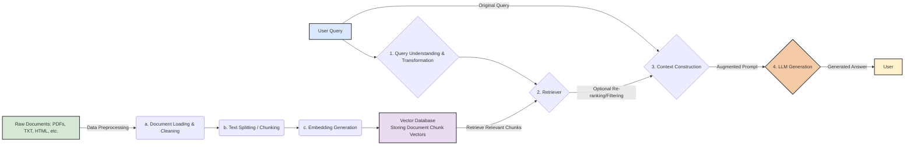

# Retrieval-Augmented Generation (RAG): Bridging Knowledge Gaps

Imagine a highly intelligent large language model (LLM) that’s been “locked in a room” with only the knowledge it was trained on. When asked about a recent event or a niche topic, it might “make up” answers—a phenomenon known as hallucination. Retrieval-Augmented Generation (RAG) solves this by equipping the LLM with a dynamic “reference library” (an external knowledge base). Before answering, RAG retrieves the latest or most relevant information, blending it with the model’s capabilities to deliver accurate, informed responses.

## Core Components of RAG

**Core Idea**: Retrieval + Generation

- **Retrieval**: When a user poses a question, the RAG system first searches a vast knowledge base to find the most relevant document snippets or data.
- **Augmentation**: These retrieved pieces are combined with the original query as context, enhancing the input to the LLM.
- **Generation**: The LLM uses this enriched context to produce a precise, information-rich answer.



### Phase 1: Data Preparation and Index Building (Offline Process - Typically Done Once, Unless Knowledge Base Updates)

**Goal**: Transform raw knowledge documents into a format the LLM can efficiently retrieve and utilize.

#### D. Raw Documents
**Sources**: Any text you want the LLM to leverage, such as:
- **Internal Documents**: Product manuals, technical docs, policy files, meeting notes (PDF, DOCX, Confluence, SharePoint).
- **Public Data**: Wikipedia, domain-specific books, news articles, blogs (HTML, TXT).
- **Specialized Databases**: Medical papers, legal texts, etc.

#### E. a. Document Loading & Cleaning
- **Loading**:
  - **Tools**: Frameworks like LangChain or LlamaIndex offer robust DocumentLoaders for various formats.
  - Examples: PDFPlumberLoader or PyMuPDFLoader for PDFs, TextLoader for TXT, UnstructuredHTMLLoader for HTML, Docx2txtLoader for DOCX.
  - **Process**: Reads file content and converts it into a unified text format.
- **Cleaning**:
  - Removes unnecessary characters, formatting tags (e.g., HTML, Markdown), headers/footers, duplicates.
  - May include spell correction or term standardization.
  - **Goal**: Deliver clean, noise-free text for downstream processing.

#### F. b. Text Splitting / Chunking
- **Why Split?**
  - **LLM Context Limits**: Most LLMs can’t handle very long texts in one go.
  - **Retrieval Accuracy**: Breaking large documents into smaller, semantically focused chunks improves precision. A single vector for a large document might retrieve irrelevant noise.
  - **Embedding Quality**: Shorter texts yield better semantic capture by embedding models.
- **Splitting Strategies**:
  - **Fixed-Size Splitting**: Divides text into chunks of a fixed character count (e.g., 500 characters) with overlap (e.g., 50 characters) to preserve context.
    - **Pros**: Simple to implement.
    - **Cons**: May cut mid-sentence or disrupt semantics.
    - **Example**:
      ```python
      chunk_size = 500
      chunk_overlap = 50
      text = "This is a long example text..."
      chunks = [text[i:i + chunk_size] for i in range(0, len(text), chunk_size - chunk_overlap)]
      ```
  - **Recursive Character Splitting**: Uses delimiters (e.g., `\n\n`, `\n`, `.`) to split recursively until chunks fit, a common LangChain approach.
    - **Pros**: Preserves semantic units (paragraphs, sentences).
    - **Cons**: Slightly complex to execute.
  - **Semantic Splitting**: Employs NLP models to identify semantic breakpoints, ensuring each chunk is a coherent unit.
    - **Pros**: High semantic cohesion.
    - **Cons**: Computationally intensive.
  - **Token-Based Splitting**: Splits based on LLM tokenizer output, controlling token count.
    - **Pros**: Precise for LLM input limits.
    - **Cons**: Model-specific.
- **Chunk Size**: A critical hyperparameter—too small loses context, too large adds noise or exceeds LLM capacity. Typically 300–1000 tokens, adjusted via experimentation.

#### G. c. Embedding Generation
- **What is Embedding?**
  - Maps discrete text (words, sentences, paragraphs) into a continuous, dense vector space where semantically similar texts cluster closely (e.g., “king” and “queen” are near, as are “apple” and “banana”).
- **Embedding Models**:
  - **Role**: Converts text chunks into vectors.
  - **Examples**: OpenAI’s text-embedding-ada-002, text-embedding-3-small/large (commercial, high performance), Sentence-Transformers (e.g., all-MiniLM-L6-v2, BAAI/bge-large-en, open-source, deployable locally), Cohere Embeddings (commercial).

#### H. Vector Database
- **Role**: Stores, indexes, and retrieves document chunk vectors efficiently.
- **Why Not Traditional Databases?**: Relational databases struggle with high-dimensional vector similarity searches; brute-force traversal is too slow for large datasets.
- **Core Functions**:
  - **Storage**: Holds vectors with metadata (e.g., original text, source, date).
  - **Indexing**: Uses specialized algorithms for fast similarity search:
    - **FLAT**: Exact but slow, computes all distances.
    - **IVF (Inverted File Index)**: Divides space into regions, searches only relevant ones.
    - **HNSW (Hierarchical Navigable Small World)**: Graph-based approximate nearest neighbor search, fast and effective.
    - **PQ/SQ (Product/Scalar Quantization)**: Compresses vectors, reducing storage/computation at the cost of some accuracy.
  - **Similarity Search**: Finds Top-K vectors closest to a query using metrics like:
    - **Cosine Similarity**: Measures vector direction alignment, range [-1, 1], higher is better. \( \text{similarity} = (A \cdot B) / (\|A\| \|B\|) \).
    - **Euclidean Distance (L2)**: Straight-line distance, smaller is better.
    - **Dot Product**: Equivalent to cosine if vectors are normalized.

### Phase 2: Runtime Retrieval and Generation (Online Process - Executes Per User Query)

- **A. User Query**
  - A natural language question from the user.

- **B. 1. Query Understanding & Transformation (Optional but Critical)**
  - **Direct Embedding**: Simplest approach—converts the query to a vector using the same model as documents.
  - **Query Enhancement/Rewriting**:
    - **Purpose**: Clarifies vague queries or aligns them with knowledge base phrasing.
    - **Methods**:
      - **HyDE (Hypothetical Document Embeddings)**: LLM generates a hypothetical answer, embeds it, and uses it to retrieve. E.g., for “How to evaluate RAG performance?”, it might create “Evaluating RAG involves accuracy, recall, and answer relevance metrics…” then embed that.
      - **Multi-Query Generation**: LLM generates multiple query variants (e.g., rephrasings), retrieves separately, and merges results to boost recall.
      - **Query Expansion**: Adds synonyms or related terms.
    - **Example (HyDE)**:
      - Query: “How is RAG performance assessed?”
      - Hypothetical: “RAG performance is assessed using metrics like retrieval accuracy, recall, and answer faithfulness…”
      - Embed and retrieve.

- **C. 2. Retriever**
  - **Input**: (Transformed) query vector.
  - **Action**: Performs similarity search in the vector database, returning Top-K chunk vectors with original text/metadata.
  - **Example**: `results = vector_db.search(query_vector, k=5)` (top 5 matches).
  - **Deep Dive into Retrieval**:
    - **Richer Retrieval Strategies**:
      - **Sparse Retrieval**: E.g., BM25 or TF-IDF, relies on keyword matching. Ideal for exact term matches (e.g., technical terms, code snippets), complementing dense retrieval.
      - **Dense Retrieval**: Based on semantic vector similarity, as detailed earlier, excels in capturing meaning over keywords.
      - **Hybrid Search**: Combines sparse and dense retrieval, often fusing scores (e.g., weighted sum, Reciprocal Rank Fusion - RRF). $ \text{RRF} = \sum_{i} 1 / (k + \text{rank}_i) $, where $ k $ is a small constant (e.g., 60) to prevent overly large scores when $ \text{rank}_i $ is low. Effective for real-world scenarios needing both precision and recall, such as mixed-domain queries.
    - **Parent Document Retriever / Hierarchical Retrieval**:
      - **Issue**: Small chunks may lack context despite semantic focus.
      - **Solution**: Retrieves small chunks first, then returns their parent document or a larger context window. LangChain supports this via `ParentDocumentRetriever`.
    - **Self-Querying Retriever**:
      - LLM dynamically generates metadata filters (e.g., {"project": "A", "year": 2023}) based on the query and metadata (e.g., creation date, source). Useful for targeted searches like “Latest 2023 updates on Project A.”
    - **Re-ranking Details**:
      - **Cross-Encoder**: Rescores (query, chunk) pairs for finer relevance, as noted.
      - **LLM-Based Re-ranking**: LLM evaluates chunk relevance and ranks them directly, though costly. Suitable for high-stakes applications.
      - **Model Choices**: Cohere Rerank, open-source bge-reranker series, offering trade-offs in accuracy, speed, and cost.

- **I. 3. Context Construction**
  - **Goal**: Integrates retrieved info and query into a clear prompt for the LLM.
  - **Method**: Uses a prompt template.
  - **Example Template**:
    ```plaintext
    Answer the user’s question based on the provided context. If the answer isn’t found, say “I don’t know” and suggest missing info or clarification questions.

    Context:
    ---
    [doc1] This is content from document 1.
    ---
    [doc2] This is content from document 2.
    ---
    [doc3] This is content from document 3.
    ---

    User Question: [Original Query]

    Answer:
    ```
  - **Advanced Context Construction & Utilization**:
    - **Context Compression**:
      - **Why**: Long or numerous chunks may exceed LLM context limits or dilute focus.
      - **Methods**:
        - **LLM-based Summarization**: Summarizes each chunk or the combined context.
        - **Selective Retention**: Keeps only the most relevant sentences (e.g., via embedding similarity or keyword matching). LangChain’s `ContextualCompressionRetriever` exemplifies this.
      - **Lost in the Middle**: LLMs prioritize beginning and end of long contexts, often ignoring the middle, underscoring the need for optimization and re-ranking.
    - **Prompt Engineering**:
      - **Refined Instructions**: E.g., “Prioritize context over internal knowledge; resolve conflicts by favoring context. Output as a JSON list if requested.”
      - **Source Marking**: Tags chunks (e.g., “[doc1]”) for LLM to cite in answers, enhancing traceability.

- **J. 4. LLM Generation**
  - **Input**: Augmented prompt.
  - **Action**: LLM generates an answer using its language skills and the provided context.
  - **Key**: Should stay faithful to the context, not its internal (potentially outdated) knowledge.
  - **Enhancing and Controlling Generation**:
    - **Citation and Grounding**: LLM cites sources (e.g., “Based on [doc1]…”), using numbered chunks from the context. Ensures verifiability.
    - **Handling “I Don’t Know”**: Beyond stating uncertainty, LLM can:
      - Identify missing context (e.g., “Requires data on 2024 trends”).
      - Pose clarifying questions (e.g., “Do you mean Project A or B?”) if permitted.
  - **Model Choices**: GPT-4, Claude 3 Opus (high capability), GPT-3.5-Turbo, Llama 3 8B/70B, Mixtral (cost/performance balance).

- **K. User**
  - Receives the final answer.
  - **Optional Feedback**: User input can refine the system (e.g., marking relevant chunks or good answers).

#### Practical Considerations
- **Chunking Experiments**: No one-size-fits-all strategy; requires experimentation.
- **Embedding Model Alignment**: Ensure query and document embedding models match or are compatible.
- **Metadata Utility**: Leverage metadata for filtering and relevance (e.g., date, source).
- **Monitoring & Logging**: Track queries, retrievals, and LLM outputs for performance analysis and issue detection.

## Key Components of RAG
- **Knowledge Base / Document Corpus**: The external data source (PDFs, web pages, internal docs, FAQs).
- **Data Preprocessing**: Cleans and chunks raw documents for retrieval.
- **Embedding Model**: Converts text (queries, chunks) into vectors capturing semantics (e.g., Sentence-BERT, OpenAI Ada, Cohere).
- **Vector Representation**: Similar texts cluster in vector space.
- **Vector Database**: Stores and retrieves vectors efficiently (e.g., FAISS, Pinecone, Weaviate, Milvus, ChromaDB).
- **Retriever**: Searches the database for relevant chunks using dense retrieval or hybrid approaches.
- **LLM**: Generates answers from the augmented prompt (e.g., GPT series, Llama, Mixtral).

## Key Advantages of RAG
- **Improved Accuracy**: Reduces hallucination with up-to-date, domain-specific knowledge.
- **Dynamic Updates**: Refreshes the knowledge base without retraining the LLM, faster and cheaper than pretraining or fine-tuning.
- **Traceability**: Links answers to retrieved chunks, enhancing transparency.
- **Domain Adaptability**: Easily tailored to specific fields with a relevant knowledge base.
- **Cost Efficiency**: More affordable than training or fine-tuning LLMs from scratch.

## Challenges and Future Directions
- **Retrieval Quality**: Performance hinges on accurate retrieval. Challenges include understanding query intent, handling multi-hop questions, and assessing result quality.
  - **Directions**: Smarter query rewriting, hybrid retrieval, re-ranking, adaptive search.
- **Context Length**: Limited LLM context windows can lead to information loss (“Lost in the Middle”).
  - **Directions**: Better chunking, summarization, context compression.
- **Generation Control**: Balancing faithfulness to context with creativity.
  - **Directions**: Refined prompt engineering, instruction tuning for context adherence.
- **Evaluation**: Assessing end-to-end performance is complex, lacking unified metrics.
  - **Directions**: Develop frameworks like RAGAS for specialized evaluation.
- **Advanced Workflows**:
  - **Iterative RAG**: Multiple retrieval-generation cycles to refine answers.
  - **Self-Reflective RAG**: LLM evaluates retrieved data, triggering new searches if insufficient.
  - **Graph RAG**: Uses knowledge graphs for structured retrieval and reasoning (e.g., linking entities in medical literature).
  - **Fusion of Fine-Tuning and RAG**: Pre-tune LLM on domain knowledge, then use RAG for dynamic updates (e.g., medical diagnostics with latest research).
  - **Proactive/Agentic RAG**: LLM actively decides on additional info needs, possibly calling tools (e.g., search API) if the knowledge base lacks answers, emphasizing decision-making.
  - **Multimodal RAG**: Extends to images, audio, etc., with LLMs generating multimodal outputs (e.g., describing images retrieved from a dataset).

## Evaluation Expansion
- **Retrieval**:
  - **Precision@K, Recall@K**: Measure exactness and coverage of Top-K results.
  - **Normalized Discounted Cumulative Gain (nDCG)**: Accounts for ranking quality. \( \text{nDCG} = \frac{\text{DCG}}{\text{IDCG}} \), where DCG discounts lower ranks.
- **Generation**:
  - **Answer Correctness/Accuracy**: Assessed by humans or a stronger LLM (e.g., GPT-4 as a judge).
  - **Conciseness, Fluency, Coherence**: Evaluates language quality.
- **End-to-End**:
  - **No Answer Rate**: Proportion of queries unanswered due to insufficient data.
  - **Hallucination Rate**: Quantifies fabricated content.
- **Evaluation Datasets**: High-quality, domain-specific datasets are crucial for robust performance benchmarking.

## Architecture and Deployment Considerations
- **Modularity & Scalability**: RAG’s components (ingestion, embedding, indexing, retrieval, generation) are independently optimizable, enabling iterative upgrades (e.g., swapping vector databases).
- **Cost & Latency**:
  - **Cost Factors**: Embedding API calls, vector database fees, LLM generation costs.
  - **Latency Drivers**: Retrieval and LLM generation; optimize with caching, faster models, or efficient indexing (e.g., HNSW).
- **Security & Privacy**:
  - **Data Protection**: Encrypt data at rest and in transit for sensitive info.
  - **Access Control**: Restrict knowledge base access to authorized users.
  - **Mitigation**: Prevent prompt injection and data leaks with input validation.

## Practical Pitfalls and Best Practices
- **Chunking Art**: No one-size-fits-all strategy; experiment with sizes and overlaps.
- **Embedding Alignment**: Use consistent embedding models for queries and documents.
- **Metadata Leverage**: Maximize metadata for filtering and relevance.
- **Monitoring & Logging**: Log queries, retrievals, and LLM outputs to track performance and troubleshoot.

## Example Code Snippet
Here’s a basic RAG pipeline using LangChain and FAISS:

```python
import os
from langchain.document_loaders import PyPDFLoader
from langchain.text_splitter import RecursiveCharacterTextSplitter
from langchain.embeddings import OpenAIEmbeddings
from langchain.vectorstores import FAISS
from langchain.chat_models import ChatOpenAI  # Updated to ChatOpenAI for modern compatibility
from langchain.chains import RetrievalQA

# Set API key (e.g., from environment or .env file)
os.environ["OPENAI_API_KEY"] = "your-api-key-here"

# Load and split documents
loader = PyPDFLoader("knowledge.pdf")
documents = loader.load()
text_splitter = RecursiveCharacterTextSplitter(chunk_size=500, chunk_overlap=50)
chunks = text_splitter.split_documents(documents)

# Generate embeddings and build vector store
embeddings = OpenAIEmbeddings()
vector_store = FAISS.from_documents(chunks, embeddings)

# Set up LLM and retrieval chain
llm = ChatOpenAI(model_name="gpt-3.5-turbo")  # Uses chat model for conversational tasks
qa_chain = RetrievalQA.from_chain_type(
    llm=llm, chain_type="stuff", retriever=vector_store.as_retriever()
)  # "stuff" concatenates all chunks; consider map_reduce, refine, or LCEL for large docs

# Query
query = "How does RAG improve LLM accuracy?"
answer = qa_chain.run(query)
print(answer)
```

This snippet loads a PDF, chunks it, embeds with OpenAI (requiring an API key), stores in FAISS, and uses `ChatOpenAI` for modern chat-based generation. The `stuff` chain is simple but may need alternatives (e.g., `map_reduce`, `refine`, or LangChain Expression Language - LCEL) for extensive documents, offering greater flexibility in newer workflows.
