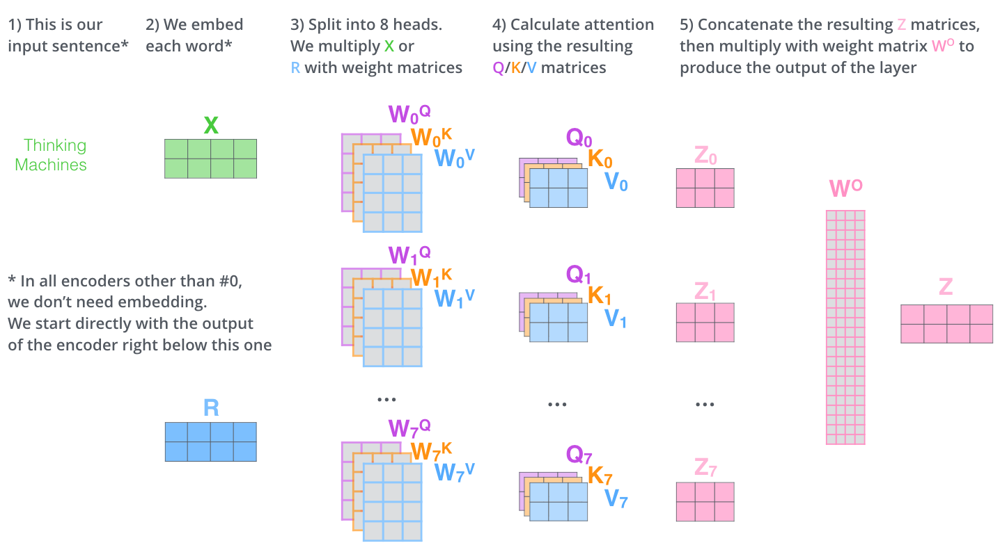

>个人理解：如图，这是多头注意力机制中的底层矩阵计算。我的理解如此，语句嵌入为词向量X，然后通过单个Q，K，V矩阵的运算，得到这个词出现的频率。最后组合起来，和权重矩阵相乘，就能得到一整个多头注意力的矩阵Z？

嵌入 -> 分头计算 -> 拼接 -> 输出

**错误点**：`通过单个Q，K，V矩阵的运算，得到这个词出现的频率`。
**正确解释**：Q, K, V 的运算**不是为了计算词频**，而是为了计算**一个词应该对句子中其他所有词（包括它自己）投入多少`注意力`或`关联度`**，并根据这个关联度来重新组合信息。

---

### **来逐一解析图中的5个步骤**

#### **步骤 1 & 2: 输入 (Input) 与 嵌入 (Embedding)**

*   **理解:** 语句嵌入为词向量X。
*   **完全正确！** 输入句子 "Thinking Machines" 被转换成一个矩阵 `X`。在这个简化的例子中，`X` 是一个 2x4 的矩阵（2个词，每个词用4维向量表示）。在真实的Transformer中，这个维度通常是512。

#### **步骤 3: 拆分成8个头 (Split into 8 heads)**

*   **你的理解:** 通过单个Q, K, V矩阵运算。
*   **这里需要细化:** 并不是只有一个Q, K, V矩阵。为了实现“多头”，模型准备了**8组完全不同**的权重矩阵。
    *   对于第0个头 (Head 0)，有一组专属的 $W₀^Q, W₀^K, W₀^V$。
    *   对于第1个头 (Head 1)，有另一组专属的 $W₁^Q, W₁^K, W₁^V$。
    *   ...以此类推，直到第7个头。
*   然后，对于每个头，都用输入 $X$ 去乘以它专属的权重矩阵，得到该头的 $Q, K, V$。
    *   $Q₀ = X * W₀^Q$
    *   $K₀ = X * W₀^K$
    *   $V₀ = X * W₀^V$
*   **目的**：让8个头从8个不同的`子空间`或`视角`去分析句子。

#### **步骤 4: 计算注意力 (Calculate attention)|关联度 - 核心步骤**

*   **理解:** 得到这个词出现的频率。
*   **这是关键的修正点！** 这一步计算的是一个**全新的、融合了上下文信息的词向量**。我们以Head 0为例，它生成的$Z_{\theta}$是怎么来的：
    1.  **计算关联度分数 (Score):** 用 $Q_{\theta}$ 去和 $K_{\theta}$ 做点积运算 ($Q_{\theta} * K_{\theta}^T$)。这个得分矩阵的每一行代表一个词，它与其他所有词的“匹配程度”。分数越高，代表关联越紧密。
    2.  **转换成权重 (Weights):** 将得分矩阵通过 `softmax` 函数，转换成一个概率分布。现在，矩阵的每一行加起来都等于1。这个权重矩阵 $A$ 才代表“注意力”，即一个词应该把多少比例的注意力放在其他词上。
    3.  **加权求和 (Weighted Sum):** 用上一步得到的注意力权重 $A$ 去乘以 $V_{\theta}$ 矩阵。$Z_{\theta} = A * V_{\theta}$。
    
*   **结果 $Z_{\theta}$ 的含义:** $Z_{\theta}$ 是一个新的词向量矩阵。对于 "Thinking" 这个词，它在$Z_{\theta}$中的新向量，是句子中所有词（"Thinking" 和 "Machines"）的 $V_{\theta}$ 向量的加权平均。权重就是刚刚算出的注意力分数。所以，$Z_{\theta}$ 是一个**充分吸收了上下文信息的新表示**，而不是词频。

#### **步骤 5: 拼接 (Concatenate) 与输出**

*   **你的理解:** 组合起来，和权重矩阵相乘，就能得到一整个多头注意力的矩阵Z。
*   **完全正确！**
    1.  **拼接 (Concatenate):** 将8个头各自计算出的结果 $Z_{\theta}$ 沿着特征维度拼接在一起。如果每个 $Z_{\theta}$ 是 2x64 维，拼接后就成了一个 2x512 维的大矩阵。
    2.  **最终投影 (Final Projection):** 将这个拼接后的大矩阵再乘以一个最终的权重矩阵 $W^O$。这一步是为了融合8个头的信息，并将其投影回模型的主维度（512维），以便于下一层编码器处理。最终得到输出矩阵 $Z$。

---

### **一个生动的比喻来理解 Q, K, V**

把自注意力想象成在图书馆查资料的过程：

1. 你脑子里有一个**问题/查询 (Query, Q)**，比如`神经网络的历史`。
2. 图书馆里每一本书都贴着一个**标签/关键词 (Key, K)**，比如`深度学习`、`AI简史`、`计算机视觉`。
3. 你用你的**查询(Q)**去和每本书的**关键词(K)**进行匹配，得到一个相关度列表（这就是`Q*K^T`和`softmax`的过程）。
    * 《AI简史》：90%相关
    * 《计算机视觉》：30%相关
    * 《园艺入门》：0%相关
4. 每本书都有它实际的**内容 (Value, V)**。
5. 你最终的**研究报告 (输出Z)**，不是只看最相关的那本书，而是根据相关度，把所有书的内容做个**加权总结**：你报告的90%内容来自《AI简史》，30%来自《计算机视觉》，0%来自《园艺入门》。（*注意：这里的权重经过softmax后加和为1，所以更准确的说法是，比如70%来自《AI简史》，23%来自《计算机视觉》等*）。

**所以，注意力机制的输出是一个融合了所有相关信息的、全新的、上下文感知的表示，而不是简单的计数或频率。**

### **总结：你的理解 vs. 正确的解释**

| 步骤 | 你的理解 | 正确的解释 |
| :--- | :--- | :--- |
| **步骤 1 & 2** | 语句嵌入为词向量X | **正确** |
| **步骤 3** | 通过单个Q, K, V矩阵运算 | 用**8组不同**的Q,K,V权重矩阵，生成8个头的Q,K,V |
| **步骤 4** | 得到这个词出现的频率 | 计算词与词的**关联度权重**，并用此权重对**V矩阵进行加权求和**，得到**融合上下文的新向量Z₀** |
| **步骤 5** | 组合起来，和权重矩阵相乘，得到Z | **正确**，将8个头的输出Z₀-Z₇拼接并与W^O相乘，融合信息得到最终输出Z |

> ❌ `得到这个词出现的频率` → 错误。应该是：得到这个词与其他词的相关性（注意力权重），然后用它来动态聚合上下文信息。
> 多头注意力机制不是在计算词频，而是在动态学习词与词之间的依赖关系，并根据这种关系有选择地融合上下文信息。这是 Transformer 强大表达能力的核心所在。