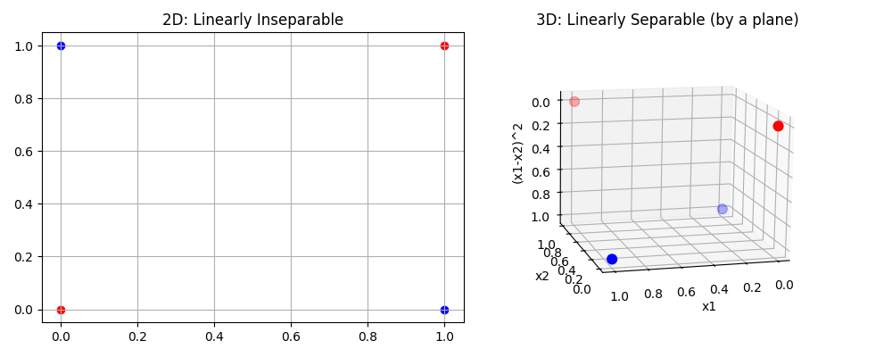
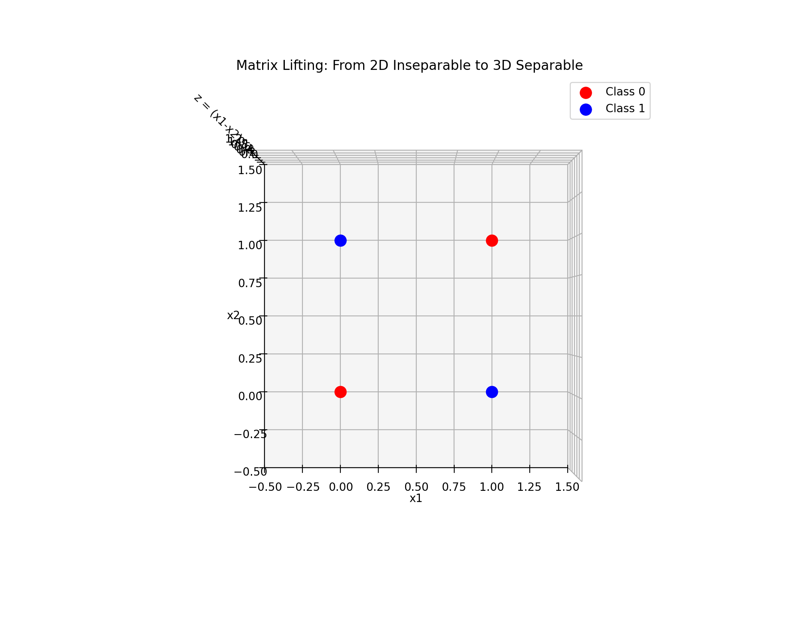

# [0.2] 矩阵论：数据的几何与变换 (Matrix Theory: Geometry & Transformation)

**摘要**：矩阵论是机器学习的**母语**。从微观的**数据表示**（特征与参数矩阵）到宏观的**模型运算**（前向传播即矩阵乘法），从**优化过程**的梯度流转到**降维技术**（PCA/SVD）的压缩本质，矩阵运算无处不在。然而，在深度学习中，矩阵不仅仅是静态的数字表格，它是**动态的空间变换算子**。它既能依据 **Cover 定理** 将低维数据**升维**以实现线性可分（Embedding/核技巧），也能将高维数据**压缩**以提取精华（LoRA）。本章将跳过繁琐的手算行列式，直接探讨矩阵的秩与模型容量的深层联系、特征值谱对训练稳定性的决定性作用，以及 SVD 在大模型高效微调中的数学原理。

---

## 1. 向量与张量：数据的容器

在 PyTorch/TensorFlow 中，我们处理的不仅仅是矩阵，而是**张量 (Tensor)**。

### 1.1 维度的物理意义
*   **标量 (0-D)**：Loss 值，学习率。
*   **向量 (1-D)**：特征向量 $\mathbf{x} \in \mathbb{R}^d$，偏置 $\mathbf{b}$。
*   **矩阵 (2-D)**：权重 $\mathbf{W} \in \mathbb{R}^{out \times in}$，灰度图。
*   **张量 (N-D)**：
    *   $(B, C, H, W)$：一批图像数据（Batch Size, Channel, Height, Width）。
    *   $(B, T, D)$：Transformer 的输入（Batch, Sequence Length, Embedding Dim）。

### 1.2 广播机制 (Broadcasting)
这是矩阵代数在工程上的重要扩展。当两个维度不同的张量进行运算时，系统会自动“复制”低维张量以匹配高维。
*   **数学本质**：$\mathbf{Y} = \mathbf{W}\mathbf{X} + \mathbf{b}$。
*   这里 $\mathbf{W}\mathbf{X}$ 的形状是 $(B, D_{out})$，而 $\mathbf{b}$ 是 $(D_{out})$。
*   广播机制隐式地将 $\mathbf{b}$ 扩展为 $(1, D_{out})$ 然后沿 Batch 维度复制 $B$ 次。这极大地提高了内存效率。

---

## 2. 线性变换与神经网络

全连接层 (Linear Layer) 的数学本质是仿射变换 (Affine Transformation)：
$$ \mathbf{y} = f(\mathbf{W}\mathbf{x} + \mathbf{b}) $$

### 2.1 矩阵乘法的几何视角
矩阵 $\mathbf{W}$ 将输入空间 $\mathbb{R}^{in}$ 映射到输出空间 $\mathbb{R}^{out}$。
*   **对角阵**：沿坐标轴缩放。
*   **正交阵**：旋转或反射（不改变向量长度，保范数）。
*   **非线性激活**：$f(\cdot)$ (如 ReLU) 的作用是**折叠**空间。如果没有非线性，无论多少层网络叠加，最终都等价于一个单层线性变换 $\mathbf{W}_{total} = \mathbf{W}_n \dots \mathbf{W}_1$。

### 2.2 矩阵的秩 (Rank) 与模型容量
**秩**度量了矩阵行/列向量张成的空间的维数，即**有效信息的维度**。
*   **秩崩溃 (Rank Collapse)**：深度神经网络中，如果权重矩阵的秩逐渐降低，深层的特征表示将退化到一个低维子空间，导致模型无法区分复杂类别。
*   **死神经元 (Dead Neurons)**：可以理解为 $\mathbf{W}$ 中某些行变成了零向量，导致有效秩下降。

---

## 3. 升维与映射：Cover 定理 (Lifting & Mapping)

矩阵不仅能降维（压缩），通过增加列数，它还能实现**升维 (Lifting)**。这是处理复杂非线性数据的关键。

### 3.1 Cover 定理 (Cover's Theorem)
**“将一个复杂的非线性分类问题投射到高维空间，它更有可能变得线性可分。”**

考虑经典的 **XOR 问题**：在二维平面上，$(0,0), (1,1)$ 为负类，$(0,1), (1,0)$ 为正类。无论你怎么画直线，都无法将它们分开。
但是，如果我们定义一个升维映射 $\phi: \mathbb{R}^2 \to \mathbb{R}^3$：
$$ \phi([x_1, x_2]) = [x_1, x_2, x_1 x_2] $$
在这个三维空间中，四个点变成了 $(0,0,0), (1,1,1)$ 和 $(0,1,0), (1,0,0)$。此时，存在一个二维平面可以将它们完美分开。

### 3.2 深度学习中的“升维”
*   **Embedding 层**：
    自然语言处理中，单词 ID 只是一个标量（1维）。Embedding 矩阵 $\mathbf{E} \in \mathbb{R}^{V \times D}$ 本质上是一个查找表，将标量映射到 $D$ 维（如 512维）的高维空间。在这个高维流形中，“国王”和“王后”的向量距离才具有了语义几何意义。
*   **Transformer FFN 层**：
    在 Transformer 的前馈网络中，通常先将维度从 $d_{model}$ 升维到 $4d_{model}$，经过非线性激活后再降维回来。这步“升维-激活-降维”的操作，正是为了在高维空间解开数据的纠缠。

---

## 4. 特征分解与训练动力学

对于方阵 $\mathbf{A} \in \mathbb{R}^{n \times n}$，若 $\mathbf{A}\mathbf{v} = \lambda \mathbf{v}$，则 $\lambda$ 为特征值。

### 4.1 特征值谱 (Eigenspectrum)
矩阵所有特征值的集合称为**谱**。谱半径 $\rho(\mathbf{A}) = \max_i |\lambda_i|$ 决定了矩阵乘法的长期行为。
在 RNN 或深层网络中，梯度反向传播涉及权重的连乘 $\mathbf{W}^L$：
*   **梯度爆炸**：若 $\rho(\mathbf{W}) > 1$，梯度随层数指数级增长。
*   **梯度消失**：若 $\rho(\mathbf{W}) < 1$，梯度随层数指数级衰减。

### 4.2 谱归一化 (Spectral Normalization)
为了稳定 GAN 的训练（满足 Lipschitz 连续性），我们需要限制判别器权重的谱半径。
$$ \mathbf{W}_{SN} = \frac{\mathbf{W}}{\sigma(\mathbf{W})} $$
其中 $\sigma(\mathbf{W})$ 是 $\mathbf{W}$ 的最大奇异值（近似于谱半径）。

---

## 5. 奇异值分解 (SVD) 与低秩适应

由于权重矩阵通常不是方阵，特征分解不适用。**SVD** 是矩阵分析的瑞士军刀。
任意矩阵 $\mathbf{W} \in \mathbb{R}^{m \times n}$ 可分解为：
$$ \mathbf{W} = \mathbf{U} \mathbf{\Sigma} \mathbf{V}^T $$
其中 $\mathbf{\Sigma}$ 对角线上的元素 $\sigma_i$ 为奇异值，且 $\sigma_1 \ge \sigma_2 \ge \dots \ge 0$。

### 5.1 几何意义
SVD 将任意线性变换解构为三个步骤：
1.  **旋转** ($\mathbf{V}^T$)：坐标系变换。
2.  **缩放** ($\mathbf{\Sigma}$)：沿新坐标轴拉伸/压缩。
3.  **旋转** ($\mathbf{U}$)：映射到输出空间。

### 5.2 LoRA (Low-Rank Adaptation) 的数学原理
在大模型微调中，我们发现权重的更新量 $\Delta \mathbf{W}$ 具有极低的**内在维度 (Intrinsic Dimension)**。
虽然 $\mathbf{W} \in \mathbb{R}^{d \times d}$ 是满秩的，但我们假设 $\Delta \mathbf{W}$ 可以近似为低秩矩阵：
$$ \Delta \mathbf{W} \approx \mathbf{B} \mathbf{A} $$
其中 $\mathbf{B} \in \mathbb{R}^{d \times r}, \mathbf{A} \in \mathbb{R}^{r \times d}$，且 $r \ll d$。
这本质上是 SVD 的一种截断形式（Truncated SVD），仅保留前 $r$ 个主要变化方向。


### 5.3 PCA 与 SVD 的统计学对偶
主成分分析 (PCA) 旨在找到数据方差最大的方向。这在数学上等价于协方差矩阵的特征分解，但在工程上通常通过 SVD 实现。

设中心化后的数据矩阵为 $\mathbf{X} \in \mathbb{R}^{n \times d}$ ($n$ 样本, $d$ 特征)。
1.  **统计视角 (PCA)**：
    计算协方差矩阵 $\mathbf{C} = \frac{1}{n-1} \mathbf{X}^T \mathbf{X}$。
    对 $\mathbf{C}$ 进行特征分解：$\mathbf{C} = \mathbf{V} \mathbf{\Lambda} \mathbf{V}^T$。
    $\mathbf{V}$ 即为主成分方向。

2.  **代数视角 (SVD)**：
    直接对 $\mathbf{X}$ 进行 SVD：$\mathbf{X} = \mathbf{U} \mathbf{\Sigma} \mathbf{V}^T$。
    代入计算 $\mathbf{X}^T \mathbf{X}$：
    $$ \mathbf{X}^T \mathbf{X} = (\mathbf{U} \mathbf{\Sigma} \mathbf{V}^T)^T (\mathbf{U} \mathbf{\Sigma} \mathbf{V}^T) = \mathbf{V} \mathbf{\Sigma}^T \underbrace{\mathbf{U}^T \mathbf{U}}_{\mathbf{I}} \mathbf{\Sigma} \mathbf{V}^T = \mathbf{V} \mathbf{\Sigma}^2 \mathbf{V}^T $$

**结论**：
*   协方差矩阵的**特征向量** = 数据矩阵的**右奇异向量** ($\mathbf{V}$)。
*   协方差矩阵的**特征值** $\lambda_i$ 与奇异值 $\sigma_i$ 的关系：$\lambda_i = \frac{\sigma_i^2}{n-1}$。
*   **工程意义**：直接对 $\mathbf{X}$ 做 SVD 数值稳定性更好，且无需显式计算 $\mathbf{X}^T \mathbf{X}$（避免精度损失）。
---

## 6. 正定矩阵与海森矩阵 (Hessian)

在优化中，二阶导数构成 **海森矩阵** $\mathbf{H}$。

### 6.1 正定性 (Positive Definiteness)
若对于任意 $\mathbf{x} \ne 0$，都有 $\mathbf{x}^T \mathbf{H} \mathbf{x} > 0$，则称 $\mathbf{H}$ 正定。
*   **几何意义**：$\mathbf{H}$ 正定意味着 Loss 面呈现为一个**碗状 (Bowl)**，存在唯一的全局极小值。
*   **不定 (Indefinite)**：若特征值有正有负，则该点为**鞍点 (Saddle Point)**。在高维非凸优化中，鞍点远比局部极小值更常见，也是训练停滞的主要原因。

---

## 7. 工程实战：升维解决 XOR 与 SVD 压缩

下面的代码包含两个部分：
1.  展示如何通过**升维 (Feature Mapping)** 将不可分的 XOR 数据变为线性可分。
2.  展示 **SVD** 如何压缩大矩阵（LoRA 原理）。

```python
import torch
import matplotlib.pyplot as plt
from mpl_toolkits.mplot3d import Axes3D

def demo_lifting_xor():
    """
    演示矩阵升维的作用：解决 XOR 问题
    """
    # 1. 定义二维 XOR 数据 (不可分)
    # Class 0: (0,0), (1,1)
    # Class 1: (0,1), (1,0)
    X = torch.tensor([[0,0], [1,1], [0,1], [1,0]], dtype=torch.float32)
    y = torch.tensor([0, 0, 1, 1])
    
    # 2. 定义升维映射 phi: (x1, x2) -> (x1, x2, |x1-x2|)
    # 这是一个非线性特征变换
    def phi(x):
        x1 = x[:, 0]
        x2 = x[:, 1]
        # 第三维构造为 x1 和 x2 的交互项，例如 |x1 - x2| 或 (x1-x2)^2
        x3 = (x1 - x2) ** 2 
        return torch.stack([x1, x2, x3], dim=1)

    X_high = phi(X)
    
    print("--- 升维演示 (Lifting) ---")
    print(f"原始 2D 数据:\n{X}")
    print(f"升维 3D 数据:\n{X_high}")
    
    # 3. 可视化
    fig = plt.figure(figsize=(10, 4))
    
    # 2D 视图
    ax1 = fig.add_subplot(121)
    ax1.scatter(X[y==0,0], X[y==0,1], color='red', label='Class 0')
    ax1.scatter(X[y==1,0], X[y==1,1], color='blue', label='Class 1')
    ax1.set_title("2D: Linearly Inseparable")
    ax1.grid(True)
    
    # 3D 视图
    ax2 = fig.add_subplot(122, projection='3d')
    ax2.scatter(X_high[y==0,0], X_high[y==0,1], X_high[y==0,2], c='red', s=60)
    ax2.scatter(X_high[y==1,0], X_high[y==1,1], X_high[y==1,2], c='blue', s=60)
    ax2.set_title("3D: Linearly Separable (by a plane)")
    ax2.set_xlabel('x1'); ax2.set_ylabel('x2'); ax2.set_zlabel('(x1-x2)^2')
    
    plt.tight_layout()
    plt.show()

def demo_svd_compression():
    """
    演示 SVD 压缩与 LoRA 参数量计算
    """
    print("\n--- SVD 压缩演示 ---")
    d_in, d_out = 100, 100
    W = torch.randn(d_out, d_in) # Rank 满的随机矩阵
    
    # SVD 分解
    U, S, V = torch.svd(W)
    
    # 保留前 5 个主成分 (Rank=5)
    r = 5
    W_approx = U[:, :r] @ torch.diag(S[:r]) @ V[:, :r].t()
    
    # 计算参数量
    params_full = d_in * d_out
    params_lora = (d_in * r) + (d_out * r)
    
    print(f"原始矩阵大小: {d_out}x{d_in} (参数量: {params_full})")
    print(f"低秩矩阵 (Rank={r}) 参数量: {params_lora}")
    print(f"压缩比: {params_lora/params_full*100:.1f}%")
    print(f"近似误差 (MSE): {torch.mean((W - W_approx)**2):.6f}")


def demo_hessian_spectrum():
    """
    演示 Hessian 矩阵特征值与临界点类型 (鞍点 vs 极值点)
    """
    import torch.autograd.functional as F_grad
    
    print("\n--- Hessian 谱分析演示 ---")
    
    # 定义两个函数
    # f1: 碗状函数 (全是正曲率) -> x^2 + y^2
    def f_min(x):
        return x[0]**2 + x[1]**2
    
    # f2: 鞍点函数 (一个方向向上弯，一个方向向下弯) -> x^2 - y^2
    def f_saddle(x):
        return x[0]**2 - x[1]**2
    
    # 测试点 (0,0)
    input_point = torch.tensor([0.0, 0.0])
    
    # 1. 分析 f_min
    H_min = F_grad.hessian(f_min, input_point)
    # torch.linalg.eigvals 返回复数，我们只看实部
    evals_min = torch.linalg.eigvals(H_min).real 
    print(f"函数 f = x^2 + y^2 在 (0,0) 处:")
    print(f"  Hessian:\n{H_min}")
    print(f"  特征值: {evals_min} -> 全为正 (All Positive)")
    print(f"  结论: 这是一个局部极小值 (Local Minima)\n")
    
    # 2. 分析 f_saddle
    H_saddle = F_grad.hessian(f_saddle, input_point)
    evals_saddle = torch.linalg.eigvals(H_saddle).real
    print(f"函数 f = x^2 - y^2 在 (0,0) 处:")
    print(f"  Hessian:\n{H_saddle}")
    print(f"  特征值: {evals_saddle} -> 一正一负 (Mixed)")
    print(f"  结论: 这是一个鞍点 (Saddle Point)！优化器容易被困住。")


if __name__ == "__main__":
    demo_lifting_xor()
    demo_svd_compression()
    demo_hessian_spectrum()

```

```shell
--- 升维演示 (Lifting) ---
原始 2D 数据:
tensor([[0., 0.],
        [1., 1.],
        [0., 1.],
        [1., 0.]])
升维 3D 数据:
tensor([[0., 0., 0.],
        [1., 1., 0.],
        [0., 1., 1.],
        [1., 0., 1.]])

--- SVD 压缩演示 ---
原始矩阵大小: 100x100 (参数量: 10000)
低秩矩阵 (Rank=5) 参数量: 1000
压缩比: 10.0%
近似误差 (MSE): 0.796066

--- Hessian 谱分析演示 ---
函数 f = x^2 + y^2 在 (0,0) 处:
  Hessian:
tensor([[2., 0.],
        [0., 2.]])
  特征值: tensor([2., 2.]) -> 全为正 (All Positive)
  结论: 这是一个局部极小值 (Local Minima)

函数 f = x^2 - y^2 在 (0,0) 处:
  Hessian:
tensor([[ 2.,  0.],
        [ 0., -2.]])
  特征值: tensor([ 2., -2.]) -> 一正一负 (Mixed)
  结论: 这是一个鞍点 (Saddle Point)！优化器容易被困住
```




---

总结

矩阵论在机器学习中是几何与算力的统一：

* 升维 (Lifting)：通过特征映射（Cover定理/Embedding），将低维不可分变为高维可分。

* 降维 (Projection)：通过 SVD/PCA，提取核心信息，去除噪声。

* 特征值 (Eigenvalues)：掌控梯度流动的稳定性，防止爆炸。




* 阶段一（2D 视角）：展示 XOR 数据在二维平面上是“纠缠”在一起的，无法用一条直线分开。

* 阶段二（升维过程）：利用 $z = (x_1 - x_2)^2$ 将数据点“拔地而起”。你会看到不同类别的点移动到了不同的高度。

* 阶段三（3D 旋转与切分）：旋转视角，并在中间插入一个超平面（Hyperplane），展示高维空间中的线性可分性。
