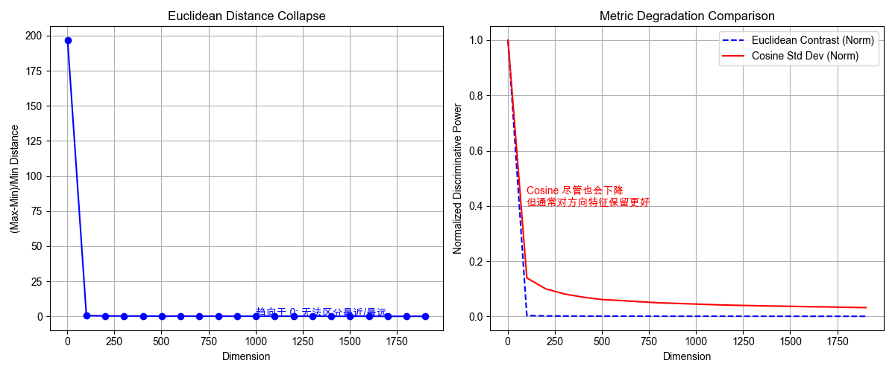

# 概率与信息论：不确定性的量化 (Probability & Information Theory)

**摘要**：如果说微积分是深度学习的引擎，线性代数是数据的容器，那么概率论就是 AI 的**世界观**。机器学习本质上是在构建一个概率分布 $P_{\theta}(y|x)$ 来拟合真实世界。本章不谈扔硬币，而是深入 **LLM 的核心指标（熵与困惑度）**，通过 **Jensen 不等式** 严格推导 **KL 散度** 的非负性，解析 **JSD** 在 GAN 中的作用，并探讨反直觉的 **高维概率论** —— 揭示为什么在高维向量检索 (RAG) 中，余弦相似度比欧氏距离更有效。

---

## 1. 频率学派 vs 贝叶斯学派

### 1.1 两种世界观
*   **频率学派 (Frequentist)**：参数 $\theta$ 是固定的客观真理，只是我们不知道。我们通过大量数据去逼近它（最大似然估计 MLE）。
    *   *应用*：大多数神经网络训练（寻找一组最优权重）。
*   **贝叶斯学派 (Bayesian)**：参数 $\theta$ 本身就是一个随机变量，服从某个分布。我们用数据更新对 $\theta$ 的信念（后验分布）。
    *   *应用*：LoRA（初始化先验）、扩散模型（马尔可夫链）、不确定性量化。

### 1.2 贝叶斯公式的 AI 视角
$$ P(\theta | \text{Data}) = \frac{P(\text{Data} | \theta) \cdot P(\theta)}{P(\text{Data})} $$
*   **Posterior (后验)**：训练后的模型参数分布。
*   **Likelihood (似然)**：模型在当前参数下产生这些数据的概率（Loss 的来源）。
*   **Prior (先验)**：我们对参数的预设假设（L2 正则化本质上是假设权重服从高斯先验）。

---

## 2. 信息论：LLM 的度量衡

大语言模型（LLM）的训练本质上是在压缩互联网上的所有文本信息。

### 2.1 惊奇度与熵 (Surprisal & Entropy)
信息量等于“惊奇程度”。
$$ I(x) = -\log P(x) $$
**熵 (Entropy)** 是信息量的期望，衡量一个分布的不确定性：
$$ H(P) = \mathbb{E}_{x \sim P} [-\log P(x)] $$
*   **物理意义**：编码该分布所需的平均最小比特数。

### 2.2 交叉熵与困惑度 (Cross-Entropy & Perplexity)
在训练 LLM 时，真实分布 $P$ 是未知的（人类语言），模型分布是 $Q$。
**交叉熵**：用模型 $Q$ 去编码真实分布 $P$ 所需的平均比特数。
$$ H(P, Q) = -\sum P(x) \log Q(x) $$
这正是 LLM 的 Loss 函数。

**困惑度 (Perplexity, PPL)**：
$$ \text{PPL} = 2^{H(P, Q)} $$
*   直观理解：如果 PPL=10，意味着模型在预测下一个 Token 时，感觉像是在 10 个等可能的选项中扔骰子。

### 2.3 KL 散度与 Jensen 不等式证明
KL 散度 (Relative Entropy) 衡量两个分布的差异：
$$ D_{KL}(P || Q) = H(P, Q) - H(P) = \sum P(x) \log \frac{P(x)}{Q(x)} $$

**为什么 KL 散度一定非负？(Gibbs' Inequality)**
利用 **Jensen 不等式**：对于凸函数 $f(x)$，有 $\mathbb{E}[f(x)] \ge f(\mathbb{E}[x])$。
由于 $\log(x)$ 是**凹函数**（$-\log(x)$ 是凸函数），我们有：

$$
\begin{aligned}
-D_{KL}(P || Q) &= - \sum P(x) \log \frac{P(x)}{Q(x)} \\
&= \sum P(x) \log \frac{Q(x)}{P(x)} \\
&= \mathbb{E}_{x \sim P} \left[ \log \frac{Q(x)}{P(x)} \right] \\
&\le \log \left( \mathbb{E}_{x \sim P} \left[ \frac{Q(x)}{P(x)} \right] \right) \quad (\text{Jensen 不等式}) \\
&= \log \left( \sum P(x) \frac{Q(x)}{P(x)} \right) \\
&= \log \left( \sum Q(x) \right) = \log(1) = 0
\end{aligned}
$$
因此 $-D_{KL} \le 0 \implies D_{KL} \ge 0$。当且仅当 $P=Q$ 时取等号。

### 2.4 JSD 散度 (Jensen-Shannon Divergence)
KL 散度有两个缺点：不对称 ($D_{KL}(P||Q) \ne D_{KL}(Q||P)$) 且无上界（这导致早期的 GAN 训练不稳定）。
**JSD** 是对称平滑版本：
$$ \text{JSD}(P || Q) = \frac{1}{2} D_{KL}(P || M) + \frac{1}{2} D_{KL}(Q || M) $$
其中 $M = \frac{P+Q}{2}$ 是平均分布。
*   **特性**：对称，且取值范围在 $[0, \log 2]$ 之间。这也是现代 GAN (如 StyleGAN) 更稳定的原因之一。

---

## 3. 高维概率论：直觉的崩塌

我们习惯了二维、三维空间的几何直觉，但在 Embedding 常见的 768维 或 1024维 空间中，几何性质会发生**维度诅咒 (Curse of Dimensionality)**。

### 3.1 测度集中现象 (Concentration of Measure)
在高维空间中，体积 $V(r) \propto r^d$。
*   **球壳理论**：一个高维球体的绝大部分体积都集中在**表面薄壳**上。
*   **工程推论**：在高维向量空间中，所有的点都在“表面”上，几乎没有点在球心附近。这就是为什么 LayerNorm 和 Batch Normalization 有效——它们在对抗数据向某些方向的坍缩。

### 3.2 距离失效：Euclidean vs Cosine
在高维空间中，任意两个随机采样的点之间的欧氏距离趋于常数：
$$ \lim_{d \to \infty} \frac{\max dist(x_i, x_j) - \min dist(x_i, x_j)}{\min dist(x_i, x_j)} \to 0 $$
这意味着**最近邻搜索**在欧氏距离下逐渐失去区分度。

而 **余弦相似度 (Cosine Similarity)** 关注的是**方向**。由于高维向量倾向于正交（几乎所有随机向量两两垂直），余弦相似度更能捕捉语义上的微小关联，且不受模长（词频/文本长度）噪音的影响。

---

## 4. 大数定律与蒙特卡洛
高维积分（如计算边缘概率）是解析解的噩梦。大数定律告诉我们：
$$ \int f(x) p(x) dx = \mathbb{E}[f(x)] \approx \frac{1}{N} \sum_{i=1}^N f(x_i), \quad x_i \sim p(x) $$
这是所有生成模型（Diffusion, VAE）采样质量的理论保证。

---

## 5. 工程实战：KL/JSD 对比与高维距离可视化

本代码包含两个实验，并**自动配置了中文字体**以防止绘图乱码：
1.  **散度对比**：展示 KL 的不对称性与 JSD 的对称性。
2.  **距离崩塌**：对比欧氏距离与余弦距离在高维下的区分度变化。

```python
import numpy as np
import matplotlib.pyplot as plt
import scipy.stats
import platform

# === 字体自动配置 (解决中文乱码) ===
system_name = platform.system()
if system_name == 'Windows':
    plt.rcParams['font.sans-serif'] = ['SimHei']  # Windows 黑体
elif system_name == 'Darwin':
    plt.rcParams['font.sans-serif'] = ['Arial Unicode MS'] # Mac 通用
else:
    # Linux/Colab 环境通常需要手动安装中文字体，这里回退到无衬线字体
    # 如果您在 Linux 上，建议安装 'WenQuanYi Micro Hei'
    plt.rcParams['font.sans-serif'] = ['DejaVu Sans'] 

plt.rcParams['axes.unicode_minus'] = False # 解决负号显示为方块的问题

def demo_divergences():
    """
    实验 1: KL 散度 vs JSD 散度
    """
    # 定义两个高斯分布 P 和 Q
    x = np.linspace(-5, 5, 1000)
    P = scipy.stats.norm.pdf(x, loc=-1.0, scale=1.0)
    Q = scipy.stats.norm.pdf(x, loc=1.0, scale=1.0)
    
    # 归一化以防数值误差
    P /= np.sum(P)
    Q /= np.sum(Q)
    M = 0.5 * (P + Q)
    
    # 手动计算 KL
    # 加上 1e-10 避免 log(0)
    kl_pq = np.sum(P * np.log((P + 1e-10) / (Q + 1e-10)))
    kl_qp = np.sum(Q * np.log((Q + 1e-10) / (P + 1e-10)))
    
    # 计算 JSD
    jsd = 0.5 * np.sum(P * np.log((P + 1e-10) / (M + 1e-10))) + \
          0.5 * np.sum(Q * np.log((Q + 1e-10) / (M + 1e-10)))
          
    print(f"KL(P||Q) = {kl_pq:.4f}")
    print(f"KL(Q||P) = {kl_qp:.4f} (注意不对称性)")
    print(f"JSD(P||Q) = {jsd:.4f} (对称且有界)")

def demo_high_dim_metrics():
    """
    实验 2: 高维空间下 Euclidean vs Cosine 的对比度分析
    """
    dims = np.arange(2, 2000, 100)
    n_samples = 100
    
    euclidean_contrasts = []
    cosine_std_devs = []
    
    for d in dims:
        # 随机采样点 (模拟 Embedding)
        X = np.random.randn(n_samples, d)
        
        # 计算两两距离/相似度
        # 1. Euclidean Distance
        diff = X[:, np.newaxis, :] - X[np.newaxis, :, :]
        dists = np.linalg.norm(diff, axis=-1)
        valid_dists = dists[np.triu_indices(n_samples, k=1)]
        
        # 对比度: (Max - Min) / Min
        # 越接近 0，说明距离越无法区分
        contrast = (np.max(valid_dists) - np.min(valid_dists)) / np.min(valid_dists)
        euclidean_contrasts.append(contrast)
        
        # 2. Cosine Similarity
        # 先归一化
        X_norm = X / np.linalg.norm(X, axis=1, keepdims=True)
        # 相似度矩阵
        sims = np.dot(X_norm, X_norm.T)
        valid_sims = sims[np.triu_indices(n_samples, k=1)]
        
        # 记录余弦相似度的标准差 (分布的宽度)
        # 我们希望分布有一定的宽度，以便区分
        cosine_std_devs.append(np.std(valid_sims))

    # === 可视化 ===
    plt.figure(figsize=(12, 5))
    
    # Plot 1: Euclidean Contrast Collapse
    plt.subplot(1, 2, 1)
    plt.plot(dims, euclidean_contrasts, 'b-o', label='Euclidean Contrast')
    plt.title("Euclidean Distance Collapse")
    plt.xlabel("Dimension")
    plt.ylabel("(Max-Min)/Min Distance")
    plt.grid(True)
    plt.text(1000, euclidean_contrasts[-1]+0.2, "趋向于 0: 无法区分最近/最远", color='blue', fontsize=10)
    
    # Plot 2: Cosine vs Euclidean Distribution spread
    # 这里我们对比二者的区分能力变化趋势（归一化到 0-1 来看趋势）
    plt.subplot(1, 2, 2)
    
    # 归一化以便同图比较
    euc_trend = np.array(euclidean_contrasts) / np.max(euclidean_contrasts)
    cos_trend = np.array(cosine_std_devs) / np.max(cosine_std_devs)
    
    plt.plot(dims, euc_trend, 'b--', label='Euclidean Contrast (Norm)')
    plt.plot(dims, cos_trend, 'r-', label='Cosine Std Dev (Norm)')
    plt.title("Metric Degradation Comparison")
    plt.xlabel("Dimension")
    plt.ylabel("Normalized Discriminative Power")
    plt.legend()
    plt.grid(True)
    plt.text(100, 0.4, "Cosine 尽管也会下降\n但通常对方向特征保留更好", color='red', fontsize=10)
    
    plt.tight_layout()
    plt.show()

if __name__ == "__main__":
    demo_divergences()
    print("-" * 30)
    demo_high_dim_metrics()
```

实验结果解读



图表深度解读：
* 左图：欧氏距离的崩塌 (Euclidean Distance Collapse)
    * 现象：蓝色曲线展示了距离对比度 $\frac{Max_Dist - Min_Dist}{Min_Dist}$ 随维度的变化。在低维（如 2D, 10D）时，该值很大（约 200），说明“最远点”和“最近点”差异显著。
    * 崩塌：一旦维度超过 100-200，曲线呈断崖式下跌并迅速趋近于 0。
    * 数学含义：这意味着在高维空间（如 1024 维）中，$Max_Dist \approx Min_Dist$。换句话说，任意两个随机向量之间的距离几乎都是一样的。
    * 工程后果：基于欧氏距离的 KNN（K-近邻）算法在高维空间会失效，因为“最近邻”不再具有统计学意义。
* 右图：度量退化对比 (Metric Degradation Comparison)
    * 现象：我们将两种度量的区分能力归一化进行对比。蓝色虚线（欧氏）瞬间归零，而红色实线（余弦标准差）下降得更平缓。
    * 鲁棒性：虽然余弦相似度的区分力也会随维度增加而下降，但它保留了更多的“方向性特征”。在 1000+ 维的空间中，红色曲线依然保持在 0 以上，说明余弦相似度仍能捕捉到微弱的语义差异。
为何 Cosine 更好？：高维向量倾向于分布在“球壳”表面，模长带来的干扰被归一化消除了，只剩下角度信息。这解释了为什么 OpenAI Embeddings 或 Vector DB (如 Milvus) 默认推荐使用 Cosine Similarity 而非 L2 距离。


核心结论：
在构建 RAG（检索增强生成）系统时，Embedding 维度通常高达 768 或 1536。此时，几何直觉是反常识的。必须放弃欧氏距离，转而使用余弦相似度或内积来衡量向量间的语义关联。

