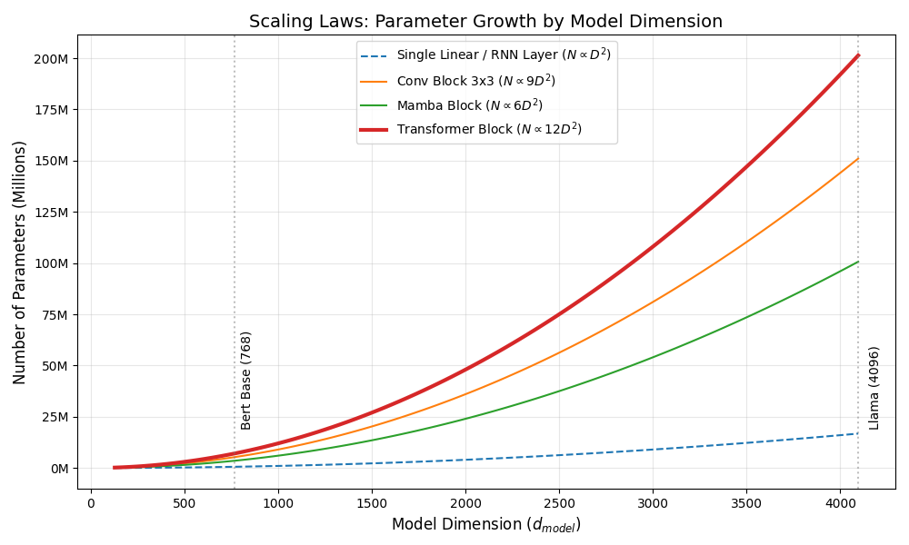
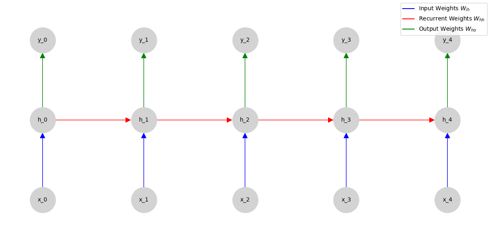

# 神经网络的几何构造：维度与参数流 (Neural Geometry: Dimensions & Parameters)

**摘要**：在深度学习中，**维度 (Dimension)** 定义了信息的形状与流动的拓扑结构，而**参数 (Parameter)** 则是这些结构中承载知识的实体。理解这两者的数学关系，是设计模型容量、估算显存占用以及推导 Scaling Laws 的前提。本章将从**仿射变换**出发，深入解析 CNN 的**计算密度 (FLOPs)**、Transformer 的**二次方缩放定律**以及 Mamba 背后的**连续时间控制方程 (SSM)**。

---

## 1. 维度的物理意义与参数的代数本质

### 1.1 骨架与血肉
如果把神经网络比作生物体：
*   **维度 (Dimensions)** 是**骨架**：它定义了张量在空间中如何流动、折叠和展开（$(B, C, H, W)$ 或 $(B, T, D)$）。
*   **参数 (Parameters)** 是**血肉**：它们是模型通过梯度下降学到的实数权重（Weights $\mathbf{W}$ 和 Biases $\mathbf{b}$）。

### 1.2 自由度与容量 (Degrees of Freedom & Capacity)
数学上，参数的总数量 $N$ 代表了模型的**自由度**。
根据 **VC 维理论**，模型的容量（记忆能力）通常与 $N$ 正相关。
*   **过参数化 (Over-parameterization)**：现代深度学习的一个反直觉现象是，$N$ 往往远大于训练样本数。这使得损失曲面拥有无数个全局极小值，优化过程变成了在参数流形上的“游走”。

---

## 2. 全连接层：高维空间的仿射变换

这是神经网络最基本的原子操作，在 PyTorch 中对应 `nn.Linear`。

### 2.1 数学形式
设输入向量 $\mathbf{x} \in \mathbb{R}^{d_{in}}$，输出向量 $\mathbf{y} \in \mathbb{R}^{d_{out}}$：
$$ \mathbf{y} = \mathbf{W}\mathbf{x} + \mathbf{b} $$
其中 $\mathbf{W} \in \mathbb{R}^{d_{out} \times d_{in}}$，$\mathbf{b} \in \mathbb{R}^{d_{out}}$。

### 2.2 参数计数原理
$$ N_{linear} = \underbrace{(d_{in} \times d_{out})}_{\text{Weights}} + \underbrace{d_{out}}_{\text{Biases}} $$

*   **几何视角**：这是两个高维向量空间之间的**全映射**。输入空间的每一个维度都与输出空间的每一个维度发生交互（稠密连接）。
*   **复杂度**：$O(d_{in} \cdot d_{out})$。如果 $d_{in} \approx d_{out} = D$，则参数量呈 $O(D^2)$ **二次增长**。


### 2.3 低秩几何：LoRA 的参数压缩
在大模型微调中，我们发现权重的**更新量** $\Delta \mathbf{W}$ 不需要满秩。
**LoRA (Low-Rank Adaptation)** 假设更新发生在低维子空间：
$$ \mathbf{W}_{new} = \mathbf{W}_{old} + \Delta \mathbf{W} = \mathbf{W}_{old} + \mathbf{B}\mathbf{A} $$
其中 $\mathbf{B} \in \mathbb{R}^{D \times r}, \mathbf{A} \in \mathbb{R}^{r \times D}$，且 $r \ll D$（如 $r=8$）。

*   **压缩比**：
    $$ \frac{\text{LoRA Params}}{\text{Full Params}} = \frac{2 \times r \times D}{D^2} = \frac{2r}{D} $$
    当 $D=4096, r=8$ 时，压缩比为 $16/4096 \approx 0.4\%$。这是**几何维度操控**的极致应用。

---

## 3. 卷积层：局部性与计算密度 (CNN)

CNN 利用了图像数据的几何先验：**局部性 (Locality)** 和 **平移不变性 (Translation Invariance)**。

### 3.1 权值共享 (Weight Sharing)
不同于全连接层对每个像素点分配独立的权重，卷积层在整个空间 $(H, W)$ 上共享同一个卷积核 $\mathcal{K}$。

### 3.2 参数量 vs 计算量 (FLOPs)
设输入张量 $\mathcal{X} \in \mathbb{R}^{C_{in} \times H \times W}$，卷积核 $K \times K$，输出通道 $C_{out}$。

1.  **参数量 (静态显存)**：与图像尺寸 $H, W$ **无关**。
    $$ N_{conv} = C_{in} \times K \times K \times C_{out} + C_{out} $$
    
2.  **计算量 (FLOPs - 动态算力)**：与图像尺寸 $H, W$ **成正比**。
    $$ \text{FLOPs} \approx 2 \times H \times W \times (C_{in} \times K^2 \times C_{out}) $$
    *(系数 2 代表一次乘法加一次加法)*

### 3.3 关键洞察
*   **空间无关性**：参数量解耦了空间尺寸，使得 CNN 可以处理任意分辨率。
*   **算力黑洞**：虽然参数量不大，但高分辨率图像 ($4K$) 会导致 FLOPs 爆炸。这就是为什么在 MobileNet 中要使用 **深度可分离卷积**（将 $C_{in} \times C_{out}$ 拆解为 $C_{in} + C_{out}$）。

---

## 4. 循环层：时间的递归展开 (RNN)

RNN 处理序列数据，核心假设是**时间不变性 (Temporal Invariance)**，即在所有时间步使用同一组权重。

### 4.1 状态转移方程
$$ \mathbf{h}_t = \sigma(\mathbf{W}_{ih}\mathbf{x}_t + \mathbf{W}_{hh}\mathbf{h}_{t-1} + \mathbf{b}) $$

### 4.2 参数构成 (Standard RNN)
1.  **输入-隐层** $\mathbf{W}_{ih}$: $D_{h} \times D_{in}$
2.  **隐层-隐层** $\mathbf{W}_{hh}$: $D_{h} \times D_{h}$
3.  **总参数**: $N_{rnn} \approx (D_{in} + D_{h}) \times D_{h}$

### 4.3 LSTM 的几何复杂性
LSTM 引入了 4 个门控机制，相当于同时训练 4 个 RNN：
$$ N_{lstm} = 4 \times N_{rnn} \approx 4 \times (D_{in} + D_{h}) \times D_{h} $$

*   **几何视角**：$D_{h} \times D_{h}$ 项表明，RNN 的记忆容量随隐藏层维度呈**二次方**增长。

---

## 5. Transformer：子空间投影与注意力流形

Transformer 彻底抛弃了归纳偏置，转向**集合交互 (Set Interaction)**。

### 5.1 嵌入与投影 (Embedding & Projection)
Transformer 的核心维度是 $d_{model}$。
*   **Embedding**: 查表操作，参数量 $V \times d_{model}$（$V$ 是词表大小，通常巨大）。
*   **Q/K/V 投影**: 将输入映射到不同的子空间。虽然有多头 (Multi-Head)，但参数总量不变。
    $$ 
    \begin{aligned} 
    N_{attn} &\approx 4 \times d_{model}^2 \quad (W_Q, W_K, W_V, W_O) 
    \end{aligned} 
    $$

### 5.2 前馈网络 (FFN) 的升维
FFN 通常包含一个“宽”的中间层 $d_{ff} = 4d_{model}$。
$$ 
\begin{aligned}
N_{ffn} &= (d_{model} \times d_{ff}) + (d_{ff} \times d_{model}) = 8 d_{model}^2 
\end{aligned}
$$

### 5.3 块级参数 (Block Parameters)
一个标准的 Transformer Block 参数量约为：
$$ N_{block} \approx 12 d_{model}^2 $$
这解释了 **LLM 的 Scaling Law**：参数量与模型宽度的平方成正比。

---

## 6. Mamba (SSM)：控制理论的几何实现

Mamba (S4) 试图在 RNN 的递归效率和 Transformer 的并行能力之间找到平衡。

### 6.1 核心方程：连续时间系统 (ODE)
Mamba 的数学核心不再是矩阵乘法，而是**状态空间模型 (State Space Model)** 的微分方程：
$$ \frac{d\mathbf{x}(t)}{dt} = \mathbf{A}\mathbf{x}(t) + \mathbf{B}\mathbf{u}(t) $$
$$ \mathbf{y}(t) = \mathbf{C}\mathbf{x}(t) $$
*   $\mathbf{u}(t)$：输入信号（1D 序列）。
*   $\mathbf{x}(t)$：潜在状态（State，维度 $N$）。
*   $\mathbf{y}(t)$：输出信号。

### 6.2 离散化与参数流
为了在计算机上运行，ODE 必须通过**零阶保持 (ZOH)** 离散化为递归形式。
参数主要集中在**线性投影**上，用于从输入动态生成 $\Delta, \mathbf{B}, \mathbf{C}$：
1.  **Input Projections**: $d_{model} \to d_{inner}$。
2.  **SSM Parameters**: $\mathbf{B}, \mathbf{C}, \Delta$ 是**输入依赖 (Input-Dependent)** 的。
3.  **Output Projection**: $d_{inner} \to d_{model}$。

### 6.3 参数效率
$$ N_{mamba} \propto E \cdot d_{model}^2 $$
虽然公式看起来和 Transformer 类似（都与 $d_{model}^2$ 有关），但 Mamba **移除了 Attention 的 $O(T^2)$ 计算复杂度**，实现了推理时的线性扩展。

---

## 7. 代码实战


### 7.1 宏观视角：参数增长曲线

为了直观理解为什么 Scaling Laws 如此迷人，我们绘制不同架构随维度 $D$ 变化的参数增长曲线。

```python
import numpy as np
import matplotlib.pyplot as plt

def plot_scaling_laws():
    """
    可视化不同架构的参数量随 Hidden Size (d_model) 的增长趋势
    """
    # 定义 d_model 的范围 (从 128 到 4096)
    d_model = np.linspace(128, 4096, 100)
    
    # 1. Linear / RNN (单层): ~ d^2
    # 假设 d_in = d_out = d
    params_linear = d_model**2 + d_model
    
    # 2. Transformer Block: ~ 12 * d^2
    # (4 * d^2 from Attn + 8 * d^2 from FFN)
    params_transformer = 12 * d_model**2
    
    # 3. Mamba Block: ~ E * d^2 (假设 E=2, 加上一些开销近似为 6 * d^2)
    # 这是一个粗略估计，取决于具体实现细节
    params_mamba = 6 * d_model**2
    
    # 4. CNN (ResNet Block): ~ C * K^2 * C
    # 假设 Kernel=3, C = d_model
    params_cnn = 9 * d_model**2

    plt.figure(figsize=(10, 6))
    
    plt.plot(d_model, params_linear, label='Single Linear / RNN Layer ($N \propto D^2$)', linestyle='--')
    plt.plot(d_model, params_cnn, label='Conv Block 3x3 ($N \propto 9 D^2$)')
    plt.plot(d_model, params_mamba, label='Mamba Block ($N \propto 6 D^2$)')
    plt.plot(d_model, params_transformer, label='Transformer Block ($N \propto 12 D^2$)', linewidth=3)
    
    plt.title("Scaling Laws: Parameter Growth by Model Dimension", fontsize=14)
    plt.xlabel("Model Dimension ($d_{model}$)", fontsize=12)
    plt.ylabel("Number of Parameters (Millions)", fontsize=12)
    plt.legend()
    plt.grid(True, alpha=0.3)
    
    # 标出 LLM 常用维度
    # 768 (Bert Base), 4096 (Llama 7B)
    plt.axvline(768, color='gray', linestyle=':', alpha=0.5)
    plt.text(800, 0.2e8, 'Bert Base (768)', rotation=90)
    
    plt.axvline(4096, color='gray', linestyle=':', alpha=0.5)
    plt.text(4150, 0.2e8, 'Llama (4096)', rotation=90)
    
    # 格式化 Y 轴为百万 (M)
    current_values = plt.gca().get_yticks()
    plt.gca().set_yticklabels(['{:.0f}M'.format(x/1e6) for x in current_values])
    
    plt.tight_layout()
    plt.show()

if __name__ == "__main__":
    plot_scaling_laws()

```



结果解读：

* 二次方统治：所有现代架构的参数量都与 $d_{model}$ 呈二次方关系（$N \propto D^2$）。这意味着每当我们将模型宽度翻倍，参数量（和算力需求）会增加 4倍。

* Transformer 的昂贵：在相同的 $d_{model}$ 下，一个 Transformer Block 的参数量大约是同等宽度 CNN 或 Mamba 的 1.5-2 倍。这是因为它内部有极其密集的 FFN 层 ($4 \times 4$ 宽)。

* 维度规划：在设计模型时，如果你只有 12G 显存，你必须非常谨慎地选择 $d_{model}$，因为它对显存的影响是平方级的。


### 7.2 微观视角：深度网络几何分析器
```python

import torch
import torch.nn as nn

class GeometryAnalyzer:
    def __init__(self, model):
        self.model = model

    def analyze(self, input_size):
        print(f"{'Layer':<20} | {'Input Shape':<20} | {'Output Shape':<20} | {'Params':<10}")
        print("-" * 80)
        
        hooks = [] # 移动到这里，确保作用域正确

        # 使用 Hook 机制捕获中间层的形状
        def register_hook(module):
            def hook(module, input, output):
                class_name = str(module.__class__).split(".")[-1].split("'")[0]
                
                # 计算该层参数 (只计算当前层的，不递归)
                params = sum(p.numel() for p in module.parameters(recurse=False))
                
                # --- 1. 处理输入形状 (Input 永远是 tuple) ---
                try:
                    # input[0] 通常是主输入张量
                    in_shape = str(list(input[0].shape))
                except:
                    in_shape = "n/a"

                # --- 2. 处理输出形状 (关键修复点) ---
                # LSTM/GRU 返回的是 tuple: (output, (hn, cn))
                # 我们只关心第一个元素 (output) 的形状
                try:
                    if isinstance(output, (tuple, list)):
                        out_shape = str(list(output[0].shape))
                    else:
                        out_shape = str(list(output.shape))
                except:
                    out_shape = "n/a"
                
                # 记录信息
                print(f"{class_name:<20} | {in_shape:<20} | {out_shape:<20} | {params:<10}")
            
            # 过滤掉容器层，只 Hook 叶子节点
            if not isinstance(module, nn.Sequential) and \
               not isinstance(module, nn.ModuleList) and \
               not (module == self.model):
                hooks.append(module.register_forward_hook(hook))
        
        self.model.apply(register_hook)
        
        # 执行一次前向传播
        # 确保输入在正确的设备上 (如果模型在 GPU，这里也要改，目前默认 CPU)
        dummy_input = torch.zeros(*input_size)
        try:
            self.model(dummy_input)
        except Exception as e:
            print(f"Forward pass failed: {e}")
        finally:
            # 无论成功失败，都移除 Hooks，防止污染模型
            for h in hooks:
                h.remove()
            
        # 统计总参数
        total_params = sum(p.numel() for p in self.model.parameters())
        print("-" * 80)
        print(f"Total Model Parameters: {total_params:,}")

# === 定义一个混合架构模型用于测试 ===
class HybridModel(nn.Module):
    def __init__(self):
        super().__init__()
        # 1. 卷积层 (空间特征提取)
        self.conv = nn.Conv2d(3, 16, kernel_size=3, padding=1)
        # 2. 扁平化 (注意：Flatten 本身没有参数)
        self.flatten = nn.Flatten()
        # 3. 循环层 (模拟序列处理)
        # 假设我们将 (B, 16, 32, 32) 展平并 reshape 后输入
        # input_size=1024 (32*32), hidden_size=64
        self.rnn = nn.LSTM(input_size=32*32, hidden_size=64, batch_first=True)
        # 4. 全连接层 (输出)
        self.fc = nn.Linear(64, 10)

    def forward(self, x):
        # x: (B, 3, 32, 32)
        x = self.conv(x)      # -> (B, 16, 32, 32)
        x = self.flatten(x)   # -> (B, 16*32*32) = (B, 16384)
        
        # 关键步骤：Reshape 为 (Batch, Seq_Len, Input_Dim)
        # 我们把 Channel (16) 当作序列长度，Spatial (32*32) 当作特征维度
        # View/Reshape 操作通常不会触发 Hook，因为它们不是 nn.Module
        x = x.view(x.size(0), 16, -1) # -> (B, 16, 1024)
        
        out, _ = self.rnn(x)  # -> (B, 16, 64)
        x = out[:, -1, :]     # 取最后一个时间步 -> (B, 64)
        x = self.fc(x)        # -> (B, 10)
        return x

# === 运行分析 ===
if __name__ == "__main__":
    model = HybridModel()
    analyzer = GeometryAnalyzer(model)
    # 输入: Batch=1, Channels=3, H=32, W=32
    analyzer.analyze((1, 3, 32, 32))
```

结果分析

```shell
Layer                | Input Shape          | Output Shape         | Params    
--------------------------------------------------------------------------------
Conv2d               | [1, 3, 32, 32]       | [1, 16, 32, 32]      | 448       
Flatten              | [1, 16, 32, 32]      | [1, 16384]           | 0         
LSTM                 | [1, 16, 1024]        | [1, 16, 64]          | 279040    
Linear               | [1, 64]              | [1, 10]              | 650       
--------------------------------------------------------------------------------
Total Model Parameters: 280,138
```

运行上述代码，你将看到清晰的维度流动：
* Conv2d: 参数量仅取决于通道和核大小，与图像 32x32 无关。
* View/Reshape: 没有参数，它是纯粹的几何变换（改变流形的拓扑而不改变内容）。
* LSTM: 参数量巨大，因为它涉及到 input_size (1024) 和 hidden_size (64) 的交互矩阵。
* Linear: 将 64 维隐空间映射到 10 维类别空间。

为什么 LSTM 参数是 279,040？让我们用第 4.3 节的公式验证：

公式：
$$
N_{lstm}=4\times((D_{in}+D_{h})\times D_{h}+D_{h})
$$
(包含 Bias)
数据：
$D_{in}=1024 (32 \times 32)$
$D_{h}=64$

$$

\begin{aligned}
N_{lstm} &= 4 \times ( (1024 + 64) \times 64 + 64 ) \
&= 4 \times ( 1088 \times 64 + 64 ) \
&= 4 \times ( 69632 + 64 ) \
&= 4 \times 69696 \
&= \mathbf{279,040}
\end{aligned}
$$
结论：理论公式与代码实测完美吻合。这证明了我们对神经网络几何结构的数学理解是准确的。


### 7.3 RNN 时间展开可视化 (Unrolling)

```python
def plot_rnn_unroll(timesteps=5):
    """
    可视化 RNN 在时间维度上的几何展开
    """
    import networkx as nx
    
    G = nx.DiGraph()
    pos = {}
    
    for t in range(timesteps):
        # 节点：输入 x, 隐状态 h, 输出 y
        G.add_node(f'x_{t}', layer='input')
        G.add_node(f'h_{t}', layer='hidden')
        G.add_node(f'y_{t}', layer='output')
        
        # 几何位置
        pos[f'x_{t}'] = (t, 0)
        pos[f'h_{t}'] = (t, 1)
        pos[f'y_{t}'] = (t, 2)
        
        # 边：输入 -> 隐层
        G.add_edge(f'x_{t}', f'h_{t}', color='blue')
        # 边：隐层 -> 输出
        G.add_edge(f'h_{t}', f'y_{t}', color='green')
        
        # 边：时间递归 h_{t-1} -> h_t
        if t > 0:
            G.add_edge(f'h_{t-1}', f'h_{t}', color='red', weight=2)

    plt.figure(figsize=(10, 4))
    colors = [G[u][v].get('color', 'black') for u,v in G.edges()]
    nx.draw(G, pos, with_labels=True, node_color='lightgray', edge_color=colors, 
            node_size=2000, font_size=10, arrowsize=20)
    
    plt.title("RNN Geometry: Temporal Unrolling (Time as a Dimension)")
    # 添加图例说明
    plt.plot([], [], color='blue', label='Input Weights $W_{ih}$')
    plt.plot([], [], color='red', label='Recurrent Weights $W_{hh}$')
    plt.plot([], [], color='green', label='Output Weights $W_{ho}$')
    plt.legend(loc='upper right')
    plt.ylim(-0.5, 2.5)
    plt.show()
```




--- 

## 8. 总结：维度设计的艺术

神经网络的设计本质上是在权衡表达能力（Capacity）与计算成本（Cost）：

* 全连接：最灵活，但$O(D^2)$ 的全参数导致泛化差。
* 卷积：利用空间对称性，参数极度共享，高效处理网格数据。$O(1)$
 的参数，$O(HW)$的计算，适合网格数据。
* Transformer：$O(D^2)$ 参数，$O(T^2)$计算，虽然昂贵，但捕捉了全局关联。,利用注意力机制，参数随维度平方增长，但获得了全局感受野。

* Mamba/RNN：利用时间递归性，在推理时极度节省显存。利用微分方程 
$ \frac{dx}{dt}=Ax+Bu $，实现了 $O(T)$的线性计算复杂度，是超长序列的新希望。
