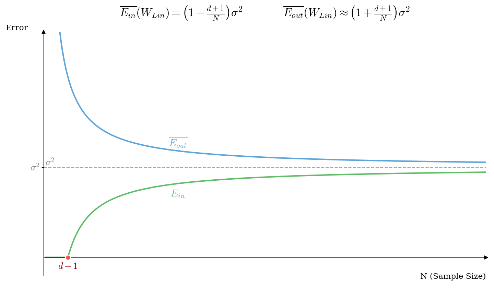
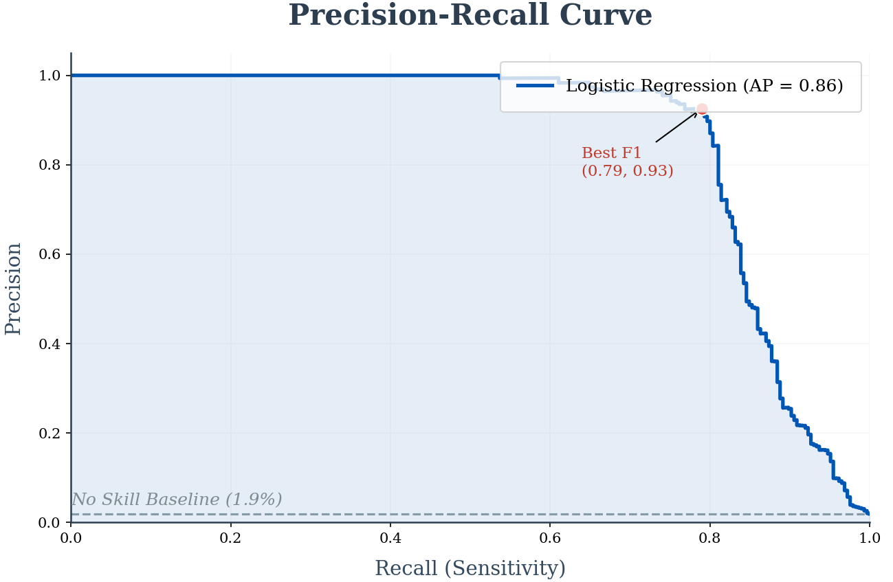
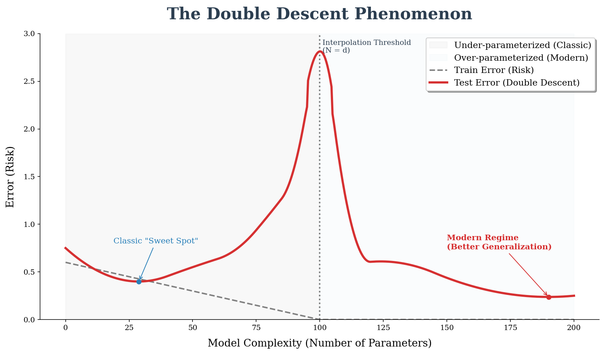

# 机器学习中的重要曲线

机器学习中有多种重要曲线，它们是模型诊断和优化的关键工具。本文详细介绍最核心的几种曲线及其应用。

---

## 📈 一、学习曲线（Learning Curve）

### 1.1 什么是学习曲线？

**定义：**
学习曲线展示了模型的**性能**（通常是准确率或误差）随着**经验**（通常是训练样本的数量，或者训练的迭代次数）的变化而变化的趋势。

在一张标准的学习曲线图中，通常有两条线：
1.  **训练集曲线 (Training Curve)：** 模型在它"看过"的数据上的表现。
2.  **验证集/测试集曲线 (Validation/Cross-Validation Curve)：** 模型在它"没看过"的数据上的表现（代表泛化能力）。

* **横轴（X轴）：** 通常是**训练数据的数量**（从小到大）。有时在深度学习中，横轴也是"Epochs"（训练迭代轮数）。
* **纵轴（Y轴）：** 通常是**误差（Loss/Error）**（越低越好）或者**得分（Score/Accuracy）**（越高越好）。

### 1.2 学习曲线是如何生成的？

#### 操作层面：迭代评估过程
假设你总共有 1000 条数据，生成学习曲线的步骤如下：

1.  **取一小部分数据：** 比如先只取 10 个样本作为训练集。
2.  **训练并评估：** 用这 10 个样本训练模型。
    *   计算它在训练集上的误差（通常很低，因为样本少，容易死记硬背）。
    *   计算它在验证集上的误差（通常很高，因为样本太少，没学到规律）。
3.  **增加数据量：** 接下来取 50 个、100 个、200 个……直到用上所有的训练数据。
4.  **连点成线：** 在每一个数据量节点上，重复步骤2，记录误差，最后把这些点连起来，就形成了学习曲线。

#### 理论层面：偏差-方差权衡 (Bias-Variance Tradeoff)
学习曲线的形状是由统计学中的"偏差"和"方差"决定的：

*   **当数据量很小时：** 模型很容易完美拟合这几个点（训练误差近乎0），但对未知数据一无所知（验证误差极高）。这是高方差的表现。
*   **随着数据量增加：**
    *   模型很难完美拟合所有点，**训练误差会缓慢上升**。
    *   模型学到了更多普遍规律，**验证误差会逐渐下降**。
*   **最终趋势：** 两条线会尝试靠拢。

### 1.3 学习曲线的诊断与理解

看懂学习曲线，主要是看两条线的**位置**和**间距**。我们以"误差（Error）"作为纵轴（越低越好）为例：

#### 🔴 欠拟合 (Underfitting) —— 高偏差 (High Bias)
*   **现象：**
    *   **训练误差**很高（一直在高位，降不下来）。
    *   **验证误差**也很高，且大约等于训练误差。
    *   两条线最后汇聚在一起，但都在很高的误差水平上。
*   **通俗理解：** 模型"太笨了"或者"太简单了"。比如数据是抛物线，你非要用直线去拟合。这时候你给它再多的数据，它也学不会。
*   **对策：**
    *   ❌ 增加数据量（通常没用）。
    *   ✅ 换更复杂的模型（增加模型复杂度）。
    *   ✅ 增加特征数量（Feature Engineering）。

#### 🔵 过拟合 (Overfitting) —— 高方差 (High Variance)
*   **现象：**
    *   **训练误差**非常低（接近0，表现极好）。
    *   **验证误差**很高（表现很差）。
    *   **关键特征：** 两条线之间有一个**巨大的缺口（Gap）**，像鳄鱼张开的嘴。
*   **通俗理解：** 模型"死记硬背"。它把训练题的答案都背下来了，但考试稍微换个数字就不会了。
*   **对策：**
    *   ✅ **增加数据量**（这是最有效的手段，随着数据增加，验证误差通常会下降，缺口会缩小）。
    *   ✅ 减少模型复杂度（正则化 Regularization）。
    *   ✅ 减少特征数量（Feature Selection）。

#### 🟢 理想状态 (Good Fit)
*   **现象：**
    *   训练误差很低。
    *   验证误差也很低。
    *   两条线靠得很近，且趋于平稳。
*   **理解：** 模型既学到了规律，又有很好的泛化能力。

### 1.4 代码实现

```python
import numpy as np
import matplotlib.pyplot as plt
from sklearn.model_selection import learning_curve
from sklearn.ensemble import RandomForestClassifier

# 绘制学习曲线示例
def plot_learning_curve(estimator, X, y):
    train_sizes, train_scores, val_scores = learning_curve(
        estimator, X, y, 
        train_sizes=np.linspace(0.1, 1.0, 10),
        cv=5
    )
    
    plt.figure(figsize=(10, 6))
    plt.plot(train_sizes, np.mean(train_scores, axis=1), 
             label='训练集得分', marker='o')
    plt.plot(train_sizes, np.mean(val_scores, axis=1), 
             label='验证集得分', marker='s')
    plt.xlabel('训练样本数')
    plt.ylabel('得分')
    plt.legend()
    plt.title('学习曲线')
    plt.grid(True)
```

### 1.5 典型模式诊断

| 模式 | 训练误差 | 验证误差 | 诊断 | 解决方案 |
|------|---------|---------|------|----------|
| 🔴 高偏差 | 高 | 高且接近 | 欠拟合 | 增加模型复杂度 |
| 🔵 高方差 | 低 | 高且有大gap | 过拟合 | 增加数据/正则化 |
| 🟢 理想状态 | 低 | 低且接近 | 拟合良好 | 继续优化 |


### 1.6 特例深度解析：线性回归的理论学习曲线


这张图是机器学习理论中最经典的一张图，它从数学期望的角度，精确描述了线性回归模型的$\mathbb{E}_{in}$(训练误差)和$\mathbb{E}_{out}$(测试/泛化误差)随训练数据量$N$的变化规律。

1. 核心公式：
    假设噪声为$\sigma^2$，线性模型的维度为$d$，则

    $$
    \mathbb{E}_{in} = (1- \frac{d+1}{N} ) \sigma^2
    $$

    - 训练误差总是小于真实噪声$\sigma^2$
    - 因为模型利用 $d+1$个自由度（参数）去“死记硬背”了训练集中的噪声，导致在训练集上表现得比真实情况更好（虚假的繁荣）。
    - 当$N$ 很大时，$\frac{d+1}{N}$趋近于0，训练误差趋近于$\sigma^2$。

    $$
    \mathbb{E}_{out} = (1 +\frac{d+1}{N}) \sigma^2
    $$

    - 验证误差总是**大于**真实噪声$\sigma^2$
    -  因为模型在训练集上拟合的那些噪声，在测试集上变成了错误的预测，导致误差增加。而 $\frac{d+1}{N}$ （就是过拟合的代价（也称为方差代价） 越大，验证误差越大。

2. 曲线的关键阶段
 - 起点 $N \approx d+1$
    - 训练误差(绿线)$\approx 0$,当样本量$N$刚好等于参数量$d+1$时，模型可以完美穿过所有训练点（线性方程组有唯一解）。这时候看似无敌，实则极度过拟合。
    - 测试误差 (蓝线) $\to \infty$，因为模型在训练集上拟合的那些噪声，在测试集上变成了错误的预测，导致误差增加。

 - 终点/收敛过程 $N \to \infty$
    - 随着数据量$N$增加，模型无法再死记硬背所有点$\mathbb E_{in}$ 被迫上升。
    - 同时，模型学到了真正的规律，$\mathbb E_{out}$开始下降。
    - 最终归宿：两条线都收敛于虚线$\sigma^2$。 (噪声水平)

3.现象

哪怕有无穷多的数据，模型的误差也无法降到 0，只能降到噪声水平 $\sigma^2$。而我们做的一切努力（增加数据$N$），都是为了让测试误差($\mathbb E_{out}$)尽可能逼近这个理论极限。

---

## 📉 二、损失曲线（Loss Curve）

### 2.1 训练过程可视化

损失曲线记录模型在训练过程中损失函数值的变化，是监控训练状态的重要工具。

```python
class LossRecorder:
    def __init__(self):
        self.train_losses = []
        self.val_losses = []
    
    def plot_loss(self):
        plt.figure(figsize=(10, 5))
        plt.plot(self.train_losses, label='训练损失')
        plt.plot(self.val_losses, label='验证损失')
        plt.xlabel('Epoch')
        plt.ylabel('Loss')
        plt.legend()
        plt.title('损失曲线')
        
        # 关键观察点
        if len(self.val_losses) > 10:
            min_val_idx = np.argmin(self.val_losses)
            plt.axvline(min_val_idx, color='r', 
                       linestyle='--', label='最佳停止点')
```

### 2.2 数学推导

损失函数（如MSE）的梯度下降过程：

$$L(\theta) = \frac{1}{n}\sum_{i=1}^{n}(y_i - f(x_i; \theta))^2$$

每次迭代更新：
$$\theta_{t+1} = \theta_t - \eta \nabla L(\theta_t)$$

曲线记录每个epoch的 $L(\theta_t)$ 值。

### 2.3 损失曲线的典型模式

#### 训练动态
- **初期**：梯度大 → 损失快速下降
- **中期**：接近最优 → 损失缓慢下降/震荡
- **后期**：过度训练 → 验证损失开始上升（过拟合）

#### 异常情况诊断
1. **损失不下降**：学习率太小或模型有问题
2. **损失震荡**：学习率太大
3. **验证损失上升**：过拟合，需要早停

---

## 🎯 三、ROC曲线

### 3.1 核心概念

ROC曲线（Receiver Operating Characteristic Curve）是评估二分类模型性能的重要工具。

```python
from sklearn.metrics import roc_curve, auc

def plot_roc_curve(y_true, y_pred_proba):
    fpr, tpr, thresholds = roc_curve(y_true, y_pred_proba)
    roc_auc = auc(fpr, tpr)
    
    plt.figure(figsize=(8, 6))
    plt.plot(fpr, tpr, label=f'ROC (AUC = {roc_auc:.2f})')
    plt.plot([0, 1], [0, 1], 'k--', label='随机猜测')
    plt.xlabel('假正例率 (FPR)')
    plt.ylabel('真正例率 (TPR)')
    plt.title('ROC曲线')
    plt.legend()
```

### 3.2 数学推导

- **TPR（灵敏度）**: $\text{TPR} = \frac{TP}{TP + FN}$
- **FPR**: $\text{FPR} = \frac{FP}{FP + TN}$

改变分类阈值 $t$，得到不同的(FPR, TPR)点，连成曲线。

### 3.3 ROC曲线的解读

- **对角线**：随机分类器，AUC = 0.5
- **左上角**：完美分类器，AUC = 1.0
- **曲线越靠近左上角**：模型性能越好

### 3.4 为什么需要PR曲线？


当正负样本极度不平衡（例如：欺诈检测，正样本只有 1.9%）时，ROC曲线会失效。因为 TN（真负例）太大，导致 FPR 几乎一直为 0，ROC曲线看起来总是很完美（靠近左上角），掩盖了模型抓不住少数正样本的事实。

#### PR曲线定义
- 横轴 (Recall/查全率)：$Recall = \frac{TP}{TP + FN}$ （所有坏人里，你抓住了多少？）
- 纵轴 (Precision/查准率)：$Precision = \frac{TP}{TP + FP}$ （你抓的人里，有多少是真的坏人？）

#### PR曲线解读
- **理想位**：右上角（Precision=1.0, Recall=1.0）。
- **趋势**：通常 Recall 越高，Precision 越低（为了抓更多坏人，难免会抓错好人）。
- **基准线**：不再是对角线，而是取决于正样本比例的水平线（例如正样本占1%，随机猜的Precision就是0.01）。

图中关键信息解读：
- 灰色虚线 (Baseline)：图中的灰色虚线不再是 0.5，而是趴在底部（约 1.9%）。
    - 这代表**随机瞎猜的准确率**。如果样本中只有 1.9% 是坏人，闭眼全猜坏人的 Precision 只有 0.019。这直观展示了任务的难度。
- 蓝色实线 (Precision-Recall)：
    - 曲线下方的阴影面积即 AP (Average Precision)，这里 AP=0.86，说明模型性能极佳。
    - 曲线呈**阶梯状（锯齿）**是正常的。每多抓一个负样本，Precision 就会垂直下跌。
- 红点 (Best F1)：
    - 图中标注的红点是 F1-Score 的最高点 (Recall=0.79, Precision=0.93)。
    - 工程意义：这是最佳的阈值选择点。在这个点上，模型在“抓得全”和“抓得准”之间取得了最好的平衡。


|场景	|首选曲线|	原因|
|---|---|---|
|样本平衡 (1:1)	|ROC曲线	|综合评估模型整体区分能力|
|极度不平衡 (1:100)	|PR曲线	|关注少数类（正类）的预测质量|


---

## 📊 四、验证曲线（Validation Curve）

### 4.1 超参数调优

验证曲线展示模型性能随超参数变化的趋势，是超参数调优的重要工具。

```python
from sklearn.model_selection import validation_curve

param_range = np.logspace(-3, 2, 6)
train_scores, val_scores = validation_curve(
    RandomForestClassifier(), X, y,
    param_name="max_depth",
    param_range=range(1, 20),
    cv=5
)

plt.plot(param_range, np.mean(train_scores, axis=1), label='训练')
plt.plot(param_range, np.mean(val_scores, axis=1), label='验证')
plt.xlabel('max_depth')
plt.ylabel('得分')
```

### 4.2 验证曲线的应用

1. **找到最佳超参数**：验证曲线峰值对应的参数值
2. **诊断过拟合/欠拟合**：
   - 训练和验证曲线差距大 → 过拟合
   - 两条曲线都很低 → 欠拟合
3. **参数敏感性分析**：曲线越陡峭，参数越敏感

---

## 🔑 五、曲线分析的综合应用

### 5.1 多曲线联合诊断

在实际项目中，通常需要同时分析多种曲线：

1. **学习曲线** → 判断是否需要更多数据
2. **损失曲线** → 监控训练过程，确定早停点
3. **ROC曲线** → 评估分类性能
4. **验证曲线** → 选择最佳超参数

### 5.2 实践建议

✅ **同时监控多个曲线**  
✅ **早停法**：验证损失不再下降时停止  
✅ **交叉验证**：获得更稳定的曲线  
✅ **对比实验**：不同模型的曲线对比

### 5.3 常见陷阱与解决方案

| 问题 | 现象 | 解决方案 |
|------|------|----------|
| 过拟合 | 学习曲线gap大 | 增加数据/正则化 |
| 欠拟合 | 学习曲线位置高 | 增加模型复杂度 |
| 训练不稳定 | 损失曲线震荡 | 调整学习率 |
| 超参数选择不当 | 验证曲线无峰值 | 扩大搜索范围 |

---

## 六、双下降曲线
注：这是深度学习时代对传统“学习曲线”的颠覆性更新。



### 6.1 传统认知的崩塌
在经典统计学（如本文 1.2 节所述）中，我们认为：
模型太简单 $\to$ 欠拟合（左侧）。
模型太复杂 $\to$ 过拟合（右侧 U 形底部的右边）。
泛化误差曲线呈 $U$ 形

### 6.2 深度学习的发现
但在现代深度神经网络中，研究人员发现，当模型参数量远远超过样本量（过参数化）时，测试误差并没有像预期的那样爆炸，而是再次下降！


### 6.3 曲线形态
结合上图，双下降现象可以分为三个关键阶段：

左侧灰色区域：欠参数化 (Under-parameterized)
- 对应经典的`偏差-方差权衡`。
- 蓝色标注的 "Classic Sweet Spot" 是传统理论认为的最佳模型复杂度。再往右走，测试误差（红线）开始上升，进入过拟合。

中间虚线：插值阈值 (Interpolation Threshold)
- 位置：
$N \approx d$（参数量 $\approx$ 样本量）。
`地狱之门`：测试误差（红线）冲到顶峰。此时模型强行拟合了所有噪声，极其不稳定。
右侧白色区域：过参数化 (Over-parameterized)
- 训练误差（灰色虚线）：注意看图底部的灰色虚线，过了阈值后，它死死地贴在 0 上。这意味着模型已经完全“背下”了所有训练数据。
- 测试误差（红色实线）：奇迹发生！虽然模型在死记硬背，但测试误差却一路下滑。

结论：最右侧的红点（Modern Regime）比左侧的蓝点更低。这证明了庞大的参数量能带来隐式的正则化效果，从而实现更好的泛化。

### 6.4 启示
这张图打破了我们对“过拟合”的恐惧。在深度学习时代，只要参数量足够大（远超样本量），“训练误差为0”不仅不是坏事，反而是通向更好泛化的必经之路。


## 💡 总结

|曲线类型|核心作用|一句话口诀|
|---|---|---|
学习曲线|诊断过拟合/欠拟合|"缺口大是过拟合，两线高是欠拟合"
线性回归理论图|理解误差来源|"训练集作弊（低于噪声），测试集还债（高于噪声）"
损失曲线|监控训练健康度|"震荡要调小LR，上升由于过拟合"
ROC曲线|评估平衡分类|"越鼓越好，贴左上角"
PR曲线|评估不平衡分类|"正样本很少时，只看这张图"
双下降曲线|现代深度学习视角|"过了临界点，越大越好"


掌握这些曲线的分析方法，将大大提升你的机器学习实践能力。记住：**数据会说话，曲线就是它们的语言！**