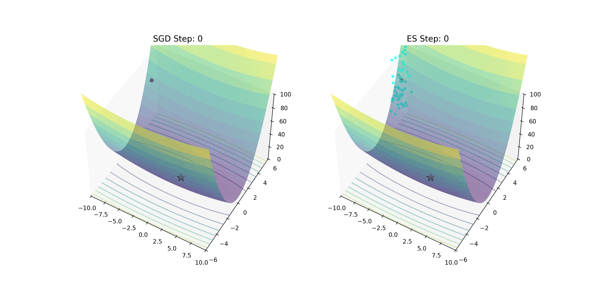

# Neuroevolution & Evolutionary Strategies: Zeroth-Order Optimization Beyond Gradients

--- 
⚠️: 补充背景

1. AlphaGo (Lee/Zero)：核心算法是 MCTS (蒙特卡洛树搜索) + RL (强化学习)。它依然大量依赖梯度下降（Backpropagation）来更新策略网络和价值网络。
2. AlphaStar (星际争霸 AI)：核心引入了 PBT (基于种群的训练)。这是进化策略的一种现代变体。它不仅仅是在训练模型参数，而是在训练过程中动态进化超参数。
3. Google AutoML / NAS：这些系统在设计神经网络结构时，大量使用了进化算法。因为网络结构（几层？卷积核多大？）是离散的、不可微的，梯度下降对此无能为力。

**结论**：进化算法不是要取代梯度下降，而是填补梯度下降的盲区（不可微、极度非凸、稀疏奖励、超参数搜索）。

---

## 一、直觉差异：登山者 vs 空降兵

### 1.1 梯度下降 (Gradient Descent)

想象你在大雾中的山上，你想下山。

策略：你用脚探一探周围哪个方向最陡（计算梯度$\nabla_\theta L$），然后迈出一步。
局限：
如果地面是平的（梯度消失），你不知道往哪走。
如果有很多小坑（局部极小值），你会陷进去出不来。
必要条件：地形必须是平滑的（可微）。

### 1.2 演化策略 (Evolution Strategies)

上帝视角，不需要知道坡度。

- **策略**
    - **空降**：在当前位置周围随机空降 1000 个`伞兵`（高斯扰动）。
    - **评估**：看看哪些伞兵的位置更低（Loss 更小）。
    - **聚合**：你的新位置 = 所有伞兵位置的加权平均（权重取决于他们的表现）。

- **优势**
    - 不需要地形平滑（不可微也能用）。
    - 不容易陷入小坑（因为是群体搜索，具有全局视野）。
    - 极其适合并行化（1000 个伞兵可以由 1000 个 CPU 核心同时计算）。

- **局限**
    - 样本效率极低 (Sample Inefficiency)：SGD 看一眼地图就知道往哪走（利用导数信息），而 ES 需要把 1000 个伞兵都扔下去试错才能决定迈出一步。这在数据获取昂贵时是致命的。
    - 高维灾难 (Curse of Dimensionality)：当参数空间巨大（如 10 亿参数）时，1000 个伞兵相对于广阔的空间就像沧海一粟，很难估算出准确的梯度方向。ES 很难直接用于训练大型 LLM 的权重，但非常适合调节只有几十个维度的超参数。

---

## 二、进化策略 (ES) 的数学本质：零阶优化

传统的遗传算法 (GA) 模拟的是生物的染色体交叉 (Crossover) 和 突变 (Mutation)，通常用于离散编码（0/1比特串）。

现代深度学习中的 进化策略 (ES)，本质上是一种 基于梯度的平滑近似 (Smoothed Gradient Approximation)。我们不需要计算真实的梯度，而是通过随机采样来估计梯度。

### 2.1 目标函数的平滑化

假设我们要最大化回报函数 $F(\theta)$。如果$F$不可微或非常崎岖，我们可以优化它的高斯平滑版本$J(\theta)$

$$
J(\theta) = \mathbb{E}_{\epsilon \sim \mathcal{N}(\theta, \sigma^2 I)} [F(\theta + \epsilon)]
$$

- $\theta$ : 模型参数
- $\sigma$ : 高斯噪声的标准差
- $\epsilon$ : 标准正态分布噪声
- $\mathcal{N}(\theta, \sigma^2 I)$ 表示以 $\theta$ 为中心，$\sigma^2$ 为方差的高斯分布。
- $\mathbb{E}_{\epsilon \sim \mathcal{N}(\theta, \sigma^2 I)} [F(\theta + \epsilon)]$ 表示 $F(\theta + \epsilon)$ 在 $\mathcal{N}(\theta, \sigma^2 I)$ 上的期望。


物理含义：我们不再关心某一个确切点的回报，而是关心参数$\theta$邻域内的平均回报。

### 2.2 对数导数技巧 (Log-Derivative Trick)

要求得$J(\theta)$ 关于$\theta$ 的梯度 $\nabla_\theta J(\theta)$，可以使用对数导数技巧（类似于 REINFORCE 算法的推导）。

$$
\nabla_\theta J(\theta) = \nabla_\theta \int p(\epsilon) F(\theta + \sigma \epsilon) d\epsilon \\
\approx \frac{1}{\sigma} \mathbb E_{\epsilon \sim \mathcal{N}(0, \sigma^2 I)} [F(\theta + \epsilon)\cdot \epsilon ]
$$

### 2.3 离散化估算 (Monte Carlo Estimation)

在工程实现中，我们采样$N$个噪声样本 $\epsilon_i$:

$$
\nabla_\theta J(\theta) \approx \frac{1}{\sigma N} \sum_{i=1}^N F(\theta + \epsilon_i) \cdot \epsilon_i
$$

这个公式告诉我们，进化策略的更新方向，本质上就是 **`表现好的方向`减去`表现差的方向`**。

- 如果 $\epsilon_i$ 表现好，$F(\theta + \epsilon_i)$ 就大，$\epsilon_i$ 就大，就顺着$\epsilon_i$ 的方向运行。
- 这是一种零阶 (Zeroth-Order) 优化，因为它只用了函数值$F(x)$，而没有用导数$\nabla F(x)$。

----

## 三、神经进化 (Neuroevolution) 的现代变体

### 3.1 OpenAI ES (Natural ES 的简化版)

OpenAI 在 2017 年证明，简单的 ES 可以在 MuJoCo 和 Atari 游戏中匹敌强化学习（RL）。

算法流程：

- 固定中心参数$\theta_t$
- 生成 $n$ 个噪声 $\epsilon_i $
- 评估 $R_i^+ = F(\theta_t + \epsilon_i \sigma)$ 和 $R_i^- = F(\theta_t - \epsilon_i \sigma)$ （镜像采样，Mirror Sampling，用于降低方差）。
- 更新 $\theta_t$ 

$$
\theta_{t+1} = \theta_t + \alpha \cdot \frac{1}{n\sigma} \sum_{i=1}^n (R_i^+ - R_i^-) \epsilon_i
$$

这就像是一个没有反向传播的 SGD。

### 3.2 PBT (Population Based Training) —— DeepMind 的大杀器

PBT 不仅仅进化权重，它还进化超参数（Learning Rate, Entropy, Discount Factor）。

逻辑：
- 并行训练 100 个模型（种群），每个模型有不同的超参数。
- **Exploit (利用)**：每隔一段时间，表现差的模型会复制表现最好的模型的参数（Weights）。
- **Explore (探索)**：复制后，对继承来的超参数进行随机扰动（Mutation）。

数学意义：
这是一个双层优化问题 (Bi-level Optimization)。

- 内层:SGD 优化权重 $\theta$
- 外层：进化算法优化超参数$\lambda$

AlphaStar 正是靠这个机制，在长达数周的训练中动态调整策略，避免了手动调参的灾难。

PBT 的核心价值：
- 自动调参：避免了人工搜索超参数的灾难。
- 动态适应：训练初期的最佳学习率可能和训练后期不同，PBT 能动态调整。

### 3.3 CMA-ES：进化策略中的 "Adam"

这是进化算法中最强大、最数学化的方法：Covariance Matrix Adaptation Evolution Strategy。

- OpenAI ES 的局限：它的探索范围是一个正圆（各向同性的高斯分布，$\sigma I$）。

- CMA-ES 的突破：会学习一个协方差矩阵
    - 这意味着探索范围变成了一个椭球。
    - 它可以自动学习参数之间的相关性，顺着山谷的走向（Valley）进行探索，而不是盲目乱撞。

类比：

- OpenAI ES $\approx $ SGD（固定步长）

- CMA-ES $\approx$ Adam / Newton Method（自适应二阶优化）。

---

## 四、损失景观的几何解释

为什么在某些情况下，ES 比 SGD 更好？我们可以从 Loss Landscape (损失景观) 的几何形状来理解。

### 4.1 逃离局部极小值

- SGD：关注的是$\theta$点的局部曲率。如果 $\theta$ 处于一个很窄很深的坑（Sharp Minima），SGD 会陷进去，或者梯度爆炸。

- ES：关注的是$\theta$周围$\sigma$半径内的体积平均。

    - 如果一个坑非常窄（比 $\sigma$ 还窄），ES 会直接`跨`过去，因为 $F(\theta + \epsilon \sigma)$  的期望值并没有显著降低。

    - ES 倾向于寻找 Flat Minima (平坦极小值)，而根据我们之前的文档，平坦极小值意味着更好的泛化能力。

### 4.2 梯度欺骗 (Gradient Deception)

在强化学习中，奖励往往是稀疏或延迟的。

只有在这一步做对了，100步后才有奖励。

此时梯度的方差极大，信噪比极低。

ES 通过直接评估整个轨迹的回报 $F(θ)$，规避了单步梯度的噪声问题。

---

## 五、工程实践：手写一个最小化的 ES 优化器

这段代码展示了如何不使用 PyTorch 的 .backward()，仅凭前向传播来训练一个简单的网络。

```python
import numpy as np

class SimpleES:
    def __init__(self, num_params, sigma=0.1, alpha=0.01):
        self.theta = np.zeros(num_params) # 参数中心
        self.sigma = sigma                # 噪声标准差 (Mutation strength)
        self.alpha = alpha                # 学习率
        
    def get_perturbations(self, population_size):
        """生成种群：一半正向扰动，一半负向扰动 (Mirror Sampling)"""
        epsilon = np.random.randn(population_size // 2, len(self.theta))
        return np.concatenate([epsilon, -epsilon]) # 技巧：镜像采样降低方差
    
    def step(self, epsilon, rewards):
        """
        参数更新核心公式：
        theta = theta + alpha * (1 / (N * sigma)) * sum(Reward * epsilon)
        """
        N = len(rewards)
        
        # 标准化奖励 (非常重要！类似于 Batch Norm)
        rewards = (rewards - np.mean(rewards)) / (np.std(rewards) + 1e-8)
        
        # 计算梯度的蒙特卡洛估计
        # dot(epsilon.T, rewards) 等价于 sum(R_i * eps_i)
        estimated_gradient = np.dot(epsilon.T, rewards) / (N * self.sigma)
        
        # 更新参数
        self.theta += self.alpha * estimated_gradient
        return self.theta

# --- 模拟使用场景 ---
# 假设目标函数是 F(w) = -w^2 (也就是希望 w 接近 0)
target_func = lambda w: -np.sum(w**2)

es = SimpleES(num_params=10)
for epoch in range(50):
    # 1. 生成 50 个“平行宇宙”的扰动
    eps = es.get_perturbations(50)
    
    # 2. 评估每个宇宙的回报
    rewards = []
    for e in eps:
        # w_try = theta + sigma * epsilon
        w_try = es.theta + es.sigma * e 
        rewards.append(target_func(w_try))
    
    # 3. 进化更新
    es.step(eps, np.array(rewards))
    
    if epoch % 10 == 0:
        print(f"Epoch {epoch}: Score {np.mean(rewards):.4f}")
```

---

## 六、神经架构搜索 (NAS)：离散空间的进化

这是 Google AutoML 的核心。这里的优化对象不是权重 $\theta$（实数），而是图的拓扑结构 $G$（离散）。

### 6.1 基因编码
网络结构被编码为一段`基因`（通常是 DAG 有向无环图的邻接矩阵或操作列表）。

- 基因片段：**[Conv3x3, ReLU, MaxPool, SkipConnection]**

### 6.2 进化算子

- 变异 (Mutation)：
    - 修改操作：把 Conv3x3 变成 Conv5x5。
    - 增加层数：在层 A 和层 B 之间插入层 C。
    - 改变连接：增加一条 ResNet 残差连接。
- 交叉 (Crossover)：
    - 取网络 A 的前半部分和网络 B 的后半部分拼接。


### 6.3 权重共享 (Weight Sharing)

早期的 NAS 非常慢，因为每生成一个新结构都要从头训练。
ENAS (Efficient NAS) 引入了计算图共享的概念：所有的子网络都是一个超大图（Supergraph）的子图。这使得进化搜索的速度提升了 1000 倍。


### 6.4 LLM Model Merging (进化算法的新疆界)

在 LLM 时代，重新训练一个大模型的成本太高。一种新的趋势是 Model Merging（如将 Llama-3 和 Mistral 融合）。

- 问题：如何确定融合的比例？每一层的权重该怎么加权？

- 解法：使用进化算法（如 CMA-ES）在验证集上搜索最佳的融合系数矩阵 $M$。

- 效果：SakanaAI 发布的“进化融合模型”在没有微调的情况下，仅通过参数混合就超越了原始模型。这是进化策略在参数空间操作的极致体现。

---

## 七、终极总结

### 7.1 算法对比图谱

|特性|梯度下降 (SGD/Backprop)|进化策略 (ES/Neuroevolution)|
|---|---|---|
导数需求|需要一阶导数 $\nabla_\theta L$|不需要 (Zeroth-Order)
适用场景|可微、稠密奖励、监督学习|不可微、稀疏奖励、黑盒优化
计算特性|串行依赖 (Layer by Layer)|高度并行 (Population based)
内存消耗|高 (需要存反向传播的梯度)|低 (只需要存当前参数)
通信成本|低|高 (如果跨机器同步参数)
主要用途|训练权重 (Weights)|训练超参数、搜索架构 (AutoML)


### 7.2 哲学视角：设计 vs 涌现

- SGD 是设计：精心设计了 Loss Function，告诉模型每一步该怎么走。这是一种强监督的逻辑，效率高，但容易陷入局部最优。

- Evolution 是涌现：只定义了`什么是活得好`（Fitness），然后让随机性和统计学规律去接管一切。这是一种弱监督的逻辑，效率低（样本利用率低），但往往能找到人类意想不到的解（如 AlphaGo 的神之一手，AlphaStar 的怪异战术）。

未来的方向：可微分进化。现在的趋势是将进化过程也变成可微的，或者用元学习（Meta-Learning）来学习进化的规则，让“空降兵”不仅知道谁活下来了，还能大概知道往哪个方向跳活得更好。



