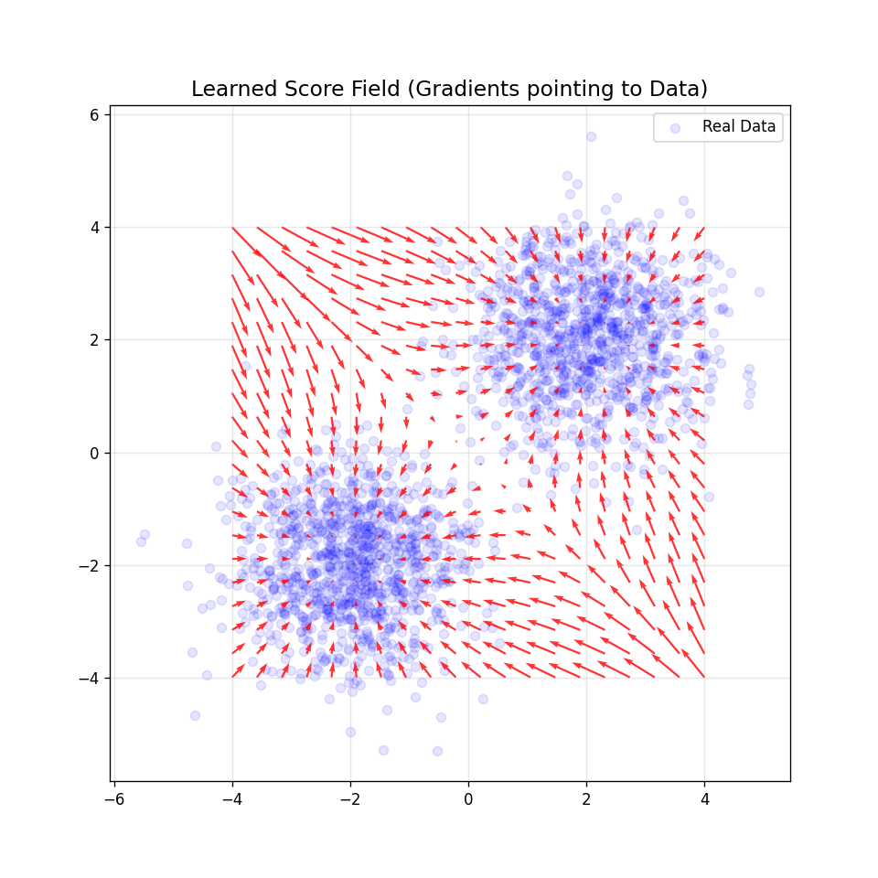

# 扩散模型与随机微分方程 (SDE)：从热力学熵增到生成智能

⚠️ 重要技术澄清：AI 不再是简单的函数映射

在之前的章节（SVM、神经网络、核回归）中，我们建立的模型大多是静态的映射：$y=f(x)$。
但在生成式 AI（Sora, Stable Diffusion）中，模型不再是一个简单的函数，而是一个**物理过程的模拟器**。

1. 不是$x \to y$，而是$t_o \to t_n$ 生成不再是瞬间完成的，而是一个随时间演化的连续过程（流）。

2. 不是拟合数据，而是拟合梯度场：模型学习的不是数据本身长什么样，而是数据在概率空间中**流动的方向**（Score Function）。

3. 物理本质：扩散模型本质上是在**求解逆向的随机热力学过程**——把一团**无序**的热能（噪声），逆转熵增，重构成**有序**的物质（图像/视频）。

*这些笔记旨在用直观的方式解释机器学习的数学基础，既注重严谨性，又强调实际应用。*

--- 

## 一、物理直觉：熵增与时间倒流

### 1.1 前向过程 (Forward)：非平衡热力学

物理学上的扩散现象，一滴墨水滴入清水中。

- 物理现象：墨水分子受到水分子撞击（布朗运动），逐渐扩散，直到整杯水变成均匀的淡蓝色。

- 信息论视角：熵 (Entropy) 最大化。结构信息被噪声淹没，最终变成纯高斯噪声。

- 数学描述：这是一个简单的物理扩散方程，我们完全知道它是如何发生的。

### 1.2 反向过程 (Reverse)

生成模型的任务是：从一杯均匀的淡蓝色的水中，恢复出那一滴墨水刚滴进去的样子。

- 宏观物理：这是不可能的，违反热力学第二定律（熵不能自发减少）。

- 微观物理：如果我们拥有`上帝视角`，知道每一个时刻、每一个位置上墨水分子受力的势能场 (Potential Field)，我们就可以给每个分子施加一个反向的力，让时间倒流。

结论：AI 的训练过程，就是让神经网络去学习这个**让时间倒流的力场**。

---

## 二、数学建模：随机微分方程 (SDE)，从离散到连续

早期的 DDPM (Denoising Diffusion Probabilistic Models) 将过程建模为离散的马尔可夫链。但在数学上更优美且更本质的描述是连续时间的随机微分方程 (SDE)。

### 2.1 前向 SDE (破坏数据)

随着时间 $t$ 从 $0$ 到 $T$，数据 $x_0$ 逐渐变成噪声 $x_T$。这个过程由 Itô SDE 描述：

$$
d X_t = \underbrace{f(x_t, t) dt}_{\text{漂移项}} + \underbrace{g(t) dW_t}_{\text{扩散项}}
$$

- $f(x_t,t)$：漂移项，表示数据随时间的变化趋势，通常设计为$- \frac{1}{2} \beta_t x_t$，作用是把数据拉向原点（防止方差无限发散）。

- $g(t)$：扩散项（控制噪声注入强度的系数），通常设计为$\sqrt{\beta_t}$，作用是让噪声逐渐增加。

- $W_t$：维纳过程 (Wiener Process) 或布朗运动的微分，$W_{t + \Delta t} - W_t \sim \mathcal{N}(0, \Delta t)$。

这本质上就是牛顿第二定律在随机环境下的形态：**变化 = 确定性力 + 随机撞击**。

### 2.2 逆向 SDE (生成数据)

这是扩散模型最核心的数学定理，由 Anderson (1982) 证明。任何前向 SDE 都有一个对应的逆向 SDE，时间从 $T$ 倒流回 $0$

$$
d\bar{x}_t = \underbrace{\left[f(\bar{x}_t, t) - g(t)^2 \nabla_{\bar{x}} \log p_t(\bar{x}_t)\right]}_{\text{修正后的漂移项}}dt + g(t)d\bar{W}_t
$$

- $f(\bar{x}_t,t)$：原本的漂移（比如把墨水拉散）。

- $- g(t)^2 \nabla_{\bar{x}} \log p_t(\bar{x}_t)$：修正项，表示数据随时间的变化趋势。
    - $\nabla_{\bar{x}} \log p_t(\bar{x}_t)$： 被称为 得分函数 (Score Function)。

    - 它指向概率密度增加最快的方向（即数据集中的方向）。

    - 这一项的作用是对抗扩散，把跑偏的分子强行拉回到数据流形上。

- $g(t)$：扩散项，表示噪声随时间的变化趋势，通常设计为$\alpha_t$，作用是让噪声逐渐增加（防止数据消失）。

- $\bar{W}_t$：布朗运动的微分，$W_{t + \Delta t} - W_t \sim \mathcal{N}(0, \Delta t)$。

AI 的任务：前向 SDE 中的 $f$和 $g$ 是人工设计的（已知的），唯一的未知项就是 Score Function。我们需要训练一个神经网络 $s_\theta(x,t)$ 来逼近它：

$$
s_\theta(x,t) \approx \nabla_{x_t} \log p_t(x_t)
$$

---

## 三、得分匹配 (Score Matching)：神经网络到底在学什么？

### 3.1 为什么不直接学概率$p(x)$ ? 

- 归一化常数难题：计算 $p(x)$ 需要对整个高维空间积分（配分函数 $Z$），这在计算上是不可行的。

- Score 的优势：Score 只需要知道 $p(x)$ 在 $x$ 处的梯度，而不需要知道 $p(x)$ 的具体形式。$$ \nabla_{x_t} \log p_t(x_t) = \frac{\nabla p(x)}{p(x)} $$ 对数梯度的计算不需要归一化常数（常数求导为0），这巧妙地绕过了计算难点

### 3.2 噪声预测与 Score 的等价性

我们在工程实现中（如 DDPM），通常是训练网络预测噪声 $\epsilon(x,t)$，而不是直接学习 Score Function $s_\theta(x,t)$。这其实等价于学习 Score。

根据 Tweedie's Formula（去噪公式）：

$$
\nabla_{x_t} \log p_t(x_t) = - \frac{\epsilon}{\sigma_t}
$$

其中$\epsilon$是导致 $x_0$ 变成 $x_t$ 的总噪声。

所以训练网络预测噪声 $\epsilon$，就等于间接训练网络学习 Score。

直观理解：

- 网络预测`加了什么噪声` ($\epsilon(x,t)$) 等价于学习`得分函数` ($s_\theta(x,t)$)

- 负的噪声方向 ( $- \epsilon(x,t)$ ) 就是`去噪方向`。

- 去噪方向 本质上就是 指向数据真实分布的梯度方向 (Score)。

损失函数：

$$
L(\theta) = \mathbb{E}_{t, x_0, \epsilon}\left[\left\|\epsilon - \epsilon_{\theta}\left(\sqrt{\bar{\alpha}_t} x_0 + \sqrt{1-\bar{\alpha}_t} \epsilon, t\right)\right\|^2\right]
$$

在任意时刻 $t$，对于加噪后的图 $x_t$，网络预测的噪声应该尽可能接近真实加入的噪声 $\epsilon$。

这看似是简单的回归（预测噪声），实则是在高维空间中拟合概率分布的梯度场。

---

## 四、数值求解：欧拉-丸山法 (Euler-Maruyama)

有了逆向 SDE 和训练好的 Score Network，生成过程就是求解微分方程。

### 4.1 离散化公式
将逆向 SDE 离散化（时间步长 $\Delta t < 0$）：

$$
x_{t-1} = x_t - \underbrace{\left[f(x_t, t) - g(t)^2 s_{\theta}(x_t, t)\right]\Delta t}_{\text{确定性回流}} + \underbrace{g(t)\sqrt{|\Delta t|} z}_{\text{随机扰动}}
$$

其中 $z \sim \mathcal{N}(0, I)$。

### 4.2 采样算法演进
DDPM / SDE Solver：严格遵循上述 SDE，每一步都加噪声。生成质量高，但慢（需要 1000 步）。

DDIM / Probability Flow ODE：

- **物理发现**：如果把 SDE 中的随机项去掉，并调整漂移项，可以得到一个 ODE (常微分方程)，它与 SDE 具有相同的边缘分布。

- **优势**：ODE 是确定性的，可以用高级求解器（如 Runge-Kutta）加速，只需 20-50 步。

Consistency Models (Sora 时代)：直接训练模型学习 ODE 的积分结果，试图实现单步生成 $x_{\Gamma} \to x_{\mathbb{0}}$ 

--- 

## 五、朗之万动力学 (Langevin Dynamics)：连接能量模型

如果把概率分布看作能量函数$p(x) \propto e^{-E(x)}$（玻尔兹曼分布），那么 Score 就是力的方向：

$$
\nabla_{x_t} \log p_t(x_t) = - \nabla_{x_t} E(x_t)
$$

朗之万动力学采样：

$$
x_{\text{new}} = x + \underbrace{\eta \nabla_{x} \log p(x)}_{\text{向数据中心移动 (去噪)}} + \underbrace{\sqrt{2\eta} z}_{\text{随机热运动 (防死锁)}}
$$

这解释了扩散模型的物理图景：

- 我们在一个能量地形图上（Loss Landscape）。
- 数据点在低谷（低能量）。
- 生成过程就是把一个随机扔在山顶的球（噪声），沿着坡度（Score）推下山谷，同时轻轻晃动它（Langevin 噪声）以防止卡在错误的浅坑里。

**图注解析**：
*   **蓝点 (Real Data)**：代表真实数据的分布（这里是两个高斯分布的簇），也就是“能量最低”的山谷。
*   **红箭头 (Score Vectors)**：代表神经网络学习到的得分函数 $\nabla \log p(x)$。
*   **物理意义**：可以看到，无论初始噪声在哪里，红色箭头都**指向数据密度最高**的区域。这就是生成的**动力源**——它像一个磁场一样，将弥散的噪声强行`吸`回到有序的数据流形上。

---

## 六、终极总结

### 6.1 物理与 AI 的大统一

|物理概念	|AI 对应概念|
|---|---|
|分子热运动 (熵增)	|前向加噪过程 (Forward SDE)|
|力场 / 势能梯度	|Score Function ($\nabla_{x_t} \log p_t(x_t)$)
|时间倒流	|逆向生成过程 (Reverse SDE)
|能量最低态	|真实数据分布流形

### 6.2 为什么 SDE 视角比 DDPM 优越？

- 解耦：SDE 将`物理模型`（微分方程）和`数值求解`（Solver）分开了。可以用同一个训练好的模型，在推理时换用 Euler、Heun 或 DPM-Solver 来权衡速度和质量。

- 连续性：支持任意分辨率的插值和编辑。

- 理论深度：它直接连接了非平衡热力学，为设计更好的生成模型（如 Flow Matching）提供了数学指导。

一句话总结：

生成式 AI 本质上是在构建一个逆向的动力学系统，通过学习高维概率空间的梯度场，对抗热力学第二定律，从混沌中重构秩序。