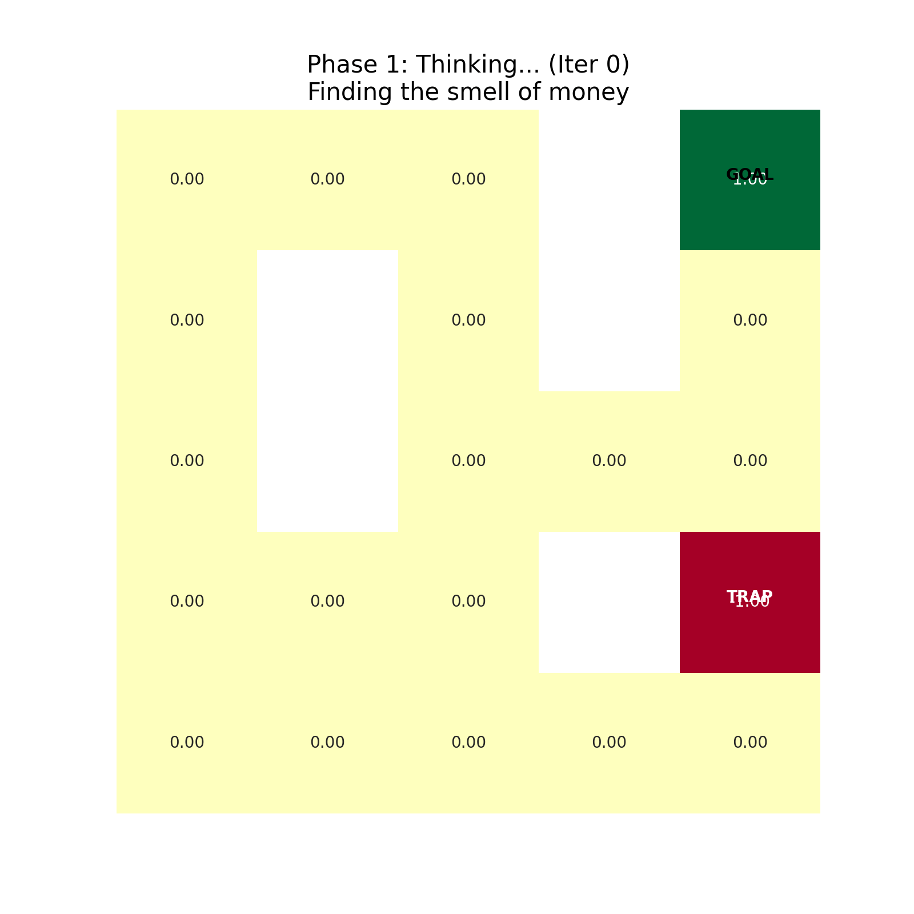

# 马尔可夫决策过程 (MDP) 与贝尔曼方程

⚠️： 范式转移：从`预测`到`决策`

在之前的章节中，我们所有的模型（SVM, CNN, Transformer）都遵循监

督学习范式：

- 给定输入 $x$，预测输出 $y$。

- 目标是最小化预测误差。

- 局限性：模型是被动的观察者，它的输出不会改变世界。

在强化学习 (RL) 中，模型变成了智能体 (Agent)：

- 它的动作 $a$ 会改变环境状态 $s$。

- 它收到的不是“正确答案”，而是延迟的奖励 $R$。

- 目标：最大化未来累积回报，甚至为此牺牲短期利益（延迟满足）。

--- 

## 一，世界观建模

### 1.1 五元组定义

要用数学描述一个“动态变化的世界”，我们需要一个五元组 $M = \langle S, A, P, R, \gamma \rangle$。

- $S$：状态空间，表示环境可能的`状态`集合。
- $A$：动作空间，表示智能体可能的`动作`集合。
- $P$：状态转移概率，表示从状态 $s$ 到状态 $s'$ 的概率。
    - $$P(s' \mid s, a) = P(S_{t+1} = s' \mid S_t = s, A_t = a)$$
    - 它描述了物理规律：在状态 $s$ 下执行动作 $a$，有大概率转移到状态 $s'$，但也可能转移到其他状态，也有可能变成$s''$。

- $R$：奖励函数，表示在状态 $s$ 下执行动作 $a$ 的奖励。
    - $$R(s, a) = R(S_t = s, A_t = a)$$
    - 它描述了奖励机制：在状态 $s$ 下执行动作 $a$，会得到奖励 $R$。

- $\gamma$：折扣因子，表示未来奖励的折扣程度。
    - $$\gamma \in [0, 1]$$
    - 数学作用：保证无限时间步的级数收敛。
    - 哲学含义：耐心。$\gamma = 0$ 是短视（只看眼前），$\gamma \to 1$ 是远见（考虑千秋万代）。

### 1.2  马尔可夫性质 (The Markov Property)
 
这是 RL 可解的根本假设：

`未来只取决于现在，与过去无关。`

$$
\mathbb P (S_{t+1} \mid S_t, S_{t-1}, \ldots, S_0) = \mathbb P(S_{t+1} \mid S_t)
$$

这意味着状态 $S_t$必须包含决策所需的所有信息。如果一张图不能通过 $S_t$ 完全推断未来，那么它就不是 MDP（而是 POMDP，部分可观测），难度指数级上升。

---

## 二、核心灵魂：贝尔曼方程 (The Bellman Equation)

### 2.1 价值函数

一个状态 $s$ 到底有多好？不仅看当前奖励，还要看未来能拿多少分。
我们定义 状态价值函数 $V_\pi(s)$ 为在策略 $\pi$ 下的期望回报：

$$
V_\pi(s) = \mathbb E_{\pi} \left[ \sum_{k=0}^\infty \gamma^k R_{t+k+1} \mid S_t = s \right]
$$


### 2.2 递归的魔法

我们可以将求和公式拆解为：第一步的奖励 + 剩下所有步的折现奖励。

$$
V_\pi(s) = \mathbb E_{\pi} \left[ R_{t+1} + \gamma \sum_{k=0}^\infty \gamma^k R_{t+k+2} \mid S_t = s \right] \\

= \mathbb E_{\pi} \left[ R_{t+1} + \gamma V_\pi(S_{t+1}) \mid S_t = s \right]
$$


展开期望，得到 贝尔曼期望方程 (Bellman Expectation Equation)：

$$
V^{\pi}(s) = \sum_{a \in \mathcal{A}} \pi(a \mid s) \sum_{s' \in \mathcal{S}} P(s' \mid s, a) \left[ R(s, a, s') + \gamma V^{\pi}(s') \right]
$$

### 2.3 贝尔曼最优方程 (Bellman Optimality Equation)

我们的目标不是评估某个策略，而是找到最优策略$\pi^*$。

最优价值 $V^*(s) = \max_\pi V_\pi(s)$ 必须满足：

$$
V^*(s) = \max_{a} \sum_{s'} P(s' \mid s, a) \left[ R(s, a, s') + \gamma V^*(s') \right]
$$

物理意义：一个状态的最优价值，等于**在当前做出最明智选择后，获得的即时奖励加上下个状态的最优价值**（打折后）。

---


## 三、数学深度：为什么这一定能算出来？
你可能会好奇：$V^\ast(s)$ 的定义里包含了 $V^\ast(s')$，这不仅仅是递归，这是循环依赖。怎么解？

### 3.1 巴拿赫不动点定理 (Banach Fixed Point Theorem)

我们将贝尔曼更新看作一个算子（Operator）$\Tau$，作用在价值函数 $V$ 上：

$$
(\Tau V)(s) = \max_{a} (R + \gamma P V)
$$

可以从数学上证明，只要 $\gamma < 1$，算子 $\Tau$ 就是一个 压缩映射 (Contraction Mapping)：

$$
||\Tau V - \Tau W||_{\infty} \leq \gamma ||V - W||_{\infty}
$$

结论：无论你初始猜测的价值表$V_0$是多么离谱（比如全猜0），只要不断地应用贝尔曼算子 
$V_{k+1} = \Tau V_k$，序列最终必然收敛到唯一的全局最优解 $V^*$ 。

这就是动态规划 (Dynamic Programming) 有效的数学保证。

---

## 四、工程解法：Q-Learning 与 策略梯度

在现实中，我们通常不知道环境的转移概率 $p$（Model-free）。我们只能通过试错来学习。


### 4.1 Q-Learning(基于价值)

Q-Learning 是一个经典的 Model-free 算法，它通过学习 Q 函数来找到最优策略。

我们定义动作价值函数 $Q(s,a)$，表示在状态 $s$ 选动作 $a$，之后都遵循最优策略的价值。
贝尔曼方程变为：

$$
Q^*(s,a) = \mathbb{E}_{s'}\left[R + \gamma \max_{a'} Q^*(s',a')\right]$$

时序差分 (TD) 更新公式：

$$
Q(s,a) \leftarrow Q(s,a) + \alpha \underbrace{\left[R + \gamma \max_{a'} Q(s',a') - Q(s,a)\right]}_{\text{TD Error: 现实 - 预期}}
$$

这是 DQN (Deep Q-Network) 的核心，只是把表格 $Q(s,a)$
换成了神经网络 $Q_\theta(s,a)$。

### 4.2 策略梯度 (Policy Gradient, 基于策略)

如果动作空间是连续的（比如机器人关节角度），求 $max_Q$ 很困难。
我们直接参数化策略 $\pi_\theta(a|s)$，并对其目标函数 $J(\theta)$ 求导。

对数导数技巧 (Log-Derivative Trick)：

$$
\nabla_{\theta} J(\theta) = \mathbb{E}_{\tau \sim \pi_{\theta}}\left[\sum_{t=0}^{T} \nabla_{\theta} \log \pi_{\theta}(a_t \mid s_t) \cdot G_t\right]
$$

- $\nabla log \pi_\theta(a_t|s_t)$ 让概率分布向该动作偏移的方向。
- $G_t$ 是折扣累积奖励，也就是这个动作带来的回报。
- 直觉：如果一个动作带来了高回报，就增加它出现的概率；反之则抑制。

---

## 五、例子

```python
import numpy as np
import matplotlib.pyplot as plt
import matplotlib.animation as animation
import seaborn as sns

# ==========================================
# 1. 地图设置 (0:空, 1:墙, 2:坑, 3:钱)
# ==========================================
GRID = np.array([
    [0, 0, 0, 1, 3],
    [0, 1, 0, 1, 0],
    [0, 1, 0, 0, 0],
    [0, 0, 0, 1, 2],
    [0, 0, 0, 0, 0]
])
ROWS, COLS = GRID.shape
GAMMA = 0.9 # 远见因子

# ==========================================
# 2. 核心算法：价值迭代 (思考过程)
# ==========================================
def value_iteration(grid):
    V = np.zeros((ROWS, COLS))
    policy = np.zeros((ROWS, COLS), dtype=int) # 0:上, 1:下, 2:左, 3:右
    history = []
    
    actions = [(-1, 0), (1, 0), (0, -1), (0, 1)] # 上下左右
    
    # 模拟思考 20 次
    for _ in range(20):
        new_V = np.copy(V)
        for r in range(ROWS):
            for c in range(COLS):
                if grid[r,c] == 1 or grid[r,c] in [2,3]: # 墙或终点不更新
                    if grid[r,c] == 3: new_V[r,c] = 1.0 # 钱本身的价值
                    if grid[r,c] == 2: new_V[r,c] = -1.0 # 坑本身的价值
                    continue
                
                # 看看四周哪里价值最高
                values = []
                for idx, (dr, dc) in enumerate(actions):
                    nr, nc = r + dr, c + dc
                    if 0 <= nr < ROWS and 0 <= nc < COLS and grid[nr, nc] != 1:
                        # 核心公式：邻居价值 * 0.9
                        v = GAMMA * V[nr, nc] 
                        values.append(v)
                    else:
                        values.append(-10) # 撞墙很痛
                
                best_val = max(values)
                new_V[r,c] = best_val
                policy[r,c] = np.argmax(values) # 记住最好的方向
        
        V = new_V
        history.append((V.copy(), policy.copy()))
    
    return history

# ==========================================
# 3. 机器人寻路 (行动过程)
# ==========================================
def get_path(policy, start=(4,0)):
    path = [start]
    curr = start
    actions = [(-1, 0), (1, 0), (0, -1), (0, 1)]
    for _ in range(20): # 防止死循环
        action_idx = policy[curr]
        dr, dc = actions[action_idx]
        nr, nc = curr[0] + dr, curr[1] + dc
        if GRID[nr, nc] == 1: break
        curr = (nr, nc)
        path.append(curr)
        if GRID[curr] == 3: break # 拿到钱了
    return path

# ==========================================
# 4. 生成超直观动图
# ==========================================
history = value_iteration(GRID)
final_V, final_policy = history[-1]
robot_path = get_path(final_policy)

fig, ax = plt.subplots(figsize=(8, 8))

def update(frame):
    ax.clear()
    
    # 前 20 帧演示"思考"，后几帧演示"走路"
    if frame < len(history):
        # --- 阶段一：思考 (Value Propagation) ---
        V_curr, policy_curr = history[frame]
        title = f"Phase 1: Thinking... (Iter {frame})\nFinding the smell of money"
        
        # 绘制热力图 (绿色是好，红色是坏)
        sns.heatmap(V_curr, annot=True, fmt=".2f", cmap="RdYlGn", cbar=False, 
                    mask=(GRID==1), vmin=-1, vmax=1, ax=ax, square=True)
        
        # 画箭头
        actions_char = ['↑', '↓', '←', '→']
        for r in range(ROWS):
            for c in range(COLS):
                if GRID[r,c] == 0 and V_curr[r,c] != 0:
                    char = actions_char[policy_curr[r,c]]
                    ax.text(c+0.5, r+0.3, char, ha='center', va='center', fontsize=20, weight='bold')

    else:
        # --- 阶段二：行动 (Robot Walking) ---
        step = frame - len(history)
        if step < len(robot_path):
            current_pos = robot_path[step]
            title = f"Phase 2: Acting!\nRobot Step {step}"
            
            # 保持背景不动
            sns.heatmap(final_V, annot=True, fmt=".2f", cmap="RdYlGn", cbar=False, 
                        mask=(GRID==1), vmin=-1, vmax=1, ax=ax, square=True)
            
            # 画机器人
            r, c = current_pos
            ax.text(c+0.5, r+0.5, "🤖", ha='center', va='center', fontsize=40)
            
            # 画之前的足迹
            for pr, pc in robot_path[:step]:
                ax.text(pc+0.5, pr+0.5, "•", ha='center', va='center', color='blue', fontsize=30)
        else:
            title = "Mission Complete!"
            sns.heatmap(final_V, annot=True, fmt=".2f", cmap="RdYlGn", cbar=False, mask=(GRID==1), ax=ax, square=True)
            r, c = robot_path[-1]
            ax.text(c+0.5, r+0.5, "💰", ha='center', va='center', fontsize=40)

    # 标记特殊点
    for r in range(ROWS):
        for c in range(COLS):
            if GRID[r,c] == 3: ax.text(c+0.5, r+0.5, "GOAL", color='black', weight='bold', ha='center')
            if GRID[r,c] == 2: ax.text(c+0.5, r+0.5, "TRAP", color='white', weight='bold', ha='center')

    ax.set_title(title, fontsize=15)
    ax.axis('off')

ani = animation.FuncAnimation(fig, update, frames=len(history) + len(robot_path) + 2, interval=300)
ani.save('rl_robot_walking.gif', writer='pillow') 
plt.show()
```




Phase 1: 思考 (Thinking) —— 贝尔曼方程的收敛过程
- 现象：你会看到绿色的`能量`从 GOAL（金币）开始，像水波一样向四周扩散。
- 数学本质：这是 $V(s)$ 表的更新。每一次颜色变深，都代表贝尔曼最优方程 $V(s) \leftarrow \max_{a} (R + \gamma \sum P V(s'))$ 进行了一次迭代。
- 关键点：注意看箭头（策略 $\pi$）。一开始它们是乱指的，随着绿色波浪传导过来，箭头自动调整方向，指向了“价值更高”的邻居。这就是**逆向归纳 (Backward Induction)** 的直观体现。

Phase 2: 行动 (Acting) —— 最优策略的执行
- 现象：机器人（🤖）出现，毫不犹豫地绕过 TRAP（红色陷阱），沿着箭头指引的最优路径走向终点。
- 数学本质：这是 Greedy Policy (贪婪策略) 的执行。机器人不需要实时计算，它只需要查表：$a^* = \arg\max_a Q(s,a)$。
- 结论：RL 的本质，就是通过**模拟思考（Phase 1），将未来的奖励折现到现在，从而让当下的每一步都充满远见**。


---
## 六、总结：RL 在数学版图中的位置
|维度	|监督学习 (Supervised)	|强化学习 (RL)
|---	|---	|---
|数据来源|	静态数据集 $(x,y)$ |动态交互$(s,a,r,s')$ 
|优化目标	|最小化瞬间误差	|最大化未来长期回报
|数学核心	|梯度下降 (Calculus)	|贝尔曼方程 / 动态规划
|核心难题	|过拟合、梯度消失	|探索与利用 (Exploration vs Exploitation)
|收敛保证	|凸优化理论	|巴拿赫不动点定理


