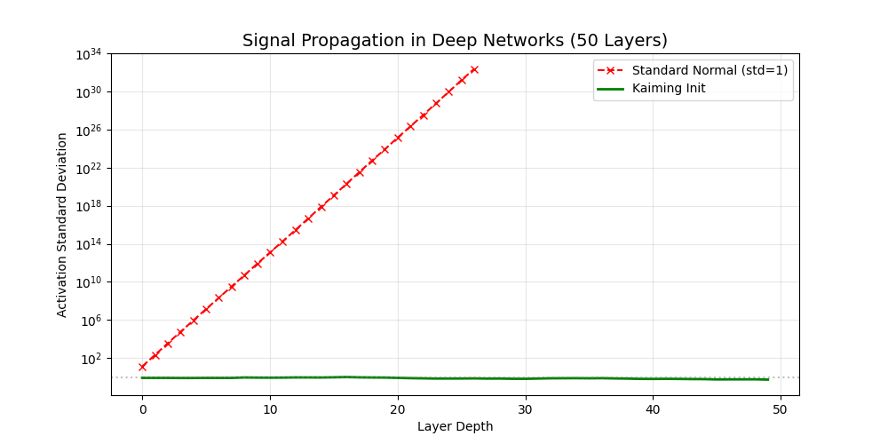

# 训练动力学与超参数理论：从**炼丹**到**化学**

⚠️ 核心认知：超参数不是静态的配置，而是动态的控制

在之前的笔记中，我们关注的是**模型结构（车长什么样）**。
这一篇，我们关注的是**训练过程（油门踩多深、方向盘怎么打）**。

很多初学者认为调参是随机尝试（Grid Search），但资深研究员知道，超参数之间存在着严密的数学耦合：

1. 初始化 (Initialization)：决定了信号在深层网络中是否会`猝死`（消失）或`爆炸`（发散）。
2. 归一化 (Normalization)：改变了损失函数的几何曲率，让优化更平滑。
3. 信噪比 (SDE)：学习率 ($\eta$) 和 Batch Size ($B$) 共同决定了训练过程中的`噪声温度`，直接影响泛化能力。

---

## 一、初始化的物理学：信号传播理论

为什么不能把所有权重初始化为 0？为什么不能用标准高斯分布 $N(0,1)$？
这涉及到一个核心问题：方差保持 (Variance Preservation)。

### 1.1 信号的`生与死`

考虑一个简单的线性层 $y=Wx$。假设 $x$ 和 $W$ 独立，且均值为 0。
根据方差性质：

$$
\text{Var}\left(y\right) = \text{Var}\left(\sum_{i=1}^{n_{\text{in}}} w_i x_i\right) \approx n_{\text{in}} \cdot \text{Var}(w_i) \cdot \text{Var}(x_i)
$$

- 如果 $n_{in} \cdot \text{Var}(w_i) > 1$，信号经过每一层都会被放大，最终会`爆炸`，导致发散，（深层网络数值爆炸 (NaN)）。

- 如果 $n_{in} \cdot \text{Var}(w_i) < 1$，信号经过每一层都会被缩小，最终会`猝死`，导致消失，（深层网络退化为线性模型）。

- 如果 $n_{in} \cdot \text{Var}(w_i) = 1$，信号经过每一层都会保持不变，最终会稳定传播，（深层网络退化为线性模型）。


目标：我们要让信号在每一层都活着，即 $Var(y)=Var(x)$。

$$

\implies \text{Var}(w) = \frac{1}{n_{\text{in}}}

$$

这就是 Xavier Initialization (Glorot Init) 的由来，适用于 Tanh/Sigmoid 激活函数。

### 1.2 Kaiming (He) Initialization：ReLU 的修正

ReLU 激活函数 $f(x)=max(0,x)$ 会将一半的神经元置为 0。这意味着它杀死了一半的方差。
为了补偿这损失的一半能量，权重的方差必须加倍：

$$

\frac{1}{2} n_{\text{in}} \text{Var}(w) = 1 \implies \text{Var}(w) = \frac{2}{n_{\text{in}}}

$$

结论：使用 ReLU 时，权重必须初始化为 $\mathcal{N}(0, \sqrt{\frac{2}{n_{\text{in}}}})$。 否则深层网络根本无法训练。


--- 

## 二、归一化的几何本质：平滑景观 (Smoothing the Landscape)


Batch Normalization (BN) 和 Layer Normalization (LN) 是现代深度学习的标配。
早期的解释是`解决内部协变量偏移 (Internal Covariate Shift)`，但 MIT 的研究表明，这并非根本原因。

### 2.1 真实的数学作用：Lipschitz 约束

归一化限制了损失函数 $L$ 的梯度变化速度（即 Lipschitz 常数）。

$$
\left\|\nabla L(x) - \nabla L(y)\right\| \le K\left\|x - y\right\|
$$

BN/LN 使得 $K$ 变小了。

- 几何直观：如果你在爬山，归一化把那些`悬崖峭壁`（梯度剧烈变化的地方）铲平了，变成了平缓的`土坡`。
- 工程后果：你可以使用更大的学习率而不会导致发散。

### 2.2 Pre-Norm vs Post-Norm (Transformer 的进化)

- Post-Norm (原始 Transformer)：`x = Norm(x + Sublayer(x))`。梯度在反向传播时需要经过 Norm 层，导致梯度在深层容易消失。需要极强的 Warmup 才能训练。

- Pre-Norm (LLaMA / GPT-3)：`x = x + Sublayer(Norm(x))`。主干道是恒等映射 (Identity Path)，梯度可以直接流向第一层。训练极度稳定，目前大模型的标配。

---

## 三、训练的随机过程：SGD 是一个 SDE

超参数 Learning Rate ($\eta$) 和 Batch Size ($B$) 不是独立的，它们是一对孪生兄弟。

### 3.1 随机微分方程 (SDE) 视角
SGD 的更新公式本质上是对一个 SDE 的离散化。Mandt et al. (2017) 证明 SGD 近似于：

$$
d\theta_t = -\nabla L(\theta_t)dt + \sqrt{\frac{\eta}{B} C(\theta_t)} dW_t
$$

其中 $W_t$ 是布朗运动，$C(\theta_t)$ 是协方差矩阵。 $\frac {\eta}{B}$ 其中是扩散系数（噪声强度）。


### 3.2 噪声温度与泛化

将 $\frac {\eta}{B}$ 看作热力学中的温度 $T$，则 $\frac {\eta}{B}$ 越大，噪声越大，模型越不稳定，泛化能力越差。

- 大 Batch (小噪声/低温)：模型迅速落入最近的极小值。如果这个坑很窄（Sharp Minima），测试集稍微偏移一点，Loss 就爆炸。泛化差。

- 小 Batch (大噪声/高温)：模型在坑里跳来跳去，只有那些宽阔平坦的极小值 (Flat Minima) 才能留住它。泛化好。

### 3.3 线性缩放定律 (Linear Scaling Rule)

如果把 Batch Size 扩大 $k$ 倍（为了加速训练），为了保持`噪声温度`不变，必须同时将学习率扩大$k$倍。

$$
\eta_{new} = k\cdot \eta_{old}  \\ when \space \space  B_{new} = k \cdot B_{old}
$$

这是分布式训练（如训练 ImageNet/LLM）中最重要的一条铁律。

---


## 四、神经正切核 (Neural Tangent Kernel, NTK)
当我们将网络的宽度推向无穷大时，会发生一件神奇的事情：训练动力学线性化了。
### 4.1 懒惰训练 (Lazy Training)
在无限宽的极限下，权重$w$在初始化附近几乎不移动，但 Loss 依然能降到 0。
此时，神经网络等价于一个核回归 (Kernel Regression)，其核函数由网络结构决定，称为 NTK。

$$

f(x,t) \approx f(x,0) + \nabla f(x,0)^T (w_t - w_0)

$$

这解释了为什么过参数化（Over-parameterized）的大模型很容易拟合训练数据——它本质上是在高维空间做线性插值。

---

##  五、工程实践：可视化信号传播

这段代码将直观展示：错误的初始化是如何杀死一个 50 层深度的神经网络的。

```python
import torch
import torch.nn as nn
import matplotlib.pyplot as plt
import numpy as np

# === 1. 定义一个深度网络前向传播测试 ===
def test_initialization(activation_fn, init_method, layer_num=50):
    # 模拟输入数据: 均值0, 方差1
    x = torch.randn(512, 512) 
    
    activations = []
    
    for i in range(layer_num):
        layer = nn.Linear(512, 512)
        
        # 应用不同的初始化方法
        if init_method == 'std_normal':
            # 标准正态: std=1 (错误的方法)
            nn.init.normal_(layer.weight, mean=0, std=1.0) 
        elif init_method == 'kaiming':
            # Kaiming He Init: std = sqrt(2/n)
            nn.init.kaiming_normal_(layer.weight, nonlinearity='relu')
            
        # 前向传播
        x = layer(x)
        x = activation_fn(x)
        
        # 记录每层的均值和标准差
        activations.append(x.std().item())
        
        # 如果数值爆炸或消失，提前停止
        if torch.isnan(x).any() or x.std().item() < 1e-6:
            break
            
    return activations

# === 2. 运行实验 ===
# 实验 A: ReLU + 标准高斯初始化 (期望：梯度消失/爆炸)
std_acts = test_initialization(nn.ReLU(), 'std_normal')

# 实验 B: ReLU + Kaiming 初始化 (期望：方差保持稳定)
kaiming_acts = test_initialization(nn.ReLU(), 'kaiming')

# === 3. 可视化 ===
plt.figure(figsize=(10, 5))
plt.plot(std_acts, label='Standard Normal (std=1)', marker='x', color='red', linestyle='--')
plt.plot(kaiming_acts, label='Kaiming Init', color='green', linewidth=2)

plt.title("Signal Propagation in Deep Networks (50 Layers)", fontsize=14)
plt.xlabel("Layer Depth")
plt.ylabel("Activation Standard Deviation")
plt.yscale('log') # 对数坐标看消失/爆炸更清晰
plt.axhline(y=1.0, color='gray', linestyle=':', alpha=0.5)
plt.legend()
plt.grid(True, alpha=0.3)
plt.show()
```


### 实验现象解读




- 红线 (Standard Normal)：在第 5-10 层左右，方差就会急剧上升至 NaN（爆炸）或者下降至 0（消失），取决于具体的激活函数和维度。在 ReLU 下通常表现为不可控的剧烈波动。

- 绿线 (Kaiming Init)：方差在 50 层网络中始终保持在 1.0 附近。这意味着信号成功地`活`到了最后一层，梯度也能成功地反向传回来。

---


## 六、终极总结：调参的化学方程式
|现象 (Symptom)|理论原因 (Diagnosis)|解决方案 (Prescription)|
|---|---|---|
Loss 不下降|信号在深层消失/初始梯度太小|检查 Kaiming Init (ReLU) 或 Xavier Init (Tanh)
Loss 震荡/发散|损失地形太陡峭 (Lipschitz 常数大)|加入 BatchNorm / LayerNorm；调小 LR
训练好但泛化差|掉入了尖锐极小值 (Sharp Minima)|增大 Noise Temperature ($\frac {\eta}{B}$)：增大 LR 或 减小 Batch Size
深层 Transformer 难训|梯度流在反向传播中受阻|改用 Pre-Norm 结构
大 Batch 训练失效|噪声太小，SGD 变成了 GD|使用 Linear Scaling Rule 线性增加 LR

一句话总结：

调参不是玄学，而是在高维空间中控制信号的方差（初始化/归一化）和控制优化的温度（学习率/Batch Size）的动力学过程。
