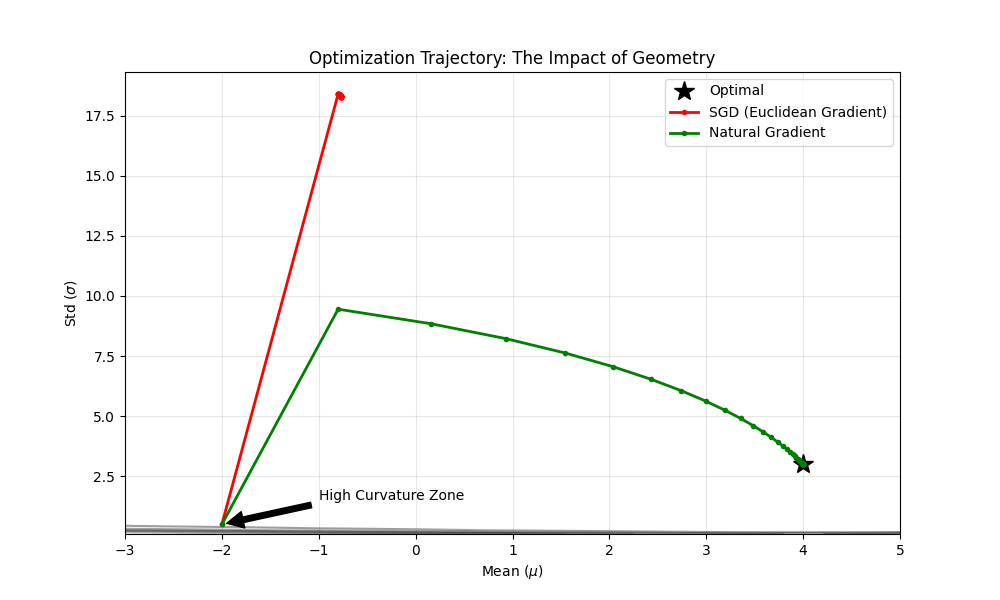

# 信息几何与自然梯度：黎曼流形上的优化

**为什么参数空间的梯度通常是错误的？**

在前面的章节中，我们通常把参数 $\theta$ 看作欧几里得空间中的一个点。但在深度学习中，**参数的数值距离并不代表模型的行为距离**。

本章将揭示优化的真实场地——**黎曼流形（Riemannian Manifold）**，并证明 Adam 等自适应优化器本质上是在对空间的曲率进行`逆变换`。

---

## 1. 直觉：地图与地球

### 1.1 参数空间 $\neq$ 概率空间
假设我们有两个高斯分布 $p = \mathcal{N}(\mu, \sigma^2)$。

*   **情况 A**：$\sigma = 10$。$\mu$ 从 $0$ 变到 $1$。分布几乎没变（重叠度极高）。
*   **情况 B**：$\sigma = 0.01$。$\mu$ 从 $0$ 变到 $1$。分布完全分离。

**矛盾点**：在参数空间中，两者的位移都是 $\|\Delta \mu\| = 1$。但在概率流形上，情况 B 的移动距离远大于情况 A。

**结论**：使用欧氏距离 $\|\theta - \theta'\|^2$ 来衡量模型的更新步长是**失效**的。我们需要一个新的度量标准。

### 1.2 KL 散度作为`尺子`
我们关注的是**分布的变化**，而非**参数数值的变化**。严谨的距离度量应基于 KL 散度：

$$
D_{KL}(p_\theta \| p_{\theta+\delta}) \approx \frac{1}{2} \delta^T \mathbf{F}(\theta) \delta
$$

这个二次型形式揭示了空间的局部几何结构，其中 $\mathbf{F}$ 就是度量张量。

---

## 2. 费雪信息矩阵 (Fisher Information Matrix, FIM)

$\mathbf{F}$ 是概率统计与微分几何的连接点。

### 2.1 数学定义
$\mathbf{F}$ 定义为**对数似然函数梯度的协方差矩阵**：

$$
\mathbf{F} = \mathbb{E}_{x \sim p(x|\theta)} \left[ \nabla_\theta \log p(x|\theta) \nabla_\theta \log p(x|\theta)^T \right]
$$

### 2.2 几何意义：局部曲率
*   **$\mathbf{F}$ 大**：梯度变化剧烈，分布对参数敏感 $\to$ 空间弯曲程度大 $\to$ 应该走小步。
*   **$\mathbf{F}$ 小**：梯度平缓，分布对参数迟钝 $\to$ 空间平坦 $\to$ 可以走大步。

在几何上，$\mathbf{F}$ 定义了一个**椭圆**邻域。普通的梯度下降把周围看作正圆，而 $\mathbf{F}$ 告诉我们这是一个被拉伸的椭圆。

---

## 3. 自然梯度下降 (Natural Gradient Descent)

如果我们希望在**概率流形**上走固定长度的步子，而不是在参数空间瞎走，我们需要求解以下约束优化问题：

$$
\min_{\delta} L(\theta + \delta) \quad \text{s.t.} \quad D_{KL}(p_\theta \| p_{\theta+\delta}) = c
$$

### 3.1 推导结果
利用拉格朗日乘数法，我们得到**自然梯度**更新公式：

$$
\tilde{\nabla} L = \mathbf{F}^{-1} \nabla L
$$

$$
\theta_{t+1} = \theta_t - \eta \mathbf{F}^{-1} \nabla L(\theta_t)
$$

### 3.2 作用机制：预处理 (Preconditioning)
$\mathbf{F}^{-1}$ 抵消了空间的弯曲：
*   如果某个方向曲率极高（$\mathbf{F}$ 大），$\mathbf{F}^{-1}$ 会缩小该方向的梯度。
*   如果某个方向非常平坦（$\mathbf{F}$ 小），$\mathbf{F}^{-1}$ 会放大该方向的梯度。

这使得优化路径从`之字形`震荡变成了直指圆心的`测地线`。

---

## 4. 为什么 Adam 有效？—— FIM 的对角近似

在深度学习中，计算并求逆 $\mathbf{F}$ ($N \times N$ 矩阵) 是不可行的。

### 4.1 RMSProp / Adam 的本质
Adam 算法维护了梯度平方的指数移动平均 $v_t$：

$$
v_t \approx \mathbb{E}[(\nabla L)^2]
$$

如果我们假设参数之间是相互独立的（即忽略相关性），那么 **FIM 退化为对角矩阵**，其对角元正是梯度的二阶矩。

Adam 的更新规则（简化版）：

$$
\Delta \theta \propto -\frac{1}{\sqrt{v_t}} \nabla L \approx -\frac{1}{\sqrt{\text{diag}(\mathbf{F})}} \nabla L
$$

### 4.2 结论
**Adam 本质上是自然梯度下降的一种`对角线近似`版本。**
它通过 $1/\sqrt{v_t}$ 这一项，自适应地在每个维度上缩放步长，试图将扭曲的椭圆空间还原成正圆。

---

## 5. 代码与可视化：SGD vs 自然梯度

本实验通过拟合一个二维高斯分布，直观展示欧氏梯度（SGD）的低效与自然梯度的直接。

```python
import numpy as np
import matplotlib.pyplot as plt

# 目标分布参数
TRUE_MU, TRUE_SIGMA = 4.0, 3.0

def get_grads(mu, sigma):
    """
    计算 Loss 对 mu 和 sigma 的梯度
    Loss 本质上是 KL(P_true || P_current)
    """
    # dL/dmu
    grad_mu = (mu - TRUE_MU) / (sigma**2)
    # dL/dsigma
    grad_sigma = (1.0/sigma) - ((TRUE_SIGMA**2 + (TRUE_MU - mu)**2) / (sigma**3))
    return np.array([grad_mu, grad_sigma])

def get_fisher_inverse(sigma):
    """
    高斯分布的 Fisher 矩阵解析解是对角阵：
    F = diag(1/sigma^2, 2/sigma^2)
    F_inv = diag(sigma^2, 0.5*sigma^2)
    """
    return np.array([sigma**2, 0.5 * sigma**2]) # 返回对角线元素

def optimize(opt_type, steps=50, lr=0.1):
    mu, sigma = -2.0, 0.5 # 初始点：很远，且 sigma 很小（高曲率区域）
    path = [[mu, sigma]]
    
    for _ in range(steps):
        grad = get_grads(mu, sigma)
        
        if opt_type == 'SGD':
            # 普通梯度：直接减去梯度
            update = -lr * grad
        elif opt_type == 'Natural':
            # 自然梯度：乘以 F_inv
            F_inv = get_fisher_inverse(sigma)
            update = -lr * (grad * F_inv) # 元素乘法即矩阵乘法（对角阵）
            
        mu += update[0]
        sigma += update[1]
        sigma = max(sigma, 0.05) # 保持数值稳定性
        path.append([mu, sigma])
        
    return np.array(path)

# --- 可视化 ---
sgd_path = optimize('SGD', lr=0.05) # SGD 需要极小的学习率否则发散
nat_path = optimize('Natural', lr=0.2)

# 绘制 Loss 等高线
mu_range = np.linspace(-3, 5, 50)
sigma_range = np.linspace(0.1, 4, 50)
M, S = np.meshgrid(mu_range, sigma_range)
# 简化的 Loss 函数可视化
Loss = np.log(S) + (TRUE_SIGMA**2 + (TRUE_MU - M)**2)/(2*S**2)

plt.figure(figsize=(10, 6))
plt.contour(M, S, Loss, levels=20, cmap='gray', alpha=0.4)
plt.plot(TRUE_MU, TRUE_SIGMA, 'k*', markersize=15, label='Optimal')

# 绘制路径
plt.plot(sgd_path[:,0], sgd_path[:,1], 'r.-', linewidth=2, label='SGD (Euclidean Gradient)')
plt.plot(nat_path[:,0], nat_path[:,1], 'g.-', linewidth=2, label='Natural Gradient')

# 添加箭头解释
plt.annotate('High Curvature Zone', xy=(-2, 0.5), xytext=(-1, 1.5),
             arrowprops=dict(facecolor='black', shrink=0.05))

plt.xlabel('Mean ($\mu$)')
plt.ylabel('Std ($\sigma$)')
plt.title('Optimization Trajectory: The Impact of Geometry')
plt.legend()
plt.grid(True, alpha=0.3)
plt.show()
```

### 5.2 现象分析




这张图完美验证了黎曼几何对优化的统治力：

1.  **SGD 的盲目狂奔 (红线)**
    *   **现象**：从 $\sigma=0.5$ 出发，瞬间垂直弹射到 $\sigma \approx 18$，完全偏离目标。
    *   **原因**：梯度爆炸。在 $\sigma$ 较小区域，梯度的分母包含 $\sigma^3$ 项 ($\nabla_\sigma L \approx \dots / \sigma^3$)。SGD 被巨大的梯度数值欺骗，迈出了过大的一步，导致参数剧烈震荡。
    *   **本质**：这是典型的**步伐与地形不匹配**。

2.  **自然梯度的理智导航 (绿线)**
    *   **现象**：沿着一条优雅的弧线直奔终点，未发生震荡。
    *   **原因**：曲率校正。$\mathbf{F}^{-1}$ 在此处正比于 $\sigma^2$。它作为一个阻尼器，抵消了梯度的爆发：
        $$ \text{Update} \propto \mathbf{F}^{-1} \cdot \nabla L \approx \sigma^2 \cdot \frac{1}{\sigma^3} = \frac{1}{\sigma} $$
    *   **本质**：它自动识别出当前处于`高曲率敏感区`，从而主动缩小步长。

**结论**：
这就是为什么大模型训练离不开 Adam。Adam 通过除以梯度均方根 ($\sqrt{v_t}$)，本质上是在模拟自然梯度的这种**自适应缩放机制**，防止模型在参数敏感区（高曲率区）发生崩溃。

---

## 6. 总结

|维度|	普通梯度下降 (SGD)|	自然梯度下降 (NGD)
|--|--|--|
|视角|看着地图走路|看着地球仪走路
|假设|参数空间是平坦的 (欧氏)|参数空间是弯曲的 (黎曼)
|公式|$\Delta \theta = -\eta \nabla L $|$\Delta \theta = -\eta \mathbf{F}^{-1} \nabla L $|
|缺点|遇到高曲率区域（如悬崖）会震荡|计算 $\mathbf{F}^{-1}$ 极其昂贵
|现代近似	|Momentum	|Adam, K-FAC


核心洞见：

Adam 之所以成为默认优化器，不仅仅是因为它调节了学习率，更因为它是低成本的自然梯度近似。它让我们在不知道空间曲率的情况下，依然能近似地走出测地线。
