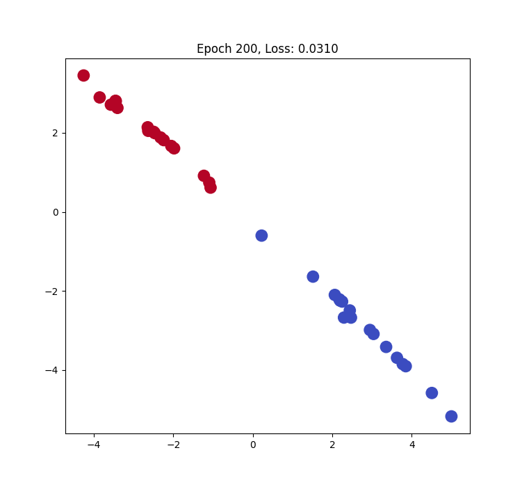

# 图神经网络与谱图理论：非欧几里得空间的谐波分析

**当数据不再整齐排列（如图像/文本），而是呈现拓扑结构（如社交网络/分子）时，卷积还存在吗？**

本章将带你进入**非欧几里得几何**的世界。我们将看到，经典的卷积神经网络 (CNN) 只是图神经网络 (GNN) 在规则网格上的一个特例。我们将利用**谱图理论 (Spectral Graph Theory)** 重新发明`卷积`。

---

## 1. 困境：当平移不变性消失

CNN 的核心威力来自于**卷积核 (Kernel) 的平移不变性 (Translation Invariance)**。
*   在图像上，像素 $(0,0)$ 的`右边`和像素 $(10,10)$ 的`右边`定义是一样的。
*   我们可以把一个 $3 \times 3$ 的滤波器在图像上滑动。

但在图 (Graph) $G=(V, E)$ 上：
1.  **没有方向**：节点的邻居数量不固定，没有`上下左右`之分。
2.  **没有平移**：拓扑结构是扭曲的，无法定义`滑动窗口`。

为了在图上做深度学习，我们必须寻找一个**与拓扑结构无关**的数学算子。

---

## 2. 核心算子：拉普拉斯矩阵 (Graph Laplacian)

在物理学中，描述`波`和`扩散`的核心工具是拉普拉斯算子 $\Delta$。在图论中，它的离散形式是**拉普拉斯矩阵** $\mathbf{L}$。

### 2.1 定义
给定无向图的邻接矩阵 $\mathbf{A}$ 和度矩阵 $\mathbf{D}$（对角阵，$\mathbf{D}_{ii} = \sum_j \mathbf{A}_{ij}$）：

$$
\mathbf{L} = \mathbf{D} - \mathbf{A}
$$

### 2.2 物理意义：离散的二阶导数
对于图上的信号 $\mathbf{x} \in \mathbb{R}^N$（每个节点一个标量值），$\mathbf{L}$ 作用在 $\mathbf{x}$ 上实际上是在计算**节点与其邻居的差异**：

$$
(\mathbf{L}\mathbf{x})_i = \sum_{j \in \mathcal{N}(i)} (\mathbf{x}_i - \mathbf{x}_j)
$$

这等价于微积分中的 $-\Delta f$。
*   **平滑度度量**：$\mathbf{x}^T \mathbf{L} \mathbf{x} = \sum_{(i,j)\in E} (\mathbf{x}_i - \mathbf{x}_j)^2$。这个二次型衡量了信号在图上的变动剧烈程度（Dirichlet Energy）。
*   **热力学视角**：它描述了热量（或信息）如何在网络上从高势能节点向低势能节点扩散。

---

## 3. 频域视角：图傅里叶变换 (GFT)

既然无法在空域（Spatial Domain）上定义卷积，我们转向频域（Spectral Domain）。

### 3.1 什么是图的`频率`？
在经典信号处理中，傅里叶变换是将信号投影到正弦波 $e^{i\omega t}$ 上。正弦波是拉普拉斯算子的特征函数：$\Delta e^{i\omega t} = -\omega^2 e^{i\omega t}$。

同理，**图的特征向量就是图的`正弦波`**。
对 $\mathbf{L}$ 进行特征分解（它是一个实对称矩阵，必可正交对角化）：

$$
\mathbf{L} = \mathbf{U} \mathbf{\Lambda} \mathbf{U}^T
$$

*   $\mathbf{U} = [\mathbf{u}_1, \dots, \mathbf{u}_N]$：特征向量，即**图的傅里叶基**。
*   $\mathbf{\Lambda} = \text{diag}(\lambda_1, \dots, \lambda_N)$：特征值，即**图的频率**。

### 3.2 卷积定理
经典卷积定理告诉我们：**时域的卷积等于频域的乘法**。
$$
f * g = \mathcal{F}^{-1} (\mathcal{F}(f) \odot \mathcal{F}(g))
$$

我们在图上定义卷积 $*_G$：
$$
\mathbf{x} *_G \mathbf{g} = \mathbf{U} ((\mathbf{U}^T \mathbf{g}) \odot (\mathbf{U}^T \mathbf{x})) = \mathbf{U} \mathbf{G}_\theta \mathbf{U}^T \mathbf{x}
$$

其中 $\mathbf{G}_\theta = \text{diag}(\theta)$ 是我们在频域上学习的滤波器。

---

## 4. 逃离 $O(N^3)$：从 ChebNet 到 GCN

上述谱图卷积有一个致命缺陷：特征分解 $\mathbf{L} = \mathbf{U} \mathbf{\Lambda} \mathbf{U}^T$ 的复杂度是 $O(N^3)$。对于百万节点的社交网络，这是不可接受的。

### 4.1 切比雪夫近似 (ChebNet)
为了避免显式计算特征分解，我们利用矩阵多项式来近似频域滤波器。
如果滤波器 $g_\theta(\Lambda)$ 是 $\Lambda$ 的 $K$ 阶多项式，那么：
$$
g_\theta(\mathbf{L}) \approx \sum_{k=0}^K \theta_k \mathbf{L}^k
$$
这意味着我们只需要计算 $\mathbf{L}$ 的幂，这对应于 $K$ 阶邻居的信息聚合，完全不需要特征分解。

### 4.2 GCN (Graph Convolutional Network)
Kipf & Welling (2017) 做了一个极其大胆的简化：只取 $K=1$（只看一阶邻居），并令 $\theta_0 = -\theta_1 = \theta$。

推导出的传播公式极其简洁：

$$
\mathbf{H}^{(l+1)} = \sigma \left( \tilde{\mathbf{D}}^{-\frac{1}{2}} \tilde{\mathbf{A}} \tilde{\mathbf{D}}^{-\frac{1}{2}} \mathbf{H}^{(l)} \mathbf{W}^{(l)} \right)
$$

*   $\tilde{\mathbf{A}} = \mathbf{A} + \mathbf{I}$：加入自环（Self-loop），保证节点在聚合时保留自己的信息。
*   $\tilde{\mathbf{D}}^{-\frac{1}{2}} \tilde{\mathbf{A}} \tilde{\mathbf{D}}^{-\frac{1}{2}}$：这是**归一化**过程，防止度大的节点特征值爆炸。

**物理意义**：GCN 的每一次更新，本质上是**加权平均了邻居节点的特征，然后做一次线性变换和非线性激活**。

---

## 5. 大一统：GNN 与 Transformer

我们回过头看 Transformer 中的 Self-Attention：
$$
\text{Attention}(\mathbf{Q}, \mathbf{K}, \mathbf{V}) = \text{softmax}\left(\frac{\mathbf{Q}\mathbf{K}^T}{\sqrt{d_k}}\right)\mathbf{V}
$$

如果不看 Softmax，令 $\mathbf{A}_{att} = \mathbf{Q}\mathbf{K}^T$，那么 Transformer 的更新公式与 GCN 惊人地相似：
*   **GCN**：聚合基于**固定的**图结构 $\mathbf{A}$（物理连接）。
*   **Transformer**：聚合基于**动态计算的**相似度 $\mathbf{A}_{att}$（语义关联）。

**结论**：Transformer 本质上是在一个**全连接图 (Fully Connected Graph)** 上运行的 GNN，其中边的权重是数据驱动的。

---

## 6. 代码实现：GCN 节点分类

我们将使用 PyTorch 实现一个手写的 GCN 层，并在经典的`扎克伯格空手道俱乐部 (Zachary's Karate Club)`数据集上进行节点分类。

```python
import torch
import torch.nn as nn
import torch.optim as optim
import numpy as np
import networkx as nx
import matplotlib.pyplot as plt

# ==========================================
# 1. 数据准备：扎克伯格空手道俱乐部 (Karate Club)
# ==========================================
def load_data():
    # 加载内置的空手道俱乐部图
    # 这是一个社交网络，节点是成员，边是他们的社交关系
    # 任务：预测成员属于"Mr. Hi"派系还是"Officer"派系
    G = nx.karate_club_graph()
    
    # 获取标签 (Ground Truth)
    labels = []
    for i in range(len(G.nodes)):
        club = G.nodes[i]['club']
        labels.append(0 if club == 'Mr. Hi' else 1)
    labels = torch.LongTensor(labels)

    # 获取邻接矩阵 A
    A = nx.adjacency_matrix(G).todense()
    A = np.array(A, dtype=np.float32)
    
    # 特征矩阵 X
    # 在这个简单例子中，我们没有节点特征，所以使用单位矩阵 (One-hot encoding)
    # 这意味着模型必须纯粹依靠图的结构来学习
    X = torch.eye(A.shape[0], dtype=torch.float32)
    
    return G, A, X, labels

# ==========================================
# 2. 数学核心：重归一化技巧 (Renormalization Trick)
# ==========================================
def preprocess_adjacency(A):
    """
    实现 GCN 论文中的公式： D^{-1/2} * (A + I) * D^{-1/2}
    这是谱图卷积的一阶切比雪夫近似。
    """
    N = A.shape[0]
    
    # 1. 添加自环 (Self-loop): A_tilde = A + I
    A_tilde = A + np.eye(N)
    
    # 2. 计算度矩阵 D_tilde
    D_tilde_vals = np.sum(A_tilde, axis=1) # 按行求和
    
    # 3. 计算 D^{-1/2}
    # 注意：如果不加自环，度可能为0导致除零错误，加了I后度至少为1
    D_inv_sqrt_vals = np.power(D_tilde_vals, -0.5)
    D_inv_sqrt = np.diag(D_inv_sqrt_vals)
    
    # 4. 对称归一化: A_hat = D^{-1/2} @ A_tilde @ D^{-1/2}
    # 这一步让特征在传播时不会爆炸（保持数值稳定性）
    A_hat = np.dot(np.dot(D_inv_sqrt, A_tilde), D_inv_sqrt)
    
    return torch.FloatTensor(A_hat)

# ==========================================
# 3. 模型定义：手动实现 GCN 层
# ==========================================
class GCNLayer(nn.Module):
    def __init__(self, in_features, out_features):
        super(GCNLayer, self).__init__()
        # 定义可学习的权重矩阵 W
        self.linear = nn.Linear(in_features, out_features, bias=False)

    def forward(self, A_hat, X):
        # 公式: H = A_hat * X * W
        # 1. 线性变换: XW (PyTorch Linear层自动处理 X @ W.T)
        X_proj = self.linear(X)
        
        # 2. 邻居聚合 (消息传递): A_hat * (XW)
        # torch.mm 是矩阵乘法
        out = torch.mm(A_hat, X_proj)
        
        return out

class GCN(nn.Module):
    def __init__(self, num_features, num_classes):
        super(GCN, self).__init__()
        # 两层 GCN
        # 第一层将特征映射到隐藏空间 (比如 4维)
        self.gcn1 = GCNLayer(num_features, 4)
        # 第二层映射到 2维 以便可视化，同时作为输出 Logits
        self.gcn2 = GCNLayer(4, 2)
        self.relu = nn.ReLU()

    def forward(self, A_hat, X):
        # 第一层: Aggregation -> Transformation -> Activation
        h1 = self.relu(self.gcn1(A_hat, X))
        # 第二层: Aggregation -> Transformation (无激活，直接输出 logits)
        h2 = self.gcn2(A_hat, h1)
        return h2

# ==========================================
# 4. 训练与可视化流程
# ==========================================
def visualize_embedding(h, color, epoch=None, loss=None):
    plt.figure(figsize=(7, 7))
    h = h.detach().numpy()
    plt.scatter(h[:, 0], h[:, 1], s=140, c=color, cmap="coolwarm")
    plt.title(f'Epoch {epoch}, Loss: {loss:.4f}' if epoch else 'Result')
    plt.show()

def main():
    # 1. 准备数据
    G, A_numpy, X, labels = load_data()
    A_hat = preprocess_adjacency(A_numpy) # 计算核心算子
    
    # 2. 初始化模型
    model = GCN(num_features=X.shape[1], num_classes=2)
    optimizer = optim.Adam(model.parameters(), lr=0.01)
    criterion = nn.CrossEntropyLoss()

    # 3. 训练循环
    print("开始训练...")
    for epoch in range(201):
        model.train()
        optimizer.zero_grad()
        
        # 前向传播
        output = model(A_hat, X)
        
        # 计算损失 (这里我们使用全监督，实际 GCN 常用于半监督)
        loss = criterion(output, labels)
        
        # 反向传播
        loss.backward()
        optimizer.step()

        if epoch % 50 == 0:
            print(f'Epoch {epoch:03d} | Loss: {loss.item():.4f}')
            # 可视化当前的 Embedding 状态
            # 我们只训练了图结构，没有任何节点特征输入
            # 看模型如何仅凭"谁认识谁"就把两拨人分开
            # Visualize every 50 epochs (optional, or just at the end)
            # visualize_embedding(output, labels, epoch, loss.item())

    # 4. 最终结果可视化
    print("训练完成！展示最终的节点分布...")
    model.eval()
    final_output = model(A_hat, X)
    visualize_embedding(final_output, labels, epoch=200, loss=loss.item())

if __name__ == "__main__":
    main()
```

*   实现 `SpectralGraphConv` 层。
*   实现 `renormalization_trick`。
*   可视化：训练前后节点的 Embedding 在二维空间的分布变化（从杂乱无章到线性可分）。


### 6.1 实验结果分析



上图展示了训练 200 个 Epoch 后的节点分布：

*   **现象**：原本在图拓扑中纠缠不清的节点，在二维嵌入空间中被清晰地拉扯成了两个线性可分的阵营（红色 vs 蓝色）。
*   **本质**：这证明了 GCN 成功提取了图的**谱特征**。即使我们没有任何节点特征输入（输入仅为单位矩阵），仅凭**结构信息**（谁认识谁），GCN 也能重构出社群结构。
*   **数学解释**：这正是拉普拉斯矩阵特征向量的作用——它们提供了图上的`最佳坐标系`，使得相连的节点在坐标系中距离更近。


---

## 7. 总结

| 概念 | 欧几里得空间 (CNN) | 非欧几里得空间 (GCN) |
| :--- | :--- | :--- |
| **基础结构** | 网格 (Grid) | 图 (Graph) |
| **不变性** | 平移不变性 | 拓扑不变性 (Permutation Invariance) |
| **卷积定义** | 滑动窗口加权和 | 谱域乘法 / 空域消息传递 |
| **核心算子** | $3\times3$ 卷积核 | 拉普拉斯矩阵 $\mathbf{L}$ |
| **计算复杂度** | $O(N)$ (借助 FFT) | $O(E)$ (借助多项式近似) |

