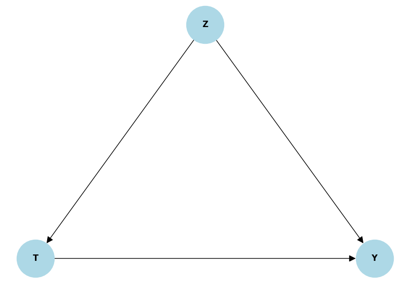
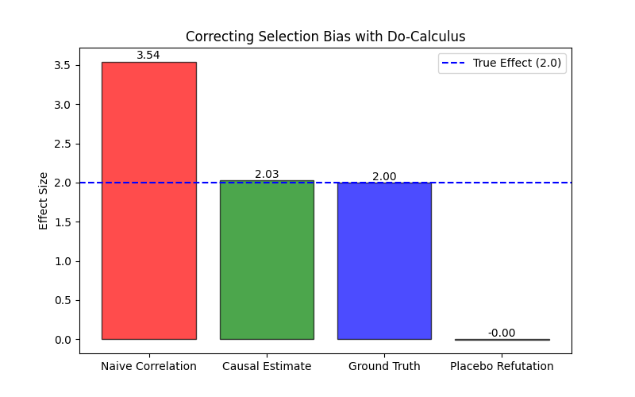

# [22] 因果推断：结构方程与 Do-Calculus

**摘要**：本章建立了一套区别于经典概率论的运算体系——**Do-Calculus**。我们将证明：在缺乏图结构假设的情况下，$P(Y|X)$ 无法推断物理机制；通过引入结构因果模型 (SCM)，我们可以将干预分布 $P(Y|do(X))$ 和反事实分布 $P(Y_{x'}|x,y)$ 转化为可计算的统计量。

---

## 1. 核心定义与公理体系

### 1.1 结构因果模型 (SCM)
定义一个 SCM 为四元组 $\mathcal{M} = \langle U, V, F, P(U) \rangle$：
*   **$U$ (外生变量)**：未被观测的背景变量（噪声），服从联合分布 $P(U)$。
*   **$V$ (内生变量)**：模型内的观测变量 $\{V_1, \dots, V_n\}$。
*   **$F$ (结构方程)**：一组函数 $v_i = f_i(pa_i, u_i)$，其中 $pa_i \subseteq V \setminus \{v_i\}$ 是 $v_i$ 的父节点。这代表了**物理生成机制**。

### 1.2 贝叶斯网络因子分解 (The Markov Property)
在未干预状态下，联合概率分布 $P(v)$ 由图结构 $G$ 决定：
$$ P(v_1, \dots, v_n) = \prod_{i=1}^n P(v_i | pa_i) $$

### 1.3 干预算子 (The Do-Operator)
干预 $do(X=x)$ 被定义为**图手术 (Graph Surgery)**：
将结构方程 $X = f_X(pa_X, u_X)$ 替换为常数方程 $X = x$。
这导致了**截断因子分解 (Truncated Factorization)**：
$$ P(v_1, \dots, v_n | do(X=x)) = \left. \prod_{i, V_i \neq X} P(v_i | pa_i) \right|_{X=x} $$
**推论**：干预改变了 $X$ 的生成机制，但保留了系统其余部分的物理定律 $P(v_i|pa_i)$。

---

## 2. 统计学的陷阱：Simpson 悖论的数学本质

Simpson 悖论表现为总体的相关性与分组的相关性符号相反。其数学本质是**选择偏差 (Selection Bias)**。

### 2.1 偏差的解析推导
设 $T \in \{0,1\}$ 为治疗，$Y$ 为结果，$Z$ 为混淆变量（$Z \to T, Z \to Y$）。
我们关注**平均治疗效应 (ATE)**：
$$ \tau = \mathbb{E}[Y | do(T=1)] - \mathbb{E}[Y | do(T=0)] $$

在观测数据中，差值为：
$$ \Delta_{obs} = \mathbb{E}[Y | T=1] - \mathbb{E}[Y | T=0] $$

利用全期望公式 $\mathbb{E}[Y|T] = \sum_z \mathbb{E}[Y|T,z]P(z|T)$ 展开 $\Delta_{obs}$：
$$ \Delta_{obs} = \sum_z \mathbb{E}[Y|T=1, z]P(z|T=1) - \sum_z \mathbb{E}[Y|T=0, z]P(z|T=0) $$

假设同质性效应（Homogeneous Effect），即在每组 $z$ 中效应相同：$\mathbb{E}[Y|T=1,z] - \mathbb{E}[Y|T=0,z] = \delta$。
则观测差值包含两部分：
$$ \Delta_{obs} = \underbrace{\delta}_{\text{真实效应}} + \underbrace{\sum_z \mathbb{E}[Y|T=0,z] \left[ P(z|T=1) - P(z|T=0) \right]}_{\text{选择偏差 (Bias)}} $$

### 2.2 结论
*   如果 $P(z|T=1) \neq P(z|T=0)$（即 $T$ 和 $Z$ 相关），则 $\Delta_{obs} \neq \delta$。
*   **因果推断的核心**在于通过 $do(T)$ 操作，强制 $P(z|do(T)) = P(z)$，从而消除上述偏差项。

---

## 3. 因果识别：后门调整公式 (Back-door Adjustment)

如何将不可观测的 $P(Y|do(X))$ 转化为可观测的概率 $P(Y|X, Z)$？

### 3.1 识别定理
如果变量集合 $Z$ 满足**后门准则 (Back-door Criterion)**：
1.  $Z$ 不包含 $X$ 的后代节点。
2.  $Z$ 阻断了 $X$ 与 $Y$ 之间所有含有指向 $X$ 的箭头（$X \leftarrow \dots$）的路径。

则有**调整公式 (Adjustment Formula)**：
$$ P(Y=y | do(X=x)) = \sum_z P(Y=y | X=x, Z=z) P(Z=z) $$

### 3.2 证明概要
基于截断因子分解：
$$
\begin{aligned}
P(y | do(x)) &= \sum_z P(y, z | do(x)) \\
&= \sum_z P(y | x, z, do(x)) P(z | do(x)) \\
\end{aligned}
$$
由于 $Z$ 满足后门准则：
1.  $Z$ 在 $X$ 上游，不受 $do(X)$ 影响 $\Rightarrow P(z | do(x)) = P(z)$。
2.  给定 $Z, X$，机制 $Y$ 不变 $\Rightarrow P(y | x, z, do(x)) = P(y | x, z)$ (模不变性)。
证毕。

---

## 4. 反事实推理 (Counterfactuals)

反事实处于 Pearl 因果阶梯的第三层，涉及符号 $P(Y_{x'} | X=x, Y=y)$。
**物理意义**：已知现实世界中 $X=x$ 导致了 $Y=y$，若我们时光倒流强制 $X=x'$，在其他条件（外生变量 $U$）不变的情况下，$Y$ 会是多少？

### 4.1 溯因-干预-预测 (Abduction-Action-Prediction)
这是一个严格的计算过程：

1.  **溯因 (Abduction)**：计算外生变量的后验分布。
    $$ P(U | x, y) = \frac{P(y|x, U) P(x|U) P(U)}{\int P(y|x, u) P(x|u) P(u) du} $$
    *注：这本质上是在推断特定个体的固有属性（如基因、天赋）。*

2.  **干预 (Action)**：建立新模型 $\mathcal{M}_{x'}$，替换方程 $X=x'$，但**保留 $U$ 的分布**。

3.  **预测 (Prediction)**：在新模型上计算 $Y$ 的期望。
    $$ \mathbb{E}[Y_{x'} | X=x, Y=y] = \int f_Y(x', pa_Y, u) \cdot P(u | x, y) du $$

### 4.2 深度学习中的联系
在 Causal VAE 或生成模型中，我们通常无法精确计算积分，而是通过变分推断 (Variational Inference) 近似：
$$ P(u | x, y) \approx q_\phi(u | x, y) $$
这就是为什么生成模型（Ch 15）是实现反事实推理的必经之路。

---
## 5. 深度因果学习：独立因果机制 (ICM)

将因果思想引入深度神经网络，核心在于寻找对环境变化鲁棒的表示。这连接了因果推断与泛化理论 (Ch 7, 9)。

### 5.1 独立因果机制原理 (ICM Principle)
物理世界的联合分布 $$ P(X_1, \ldots, X_n) $$ 可以分解为独立机制的乘积：

$$ P(s) = \prod_{i=1}^n P(X_i | P A_i) $$

ICM 假设：各个物理机制 $P(X_i | P A_i)$ 之间是独立的，且不包含彼此的信息。这意味着当分布发生偏移（Distribution Shift）时，通常只有稀疏 (Sparse) 的几个机制发生了改变，而其他机制保持不变（Invariant）。

### 5.2 稀疏机制偏移 (Sparse Mechanism Shift)

在深度学习中，如果我们学习到了正确的因果变量（Disentangled Representation），那么从训练集（源域 $e_{train}$）迁移到测试集（目标域 $e_{test}$）时，参数的变化应该是最小的。
我们可以定义损失函数来寻找这些因果模块。假设神经网络被分解为 $k$ 个模块 ${m_1,\ldots,m_k}$，在不同环境 $e$ 下：

$$
L_{\text{Total}} = \underbrace{\sum_{e} L_{\text{pred}}(f(x), y; e)}_{\text{预测误差}} + \lambda \underbrace{\sum_{j=1}^{k} \left\|\nabla_{e} P(m_j \mid e)\right\|}_{\text{机制变化惩罚}}
$$

转为KL散度形式：

$$

\min_{\theta} \sum_{i} D_{\text{KL}}\left(P(M_i^{\text{train}}) \parallel P(M_i^{\text{test}})\right)

$$

这正是 不变量风险最小化 (Invariant Risk Minimization, IRM) 和 Bengio 的意识先验 (Consciousness Prior) 的数学基础。

---

## 6. 代码实战：Do-Calculus 验证

我们将构建一个符合 $Z \to T, Z \to Y, T \to Y$ 结构的 SCM，并验证调整公式的正确性。

```python
import networkx as nx
import numpy as np
import pandas as pd
import dowhy
from dowhy import CausalModel
import matplotlib.pyplot as plt

# ==========================================
# 1. 定义物理世界 (SCM)
# ==========================================
class StructuralCausalModel:
    def __init__(self, N=10000):
        np.random.seed(42)
        self.N = N
    
    def generate(self):
        # U_Z ~ N(0,1)
        self.Z = np.random.normal(0, 1, self.N)
        
        # T = f_T(Z, U_T), T 是离散的 (0/1)
        # Logit 机制：Z 越大，T=1 概率越大
        logit = 0.8 * self.Z + np.random.normal(0, 1, self.N)
        self.T = (logit > 0).astype(int)
        
        # Y = f_Y(T, Z, U_Y)
        # 真实因果系数：T -> Y = 2.0
        # 混淆系数：Z -> Y = 1.5
        self.Y = 2.0 * self.T + 1.5 * self.Z + np.random.normal(0, 1, self.N)
        
        return pd.DataFrame({'Z': self.Z, 'T': self.T, 'Y': self.Y})

scm = StructuralCausalModel()
df = scm.generate()

# ==========================================
# 2. 因果推断 (DoWhy Framework)
# ==========================================

# A. 定义图结构 (假设我们知道定性关系，不知道定量系数)
causal_graph = """
digraph {
    Z -> T;
    Z -> Y;
    T -> Y;
}
"""

model = CausalModel(
    data=df,
    treatment='T',
    outcome='Y',
    graph=causal_graph
)

# B. 识别 Estimand (应用后门准则)
identified_estimand = model.identify_effect()

# C. 估计 Estimate (应用调整公式)
# 使用线性回归作为统计调整手段：E[Y|T,Z]
causal_estimate = model.estimate_effect(
    identified_estimand,
    method_name="backdoor.linear_regression"
)

# D. Naive Estimate (直接观测)
naive_effect = df[df['T']==1]['Y'].mean() - df[df['T']==0]['Y'].mean()

# E. 反驳测试 (Refutation)
refute = model.refute_estimate(
    identified_estimand,
    causal_estimate,
    method_name="placebo_treatment_refuter"
)

# ==========================================
# 3. 结果可视化与验证
# ==========================================

# 1. 绘制 DAG (使用规范布局)
plt.figure(figsize=(5, 4))
G = nx.DiGraph()
G.add_edges_from([('Z', 'T'), ('Z', 'Y'), ('T', 'Y')])
pos = {'Z': (0, 1), 'T': (-1, 0), 'Y': (1, 0)} # 倒三角布局

nx.draw(G, pos, with_labels=True, node_color='lightblue', 
        node_size=3000, arrowsize=20, font_size=12, font_weight='bold', 
        edge_color='black')
plt.title("Causal DAG Topology")
plt.show()

# 2. 偏差对比图
results = {
    'Naive Correlation': naive_effect,
    'Causal Estimate': causal_estimate.value,
    'Ground Truth': 2.0,
    'Placebo Refutation': refute.new_effect
}

print(f"{'Metric':<20} | {'Value':<10}")
print("-" * 35)
for k, v in results.items():
    print(f"{k:<20} | {v:.4f}")

plt.figure(figsize=(8, 5))
colors = ['red', 'green', 'blue', 'gray']
bars = plt.bar(results.keys(), results.values(), color=colors, alpha=0.7, edgecolor='black')
plt.axhline(2.0, color='blue', linestyle='--', label='True Effect (2.0)')
plt.ylabel('Effect Size')
plt.title('Correcting Selection Bias with Do-Calculus')
plt.legend()

for bar in bars:
    height = bar.get_height()
    plt.text(bar.get_x() + bar.get_width()/2., height,
             f'{height:.2f}', ha='center', va='bottom')

plt.show()
```


### 总结：从图论假设到统计真理

本章我们跨越了机器学习中`相关性`与`因果性`的鸿沟。这一跨越并非哲学上的思辨，而是建立在严格的数学推导之上的。

### 三个层级的数学统一
我们用一套统一的符号体系描述了人类认知的三个阶梯：

| 阶梯 | 核心问题 | 数学表达 | 运算本质 | 数据要求 |
| :--- | :--- | :--- | :--- | :--- |
| **L1 关联** | "看到 $X$ 时，$Y$ 是多少？" | $P(Y \mid X)$ | **贝叶斯更新**<br>根据观测证据更新后验分布。 | 观测数据 $D$ |
| **L2 干预** | "如果做 $X$，$Y$ 会变吗？" | $P(Y \mid do(X))$ | **图手术 & 截断分解**<br>切断指向 $X$ 的父节点边，强制赋值。 | $D$ + 因果图 $G$ |
| **L3 反事实** | "若当初没做 $X$，$Y$ 会怎样？" | $P(Y_{x'} \mid x, y)$ | **溯因-行动-预测**<br>推断外生变量 $U$ (Abduction) $\to$ 平行宇宙干预。 | $D$ + $G$ + 结构方程 $F$ |

### 实验回顾：两张图的逻辑闭环
在代码实战中，生成的两张图表缺一不可，它们构成了完整的推断逻辑：







1.  **关系图 (DAG) —— 逻辑前提 (Qualitative Premise)**
    *   **作用**：它不仅是可视化，更是**计算公式的选择依据**。
    *   **解读**：图中显示的 $T \leftarrow Z \to Y$ 结构揭示了**后门路径**。正是这张图告诉 DoWhy 库：“必须控制 $Z$，否则 $T$ 和 $Y$ 的关联是虚假的”。如果没有这张图，或者箭头画反了，所有的计算都将失去意义。

2.  **结果图 (Bar Chart) —— 数值结论 (Quantitative Conclusion)**
    *   **Naive Correlation (红色)**：这是机器盲目拟合数据的后果 (Effect $\approx 3.54$)。它包含了真实的因果效应 + $Z$ 带来的混淆偏差。
    *   **Causal Estimate (绿色)**：这是应用数学手术剔除偏差后的真理 (Effect $\approx 2.03$)。它验证了 $2.0$ 的真实物理参数。
    *   **Placebo Refutation (灰色)**：这是模型的自我证伪。当因果机制不存在时，效应归零，证明了方法的鲁棒性。

### 通向未来的桥梁

至此，我们已经掌握了描述**变量间结构**（Topology）的数学语言——DAG。

然而，在生成模型（如 Diffusion）和领域迁移（Domain Adaptation）中，我们需要解决另一个几何问题：**如何以最小的代价，将一个概率分布`搬运`到另一个分布上？**

如果说因果推断解决了`方向`问题，那么下一章将解决`距离`与`路径`问题。

