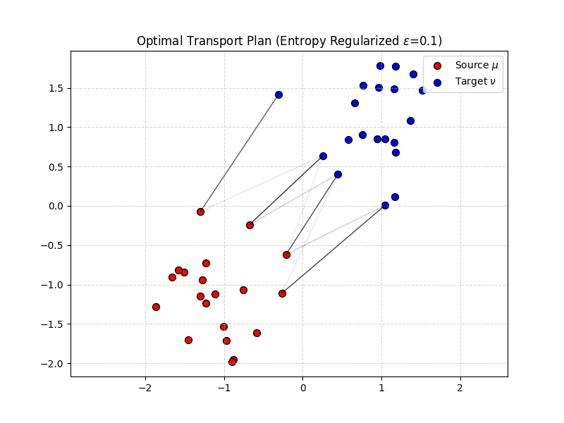
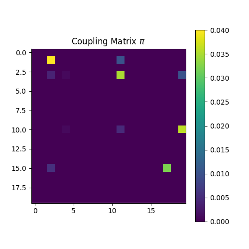

# 最优传输理论 (Optimal Transport)

**摘要**：在前面的章节中，我们讨论了如何度量向量间的距离（欧氏距离），以及概率分布间的`差异`（KL 散度）。然而，当两个分布互不重叠时，KL 散度会失效（梯度消失）。本章引入**最优传输 (Optimal Transport, OT)** 理论，它将概率分布视为几何对象，通过**Wasserstein 距离**定义了分布空间上的度量。我们将从经典的搬土问题出发，推导出 Kantorovich 对偶性，解析 Sinkhorn 算法如何将 $O(N^3)$ 的难题转化为 GPU 友好的矩阵运算，并最终揭示其在 WGAN 和 Flow Matching 中的核心作用。

---

## 1. 蒙日-坎托罗维奇问题 (The Monge-Kantorovich Problem)

### 1.1 物理直觉：搬土问题
假设你有一堆土分布在位置 $x$ 上，形状为分布 $\mu(x)$；你想把它搬到另一个位置 $y$，堆成新的形状 $\nu(y)$。
移动单位质量的土从 $x$ 到 $y$ 需要花费代价 $c(x, y)$（通常是欧氏距离 $||x-y||^2$）。
**核心问题**：如何制定运输方案，使得总运费最低？

### 1.2 Monge 形式 (1781) - 确定性映射
Monge 寻找一个映射函数 $T: \mathcal{X} \to \mathcal{Y}$，将 $x$ 处的土全部运到 $T(x)$。
$$ \min_T \int_{\mathcal{X}} c(x, T(x)) d\mu(x) $$
约束条件是**质量守恒**：$\nu = T_{\#} \mu$（即 $\nu$ 是 $\mu$ 经过 $T$ 推送后的分布）。
*   **缺陷**：如果 $\mu$ 是狄拉克分布（一个点），$\nu$ 是两个点，Monge 问题无解（不能把一个点撕开）。这是一个**非凸**问题。

### 1.3 Kantorovich 松弛 (1942) - 概率耦合
Kantorovich 引入了**耦合矩阵 (Coupling Matrix)** $\pi(x, y)$，表示从 $x$ 运送多少质量到 $y$。允许将 $x$ 处的土分发到不同的 $y$。

$$ \min_{\pi} \int_{\mathcal{X} \times \mathcal{Y}} c(x, y) d\pi(x, y) $$

**约束条件**：
$$
\begin{cases}
\int_{\mathcal{Y}} \pi(x, y) dy = \mu(x) & \text{(行和为 } \mu \text{)} \\
\int_{\mathcal{X}} \pi(x, y) dx = \nu(y) & \text{(列和为 } \nu \text{)} \\
\pi(x, y) \ge 0
\end{cases}
$$
这变成了一个**线性规划 (Linear Programming)** 问题，保证有解且是凸优化。

---

## 2. Wasserstein 距离：几何视角的度量

基于最优传输成本，我们定义 $p$-Wasserstein 距离：
$$ W_p(\mu, \nu) = \left( \inf_{\pi \in \Pi(\mu, \nu)} \mathbb{E}_{(x,y) \sim \pi} [||x - y||^p] \right)^{1/p} $$

### 2.1 为什么 KL 散度会失败？
考虑二维平面上的两个互不重叠的均匀分布（比如两个分开的矩形）。
*   **KL 散度**：$D_{KL}(P||Q) = \sum P(x) \log \frac{P(x)}{Q(x)}$。如果在 $P(x)>0$ 的地方 $Q(x)=0$，则 KL 为 $+\infty$。即使有极小重叠，KL 的梯度也是局部的，无法告诉 $P$ 该往哪个方向移动才能接近 $Q$。
*   **Wasserstein 距离**：即使两个分布相距很远，$W_p$ 依然等于它们中心之间的物理距离。
    *   **梯度性质**：$\nabla_\theta W(P_\theta, Q)$ 是常数且指向正确的方向。这就是 **WGAN** 解决梯度消失的几何本质。

### 2.2 Kantorovich 对偶性 (The Duality)
直接求解 $\pi$ 计算量很大。利用拉格朗日乘数法，我们可以将原始问题（Primal）转化为对偶问题（Dual）：

$$ W_1(\mu, \nu) = \sup_{f, g} \left( \mathbb{E}_{x \sim \mu}[f(x)] + \mathbb{E}_{y \sim \nu}[g(y)] \right) $$
约束：$f(x) + g(y) \le c(x, y)$。

当 $c(x, y) = ||x-y||$ 时，根据 **Kantorovich-Rubinstein 定理**，对偶形式简化为：
$$ W_1(\mu, \nu) = \sup_{||f||_L \le 1} \left( \mathbb{E}_{x \sim \mu}[f(x)] - \mathbb{E}_{x \sim \nu}[f(x)] \right) $$
其中 $||f||_L \le 1$ 表示 $f$ 必须是 **1-Lipschitz 连续** 的函数。

*   **物理意义**：从`搬运工视角`（最小化运费）转变为`供应商视角`（最大化价格差）。函数 $f(x)$ 就像是一个势能场。

---

## 3. Sinkhorn 算法：从线性规划到 GPU 运算

标准的线性规划求解需要 $O(N^3 \log N)$，无法应用于深度学习。
Cuturi (2013) 提出了**熵正则化 (Entropy Regularization)**，彻底改变了游戏规则。

### 3.1 熵正则化目标
$$ \min_{\pi \in \Pi} \langle C, \pi \rangle - \epsilon H(\pi) $$
其中 $H(\pi) = -\sum \pi_{ij} (\log \pi_{ij} - 1)$ 是香农熵。

### 3.2 形式解与 Softmax
引入拉格朗日乘子后，最优解具有如下形式：
$$ \pi_{ij} = u_i e^{-C_{ij}/\epsilon} v_j $$
这看起来非常像 **Softmax**！其中 $K_{ij} = e^{-C_{ij}/\epsilon}$ 是吉布斯核 (Gibbs Kernel)。

### 3.3 Sinkhorn-Knopp 迭代
我们需要找到向量 $u$ 和 $v$ 使得 $\pi$ 满足行列约束。这是一个交替投影过程：
1.  **行归一化**：$u^{(t+1)} = \mu / (K v^{(t)})$
2.  **列归一化**：$v^{(t+1)} = \nu / (K^T u^{(t+1)})$

*   **复杂度**：这就是简单的矩阵-向量乘法，复杂度 $O(N^2)$，且完全可并行化（GPU 友好）。
*   **Attention 联系**：Transformer 中的 **Attention 机制**本质上就是单步的 Sinkhorn 迭代（Query 和 Key 计算 Cost，Softmax 归一化得到传输矩阵 $\pi$）。Sinkhorn 算法通过多次迭代，寻找双随机矩阵（Doubly Stochastic Matrix），是一种更严格的`双向注意力`。

---

## 4. 应用：从 WGAN 到 Flow Matching

最优传输理论不仅解决了度量问题，还为生成模型提供了最优的`演化路径`。

### 4.1 WGAN：利用对偶性
在 GAN 中，我们希望最小化 $W_1(P_{data}, P_G)$。由于直接计算 $W_1$ 很困难，WGAN 利用了 **Kantorovich-Rubinstein 对偶性** (见 2.2 节)。

$$ \min_G W_1(P_{data}, P_G) = \min_G \sup_{||f||_L \le 1} \left( \mathbb{E}_{x \sim P_{data}}[f(x)] - \mathbb{E}_{z \sim P_z}[f(G(z))] \right) $$

*   **判别器 (Critic) 的角色变化**：判别器不再是输出概率 $[0,1]$ 的二分类器，而是拟合 Lipschitz 势能函数 $f(x)$ 的回归器。它试图拉大真假样本的得分差。
*   **Lipschitz 约束**：为了保证 $||f||_L \le 1$，WGAN 使用了 **权重剪裁 (Weight Clipping)** 或 **梯度惩罚 (Gradient Penalty, WGAN-GP)**：$(||\nabla_x f(x)||_2 - 1)^2$。

### 4.2 Flow Matching：寻找最优传输映射
扩散模型 (Diffusion) 定义了一条从数据到噪声的随机路径。最优传输告诉我们，存在一条**直线路径 (Geodesic)** 连接这两个分布，且传输代价最小。

**Flow Matching** (及其变体 Rectified Flow) 的核心思想是直接回归这条直线速度场：
假设我们希望将噪声 $x_0 \sim N(0, I)$ 映射到数据 $x_1 \sim P_{data}$。
最优传输位移为 $x_t = (1-t)x_0 + t x_1$。
对应的速度场（Vector Field）为：
$$ v_t(x_t) = \frac{d}{dt} x_t = x_1 - x_0 $$

模型训练目标变为回归这个速度场：
$$ \mathcal{L}(\theta) = \mathbb{E}_{t, x_0, x_1} || v_\theta(x_t, t) - (x_1 - x_0) ||^2 $$

这比传统的 Diffusion 收敛更快，因为它是沿着最优传输路径进行采样的。

---

## 5. 代码实战：Sinkhorn 算法实现

我们将手动实现 Sinkhorn 迭代，求解两个二维点云分布之间的最优传输方案，并可视化传输连接。

```python
import numpy as np
import matplotlib.pyplot as plt
import matplotlib.collections as mc

class OptimalTransportSolver:
    def __init__(self, epsilon=0.1, max_iter=100):
        self.epsilon = epsilon  # 熵正则化系数
        self.max_iter = max_iter

    def compute_cost_matrix(self, X, Y):
        """
        计算欧氏距离平方作为 Cost Matrix
        X: (N, d), Y: (M, d)
        C: (N, M)
        """
        # ||x - y||^2 = ||x||^2 + ||y||^2 - 2<x, y>
        x_col = np.sum(X**2, axis=1).reshape(-1, 1)
        y_row = np.sum(Y**2, axis=1).reshape(1, -1)
        C = x_col + y_row - 2 * np.dot(X, Y.T)
        return C

    def sinkhorn(self, C, mu, nu):
        """
        Sinkhorn-Knopp 迭代求解耦合矩阵 P
        mu: 源分布权重 (N,)
        nu: 目标分布权重 (M,)
        """
        N, M = C.shape
        K = np.exp(-C / self.epsilon) # Gibbs Kernel
        
        # 初始化 u, v
        u = np.ones(N)
        v = np.ones(M)
        
        for _ in range(self.max_iter):
            # 行归一化: u = mu / (K @ v)
            u = mu / (np.dot(K, v) + 1e-8)
            # 列归一化: v = nu / (K.T @ u)
            v = nu / (np.dot(K.T, u) + 1e-8)
            
        # P = diag(u) @ K @ diag(v)
        P = np.diag(u) @ K @ np.diag(v)
        return P

# ==========================================
# 1. 生成数据
# ==========================================
np.random.seed(42)
n_points = 20

# 源分布: 红色点 (围绕 (-1, -1))
X = np.random.randn(n_points, 2) * 0.5 - 1
mu = np.ones(n_points) / n_points # 均匀权重

# 目标分布: 蓝色点 (围绕 (1, 1))
Y = np.random.randn(n_points, 2) * 0.5 + 1
nu = np.ones(n_points) / n_points

# ==========================================
# 2. 求解最优传输
# ==========================================
ot_solver = OptimalTransportSolver(epsilon=0.1, max_iter=50)
C = ot_solver.compute_cost_matrix(X, Y)
P = ot_solver.sinkhorn(C, mu, nu)

# 计算 Wasserstein 距离近似值
w_dist = np.sum(P * C)
print(f"Sinkhorn Distance (Approx W2): {w_dist:.4f}")

# ==========================================
# 3. 可视化
# ==========================================
plt.figure(figsize=(8, 6))

# 绘制点
plt.scatter(X[:, 0], X[:, 1], c='r', label='Source $\mu$', s=50, edgecolors='k')
plt.scatter(Y[:, 0], Y[:, 1], c='b', label='Target $\\nu$', s=50, edgecolors='k')

# 绘制传输线
# P_ij 表示从 X_i 到 Y_j 的传输量
# 我们只绘制传输量大于阈值的线
lines = []
colors = []
threshold = 1e-4

for i in range(n_points):
    for j in range(n_points):
        if P[i, j] > threshold:
            lines.append([X[i], Y[j]])
            # 颜色深浅代表传输量大小
            colors.append((0, 0, 0, P[i, j] * n_points)) 

lc = mc.LineCollection(lines, colors=colors, linewidths=1)
plt.gca().add_collection(lc)

plt.title(f"Optimal Transport Plan (Entropy Regularized $\epsilon$={ot_solver.epsilon})")
plt.legend()
plt.grid(True, linestyle='--', alpha=0.5)
plt.axis('equal')
plt.show()

# 显示耦合矩阵热力图
plt.figure(figsize=(5, 5))
plt.imshow(P, cmap='viridis')
plt.title("Coupling Matrix $\pi$")
plt.colorbar()
plt.show()
```

#### 实验结果分析与总结




**图表解读：**
上图展示了在熵正则化系数 $\epsilon=0.1$ 下，源分布 $\mu$（红点）向目标分布 $\nu$（蓝点）传输的最优方案。灰色连线的深浅代表了耦合矩阵 $\pi_{ij}$ 的数值大小（即传输的质量份额）。

**核心洞察：**

1.  **局部性原则 (Locality)**：
    观察连线可以发现，红点倾向于连接距离它最近的蓝点。这验证了最优传输的**几何特性**——它自动寻找总运输距离（$\sum \pi_{ij} ||x_i - y_j||^2$）最小的全局最优解，而不是随机配对。

2.  **熵正则化的`模糊`效应 (Blurring Effect of Entropy)**：
    注意某些红点（例如中间区域的点）并不是只连接到一个蓝点，而是发出了几条深浅不一的线连接到附近多个蓝点。
    *   **数学原因**：这是 $\epsilon H(\pi)$ 项的作用。正则化使得传输方案不再是绝对的`硬分配`（Hard Assignment, 0或1），而是变成了`软分配`（Soft Assignment）。
    *   **权衡**：$\epsilon=0.1$ 保持了较高的传输精度，同时赋予了优化问题凸性，使其能通过 Sinkhorn 快速收敛。如果 $\epsilon \to 0$，连线会变成稀疏的一对一映射；如果 $\epsilon \to \infty$，连线将变成均匀的全连接。

3.  **对生成模型的启示**：
    想象这些灰色的连线是无数个粒子随时间移动的轨迹。
    *   **WGAN**：这些连线的总长度（加权和）就是 Wasserstein 距离，也就是 WGAN 判别器试图估算的那个`标量`。
    *   **Flow Matching / Diffusion**：如果我们希望训练一个神经网络把红点变成蓝点，**最优的策略就是让神经网络拟合这些灰色连线的向量场**。这就是现代生成模型（如 Rectified Flow）比传统 Diffusion 效率更高的几何原因——它们沿着最优传输的`测地线`进行采样。




**图表 2：耦合矩阵热力图 (Coupling Matrix Visualization)**

**图表解读：**
上图展示了 $20 \times 20$ 的耦合矩阵 $\pi$。
*   **横轴**：目标点 $\nu$ 的索引 (0-19)。
*   **纵轴**：源点 $\mu$ 的索引 (0-19)。
*   **颜色**：亮度（黄/绿）代表数值大小。越亮表示 $\pi_{ij}$ 越大，即点 $i$ 向点 $j$ 传输的质量越多。

**核心洞察：**

1.  **稀疏性 (Sparsity)**：
    图中绝大部分区域是深紫色（接近 0）。这意味着尽管 Sinkhorn 是全连接的计算（类似于 Softmax），但在收敛后，**大部分传输权重会自动归零**。
    *   **数学意义**：这说明最优传输方案倾向于“专一”。一个源点通常只需要向 1-2 个目标点供货，而不需要雨露均沾。这种稀疏性对于大规模数据的计算效率非常重要。

2.  **双随机约束的满足 (Doubly Stochastic)**：
    虽然肉眼难以精确求和，但算法保证了**每一行的和**等于 $1/N$，**每一列的和**也等于 $1/N$。图中亮块的分布虽然看起来杂乱，但它们在行与列的方向上达到了完美的数学平衡。

3.  **Attention Map 的物理原型**：
    如果你熟悉 Transformer，这张图看起来会非常眼熟。**它本质上就是一张 Attention Map**。
    *   在 Transformer 中，Token A 对 Token B 的关注度（Attention Score），就等同于这里点 A 向点 B 输送的“质量”。
    *   **熵正则化系数 $\epsilon$** 扮演了 **Temperature ($\tau$)** 的角色。$\epsilon$ 越小，热力图上的亮块就越集中（One-hot），对应 Attention 越“尖锐”；$\epsilon$ 越大，热力图越均匀，对应 Attention 越“平滑”。
---

## 6. 总结：几何与概率的桥梁

最优传输理论不仅为我们提供了一种衡量分布距离的有力工具（Wasserstein Distance），更重要的是，它将概率问题几何化了。

从 KL 到 Wasserstein：我们不再仅仅比较两个概率密度函数在同一点的数值差异，而是计算将一个分布`变形`到另一个分布所需的物理功。
从 Diffusion 到 Flow：生成模型不再是盲目的随机游走，而是沿着最优传输的测地线进行确定性的演化。

至此，我们的数学拼图补上了**度量这一块。下一章，我们将进入博弈**的世界，探讨当优化的目标不再是固定的，而是随着对手策略变化时，该如何寻找均衡。