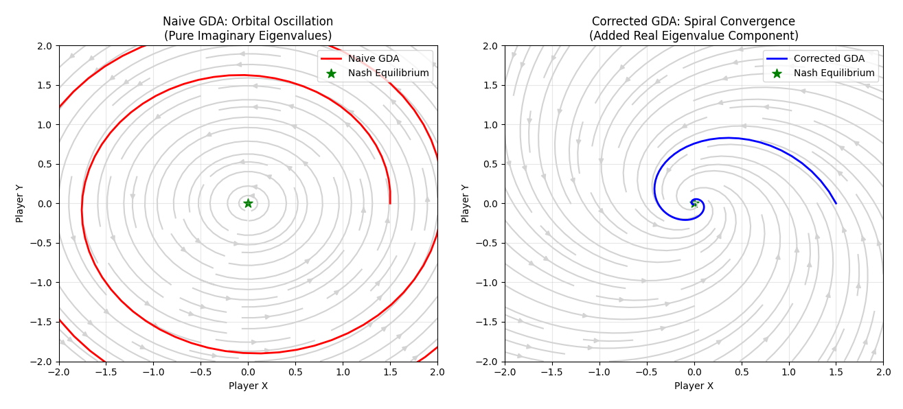

# 博弈论 (Game Theory)

**摘要**：在前 22 章中，我们的假设几乎都是`环境是静态的`，优化的目标是寻找一个固定的损失函数曲面的极小值。然而，在 GAN、多智能体强化学习 (MARL) 或对抗攻击中，优化目标取决于**对手**的策略。如果不动点不再是简单的极小值，而是**鞍点 (Saddle Point)**，传统的梯度下降是否还有效？本章将揭示极小极大优化中的**旋转动力学**，利用**雅可比矩阵**分析震荡的根源，并引入**辛力学 (Symplectic Mechanics)** 视角来解决训练的不稳定性。

---

## 1. 静态博弈与纳什均衡 (Nash Equilibrium)

### 1.1 从优化到均衡
在传统机器学习中，我们寻找参数 $\theta$ 使得 $\min L(\theta)$。
在博弈论中，即使只有两个玩家，问题也变成了寻找 $(\theta_1, \theta_2)$ 使得：
$$
\begin{cases}
\theta_1^* = \arg\min_{\theta_1} L_1(\theta_1, \theta_2^*) \\
\theta_2^* = \arg\min_{\theta_2} L_2(\theta_1^*, \theta_2)
\end{cases}
$$
如果 $L_1 = -L_2$（零和博弈），这便构成了**极小极大 (Min-Max)** 问题。

### 1.2 纳什均衡 (Nash Equilibrium, NE)
**定义**：一个策略组合 $(\theta_1^*, \theta_2^*)$ 是纳什均衡，如果没有任何一方可以通过**单方面**改变策略而获益。

**存在性 (Brouwer 不动点定理)**：
如果策略空间是紧致凸集，且收益函数连续，则纳什均衡一定存在。
*   **直观理解**：就像把一张揉皱的纸扔回桌上，总有一个点在垂直方向上没有位移。
*   **挑战**：定理只保证存在，不保证**梯度下降**能找到它。在非凸优化中，纳什均衡通常对应于**鞍点**。

---

## 2. 极小极大优化与旋转动力学

最经典的极小极大问题（也是 GAN 的简化原型）是双线性博弈：
$$ \min_x \max_y f(x, y) = xy $$

### 2.1 梯度下降-上升 (GDA) 的失败
如果我们使用朴素的梯度方法：
*   $x$ 试图最小化 $xy$ $\Rightarrow$ 沿 $-\nabla_x f = -y$ 更新。
*   $y$ 试图最大化 $xy$ $\Rightarrow$ 沿 $+\nabla_y f = x$ 更新。

动力学方程（连续时间）：
$$
\begin{bmatrix} \dot{x} \\ \dot{y} \end{bmatrix} = \begin{bmatrix} -y \\ x \end{bmatrix} = \underbrace{\begin{bmatrix} 0 & -1 \\ 1 & 0 \end{bmatrix}}_{J} \begin{bmatrix} x \\ y \end{bmatrix}
$$

### 2.2 雅可比矩阵特征值分析
系统的稳定性由雅可比矩阵 $J$ 的特征值 $\lambda$ 决定。
对于 $J = \begin{bmatrix} 0 & -1 \\ 1 & 0 \end{bmatrix}$，特征方程为：
$$ \det(J - \lambda I) = \lambda^2 + 1 = 0 \implies \lambda = \pm i $$

*   **实部 Re($\lambda$) < 0**：系统稳定收敛（有摩擦力）。
*   **实部 Re($\lambda$) > 0**：系统发散。
*   **实部 Re($\lambda$) = 0 且 虚部 Im($\lambda$) $\neq$ 0**：意味着**纯旋转**。

**结论**：在简单的 $xy$ 博弈中，GDA 算法会导致轨迹在相平面上画圆（或者是离散时间下的螺旋发散），永远无法收敛到原点 $(0,0)$ 这个纳什均衡点。这就是 GAN 训练中常见的**震荡 (Oscillation)** 和 **模式崩塌 (Mode Collapse)** 的数学根源。

---

## 3. 动力学分析：向量场与结构稳定性

为了深入理解，我们将优化产生的**向量场 (Vector Field)** $v(\theta)$ 分解为两部分：
$$ v(\theta) = -\nabla \phi(\theta) + H(\theta) $$

### 3.1 势能流与汉密尔顿流
*   **势能流 (Potential Flow)** $-\nabla \phi$：对应雅可比矩阵的**对称部分**（实特征值）。驱动系统走向极小值，消耗能量。
*   **汉密尔顿流 (Hamiltonian Flow)** $H$：对应雅可比矩阵的**反对称部分**（纯虚数特征值）。驱动系统沿等高线运动，**能量守恒**。

### 3.2 结构稳定性分析 (Structural Stability)
为什么朴素 GDA 是危险的？我们需要分析纳什均衡点 $\theta^*$ 在微小扰动下的**鲁棒性**。

假设系统在均衡点附近受到微小扰动 $\delta(t) = \theta(t) - \theta^*$，其动力学遵循线性化方程：
$$ \dot{\delta} = J(\theta^*) \delta $$
其中 $J$ 是雅可比矩阵。系统的解为 $\delta(t) = e^{Jt} \delta(0)$。

*   **结构不稳定性 (Structural Instability)**：
    对于朴素 GDA（如 $xy$ 博弈），特征值 $\lambda = \pm i$ 位于虚轴上。
    数学上，这是一个**中心 (Center)**。根据动力系统理论，中心是**结构不稳定**的。这意味着向量场 $v$ 的任何微小扰动 $\epsilon$（例如数值误差、随机噪声或非零和的偏差）都可能将特征值推向右半平面（$\text{Re}(\lambda) > 0$），导致系统从“画圆”变成“螺旋发散”。
    $$ \text{Re}(\lambda) = 0 \xrightarrow{\text{perturbation}} \text{Re}(\lambda) \approx \epsilon > 0 \implies \text{Explosion} $$

*   **鲁棒性修正**：
    我们必须引入修正项（如辛梯度 $\alpha J^T v$），强制 $\text{Re}(\lambda) < -\beta < 0$。这样即使存在外部扰动 $\epsilon$，只要 $\beta > \epsilon$，系统依然能保持渐进稳定 (Asymptotically Stable)。

---

## 4. 多智能体与双层优化 (Stackelberg Games)

当博弈存在先后之分（Leader-Follower）时，我们进入了 Stackelberg 博弈的领域。这在数学上被称为**双层优化 (Bilevel Optimization)**。

### 4.1 Stackelberg 均衡的数学定义
Leader ($\theta_1$) 必须预判 Follower ($\theta_2$) 的最优反应。目标函数定义为：
$$
\min_{\theta_1} U_{leader}(\theta_1, \theta_2^*(\theta_1))
$$
$$
\text{s.t.} \quad \theta_2^*(\theta_1) = \arg\min_{\theta_2} L_{follower}(\theta_1, \theta_2)
$$
*   **Leader**: 元学习器、超参数优化器、生成器。
*   **Follower**: 基学习器、网络权重、判别器。

### 4.2 硬核推导：隐函数定理求全导数
如何对 Leader 的目标函数求关于 $\theta_1$ 的梯度？最大的难点在于 $\theta_2^*$ 是 $\theta_1$ 的隐函数。

根据链式法则，Leader 的全梯度（Total Gradient）为：
$$ \nabla_{\theta_1} U = \frac{\partial U}{\partial \theta_1} + \frac{\partial U}{\partial \theta_2} \cdot \underbrace{\frac{d \theta_2^*}{d \theta_1}}_{\text{Implicit Jacobian}} $$

为了求出隐式雅可比 $\frac{d \theta_2^*}{d \theta_1}$，我们利用 Follower 的最优性条件（KKT 条件）：
$$ \nabla_{\theta_2} L_{follower}(\theta_1, \theta_2^*) = 0 $$

对上式两边同时关于 $\theta_1$ 求全微分：
$$ \nabla_{\theta_1 \theta_2}^2 L_{follower} + \nabla_{\theta_2 \theta_2}^2 L_{follower} \cdot \frac{d \theta_2^*}{d \theta_1} = 0 $$

移项并求逆，得到著名的**隐函数梯度公式**：
$$ \frac{d \theta_2^*}{d \theta_1} = - \left[ \nabla_{\theta_2 \theta_2}^2 L_{follower} \right]^{-1} \nabla_{\theta_1 \theta_2}^2 L_{follower} $$

代回原式，得到 **Stackelberg 梯度**：
$$ \nabla_{\theta_1}^{Total} = \nabla_{\theta_1} U - \nabla_{\theta_2} U \cdot \underbrace{\left[ \nabla_{\theta_2 \theta_2}^2 L_{follower} \right]^{-1}}_{\text{Inverse Hessian}} \cdot \nabla_{\theta_1 \theta_2}^2 L_{follower} $$

*   **计算代价**：直接计算海森矩阵的逆需要 $O(N^3)$，这是不可接受的。
*   **工程近似**：在实际代码（如 MAML, DARTS）中，我们通常使用**Neumann 级数**近似或**共轭梯度法 (Conjugate Gradient)** 来估计 Hessian-Vector Product (HVP)，将复杂度降为 $O(N)$。

### 4.3 合作与背叛：LOLA 算法
在连续困境中，智能体不仅要优化自己的损失，还要通过梯度项 $\frac{d \theta_{opponent}}{d \theta_{self}}$ 来**塑造 (Shape)** 对手的学习过程。
**LOLA (Learning with Opponent-Learning Awareness)** 算法利用泰勒展开，将上述 Stackelberg 梯度引入更新规则，从而在囚徒困境中自发涌现出“针锋相对” (Tit-for-Tat) 的合作策略。

---

## 5. 代码实战：GDA 的震荡与修正

我们将模拟 $f(x, y) = xy$ 的极小极大博弈，对比朴素 GDA 和 添加了修正项的 GDA。

```python
import numpy as np
import matplotlib.pyplot as plt

# ==========================================
# 1. 定义博弈动力学
# ==========================================
class GameDynamics:
    def __init__(self, eta=0.1):
        self.eta = eta
        
    def vector_field(self, state):
        x, y = state
        # min_x max_y xy
        # grad_x = y, grad_y = x
        # update_x = -grad_x = -y
        # update_y = +grad_y = x
        return np.array([-y, x])
    
    def symplectic_correction(self, state, lambda_reg=0.5):
        # 模拟添加正则化项或辛梯度修正
        # Jacobian J = [[0, -1], [1, 0]]
        # v = [-y, x]
        # J.T @ v = [[0, 1], [-1, 0]] @ [-y, x] = [x, y]
        # Correction term adds a "potential" flow pointing to origin
        x, y = state
        v = self.vector_field(state)
        
        # 修正项本质上是引入了实部特征值
        correction = -lambda_reg * np.array([x, y]) 
        return v + correction

# ==========================================
# 2. 模拟轨迹
# ==========================================
def simulate(dynamics, start_pos, steps=200, use_correction=False):
    trajectory = [start_pos]
    state = np.array(start_pos)
    
    for _ in range(steps):
        if use_correction:
            update = dynamics.symplectic_correction(state)
        else:
            update = dynamics.vector_field(state)
        
        state = state + dynamics.eta * update
        trajectory.append(state)
        
    return np.array(trajectory)

# ==========================================
# 3. 可视化：相平面与流场
# ==========================================
eta = 0.1
game = GameDynamics(eta=eta)

# 创建网格用于流场可视化
Y, X = np.mgrid[-2:2:20j, -2:2:20j]
U = -Y # dx/dt
V = X  # dy/dt

plt.figure(figsize=(12, 5))

# --- Plot 1: Naive GDA (Standard GAN training) ---
plt.subplot(1, 2, 1)
# 绘制向量场流线
plt.streamplot(X, Y, U, V, color='lightgray', density=1.0)
traj_naive = simulate(game, [1.5, 0.0], steps=300, use_correction=False)

plt.plot(traj_naive[:,0], traj_naive[:,1], 'r-', label='Naive GDA', linewidth=2)
plt.scatter([0], [0], c='green', s=100, marker='*', label='Nash Equilibrium')
plt.title("Naive GDA: Orbital Oscillation\n(Pure Imaginary Eigenvalues)")
plt.xlim(-2, 2)
plt.ylim(-2, 2)
plt.xlabel("Player X")
plt.ylabel("Player Y")
plt.legend(loc='upper right')
plt.grid(True, alpha=0.3)

# --- Plot 2: Corrected Dynamics (Symplectic / Regularized) ---
# Vizualize the corrected vector field
U_corr = U - 0.5 * X
V_corr = V - 0.5 * Y

plt.subplot(1, 2, 2)
plt.streamplot(X, Y, U_corr, V_corr, color='lightgray', density=1.0)
traj_corr = simulate(game, [1.5, 0.0], steps=100, use_correction=True)

plt.plot(traj_corr[:,0], traj_corr[:,1], 'b-', label='Corrected GDA', linewidth=2)
plt.scatter([0], [0], c='green', s=100, marker='*', label='Nash Equilibrium')
plt.title("Corrected GDA: Spiral Convergence\n(Added Real Eigenvalue Component)")
plt.xlim(-2, 2)
plt.ylim(-2, 2)
plt.xlabel("Player X")
plt.ylabel("Player Y")
plt.legend(loc='upper right')
plt.grid(True, alpha=0.3)

plt.tight_layout()
plt.show()
```

### 5.1 实验结果解析



图表解读：
上图展示了在相同起始位置 $(1.5,0.0)$ 出发，策略空间  $(x,y)$

在两种不同动力学规则下的演化轨迹。背景灰色箭头表示向量场（梯度的反方向）。

左图：朴素 GDA (Naive GDA)

- 现象：红色轨迹呈现闭合圆形（由于离散步长误差，实际甚至略微向外发散），始终围绕着中心的绿色五角星（纳什均衡点）旋转，却永远无法接近它。
- 数学本质：雅可比矩阵的特征值为纯虚数 $\lambda = \pm i$。
这是一个保守场 (Conservative Field)，类似于物理中的无阻尼单摆。系统`能量`（距离原点的半径）守恒。$$\frac{d}{dt}(x^2 + y^2) = 0 $$

深度学习启示：这解释了为什么原始 GAN 训练极不稳定。生成器和判别器在策略空间中进行`猫鼠游戏`，导致损失函数震荡不收敛。

右图：修正 GDA (Corrected GDA)

- 现象：蓝色轨迹呈现螺旋向内 (Spiral Convergence) 的形态，迅速且平滑地收敛到了中心的纳什均衡点。

- 数学本质：通过引入正则化项（如 Symplectic Gradient Adjustment 或 Gradient Penalty），我们将特征值变为复数且具有负实部：$\lambda = -\alpha \pm i$。
负实部 $-\alpha$ 充当了物理系统中的摩擦力 (Friction) 或阻尼 (Damping)。它不断消耗系统的能量，迫使粒子落入势能最低点。
深度学习启示：在 GAN 中使用 Gradient Penalty (WGAN-GP) 或 Spectral Normalization，本质上就是把左图的旋转场变成了右图的收敛场。


---

## 6. 总结

博弈论视角的引入，将机器学习从`爬山`变成了`旋风中的舞蹈`。

- 雅可比矩阵的虚部是震荡的元凶。

- 纳什均衡往往是鞍点，而不是极小值点。

- 要让 GAN 或 MARL 收敛，不能仅靠梯度下降，必须通过正则化或辛算法来操纵系统的动力学特性。

至此，我们的数学框架已经能够处理静态分布、动态传输以及对抗博弈。下一章，我们将整合多模态融合几何，探讨不同流形之间的对齐问题。

