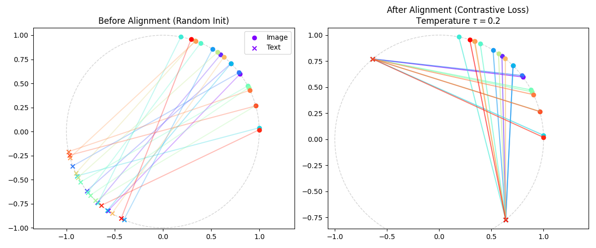

# 多模态融合几何 (Multimodal Geometry)

**摘要**：在深度学习的早期，我们分别处理图像（CNN）和文本（RNN/Transformer）。如今，多模态大模型要求我们将视觉、语言甚至音频缝合在一起。但图像流形（高维像素连续空间）与文本流形（离散符号空间）有着完全不同的拓扑结构。本章将探讨如何利用**球面几何**实现流形对齐（CLIP），严谨推导 InfoNCE 与互信息下界的数学联系，利用**张量代数**捕捉模态间的非线性交互，以及**Cross-Attention** 如何在 SDE 动力学中充当连接异构流形的“传送门”。

---

## 1. 异构空间的对齐 (Heterogeneous Alignment)

图像 $x \in \mathbb{R}^{H \times W \times 3}$ 和文本 $y \in \mathbb{N}^L$ 生活在完全不同的空间中。要让它们交流，首先需要将它们映射到一个共享的嵌入空间（Embedding Space）。

### 1.1 超球面上的几何
现代多模态模型（如 CLIP）通常将特征归一化到单位超球面上：$||z||_2 = 1$。
*   **消去模长**：高维空间中，模长通常代表信号强度或句子长度，而方向代表语义。归一化使得优化集中在角度 $\theta$ 上。
*   **度量等价性**：在单位球面上，欧氏距离与余弦相似度严格单调相关：
    $$ ||z_I - z_T||^2 = (z_I - z_T)^T (z_I - z_T) = 2 - 2 \cos(z_I, z_T) $$

### 1.2 InfoNCE：互信息的变分下界
我们常说 InfoNCE Loss 在“拉近正样本，推开负样本”，其深层数学目标是最大化模态间的**互信息 (Mutual Information, MI)**。

**定理**：最小化 InfoNCE Loss 等价于最大化互信息 $I(X; Y)$ 的下界：
$$ I(X; Y) \ge \log N - \mathcal{L}_{NCE} $$

**推导简述**：
1.  **互信息定义**：$I(X; Y) = \mathbb{E}_{p(x,y)} \left[ \log \frac{p(x,y)}{p(x)p(y)} \right]$。
2.  **最优判别器**：InfoNCE 中的评分函数 $f(x,y)$ 在最优状态下会逼近点互信息（PMI）：$f^*(x,y) = \log \frac{p(y|x)}{p(y)} + C$。
3.  **代入损失**：
    $$
    \begin{aligned}
    \mathbb{E}[\mathcal{L}_{NCE}] & = \mathbb{E} \left[ -\log \frac{e^{f(x,y)}}{e^{f(x,y)} + \sum_{j=1}^{N-1} e^{f(x,y_j)}} \right] \\
    & \approx \mathbb{E} \left[ \log \left( 1 + \frac{p(y)}{p(y|x)} (N-1) \right) \right] \\
    & \approx \mathbb{E} \left[ \log \left( \frac{p(y)}{p(y|x)} N \right) \right] \quad (\text{当 } N \text{ 很大时}) \\
    & = \log N - \underbrace{\mathbb{E} \left[ \log \frac{p(y|x)}{p(y)} \right]}_{I(X;Y)}
    \end{aligned}
    $$
    移项得：$I(X;Y) \ge \log N - \mathcal{L}_{NCE}$。
    这证明了：**负采样数量 $N$ 越大，这个下界越紧，模型学到的互信息越多。**

### 1.3 温度系数 $\tau$ 的物理意义
损失函数中的 $\exp(z_I \cdot z_T / \tau)$ 包含温度系数。
*   **小 $\tau$ (低温)**：分布呈现尖峰状 (Peaked)。模型只关注最难区分的负样本 (Hard Negatives)，几何上对应局部高曲率。
*   **大 $\tau$ (高温)**：分布趋于均匀 (Uniform)。梯度流向所有负样本。
*   **关联 (See Ch 23)**：这里的 $\tau$ 与最优传输 Sinkhorn 算法中的熵正则化系数 $\epsilon$ 扮演完全相同的角色——**平衡“精确匹配”与“最大熵”**。

---

## 2. 格拉斯曼流形 (Grassmannian Manifold)

当数据不是一个点（如一张图），而是一个集合（如视频的一组帧，或 Few-shot 任务的一个类）时，我们实际上是在比较两个线性子空间。

### 2.1 子空间表示
**格拉斯曼流形** $Gr(k, n)$ 是 $\mathbb{R}^n$ 中所有 $k$ 维线性子空间的集合。
视频 $X \in \mathbb{R}^{n \times T}$ 可以通过 SVD 分解 $X = U \Sigma V^T$ 表示为子空间 $U \in Gr(k, n)$。

### 2.2 测地线距离：主角度
两个子空间 $U_1, U_2$ 之间的距离不再是欧氏距离，而是**主角度 (Principal Angles)** $\theta_i$。
$$ \cos \theta_i = \sigma_i(U_1^T U_2) $$
这是多模态视频理解中，对齐“视频流形”与“文本流形”的数学基础。

---

## 3. 张量融合 (Tensor Fusion)

简单的拼接 $[v_I; v_T]$ 只是加法群的线性操作，无法捕捉模态间的乘法交互（逻辑与/或/非）。

### 3.1 外积与笛卡尔积
为了捕捉全方位的交互，我们需要计算**外积 (Outer Product)**：
$$ Z = v_I \otimes v_T \in \mathbb{R}^{D_I \times D_T} $$
$$ Z_{ij} = v_{I, i} \cdot v_{T, j} $$
这不仅保留了特征，还保留了特征之间的二阶相关性。

### 3.2 低秩张量分解
为了解决 $D^2$ 的维度爆炸，我们利用 Tucker 分解或 CP 分解。在深度学习中，这通常实现为：
$$ Z \approx (v_I W_I) \odot (v_T W_T) $$
其中 $\odot$ 是哈达玛积（Element-wise product）。这在数学上等价于在一个低秩空间中重建高阶张量，常见于 VQA（视觉问答）任务中。

---

## 4. 潜空间动力学与 SDE

在生成模型（Stable Diffusion）中，多模态对齐不仅是计算距离，更是**施加力场**。

### 4.1 条件 SDE (Conditional SDE)
回顾 **第 15 章 (扩散模型)**，生成过程是逆向 SDE：
$$ dx = [f(x, t) - g^2(t) \nabla_x \log p_t(x)] dt + g(t) dw $$

当引入文本 $y$ 进行控制时，利用贝叶斯公式 $p(x|y) \propto p(y|x)p(x)$，漂移项（Drift Term）被修正为：
$$ \nabla_x \log p_t(x|y) = \underbrace{\nabla_x \log p_t(x)}_{\text{Unconditional Score}} + \lambda \underbrace{\nabla_x \log p_t(y|x)}_{\text{Classifier Guidance}} $$

*   **$\nabla_x \log p_t(x)$**：保持图像的真实感（流形的切向量）。
*   **$\nabla_x \log p_t(y|x)$**：将图像拉向文本描述的方向（流形间的引导力）。
*   **Cross-Attention 的角色**：Cross-Attention 模块本质上是在估计这个条件引导项。它计算文本 $y$ 与当前噪点 $x_t$ 的相关性，并将文本特征投影为图像空间中的梯度更新量。

---

## 5. 代码实战：InfoNCE 与流形对齐

### 5.1 PyTorch 实现 InfoNCE (生产级代码)

```python
import torch
import torch.nn.functional as F

def info_nce_loss(features_a, features_b, temperature=0.1):
    """
    Args:
        features_a: (Batch, Dim) 归一化后的图像特征
        features_b: (Batch, Dim) 归一化后的文本特征
        temperature: 温度系数 tau，控制分布的尖锐程度
    """
    # 1. 计算余弦相似度矩阵 (Batch, Batch)
    # logits[i][j] 代表第 i 张图和第 j 个文本的相似度
    logits = torch.matmul(features_a, features_b.T) / temperature
    
    # 2. 构造标签：对角线是正样本 (0, 1, 2, ...)
    batch_size = features_a.shape[0]
    labels = torch.arange(batch_size).to(features_a.device)
    
    # 3. 双向 Cross Entropy (CLIP 采用对称损失)
    # Image -> Text: 给定图，找对应的文
    loss_a2b = F.cross_entropy(logits, labels)
    # Text -> Image: 给定文，找对应的图
    loss_b2a = F.cross_entropy(logits.T, labels)
    
    return (loss_a2b + loss_b2a) / 2

### 5.2 球面上的流形对齐

```python
import numpy as np
import matplotlib.pyplot as plt
import matplotlib.cm as cm

def normalize(x):
    """将向量投影到单位球(圆)面上"""
    norm = np.linalg.norm(x, axis=1, keepdims=True)
    return x / (norm + 1e-8)

def infonce_loss_gradient(I, T, tau=0.1):
    """
    计算简化的 InfoNCE 梯度
    I, T: (Batch_Size, Dim) 归一化后的特征
    模拟将 T 拉向 I (正样本)，推开其他 I (负样本)
    """
    N = I.shape[0]
    # 相似度矩阵 (Logits)
    logits = np.dot(I, T.T) / tau  # (N, N)
    
    # Softmax 概率
    exp_logits = np.exp(logits - np.max(logits, axis=1, keepdims=True))
    probs = exp_logits / np.sum(exp_logits, axis=1, keepdims=True)
    
    # 梯度推导: dL/dI_i = sum_j (p_ij - y_ij) * T_j
    # 其中 y_ij 是单位矩阵 (只有对角线是正样本)
    targets = np.eye(N)
    grad = np.dot((probs - targets), T) / tau
    
    return grad

# ==========================================
# 1. 数据生成：未对齐的两个模态
# ==========================================
np.random.seed(42)
N = 20 # 样本数
dim = 2

# 模态 A (图像): 分布在右上区
feat_A = np.random.randn(N, dim) + np.array([2, 2])
# 模态 B (文本): 分布在左下区，且顺序被打乱的乱序映射(假设初始完全不对齐)
feat_B = np.random.randn(N, dim) + np.array([-2, -2])

# 归一化到单位圆
feat_A = normalize(feat_A)
feat_B = normalize(feat_B)

# ==========================================
# 2. 模拟训练过程
# ==========================================
lr = 0.5
tau = 0.2
steps = 50

history_A = [feat_A.copy()]
history_B = [feat_B.copy()]

# 这里我们只移动 feat_B 来适应 feat_A (简化演示)
for _ in range(steps):
    grad = infonce_loss_gradient(feat_A, feat_B, tau)
    feat_B = feat_B - lr * grad
    feat_B = normalize(feat_B) # 重新投影回球面
    
    history_B.append(feat_B.copy())

# ==========================================
# 3. 可视化
# ==========================================
plt.figure(figsize=(12, 5))
colors = cm.rainbow(np.linspace(0, 1, N))

# --- Plot 1: 初始状态 ---
plt.subplot(1, 2, 1)
circle = plt.Circle((0, 0), 1, color='lightgray', fill=False, linestyle='--')
plt.gca().add_artist(circle)

for i in range(N):
    plt.scatter(history_A[0][i, 0], history_A[0][i, 1], color=colors[i], marker='o', label='Image' if i==0 else "")
    plt.scatter(history_B[0][i, 0], history_B[0][i, 1], color=colors[i], marker='x', label='Text' if i==0 else "")
    # 绘制配对连线
    plt.plot([history_A[0][i, 0], history_B[0][i, 0]], 
             [history_A[0][i, 1], history_B[0][i, 1]], 
             color=colors[i], alpha=0.3)

plt.title("Before Alignment (Random Init)")
plt.xlim(-1.5, 1.5); plt.ylim(-1.5, 1.5)
plt.legend()
plt.axis('equal')

# --- Plot 2: 最终状态 ---
plt.subplot(1, 2, 2)
circle = plt.Circle((0, 0), 1, color='lightgray', fill=False, linestyle='--')
plt.gca().add_artist(circle)

final_B = history_B[-1]
for i in range(N):
    plt.scatter(feat_A[i, 0], feat_A[i, 1], color=colors[i], marker='o')
    plt.scatter(final_B[i, 0], final_B[i, 1], color=colors[i], marker='x')
    plt.plot([feat_A[i, 0], final_B[i, 0]], 
             [feat_A[i, 1], final_B[i, 1]], 
             color=colors[i], alpha=0.6)

plt.title(f"After Alignment (Contrastive Loss)\nTemperature $\\tau={tau}$")
plt.xlim(-1.5, 1.5); plt.ylim(-1.5, 1.5)
plt.axis('equal')

plt.tight_layout()
plt.show()
```



**图表解读：**
上图展示了二维球面（圆环）上的流形对齐实验结果。其中**圆点 (Image)** 代表图像模态的特征分布，**叉号 (Text)** 代表文本模态的特征分布。连线表示**Ground Truth**（真实的图文配对关系）。

1.  **左图：初始状态 (Before Alignment)**
    *   **语义鸿沟 (Semantic Gap)**：可以看到，图像特征集中在右上象限（0° 到 90°），而文本特征集中在左下象限（-90° 到 -180°）。这种分布差异模拟了多模态模型初始化时，视觉编码器和文本编码器输出的特征空间完全不重叠的现象。
    *   **混乱的对应关系**：连接同色点对的直线横跨圆心。在球面几何中，这意味着配对样本的夹角接近 $180^\circ$（余弦相似度接近 -1），即模型认为这些配对的图文完全不相关，甚至相反。

2.  **右图：对齐状态 (After Alignment)**
    *   **拓扑迁移**：经过 InfoNCE Loss 的梯度下降优化，代表文本的叉号（Text）发生了剧烈的位移，集体“迁徙”到了右上象限，与图像特征（Image）重合。这验证了对比学习能够强行拉近异构流形。
    *   **精细对齐 (Fine-grained Alignment)**：注意观察颜色的对应关系。红色的叉号精确地移动到了红色的圆点旁边，青色的叉号也找到了青色的圆点。
    *   **几何排斥与温度系数**：虽然配对点靠得很近，但不同颜色的点对依然保持着一定的间距，没有坍缩成一个点。这正是 **InfoNCE Loss** 中分母项（负样本）以及温度系数 $\tau=0.2$ 的作用——它在拉近正样本的同时，利用球面空间的有限体积，迫使负样本互相排斥，从而保留了数据的**判别性结构**。

**结论**：
这张图直观地展示了 CLIP 等模型的核心数学原理：**学习是一个将不同模态的流形在超球面上进行旋转、缩放和对齐的过程**。一旦对齐完成，我们就可以简单地通过计算余弦距离（夹角）来实现跨模态检索或零样本分类。

--- 

## 6. 总结：通往 AGI 的桥梁

多模态融合几何是连接感知（Perception）与认知（Cognition）的关键。

- 球面几何（CLIP）解决了**是什么**的问题，建立了不同模态间的字典。

- 张量几何（Tensor Fusion）解决了**怎么样**的问题，捕捉了复
杂的逻辑交互。

- 微分几何（Cross-Attention/Diffusion）解决了**创造**的问题，让语义能够引导生成。