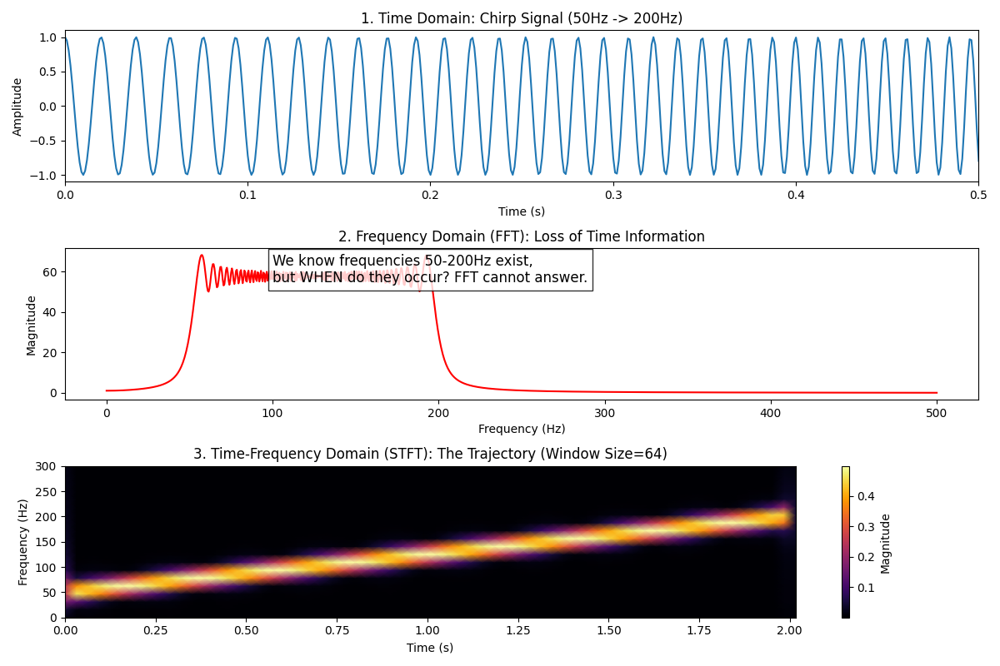

# [25] 信号处理与时频分析 (Signal Processing & Time-Frequency Analysis)

**摘要**：机器学习的数据源往往是物理世界的采样：声音、股市震荡、脑电波 (EEG)。这些信号本质上是**波**。经典的深度学习（如 MLP）处理静态向量，RNN 处理离散序列，但它们往往忽略了信号的**频域特性**。本章将从**海森堡不确定性原理**出发，探讨傅里叶变换的局限性，引出短时傅里叶变换 (STFT) 和小波变换 (Wavelet)，并深入解析当前大模型新宠 **Mamba (SSM)** 背后的连续时间系统离散化数学原理。

---

## 1. 傅里叶变换的局限与 STFT

### 1.1 从全局到局部
标准的**傅里叶变换 (FT)** 将时域信号 $x(t)$ 转换为频域信号 $X(\omega)$：
$$ X(\omega) = \int_{-\infty}^{\infty} x(t) e^{-j\omega t} dt $$
**致命缺陷**：积分区间是 $(-\infty, \infty)$。它告诉你信号里“有什么频率”，但没告诉你“什么时候发生”。
*   例子：一段“先钢琴后小提琴”的录音，和一段“钢琴小提琴同时演奏”的录音，其全局频谱可能非常相似。

### 1.2 短时傅里叶变换 (STFT)
为了引入时间维度，我们给信号加一个滑动的**窗函数 (Window Function)** $w(t)$（如 Hann 窗）：
$$ STFT(t, \omega) = \int_{-\infty}^{\infty} x(\tau) w(\tau - t) e^{-j\omega \tau} d\tau $$
这生成了一个二维复数矩阵，其模的平方 $|STFT(t, \omega)|^2$ 就是**声谱图 (Spectrogram)**。
*   **数学本质**：声谱图是图像（矩阵），这也是为什么 CNN 可以被直接用来处理音频分类任务。

### 1.3 海森堡测不准原理 (Heisenberg Uncertainty Principle)
为什么我们不能同时拥有完美的时间分辨率和频率分辨率？这并非技术限制，而是数学上的根本真理。

定义时间展宽 $\sigma_t$ 和频率展宽 $\sigma_\omega$。对于任意非零函数 $f(t)$，都有：
$$ \sigma_t \cdot \sigma_\omega \ge \frac{1}{2} $$

*   **窄窗口**（小 $\sigma_t$）：时间定位精准，但频域发生卷积模糊，频率分辨率差（大 $\sigma_\omega$）。
*   **宽窗口**（大 $\sigma_t$）：频率定位精准，但时间模糊，不知道瞬态何时发生。
*   **Gabor 变换**：当窗函数为高斯函数时，等号成立（达到理论极限）。

---

## 2. 小波变换 (Wavelet Transform)

STFT 的缺点是窗口大小固定。然而现实信号通常包含**高频瞬态**（需要高时间分辨率）和**低频背景**（需要高频率分辨率）。

### 2.1 多分辨率分析 (MRA)
小波变换不再使用正弦波 $e^{j\omega t}$ 作为基底，而是使用**小波基** $\psi(t)$。
连续小波变换 (CWT) 定义为：
$$ W(a, b) = \frac{1}{\sqrt{a}} \int_{-\infty}^{\infty} x(t) \psi^* \left( \frac{t - b}{a} \right) dt $$

*   **缩放因子 $a$ (Scale)**：类似频率的倒数。
    *   $a$ 很小 $\to$ 波形被压缩 $\to$ 捕捉**高频** $\to$ 时间窗变窄（高时间分辨率）。
    *   $a$ 很大 $\to$ 波形被拉伸 $\to$ 捕捉**低频** $\to$ 时间窗变宽（高频率分辨率）。
*   **平移因子 $b$ (Shift)**：控制时间位置。

### 2.2 数学显微镜
小波变换就像一个变焦显微镜：
*   看低频全貌时，视野宽广。
*   看高频细节时，聚焦微观。
这种**时频自适应**特性使其成为处理非平稳信号（如心电图 ECG）的最佳工具。

---

## 3. 状态空间模型 (SSM) 与 Mamba

最新的序列建模架构（如 S4, Mamba）的核心思想是：**将深度学习模型视为连续时间系统的离散化。**

### 3.1 连续系统 (ODE View)
一个线性时不变 (LTI) 系统由微分方程描述：
$$
\begin{cases}
h'(t) = \mathbf{A}h(t) + \mathbf{B}x(t) & \text{(状态方程)} \\
y(t) = \mathbf{C}h(t) & \text{(输出方程)}
\end{cases}
$$
其中 $x(t)$ 是输入（如音频波形），$h(t)$ 是隐状态，$\mathbf{A}$ 是演化矩阵。

### 3.2 离散化 (Discretization)
计算机只能处理离散数据。利用零阶保持 (Zero-Order Hold, ZOH) 或双线性变换，我们可以将上述 ODE 转化为递归形式：
$$ h_k = \mathbf{\bar{A}} h_{k-1} + \mathbf{\bar{B}} x_k $$
这看起来就是一个 RNN！

### 3.3 卷积-递归对偶性 (Convolution-Recurrence Duality)
这是 SSM 最迷人的数学性质：
1.  **训练时 (并行)**：展开递归公式，$y$ 可以写成输入 $x$ 与卷积核 $\mathbf{K}$ 的卷积：
    $$ y = x * \mathbf{K}, \quad \text{where } \mathbf{K} = (\mathbf{C}\mathbf{B}, \mathbf{C}\mathbf{A}\mathbf{B}, \mathbf{C}\mathbf{A}^2\mathbf{B}, \dots) $$
    这使得训练可以像 CNN 一样并行化（不需要等 $t-1$ 步）。
2.  **推理时 (串行)**：使用递归形式 $h_k = \mathbf{\bar{A}} h_{k-1} + \dots$，推理成本为 $O(1)$（不需要像 Transformer 那样看整个缓存）。

### 3.4 HiPPO 矩阵：记忆的数学
如果 $\mathbf{A}$ 是随机初始化的，模型会遗忘历史。
**HiPPO (High-order Polynomial Projection Operators)** 理论证明，当 $\mathbf{A}$ 取特定的矩阵形式时，隐状态 $h(t)$ 恰好存储了历史输入 $x(t)$ 在勒让德多项式基底上的投影系数。
这从数学上解决了**长期记忆 (Long-range Dependency)** 问题。

---

## 4. 神经音频数学

### 4.1 梅尔倒谱 (MFCC)
人类听觉对频率的感知不是线性的，而是对数的（对低频更敏感）。
**Mel 刻度**公式：
$$ M(f) = 2595 \log_{10}(1 + \frac{f}{700}) $$
MFCC 的计算过程：傅里叶变换 $\to$ 功率谱 $\to$ Mel 滤波器组 $\to$ 对数 $\to$ **离散余弦变换 (DCT)**。
*   **DCT 的作用**：去相关性。频谱相邻频带高度相关，DCT 将其变换为独立的特征系数，更适合高斯混合模型 (GMM) 或神经网络。

### 4.2 复数神经网络 (Complex-valued NN)
在 STFT 中，相位（Phase）包含了重要的结构信息。
传统的做法是只取模值 $|STFT|$，丢弃相位。但在语音增强或源分离任务中，相位至关重要。
**复数卷积**：
设 $W = A + iB, h = x + iy$，则
$$ W * h = (A*x - B*y) + i(B*x + A*y) $$
复数网络尊重复数代数结构，相比将实部虚部当作两个通道 (2-channel real)，具有更好的相位一致性和泛化能力。

---

## 5. 代码实战：海森堡测不准原理的可视化

我们将生成一个频率随时间变化的**线性调频信号 (Chirp Signal)**，并对比 FFT 和 STFT 的结果，直观展示时频权衡。

```python
import numpy as np
import matplotlib.pyplot as plt
from scipy.signal import stft, chirp

# ==========================================
# 1. 生成信号：线性调频 (Chirp)
# ==========================================
fs = 1000          # 采样率 1000Hz
T = 2.0            # 时长 2秒
t = np.linspace(0, T, int(T*fs))

# 信号从 50Hz 变到 200Hz
# x(t) = cos(2 * pi * (f0 + (f1-f0)/T * t) * t)
signal = chirp(t, f0=50, f1=200, t1=T, method='linear')

# ==========================================
# 2. 全局傅里叶变换 (FFT)
# ==========================================
freqs = np.fft.rfftfreq(len(t), d=1/fs)
fft_mag = np.abs(np.fft.rfft(signal))

# ==========================================
# 3. 短时傅里叶变换 (STFT)
# ==========================================
# nperseg 控制窗口大小，体现海森堡权衡
nperseg = 64 
f_stft, t_stft, Zxx = stft(signal, fs=fs, nperseg=nperseg)
spectrogram = np.abs(Zxx)

# ==========================================
# 4. 可视化对比
# ==========================================
plt.figure(figsize=(12, 8))

# --- Plot 1: 时域波形 ---
plt.subplot(3, 1, 1)
plt.plot(t, signal)
plt.title("1. Time Domain: Chirp Signal (50Hz -> 200Hz)")
plt.xlabel("Time (s)")
plt.ylabel("Amplitude")
plt.xlim(0, 0.5) # 只看前0.5秒细节

# --- Plot 2: 全局频域 (FFT) ---
plt.subplot(3, 1, 2)
plt.plot(freqs, fft_mag, color='r')
plt.title("2. Frequency Domain (FFT): Loss of Time Information")
plt.xlabel("Frequency (Hz)")
plt.ylabel("Magnitude")
plt.text(100, np.max(fft_mag)*0.8, "We know frequencies 50-200Hz exist,\nbut WHEN do they occur? FFT cannot answer.", fontsize=12, bbox=dict(facecolor='white', alpha=0.8))

# --- Plot 3: 时频域 (STFT Spectrogram) ---
plt.subplot(3, 1, 3)
plt.pcolormesh(t_stft, f_stft, spectrogram, shading='gouraud', cmap='inferno')
plt.title(f"3. Time-Frequency Domain (STFT): The Trajectory (Window Size={nperseg})")
plt.ylabel("Frequency (Hz)")
plt.xlabel("Time (s)")
plt.colorbar(label="Magnitude")
plt.ylim(0, 300)

plt.tight_layout()
plt.show()
```




实验结果分析

- 时域图：你可以看到正弦波越来越密集，直观感受频率在变高。
- FFT 图：你看到了一个从 50Hz 到 200Hz 的矩形“平台”。这告诉你信号里包含了这些频率，但完全丢失了“频率是随时间线性增加”这一关键信息。
- STFT 图：你看到了一条亮黄色的对角线。横轴是时间，纵轴是频率。这条线清晰地描绘了频率随时间演化的轨迹。
- 海森堡演示：你可以尝试修改代码中的 nperseg（窗口大小）。
    - 如果 nperseg=16（窄窗）：时间轴上的线会很细（时间准），但频率轴上会变宽变模糊（频率不准）。
    - 如果 nperseg=256（宽窗）：频率轴上的线很细（频率准），但时间轴上会模糊。


---


## 6. 总结

信号处理不仅仅是预处理步骤，它是理解数据物理本质的关键。

- 海森堡原理 告诉我们，我们永远无法在时域和频域同时达到无限精度。

- 小波变换 利用多分辨率思想，在不同尺度上平衡了这种权衡。

- SSM (Mamba) 利用连续系统的离散化，打通了 CNN（并行训练）和 RNN（快速推理）的任督二脉，成为处理超长序列的数学利器。