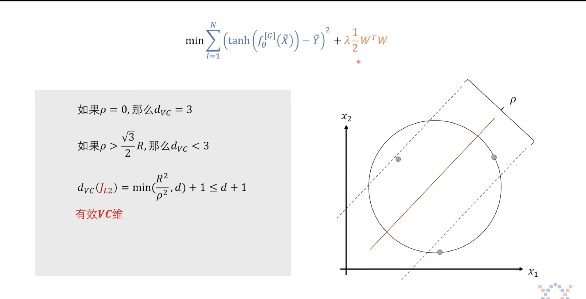

# **VC维是如何推导出来的？为什么它如此重要？**

## 🎯 一、VC维的诞生：为了解决`模型为什么会过拟合？`

### 1.1 问题背景（20世纪60年代）

在机器学习早期，人们发现：
- 一个非常复杂的模型（比如高阶多项式）可以完美拟合训练数据。
- 但这个模型在新数据上表现极差 → **过拟合**。

大家开始思考：
> `我们如何判断一个模型是`好`还是`坏`？有没有一个数学工具能告诉我们`这个模型会不会过拟合`？`

### 1.2 两位天才：Vapnik 和 Chervonenkis

苏联数学家 **Vladimir Vapnik** 和 **Alexey Chervonenkis** 在1971年提出了 **VC维** 的概念。他们的目标是：

> **给任意一个模型类（Model Class），定义一个数值，来衡量它的`表达能力`或`复杂度`，并用这个数值来预测它的泛化能力。**

---

## 🧮 二、VC维是怎么`算`出来的？（核心推导）

### 2.1 核心思想：`打散`（Shattering）

VC维的本质是：**一个模型类能`打散`的最大点数。**

#### 什么是`打散`？
> 对于一组点，如果模型类能对这组点的所有可能的标签组合都实现完美分类，我们就说这组点被`打散`了。

**例子**：假设你在平面上有3个点，它们不共线。
- 模型类是`直线`。
- 你可以画出一条直线，把这3个点分成任何一种组合（比如左2右1、左1右2、全左、全右等）。
- 所以，这3个点可以被`打散`。

#### 如果再加第4个点呢？
- 在平面上，你无法用一条直线把任意4个点的所有标签组合都分开（比如4个点呈`凹四边形`时）。
- 所以，**线性分类器的 VC维 = 3**。

---
要理解VC维的推导，我们不用搞复杂的数学证明，而是从**`分类能力`的直观衡量**出发，一步步推导它的定义和具体模型的VC维计算。

---

### 🔍 第一步：先搞清楚我们要解决什么问题
VC维是为了回答：**`一个模型到底能‘分辨’多复杂的模式？`**

比如，我们有个`直线分类器`（用直线把点分成两类），我们想知道：它最多能把几个点的**所有可能标签组合**都分开？

---

### 🧮 第二步：定义`增长函数`——衡量模型的分类能力
为了量化这个`分类能力`，我们先定义**增长函数（Growth Function）**：

#### 增长函数的定义
对于一个模型类（比如所有直线分类器），用符号 \(\mathcal{H}\) 表示。
对于任意 \(n\) 个点，模型能给它们贴出**多少种不同的标签组合**（`二分`）？
我们把这个`最大数量`记作 \(\Pi_{\mathcal{H}}(n)\)，这就是增长函数。

**公式**：
$$
\Pi_{\mathcal{H}}(n) = \max_{S: |S|=n} \left| \left\{ f(S) \mid f \in \mathcal{H} \right\} \right|
$$

**人话翻译**：
找一堆 \(n\) 个点，让模型给它们贴标签，能贴出多少种不一样的结果？我们取这个结果的最大值，就是增长函数。

#### 举个例子：直线分类器的增长函数
我们用`2维平面上的直线`来算增长函数：
1. **\(n=1\) 个点**：
   可以贴`+`或`-`，共 \(2\) 种 → \(\Pi_{\mathcal{H}}(1)=2=2^1\)
2. **\(n=2\) 个点**：
   可以贴`++`、`+-`、`-+`、`--`，共 \(4\) 种 → \(\Pi_{\mathcal{H}}(2)=4=2^2\)
3. **\(n=3\) 个点（不共线）**：
   可以贴出 \(8\) 种（所有2^3=8种标签组合）→ \(\Pi_{\mathcal{H}}(3)=8=2^3\)
4. **\(n=4\) 个点**：
   不管你怎么选4个点，直线最多只能贴出 \(14\) 种组合（比如`环形标签`：+ - + - 就分不出来）→ \(\Pi_{\mathcal{H}}(4)=14 < 16=2^4\)

---

### 🎯 第三步：VC维的定义——从增长函数到`最大可打散点数`
我们发现一个关键：
- 当 $n$ 比较小时，增长函数 $\Pi_{\mathcal{H}}(n)=2^n$（模型能把所有标签组合都分开）；
- 当 $n$ 超过某个数后，$\Pi_{\mathcal{H}}(n) < 2^n$（模型搞不定所有组合了）。

这个`临界点`就是VC维！

#### VC维的正式定义
$$
d_{VC}(\mathcal{H}) = \max\left\{ n \mid \Pi_{\mathcal{H}}(n) = 2^n \right\}
$$

**人话翻译**：
VC维就是模型能`打散`的**最大点数**——`打散`的意思是：模型能把这 \(n\) 个点的**所有 \(2^n\) 种标签组合**都完美分开。

#### 例子：直线分类器的VC维
从上面的例子：
- 直线能打散1、2、3个点 → $\Pi_{\mathcal{H}}(3)=2^3$
- 直线不能打散4个点 → $\Pi_{\mathcal{H}}(4) < 2^4$

所以，**2维直线分类器的VC维 $d_{VC}=3$**

---

### 📐 第四步：推导一般模型的VC维（以线性分类器为例）
上面是2维的例子，我们推广到**$d$维空间的线性分类器**（比如用超平面分类）：

#### 推导结论
$d$维空间的线性分类器，VC维 $d_{VC} = d+1$

#### 怎么推导？分两步：
1. **证明`能打散 $d+1$ 个点`**：
   找 $d+1$ 个`一般位置`的点（比如d维空间中的`单纯形顶点`，类似2维的三角形、3维的四面体）。
   对于这 $d+1$ 个点的任何标签组合，我们总能找到一个超平面把它们分开 → $\Pi_{\mathcal{H}}(d+1)=2^{d+1}$

2. **证明`不能打散 $d+2$ 个点`**：
   对于任何 $d+2$ 个点，根据`线性代数中的线性相关性`，其中必有一个点可以被其他 $d+1$ 个点线性表示。
   这意味着，存在一种标签组合（比如`多数点是+，这个点是-`），超平面无法把它分开 → $\Pi_{\mathcal{H}}(d+2) < 2^{d+2}$

---

### ✅ 总结：VC维的推导逻辑
1. **问题出发**：想知道模型的分类能力上限 → 定义`增长函数` $(\Pi_{\mathcal{H}}(n)$，衡量模型对n个点的最大分类组合数。
2. **定义VC维**：找到最大的 $n$，让 $\Pi_{\mathcal{H}}(n)=2^n$（模型能打散所有标签组合），这个n就是VC维。
3. **具体模型推导**：对某个模型（比如线性分类器），证明它能打散多少点，不能打散更多点，从而得到它的VC维。

VC维的`推导`本质是**`通过分类能力的上限来定义复杂度`**——它不是`算出来的`，而是通过`打散`这个直观概念定义出来，再验证具体模型的这个值。

### 2.2 数学定义

设 $\mathcal{F}$ 是一个函数族（比如所有线性分类器）。

对于一个大小为 $n$ 的样本集 $S = \{x_1, x_2, ..., x_n\}$，定义其**增长函数**（Growth Function）：

$$
\Pi_{\mathcal{F}}(n) = \max_{S:|S|=n} |\{f(S): f \in \mathcal{F}\}|
$$

- $\Pi_{\mathcal{F}}(n)$ 表示：对于任意 $n$ 个点，模型类 $\mathcal{F}$ 最多能产生多少种不同的分类结果。

**VC维** 就是使得增长函数达到最大值 $2^n$ 的最大 $n$：

$$
d_{VC} = \max \{ n : \Pi_{\mathcal{F}}(n) = 2^n \}
$$

**通俗解释**：
- 如果模型类能把 $n$ 个点的所有 $2^n$ 种标签组合都分出来，那么它的 VC 维至少是 $n$。
- VC维就是这个最大的 $n$。

---

### 2.3 为什么 VC维是有限的？

不是所有的模型类都有有限的 VC 维！

- **线性分类器**：VC维 = $d+1$（$d$ 是特征维度）
- **神经网络**：理论上 VC 维可以无限大（因为参数太多），但在实践中，我们通过正则化、Dropout 等手段限制其有效 VC 维。
- **决策树**：VC维与树的深度和叶子节点数有关。

**关键点**：**只有 VC 维有限的模型类，才能保证在足够大的数据集上泛化误差有界。**

---

## 🌟 三、为什么说 VC维是机器学习中最重要的理论？

### 3.1 它给出了`泛化误差`的理论保证

这是 VC 维最伟大的贡献！

#### 泛化误差上界（PAC 学习理论）

对于一个 VC 维为 $d_{VC}$ 的模型类，在训练集大小为 $N$ 的情况下，泛化误差 $\epsilon$ 有如下上界：

$$
\epsilon \le \epsilon_{\text{emp}} + \sqrt{\frac{d_{VC} (\log N + 1) - \log \eta}{N}}
$$

- $\epsilon_{\text{emp}}$：经验误差（训练误差）
- $\eta$：置信度（比如 0.05，表示 95% 的概率下成立）

**通俗解释**：
> 只要你的模型 VC 维 $d_{VC}$ 不是无穷大，并且你有足够的训练数据 $N$，你就能保证模型在新数据上的表现不会太差！

**这就是机器学习的`基石`理论！**

---

### 3.2 它统一了`模型复杂度`的概念

在 VC 维之前，人们用各种方式衡量模型复杂度：
- 参数个数
- 拟合优度
- AIC/BIC 准则

VC 维提供了一个**统一、普适**的框架：
- **复杂度 = VC维**
- **泛化能力 = 由 VC维 和 数据量 共同决定**

---

### 3.3 它指导了现代机器学习实践

- **SVM**：通过最大化间隔，隐式地控制 VC 维。
- **正则化**：通过 L1/L2 正则项，显式地控制模型复杂度（降低有效 VC 维）。
- **深度学习**：虽然深度神经网络的 VC 维理论上很大，但实践中我们通过早停、Dropout、BatchNorm 等技术，有效地降低了其`有效 VC 维`，从而实现了良好的泛化性能。

---

## 🎓 四、总结

### 4.1 VC维的推导简史

1. **问题提出**：模型为什么会过拟合？
2. **核心思想**：定义`打散`概念，用最大可打散点数作为复杂度指标。
3. **数学定义**：VC维 = 使增长函数等于 $2^n$ 的最大 $n$。
4. **理论突破**：证明了泛化误差上界，建立了 PAC 学习理论。

### 4.2 为什么最重要？

- **它是第一个系统性解决`泛化`问题的理论**。
- **它给出了模型复杂度和数据量之间的定量关系**。
- **它指导了几乎所有现代机器学习算法的设计**（如 SVM、正则化、深度学习）。

---

## 💡 五、生活化比喻

### 比喻1：学生考试

- **VC维**：学生的`学习能力`
- **训练数据**：老师给的练习题
- **测试数据**：期末考试
- **泛化误差**：期末考试成绩

**结论**：
- 一个`学习能力`很强的学生（高 VC 维），如果只做了几道题（小数据），很可能在期末考砸（过拟合）。
- 一个`学习能力`适中的学生（低 VC 维），即使只做了一部分题，也能在期末考得不错（泛化好）。

### 比喻2：裁缝做衣服

- **VC维**：裁缝的`手艺复杂度`
- **训练数据**：客户提供的身材数据
- **测试数据**：新客户的身材数据

**结论**：
- 裁缝手艺太复杂（高 VC 维），会为了一个客户做出一件`完全贴身`的衣服，但换一个客户就穿不了。
- 裁缝手艺适中（低 VC 维），做的衣服`合身但不紧身`，适合更多人。

---

## ✅ 六、一句话总结

> **VC维是机器学习的`灵魂`，它第一次用数学语言回答了`模型为什么能泛化`，并为我们提供了设计和评估模型的理论框架。**

如果你理解了 VC 维，你就站在了机器学习理论的巅峰！

---

## 📊 **VC维的现代发展与实际应用**

### 1. VC维的实际计算方法

虽然VC维理论上难以精确计算，但有一些实用方法：

#### Rademacher复杂度
- **更紧的界**：比VC维提供更精确的泛化界
- **计算更可行**：可以通过优化问题求解
- **公式**：$R_n(\mathcal{F}) = \mathbb{E}_\sigma \left[ \sup_{f \in \mathcal{F}} \frac{1}{n} \sum_{i=1}^n \sigma_i f(x_i) \right]$

#### PAC-Bayes界
- **贝叶斯视角**：结合先验分布和后验分布
- **适用于深度学习**：比传统VC维更适合神经网络
- **优势**：考虑了数据分布和算法随机性

### 2. 深度学习中的VC维悖论

#### 理论与实践的矛盾
- **理论上**：深度神经网络VC维极大（甚至无限）
- **实践中**：却能很好地泛化

#### 解释机制
1. **隐式正则化**：SGD本身就有正则化效果
2. **过参数化现象**：参数多反而有助于优化
3. **平坦最小值**：找到的解通常在平坦区域

### 3. VC维在模型选择中的应用

#### 模型复杂度控制
- **结构风险最小化**：$R(f) \le R_{emp}(f) + \sqrt{\frac{h(\log N + 1) - \log \delta}{N}}$
- **实际应用**：根据数据量选择合适复杂度的模型

#### 交叉验证的理论基础
- **留出法**：验证集估计泛化误差
- **k折交叉验证**：更稳定的估计
- **理论保证**：与VC维理论一致

### 4. VC维与其他复杂度度量对比

| 度量方法 | 优点 | 缺点 | 适用场景 |
|---------|------|------|---------|
| **VC维** | 理论基础强，直观 | 界松，计算难 | 传统机器学习理论 |
| **Rademacher复杂度** | 界更紧，可计算 | 理论复杂 | 统计学习理论 |
| **PAC-Bayes** | 适合贝叶斯方法 | 需要先验 | 深度学习理论 |
| **参数数量** | 简单直观 | 不准确 | 实践参考 |

### 5. 前沿研究方向

#### 现代理论发展
1. **神经网络泛化理论**：解释深度学习的泛化能力
2. **双下降现象**：模型复杂度与误差的非单调关系
3. **优化与泛化的关系**：SGD如何影响泛化

#### 实用工具
1. **复杂度度量工具**：自动计算模型复杂度
2. **自动模型选择**：基于理论的超参数优化
3. **泛化误差估计**：更准确的泛化预测

---
 

如果你想看 VC 维在神经网络中的具体应用（比如`有效 VC 维`、`Rademacher 复杂度`），我也可以继续展开！

---

## 🎯 第一部分：VC维是什么？—— 模型的`智商`或`容量`

### 1.1 核心公式（要记的）：真实风险上界

VC维理论的核心结论是这个不等式：

$$
\underbrace{R(f)}_{\text{真实风险}} \le \underbrace{R_{\text{emp}}(f)}_{\text{经验风险}} + \underbrace{\Phi\left(\frac{h}{n}\right)}_{\text{复杂度惩罚项}}
$$

**直观翻译**：
> **模型在新数据上的错误率** ≤ **模型在训练集上的错误率** + **模型复杂度带来的额外风险**

### 1.2 比喻：学生考试（牢记这个比喻）

| 符号/概念 | 角色 | 含义 |
| :--- | :--- | :--- |
| **$R(f)$** | **期末考试成绩** | 模型的真实表现，无法直接测量。 |
| **$R_{\text{emp}}(f)$** | **练习册得分** | 模型在训练集上的表现，我们能直接算。 |
| **$h$ (VC维)** | **学生智商/记忆容量** | 衡量模型能记住多复杂的模式。 |
| **$n$** | **练习册题目数** | 训练样本数量。 |
| **$\Phi(\frac{h}{n})$** | **`作弊`风险** | **智商 (h) / 题目数 (n)** 的比值，这个比值越大，你过拟合的风险越高。 |

**目标**：我们训练模型，就是想让 **期末考试成绩 ($R(f)$)** 尽可能好。所以，我们要同时优化公式右侧的两项：

1.  **最小化 $R_{\text{emp}}(f)$**：努力在练习册上拿高分（拟合数据）。
2.  **最小化 $\Phi(\frac{h}{n})$**：控制智商，不要死记硬背（控制复杂度）。

---

## 🔥 第二部分：SVM — 天生的VC维专家

SVM从设计之初，就是为了优化VC维上界公式的！

### 2.1 SVM的优化目标（再看一眼）

SVM的优化目标是：
$$
\min \quad \underbrace{\frac{1}{2}\|w\|^2}_{\text{VC维控制}} + C \sum_{i=1}^{n} \underbrace{\max(0, 1 - y_i f(x_i))}_{\text{合页损失 (经验风险)}}
$$

### 2.2 核心联系：最小化权重 = 最小化VC维

对于线性分类器（如SVM），数学证明表明，**VC维的上界与间隔成反比**。

- **最大间隔**$\rho$ = $\frac{2}{\|w\|}$
- **VC维 (h) 上界** $\propto \frac{1}{\rho^2} \propto \|w\|^2$

**通俗解释**：
- **$\|w\|^2$ 越小** → **间隔 $\rho$ 越大** → **模型的复杂度 $h$ 越低**。

**SVM的`天人合一`**：
1. **最小化 $\|w\|^2$**：SVM通过最小化权重平方，**直接（但间接地）最小化了VC维 $h$**，从而控制了公式右侧的 **复杂度惩罚项**。
2. **最小化合页损失**：最小化了 **经验风险 $R_{\text{emp}}(f)$**。

**结论**：**SVM是第一个在数学上证明，通过`最大化间隔`可以最小化模型复杂度（VC维）的算法。**它完美地执行了`最小化真实风险上界`的策略。

---

## 🛠️ 第三部分：正则化 — 强行给模型套上VC维的`紧箍咒`

正则化（如L2/L1）就是一种通用工具，可以给任何模型（NN、线性回归等）加上这个`VC维惩罚`。

### 3.1 正则化的公式解读

带L2正则化的总损失函数：
$$
\min \quad \underbrace{\frac{1}{n}\sum_{i=1}^{n} \ell(y_i, f(x_i; w))}_{\text{经验风险 } R_{\text{emp}}} + \underbrace{\lambda \|w\|^2}_{\text{L2正则项}}
$$

### 3.2 贝叶斯/拉格朗日视角回顾

我们之前讲过，L2正则化项 $\lambda \|w\|^2$ 等价于：
1.  **约束条件**：$\|w\|^2 \le C$（权重不能太大）。
2.  **高斯先验**：先验地相信权重应该集中在0附近。

### 3.3 VC维的解释

在这个公式中，**正则化项 $\lambda \|w\|^2$ 就是 VC维惩罚项 $\Phi(\frac{h}{n})$ 的一个`代理`**。

- **$\lambda$ 的作用**：
  - **$\lambda$ 越大**：我们对复杂度惩罚越重，模型被强制变得更简单（VC维被压低）。
  - **$\lambda$ 越小**：我们允许模型更复杂，更关注拟合训练数据。

**通俗比喻**：
- **$\lambda$** 是老师手中的`严格度旋钮`。
- **$\|w\|^2$** 是学生`智商`的量化指标。

如果你发现学生（模型）在期末考试（新数据）时表现不好（泛化差），通常是因为：
- **期末考试成绩差** ($R(f)$ 太高) = **练习册得分低** ($R_{\text{emp}}$ 高) + **作弊风险高** ($\Phi$ 高)。

如果 $\Phi$ 太高（过拟合），我们就要**加大 $\lambda$**，强制学生放弃背诵（减小 $\|w\|^2$），回归简单。

---

## 💡 总结：VC维下的指导原则

VC维理论不是一个计算工具（VC维太难算了），而是一个**指导我们设计算法的原则**：

1.  **SVM的价值**：它在理论上找到了**最优雅的方式**，通过最大化间隔（最小化 $\|w\|^2$），直接从内部优化了VC维上界。
2.  **正则化的价值**：它是**最通用的方式**，通过在损失函数中添加惩罚项 $\lambda \|w\|^2$，来**外部控制**模型的复杂度，防止其VC维过高。

**一句话记住**：
> **VC维是评判模型`智商`和`作弊风险`的理论标准，SVM 和 正则化都是在遵循`智商必须匹配数据量`这一VC维原则来设计和优化模型。**

--- 

## 🎯 公式的解析

如图公式展示了一个**带 L2 正则项的损失函数**，并给出了其**有效 VC 维**的理论上界。

### 1.1 优化目标（图中的公式）

$$
\min \sum_{i=1}^{N} \left( \tanh\left(f_{\theta}^{[G]}(\tilde{X})\right) - \tilde{Y} \right)^2 + \lambda \frac{1}{2} W^\top W
$$

**通俗解释**：这是一个**带 L2 正则化**的**分类器**在进行优化。
- **左边项 (经验损失)**：$\sum (\dots)^2$。这是一个**平方误差项**，用来衡量模型输出（经过 $\tanh$ 激活后）与真实标签（$\tilde{Y}$）的接近程度。
- **右边项 (L2 正则化项)**：$\lambda \frac{1}{2} W^\top W$。这是 **权重衰减**，用于惩罚过大的权重。
- **核心**：模型通过最小化这个总目标，同时追求 **拟合数据** 和 **保持简单**。

### 1.2 几何图形（右侧的图）

- **圆圈**：代表训练数据点的分布范围 $R$。
- **红色实线**：代表分类的决策边界（超平面）。
- **虚线**：代表分类间隔的边界。
- **$\rho$**：代表 **几何间隔 (Margin)**，是决策边界到最近数据点的距离。
- **核心**：在同一个数据分布 $R$ 内，分类器可以有不同的间隔 $\rho$。

---

## 🔥 第二部分：正则化如何影响 VC 维？（核心机制）

### 2.1 基础 VC 维（无间隔）

对于一个 **线性分类器**（如线性回归或单层感知机），如果不对其权重进行任何限制：

$$
d_{\text{VC}} = d + 1
$$
- $d$ 是特征空间的维度（如果图是 2D，则 $d=2$）。
- **结论**：VC维只由**特征维度**决定，与数据无关。

**图示中的第一条信息**：
> **如果 $\rho = 0$，那么 $d_{\text{VC}} = 3$**
- **解释**：如果间隔 $\rho$ 极小（趋近于0），模型可以极度扭曲自己去拟合数据。此时，VC维就退化到线性分类器的标准 VC 维 $d+1$。

### 2.2 有效 VC 维（正则化的魔力）

正则化项 $\lambda W^\top W$ 的目的就是**最小化 $\|W\|^2$**，这恰恰是**最大化几何间隔 $\rho \propto \frac{1}{\|W\|}$**。

当模型强制保持一定间隔 $\rho$ 时，它的`智商`就被**人为限制**了。这引入了 **`间隔 VC 维`**，也叫 **`有效 VC 维`** $d_{VC}(\mathcal{J}_{L2})$。

**图示中的核心公式**：
$$
d_{VC}(\mathcal{J}_{L2}) = \min \left( \frac{R^2}{\rho^2},\ d \right) + 1 \quad \le d + 1
$$

**公式拆解**：
- **$R^2$**：训练数据分布的最大范围。
- **$\rho^2$**：几何间隔的平方。
- **$\frac{R^2}{\rho^2}$**：这个比值是 **模型复杂度** 的度量。它随着间隔 $\rho$ 增大而减小。
- **$d$**：特征空间的维度。

**核心结论：正则化通过间隔 $\rho$ 限制了 VC 维**

1.  **L2 正则化** 迫使模型寻找更小的 $\|W\|^2$。
2.  $\|W\|^2$ 越小，**间隔 $\rho$ 越大**。
3.  间隔 $\rho$ 越大，**有效 VC 维 $\frac{R^2}{\rho^2}$ 越小**。

**通俗解释**：
- **L2 正则化项** $\lambda W^\top W$ 就像一个**`紧箍咒`**，它强制模型将间隔 $\rho$ 保持在一个较大的值。
- **间隔 $\rho$** 是我们对模型复杂度的**实际限制**。
- **只要间隔 $\rho$ 保持得足够大，模型的`智商`（有效VC维）就被成功地压缩了，低于其原始的维度 $d+1$，从而有效防止过拟合。**

### 2.3 效果对比（图中的第二条信息）

> **如果 $\rho > \frac{\sqrt{3}}{2}R$，那么 $d_{\text{VC}} < 3$**

- **解释**：在 2D 空间 ($d=2$) 中，如果模型能找到一个足够大的间隔 $\rho$，使得它大于某个阈值（$\frac{\sqrt{3}}{2}R$），那么模型的有效 VC 维就被限制在 3 以下（即，比其原始 VC 维 $d+1=3$ 更低）。
- **意义**：这在理论上保证了，**即使在同一个特征空间里，间隔大的分类器比间隔小的分类器，理论上更不容易过拟合**。

---

## 💡 第三部分：模型复杂度由什么决定？

模型复杂度 $h$（VC维）决定了模型**能学习多复杂的边界**。它主要由三个因素决定，其中前两个是`理论VC维`，第三个是`实践VC维`：

### 1. 结构复杂性（理论 VC 维）

- **定义**：由模型自身的**数学结构**决定。
- **决定因素**：
    - **特征维度 $d$**：线性模型的复杂度 $d+1$。
    - **网络层数/参数量**：神经网络的复杂度非常高，但理论上很难精确计算，通常只知道上限。

### 2. 间隔大小 $\rho$（有效 VC 维）

- **定义**：由 **优化目标** 决定，VC维与 $\rho$ 成反比。
- **决定因素**：
    - **权重的大小 $\|W\|$**：权重越小，间隔越大，复杂度越低。
    - **训练数据范围 $R$**：数据越分散（R越大），模型越难保持大间隔。
- **关键**：**L2 正则化和 SVM 就是通过控制 $\|W\|$ 来控制 $\rho$，从而控制有效 VC 维。**

### 3. 训练过程（实践复杂度）

在实际深度学习中，模型复杂度还受到以下因素影响：

- **迭代次数**：训练得越久，模型越复杂（越接近过拟合）。
- **学习率**：学习率越大，模型可能跳过简单解。
- **DropOut/BatchNorm**：这些技术**人工**降低了模型的复杂度和自由度。
- **数据量 $n$**：VC维上界公式中，复杂度惩罚项分母是 $n$。**数据越多，模型能安全容纳的复杂度就越高。**

---

## 📊 **VC维的实际计算示例**

### 1. 线性分类器的VC维计算

#### 在1D空间（数轴上）
- **模型**：点分类器 $f(x) = \text{sign}(x - a)$
- **VC维**：1
- **解释**：只能打散1个点，无法打散2个点

#### 在2D空间（平面上）
- **模型**：线性分类器 $f(x,y) = \text{sign}(w_1x + w_2y + b)$
- **VC维**：3
- **证明**：
  - 可以打散任意3个不共线的点（$2^3 = 8$种标签组合都能实现）
  - 无法打散4个点（如正方形的4个顶点，无法实现对角标签模式）

#### 在d维空间
- **模型**：超平面分类器
- **VC维**：$d + 1$
- **公式**：$d_{VC} = d + 1$

### 2. 非线性模型的VC维

#### 多项式分类器
- **模型**：$f(x) = \text{sign}(p(x))$，其中$p(x)$是$n$次多项式
- **VC维**：$\binom{n+d}{d}$（组合数）
- **例子**：2次多项式在2D空间的VC维 = $\binom{2+2}{2} = 6$

#### 决策树
- **模型**：完全二叉树，深度为$h$
- **VC维**：$2^h$（叶子节点数）
- **实际**：通常远小于理论值，因为不是所有分割都有意义

#### 神经网络
- **模型**：带ReLU激活的前馈网络
- **VC维**：$O(W \log W)$，其中$W$是权重数量
- **注意**：这是理论上界，实际有效VC维可能小得多

---

## 🤖 **VC维与深度学习的悖论**

### 1. 理论与实践的矛盾

#### 理论预测
- 深度神经网络参数量巨大（百万到十亿级别）
- VC维理论上应该极大（甚至无限）
- 根据VC理论，应该严重过拟合

#### 实际观察
- 深度网络在训练集上表现良好
- 在测试集上也能很好地泛化
- **没有出现预期的严重过拟合**

### 2. 可能的解释

#### 隐式正则化
- **SGD的随机性**：随机梯度下降本身就有正则化效果
- **批处理**：Mini-batch训练引入噪声，防止过拟合
- **早停**：实践中通常在验证集性能下降时停止训练

#### 过参数化的优势
- **更宽的极小值盆地**：参数多反而容易找到平坦的极小值
- **更快的优化**：过参数化使损失景观更平滑
- **插值的好处**：完全插值训练数据可能有助于泛化

#### 现代理论发展
- **NTK（神经正切核）理论**：无限宽网络等价于核方法
- **双下降现象**：误差随模型复杂度呈现双U形曲线
- **PAC-Bayes框架**：提供更紧的泛化界

---

## ⚠️ **VC维的局限性**

### 1. 界的松散性

#### 理论界 vs 实际表现
- **理论上界**：$\epsilon \le \epsilon_{\text{emp}} + \sqrt{\frac{d_{VC} \log N}{N}}$
- **实际问题**：这个界通常非常松散，过于保守
- **结果**：预测的泛化误差远大于实际观察值

#### 数值例子
- 对于ImageNet上的ResNet-50：
  - 参数量：~2600万
  - 理论VC维：> $10^7$
  - 训练样本：~100万
  - 理论预测：应该严重过拟合
  - 实际表现：Top-1错误率~23%，泛化良好

### 2. 不考虑数据分布

#### 假设过于悲观
- VC维假设**最坏情况**的数据分布
- 实际数据通常有结构，不是任意的
- **结果**：理论界对真实任务过于保守

#### 忽略任务特性
- 不同任务的难度差异很大
- VC维不考虑标签噪声、特征相关性等
- **局限**：无法针对特定任务给出精确预测

### 3. 不考虑算法

#### 模型类 vs 具体算法
- VC维只考虑**模型的表达能力**
- 不考虑**优化算法**的特性
- **问题**：不同算法（SGD vs Adam）可能有不同泛化表现

---

## 🎯 **VC维的实际应用指导**

### 1. 模型选择原则

#### 根据数据量选择复杂度
- **经验法则**：$n \geq 10 \times d_{VC}$
- **小数据集**（$n < 1000$）：
  - 优先选择简单模型（线性、浅层树）
  - 避免深度网络，强正则化
- **大数据集**（$n > 10^6$）：
  - 可以使用复杂模型
  - 仍需注意过拟合风险

#### 交叉验证的重要性
- **理论指导**：VC维告诉我们复杂度很重要
- **实践验证**：交叉验证实际评估泛化性能
- **结合使用**：理论指导方向，验证确认效果

### 2. 正则化策略

#### 显式正则化
- **L1/L2正则**：直接控制模型复杂度
- **Dropout**：随机屏蔽神经元，降低有效VC维
- **数据增强**：增加有效数据量，提高容许复杂度

#### 隐式正则化
- **早停**：避免过度拟合训练数据
- **批量归一化**：稳定训练，间接控制复杂度
- **标签平滑**：防止过度自信，降低过拟合风险

### 3. 深度学习实践

#### 网络设计原则
- **先简后繁**：从简单架构开始，逐步增加复杂度
- **宽度 vs 深度**：更宽的网络通常比更深的好优化
- **残差连接**：帮助梯度流动，允许更深的网络

#### 训练技巧
- **学习率调度**：大的初始学习率有正则化效果
- **权重衰减**：L2正则的现代实现
- **混合精度**：可能有助于泛化（仍在研究中）

---

## 🎯 最终总结：

1.  **正则化影响 VC 维的机制**：
    - **L2 正则化 $\lambda W^\top W$ 迫使 $\|W\|$ 最小化。**
    - **最小化 $\|W\|$ 等价于最大化间隔 $\rho$。**
    - **VC 维 $(h)$ 与 $\rho$ 成反比 ($h \propto 1/\rho^2$)。**
    - **因此，正则化通过增加 $\rho$ 来压缩 VC 维，从而降低泛化误差的上界。**

2.  **模型复杂度决定因素**：
    - **理论上**：由模型结构和特征维度 $d$ 决定。
    - **实践中**：由 **间隔 $\rho$** (通过正则化控制)、数据分布 $R$ 和训练过程决定。

3.  **VC维的现代视角**：
    - **理论价值**：奠基性的泛化理论，提供了复杂度与泛化的连接
    - **实践局限**：界过于保守，不考虑优化算法和数据分布
    - **核心启示**：模型复杂度需要与数据量匹配，仍是机器学习的黄金法则

---