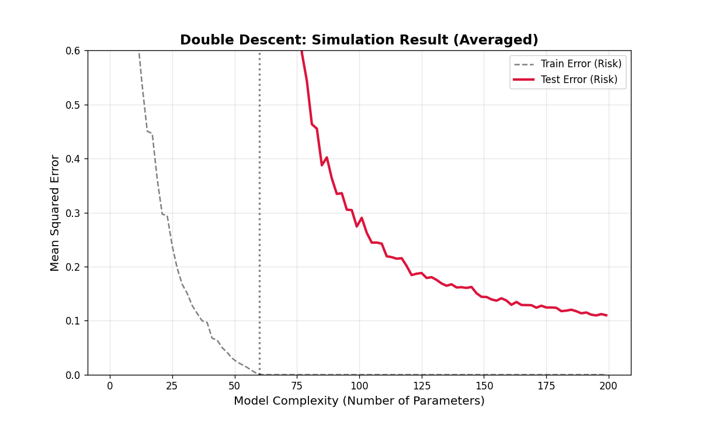

# **VC维是如何推导出来的？为什么它如此重要？**

## 🧮 VC维是怎么推导出来的？

### 直观理解：从"贴标签"说起

想象你有一堆点，要用模型给它们`贴标签`（+或-）。**增长函数** $\Pi_{\mathcal{H}}(n)$ 就是模型对 $n$ 个点最多能贴出多少种不同的标签组合。

**例子**：平面上的直线分类器
- 1个点：能贴2种（+/-）→ $\Pi=2=2^1$
- 2个点：能贴4种（++/+-/-+/--）→ $\Pi=4=2^2$  
- 3个点：能贴8种（所有组合）→ $\Pi=8=2^3$
- 4个点：最多14种（环形标签+ - + -分不开）→ $\Pi<2^4$

**VC维定义**：模型能"打散"的最大点数
$$
d_{VC} = \max \{ n : \Pi_{\mathcal{H}}(n) = 2^n \}
$$
"打散"=能把所有 $2^n$ 种标签组合都分开。所以2维直线分类器的VC维=3。

### 严格推导：四步走

#### 第一步：单个模型的误差界
- 真实误差：$R(h) = P[h(X) \neq Y]$（期末考）
- 经验误差：$\hat{R}_N(h) = \frac{1}{N}\sum 1\{h(x_i) \neq y_i\}$（练习册）
- Hoeffding不等式：$P(|R(h)-\hat{R}_N(h)|>\varepsilon) \leq 2e^{-2N\varepsilon^2}$

#### 第二步：处理一堆模型（联合界）
学习算法要从假设空间 $\mathcal{H}$ 中挑最好的，需要对所有 $h \in \mathcal{H}$ 同时成立。

用并合界：$P(\sup_{h\in\mathcal{H}}|R(h)-\hat{R}_N(h)|>\varepsilon) \leq 2|\mathcal{H}|e^{-2N\varepsilon^2}$

但 $\mathcal{H}$ 常常无限，转而观察"在N个点上能产生的不同标签数"：
$$
P(\sup_{h\in\mathcal{H}}|R(h)-\hat{R}_N(h)|>\varepsilon) \leq 2m_{\mathcal{H}}(N)e^{-2N\varepsilon^2}
$$
其中 $m_{\mathcal{H}}(N)$ 是增长函数。

> tip: 严格推导中，这里需要使用Symmetrization (对称化) 技巧，引入另一组大小为 
$N$ 的幽灵样本。这会导致公式中的常数发生变化，例如系数变成 8，指数部分变成 $N/8$
或类似形式，具体取决于使用的界。但核心结论——增长函数控制了概率上界——是不变的。

#### 第三步：从增长函数到VC维（Sauer-Shelah引理）
直接算 $m_{\mathcal{H}}(N)$ 很难，用VC维 $d$ 来上界。这里需要组合数学的重要结果——**Sauer-Shelah引理**。

##### Sauer-Shelah引理的表述

**定理（Sauer-Shelah引理）**：
设假设空间 $\mathcal{H}$ 的VC维为 $d$，则对任意 $N \ge 1$：
$
m_{\mathcal{H}}(N) \leq \sum_{i=0}^{d} \binom{N}{i}
$

**推论（更紧的上界）**：
当 $N > d$ 时：
$
\sum_{i=0}^{d} \binom{N}{i} \leq \left(\frac{eN}{d}\right)^d
$

##### 为什么这个引理成立？——组合证明思路

**核心思想**：如果VC维是 $d$，那么任何 $d+1$ 个点都不能被打散。这意味着在 $N$ 个点中，任何 $d+1$ 个点的子集都有一个"缺失"的标注模式。

**证明梗概**：

1. **归纳基础**：$d=0$ 时，$\mathcal{H}$ 只能产生一种标注（全+或全-），$m_{\mathcal{H}}(N) = 1 = \binom{N}{0}$。

2. **归纳步骤**：假设对VC维 $d-1$ 成立，证明对VC维 $d$ 也成立。

3. **关键观察**：取 $N$ 个点中的任意一个点 $x$，将 $\mathcal{H}$ 分成两部分：
   - $\mathcal{H}_0 = \{h \in \mathcal{H} : h(x) = 0\}$
   - $\mathcal{H}_1 = \{h \in \mathcal{H} : h(x) = 1\}$

4. **递归关系**：
   $
   m_{\mathcal{H}}(N) = m_{\mathcal{H}_0}(N-1) + m_{\mathcal{H}_1}(N-1)
   $
   
   注意：$\mathcal{H}_0$ 和 $\mathcal{H}_1$ 的VC维都 $\leq d-1$（否则就能打散包含 $x$ 的 $d+1$ 个点）。

5. **应用归纳假设**：
   $
   m_{\mathcal{H}}(N) \leq \sum_{i=0}^{d-1} \binom{N-1}{i} + \sum_{i=0}^{d-1} \binom{N-1}{i} = \sum_{i=0}^{d} \binom{N}{i}
   $

##### 直观理解

- **小样本（$N \leq d$）**：模型几乎"无所不能"，能产生所有 $2^N$ 种标注
  $
  \sum_{i=0}^{N} \binom{N}{i} = 2^N
  $

- **大样本（$N > d$）**：模型能力被"卡住"，从指数增长降为多项式增长
  $
  \sum_{i=0}^{d} \binom{N}{i} \approx \binom{N}{d} = O(N^d)
  $

**关键洞察**：VC维 $d$ 就像一个"断点"，超过这个点后，模型的表达能力从指数级降为多项式级！

##### 应用到VC泛化界

有了 Sauer-Shelah 引理，我们可以：
- 若 $N \leq d$：$m_{\mathcal{H}}(N) = 2^N$（几乎无所不能）
- 若 $N > d$：$m_{\mathcal{H}}(N) \leq \sum_{i=0}^{d}\binom{N}{i} \leq (\frac{eN}{d})^d$

**关键**：VC维把指数增长"卡住"成多项式增长！

#### 第四步：VC泛化不等式
代回得到：
$$
P(\sup_{h\in\mathcal{H}}|R(h)-\hat{R}_N(h)|>\varepsilon) \leq 4(\frac{2eN}{d})^d e^{-N\varepsilon^2/4}
$$

等价的高概率形式：
$$
R(h) \leq \hat{R}_N(h) + \sqrt{\frac{4}{N}[d\log\frac{2eN}{d} + \log\frac{4}{\delta}]}
$$

**样本复杂度**：$N = O(\frac{1}{\varepsilon^2}[d\log\frac{1}{\varepsilon} + \log\frac{1}{\delta}])$

### 常见模型的VC维计算

#### 线性分类器（d维空间）
- **模型**：超平面分类器 $f(x) = \text{sign}(w^T x + b)$
- **VC维**：$d + 1$
- **详细推导**：
  
  **第一步：证明VC维 ≥ d+1**
  
  取 $d+1$ 个点，它们处于`一般位置`：
  $$
  x_0 = 0, \quad x_1 = e_1, \quad x_2 = e_2, \quad \ldots, \quad x_d = e_d
  $$
  
  对于任意标注 $(y_0, y_1, \ldots, y_d)$，我们可以找到权重：
  $$
  w = \sum_{i=1}^d (y_i - y_0) e_i, \quad b = y_0
  $$
  
  因此，$d+1$ 个点可以被打散。
  
  **第二步：证明VC维 ≤ d+1**
  
  假设有 $d+2$ 个点，根据线性代数，存在不全为0的系数 $\alpha_i$ 使得：
  $$
  \sum_{i=0}^{d+1} \alpha_i x_i = 0, \quad \sum_{i=0}^{d+1} \alpha_i = 0
  $$
  
  考虑两种标注会导致矛盾，因此 $d+2$ 个点无法被任意打散。
  

  **结论**：线性分类器的VC维 = $d+1$。

#### 证明 VC维 $\le d+1$(基于 Radon 定理)

1. 构造线性相关性：

    考虑 $R^d$ 空间中的 $d+2$ 个点 $x_1, \ldots, x_{d+2}$。由于点的数量多于维数+1，根据线性代数（仿射相关性），必然存在一组不全为 0 的实数系数 $\alpha_1, \ldots, \alpha_{d+2}$，满足以下两个条件：
    $$
    \sum_{i=1}^{d+2} \alpha_i x_i = 0, \quad \text{且} \quad \sum_{i=1}^{d+2} \alpha_i = 0
    $$

2. 分组与凸包 (Radon 分解)：

    - 根据 $\sum \alpha_i = 0$，系数 $\alpha_i$ 中必然既有正数也有负数。我们将这些点分为两组：
    - 集合 $P$ (Positive)：所有系数 $\alpha_i > 0$ 的点。
    - 集合 $N$ (Negative)：所有系数 $\alpha_i < 0$ 的点。
    我们可以通过移项整理上述公式，得到：
    $$
    \sum_{i \in P} \alpha_i x_i = \sum_{j \in N} (-\alpha_j) x_j
    $$

    令 $S = \sum_{i \in P} \alpha_i = \sum_{j \in N} (-\alpha_j)$。由于 $S > 0$，我们可以两边同除以 $S$：
    $$
    \sum_{i \in P} \frac{\alpha_i}{S} x_i = \sum_{j \in N} \frac{-\alpha_j}{S} x_j = \mathbf{z}
    $$

    几何含义：点 $z$ 既是由 $P$ 中点构成的凸组合，也是由 $N$ 中点构成的凸组合。
    这意味着：集合$P$ 的凸包与集合$N$ 的凸包必有交集 (交点为$z$)。

3. 得出矛盾 (凸集分离定理)

    现在，假设我们给集合$P$ 中的点贴上标签 +1，给集合$N$中的点贴上标签 -1。
    如果存在一个线性超平面能将这两类点完全分开，那么根据**凸集分离定理**，这个超平面必须能把 $P$ 的凸包和 $N$ 的凸包分开。
    但是，我们在第2步证明了这两个凸包相交于点$z$。
    矛盾：超平面无法既把$z$ 划在正侧（因为它在$P$的凸包里），又把 $z$划在负侧（因为它也在$N$的凸包里）。

结论：线性分类器无法对这种特定的标签组合（$P$ 为正，$N$ 为负）进行分类。因此，模型无法打散 $d+2$ 个点，VC维 $\le d+1$。

#### 多项式分类器
- **模型**：$f(x) = \text{sign}(p(x))$，其中$p(x)$是$n$次多项式
- **VC维**：$\binom{n+d}{d}$（组合数）
- **推导**：
  
  $d$ 维空间中的 $n$ 次多项式的系数个数等于：
  $$
  \#\{I : |I| \le n\} = \binom{n+d}{d}
  $$
  
  **关键结论**：多项式分类器的VC维等于其自由参数的数量。

#### 神经网络
- **模型**：带ReLU激活的前馈网络
- **VC维**：$O(W \log W)$，其中$W$是权重数量
- **推导思路**：
  
  对于ReLU网络，通过Sauer引理和增长函数的分析，可以证明VC维的上界为：
  $$
  d_{VC} \le O(W \log W)
  $$

---

## 为什么说 VC维是机器学习中最重要的理论？

### 它给出了"泛化误差"的理论保证

对于一个 VC 维为 $d_{VC}$ 的模型类，在训练集大小为 $N$ 的情况下，泛化误差 $\epsilon$ 有如下上界：

$$
\epsilon \le \epsilon_{\text{emp}} + \sqrt{\frac{d_{VC} (\log N + 1) - \log \eta}{N}}
$$

- $\epsilon_{\text{emp}}$：经验误差（训练误差）
- $\eta$：置信度（比如 0.05，表示 95% 的概率下成立）

**通俗解释**：
> 只要你的模型 VC 维 $d_{VC}$ 不是无穷大，并且你有足够的训练数据 $N$，你就能保证模型在新数据上的表现不会太差！

这就是机器学习的"基石"理论！

### 它统一了"模型复杂度"的概念

在 VC 维之前，人们用各种方式衡量模型复杂度：
- 参数个数
- 拟合优度
- AIC/BIC 准则

VC维提供了一个**统一、普适**的框架：
- **复杂度 = VC维**
- **泛化能力 = 由 VC维 和 数据量 共同决定**

### 它指导了现代机器学习实践

- **SVM**：通过最大化间隔，隐式地控制 VC 维。
- **正则化**：通过 L1/L2 正则项，显式地控制模型复杂度（降低有效 VC 维）。
- **深度学习**：虽然深度神经网络的 VC 维理论上很大，但实践中我们通过早停、Dropout、BatchNorm 等技术，有效地降低了其"有效 VC 维"。

---

## 正则化 — 强行给模型套上VC维的"紧箍咒"

### SVM：天生的VC维专家

SVM的优化目标是：
$$
\min \quad \underbrace{\frac{1}{2}\|w\|^2}_{\text{VC维控制}} + C \sum_{i=1}^{n} \underbrace{\max(0, 1 - y_i f(x_i))}_{\text{合页损失 (经验风险)}}
$$

#### 核心联系：最小化权重 = 最小化VC维

对于线性分类器（如SVM），数学证明表明，**VC维的上界与间隔成反比**。

- **最大间隔**$\rho$ = $\frac{2}{\|w\|}$
- **VC维 (h) 上界** $\propto \frac{1}{\rho^2} \propto \|w\|^2$

**通俗解释**：
- **$\|w\|^2$ 越小** → **间隔 $\rho$ 越大** → **模型的复杂度 $h$ 越低**。

**SVM的"天人合一"**：
1. **最小化 $\|w\|^2$**：SVM通过最小化权重平方，**直接（但间接地）最小化了VC维 $h$**，从而控制了公式右侧的 **复杂度惩罚项**。
2. **最小化合页损失**：最小化了 **经验风险 $R_{\text{emp}}(f)$**。

**结论**：**SVM是第一个在数学上证明，通过"最大化间隔"可以最小化模型复杂度（VC维）的算法。**

### 正则化：通用的VC维控制工具

带L2正则化的总损失函数：
$$
\min \quad \underbrace{\frac{1}{n}\sum_{i=1}^{n} \ell(y_i, f(x_i; w))}_{\text{经验风险 } R_{\text{emp}}} + \underbrace{\lambda \|w\|^2}_{\text{L2正则项}}
$$

在这个公式中，**正则化项 $\lambda \|w\|^2$ 就是 VC维惩罚项 $\Phi(\frac{h}{n})$ 的一个"代理"**。

- **$\lambda$ 的作用**：
  - **$\lambda$ 越大**：我们对复杂度惩罚越重，模型被强制变得更简单（VC维被压低）。
  - **$\lambda$ 越小**：我们允许模型更复杂，更关注拟合训练数据。

### 有效VC维公式

对于带L2正则化的线性分类器，有效VC维的上界为：
$$
d_{VC}(\mathcal{J}_{L2}) = \min \left( \frac{R^2}{\rho^2},\ d \right) + 1 \quad \le d + 1
$$

- **$R^2$**：训练数据分布的最大范围。
- **$\rho^2$**：几何间隔的平方。
- **$\frac{R^2}{\rho^2}$**：这个比值是 **模型复杂度** 的度量。它随着间隔 $\rho$ 增大而减小。

> 这个公式解释了**`为什么高维空间（$d$很大）里，SVM依然能工作`**即便特征维度$d \to \infty$  （比如 RBF 核），只要我们能找到一个大间隔$\rho$ （使得$R^2 / \rho^2 $ 很小），模型的实际复杂度依然很低。这就是 SVM 能抵抗`维数灾难`的数学原因

**核心结论：正则化通过间隔 $\rho$ 限制了 VC 维**

1.  **L2 正则化** 迫使模型寻找更小的 $\|W\|^2$。
2.  $\|W\|^2$ 越小，**间隔 $\rho$ 越大**。
3.  间隔 $\rho$ 越大，**有效 VC 维 $\frac{R^2}{\rho^2}$ 越小**。

---

## VC维与深度学习的悖论

### 理论与实践的矛盾

#### 理论预测
- 深度神经网络参数量巨大（百万到十亿级别）
- VC维理论上应该极大（甚至无限）
- 根据VC理论，应该严重过拟合

#### 实际观察
- 深度网络在训练集上表现良好
- 在测试集上也能很好地泛化
- **没有出现预期的严重过拟合**

### 可能的解释

#### 隐式正则化
- **SGD的随机性**：随机梯度下降本身就有正则化效果
- **批处理**：Mini-batch训练引入噪声，防止过拟合
- **早停**：实践中通常在验证集性能下降时停止训练

#### 过参数化的优势
- **更宽的极小值盆地**：参数多反而容易找到平坦的极小值
- **更快的优化**：过参数化使损失景观更平滑
- **插值的好处**：完全插值训练数据可能有助于泛化

#### 现代理论发展
- **NTK（神经正切核）理论**：无限宽网络等价于核方法
- **双下降现象**：误差随模型复杂度呈现双U形曲线
  - 经典区间：随着复杂度增加，测试误差先降后升（符合VC理论）。
  - 插值阈值 (Interpolation Threshold)：训练误差降为0的点。
  - 现代区间：随着复杂度继续增加（过参数化），测试误差再次下降。
  - 这通常被解释为，在这个阶段，模型实际上是在拟合一种“最小范数解”（类似于 $\lambda \to 0$ 时的 L2 正则化解），因此依然受到隐式VC维的约束。

- **PAC-Bayes框架**：提供更紧的泛化界

双下降曲线模拟

图解：

1. 那条虚线（x=60，插值阈值）：
这是**`地狱之门`**。在这个点上，模型参数量刚好等于样本量。
红色实线（测试误差）在这里直接冲出了画面顶部（因为误差极大）。这对应了经典统计学中最糟糕的过拟合状态。
2. 右侧的`奇迹下滑`（x > 75）：
这是图中最迷人的地方，也是VC维理论解释不了的地方。
随着参数继续增加（从 75 增加到 200），虽然模型变得更复杂了，但红色的测试误差却一路平滑下降。
结论：这就是“过参数化”的力量——参数多到一定程度，反而起到了隐式正则化的作用，让模型泛化能力变强了。
3. 趴在地上的灰线（训练误差）：
在 x > 60 后，灰色虚线死死贴在 0 上。
这意味着模型已经完全死记硬背了所有训练数据（Interpolation），但因为右侧红线在下降，说明这种“死记硬背”并没有毁掉模型的泛化能力。

- 左侧（未显示全）：经典的“U形”曲线，偏差-方差权衡。
- 中间（虚线处）：插值阈值 ($N=d$ )，模型试图强行拟合所有噪声，导致泛化误差爆炸。

- 右侧（现代区间）：随着参数量远超样本量 ($ d≫ N $)，测试误差（红线）反而再次下降。这证明了在深度学习时代，“过参数化”并非坏事，反而能带来更好的泛化性能。

---

## VC维的局限性

### 界的松散性

#### 理论界 vs 实际表现
- **理论上界**：$\epsilon \le \epsilon_{\text{emp}} + \sqrt{\frac{d_{VC} \log N}{N}}$
- **实际问题**：这个界通常非常松散，过于保守
- **结果**：预测的泛化误差远大于实际观察值

#### 数值例子
- 对于ImageNet上的ResNet-50：
  - 参数量：~2600万
  - 理论VC维：> $10^7$
  - 训练样本：~100万
  - 理论预测：应该严重过拟合
  - 实际表现：Top-1错误率~23%，泛化良好

### 不考虑数据分布

#### 假设过于悲观
- VC维假设**最坏情况**的数据分布
- 实际数据通常有结构，不是任意的
- **结果**：理论界对真实任务过于保守

#### 忽略任务特性
- 不同任务的难度差异很大
- VC维不考虑标签噪声、特征相关性等
- **局限**：无法针对特定任务给出精确预测

### 不考虑算法

#### 模型类 vs 具体算法
- VC维只考虑**模型的表达能力**
- 不考虑**优化算法**的特性
- **问题**：不同算法（SGD vs Adam）可能有不同泛化表现

---

## VC维的实际应用指导

### 模型选择原则

#### 根据数据量选择复杂度
- **经验法则**：$n \geq 10 \times d_{VC}$
- **小数据集**（$n < 1000$）：
  - 优先选择简单模型（线性、浅层树）
  - 避免深度网络，强正则化
- **大数据集**（$n > 10^6$）：
  - 可以使用复杂模型
  - 仍需注意过拟合风险

#### 交叉验证的重要性
- **理论指导**：VC维告诉我们复杂度很重要
- **实践验证**：交叉验证实际评估泛化性能
- **结合使用**：理论指导方向，验证确认效果

### 正则化策略

#### 显式正则化
- **L1/L2正则**：直接控制模型复杂度
- **Dropout**：随机屏蔽神经元，降低有效VC维
- **数据增强**：增加有效数据量，提高容许复杂度

#### 隐式正则化
- **早停**：避免过度拟合训练数据
- **批量归一化**：稳定训练，间接控制复杂度
- **标签平滑**：防止过度自信，降低过拟合风险

### 深度学习实践

#### 网络设计原则
- **先简后繁**：从简单架构开始，逐步增加复杂度
- **宽度 vs 深度**：更宽的网络通常比更深的好优化
- **残差连接**：帮助梯度流动，允许更深的网络

#### 训练技巧
- **学习率调度**：大的初始学习率有正则化效果
- **权重衰减**：L2正则的现代实现
- **混合精度**：可能有助于泛化（仍在研究中）

---

## 总结：VC维的现代视角

### 理论价值
- **奠基性贡献**：第一个系统化的泛化理论
- **统一框架**：连接了模型复杂度与泛化能力
- **指导意义**：提醒我们关注复杂度控制

### 实践局限
- **过于保守**：理论界与实际差距较大
- **不考虑优化**：现代深度学习的优化过程很重要
- **需要发展**：需要更适合深度学习的理论

### 未来方向
- **更紧的界**：Rademacher复杂度、PAC-Bayes等
- **算法感知**：考虑优化过程的泛化理论
- **任务相关**：结合任务特性的泛化分析

> **核心观点**：VC维理论虽然有其局限性，但其核心思想——**模型复杂度需要与数据量匹配**——至今仍是机器学习的黄金法则。

---

## 📊 附录：常见模型的VC维速查表

| 模型类型 | VC维 | 说明 |
|---------|------|------|
| 1D点分类器 | 1 | 只能打散1个点 |
| 2D线性分类器 | 3 | 能打散3个不共线点 |
| d维超平面 | d+1 | 一般位置下的最大可打散点数 |
| 1D区间分类器 | 2 | [a,b]区间能打散2个点 |
| 2D轴对齐矩形 | 4 | 四个角点可任意包含/排除 |
| n次多项式(d维) | C(n+d,d) | 自由参数数量 |
| 决策树(深度h) | 2^h | 理论上界，实际通常更小 |
| ReLU神经网络 | O(W log W) | W为权重数量 |
| RBF核SVM | 无限 | 映射到无穷维特征空间