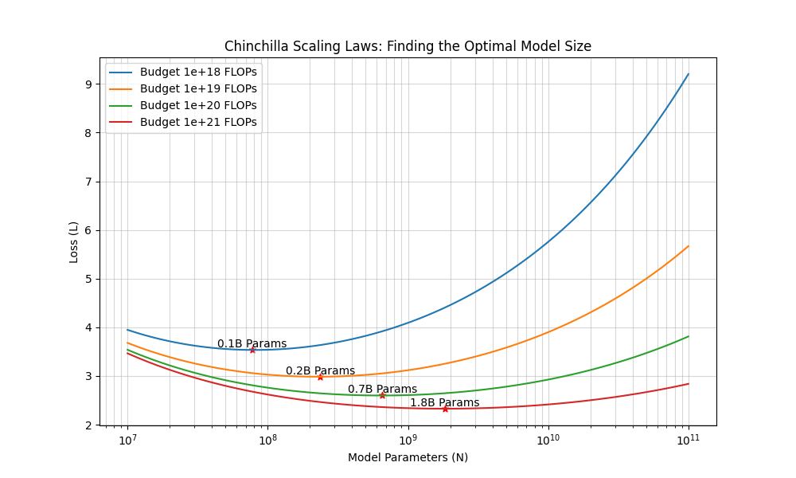

# [Appendix B] 缩放定律 (Scaling Laws)：预知未来的数学

**摘要**：深度学习曾经被认为是一门“炼金术”，直到 **Scaling Laws（缩放定律）** 的出现。它揭示了一个惊人的物理事实：模型的性能（Loss）与计算量、参数量、数据量之间存在严格的**幂律关系**。本章将推导著名的 **Chinchilla Scaling Laws**，解释“计算最优”前沿，并探讨在 2024+ Llama 时代，为什么我们开始追求“推理最优”而非“训练最优”。

---

## 1. 幂律现象 (The Power Law)

### 1.1 经验公式
OpenAI (Kaplan et al., 2020) 和 DeepMind (Hoffmann et al., 2022) 发现，测试集上的交叉熵损失 $L$ 与变量 $X$ 之间遵循幂函数关系：

$$ L(X) \approx C + \frac{A}{X^\alpha} $$

或者在双对数坐标系 (Log-Log Scale) 下：

$$ \log(L(X) - C) \approx \log A - \alpha \log X $$

这表现为一条**直线**。这意味着：**只要你不断增加算力/数据/参数，Loss 就会可预测地下降，没有尽头（直到达到不可约误差 $C$）。**

### 1.2 为什么是幂律？
从流形假设 (Chapter 26) 的角度理解：
*   高维数据流形被复杂的曲面包裹。
*   增加参数量 $N$ 或数据量 $D$，相当于用更细的网格去逼近这个流形。
*   逼近误差通常与网格密度的幂次成反比（类似于泰勒展开的余项）。

---

## 2. 计算预算与优化约束

假设我们有固定的计算预算 $C$ (Compute, 单位 FLOPs)，我们需要决定分配多少给模型大小 $N$ (Parameters)，多少给训练数据量 $D$ (Tokens)。

### 2.1 FLOPs 近似公式
训练一个 Transformer 模型的计算量近似为：
$$ C \approx 6 N D $$
**推导**：
*   **前向传播 (Forward)**：每个参数涉及一次乘法和一次加法（2 FLOPs）。$C_{fwd} \approx 2N$ per token。
*   **反向传播 (Backward)**：计算梯度和更新权重，计算量约为前向的 2 倍。$C_{bwd} \approx 4N$ per token。
*   **合计**：$6N$ FLOPs per token。

### 2.2 参数化损失函数
DeepMind 在 Chinchilla 论文中提出，联合损失函数可以建模为：
$$ L(N, D) = E + \frac{A}{N^\alpha} + \frac{B}{D^\beta} $$
其中：
*   $E$：不可约损失（如自然语言本身的熵）。
*   $\frac{A}{N^\alpha}$：由于模型太小导致的偏差 (Bias)。
*   $\frac{B}{D^\beta}$：由于数据太少导致的方差 (Variance)。
*   $\alpha, \beta$：拟合常数，通常在 $0.3 \sim 0.5$ 之间。

---

## 3. Chinchilla 最优前沿：拉格朗日推导

我们的目标是在约束 $C = 6ND$ 下，最小化 $L(N, D)$。

### 3.1 构造拉格朗日函数
$$ \mathcal{L}(N, D, \lambda) = \frac{A}{N^\alpha} + \frac{B}{D^\beta} - \lambda (6ND - C) $$
*(忽略常数 $E$，不影响极值点)*

### 3.2 求解偏导数
分别对 $N$ 和 $D$ 求偏导并设为 0：

1.  $\frac{\partial \mathcal{L}}{\partial N} = -\alpha A N^{-\alpha - 1} - 6\lambda D = 0 \implies \lambda = -\frac{\alpha A}{6 D N^{\alpha + 1}}$
2.  $\frac{\partial \mathcal{L}}{\partial D} = -\beta B D^{-\beta - 1} - 6\lambda N = 0 \implies \lambda = -\frac{\beta B}{6 N D^{\beta + 1}}$

### 3.3 联立求解
令两个 $\lambda$ 相等：
$$ \frac{\alpha A}{6 D N^{\alpha + 1}} = \frac{\beta B}{6 N D^{\beta + 1}} $$
化简得：
$$ \frac{\alpha A}{N^\alpha} = \frac{\beta B}{D^\beta} $$
这揭示了一个深刻的**均衡条件**：在最优状态下，模型规模带来的误差贡献应与数据规模带来的误差贡献成比例。

整理得到 $N$ 和 $D$ 的关系：
$$ N_{opt}^\alpha \propto D_{opt}^\beta \implies N_{opt} \propto D_{opt}^{\frac{\beta}{\alpha}} $$

### 3.4 它是如何随算力 $C$ 增长的？
利用 $C = 6ND$ 和上述关系，我们可以解出 $N_{opt}$ 和 $D_{opt}$ 关于 $C$ 的表达式：

$$ N_{opt} \propto C^{\frac{\beta}{\alpha + \beta}}, \quad D_{opt} \propto C^{\frac{\alpha}{\alpha + \beta}} $$

**Chinchilla 的发现 (Hoffmann et al., 2022)**：
通过大量实验拟合，发现 $\alpha \approx 0.50$, $\beta \approx 0.50$。
这意味着：
$$ \frac{\beta}{\alpha + \beta} \approx 0.5, \quad \frac{\alpha}{\alpha + \beta} \approx 0.5 $$

**结论**：
$$ N_{opt} \propto \sqrt{C}, \quad D_{opt} \propto \sqrt{C} $$
也就是说，当计算预算增加 10 倍时，你应该**同时**将模型参数量扩大 3.16 倍，数据量扩大 3.16 倍。
Kaplan 定律（$\alpha \approx 0.74, \beta \approx 0.28$）在数据受限时代成立；Chinchilla 定律（$\alpha \approx \beta \approx 0.5$）在数据充足时代成立。

---

## 4. 工程实战：黄金比例与 Llama 时代

### 4.1 Chinchilla 黄金法则 (训练最优)
基于上述推导，计算最优的配置通常遵循：
$$ D_{opt} \approx 20 \times N_{opt} $$
即：**每 1 个参数对应 20 个训练 Token。**

*   **10B 模型**：需要 200B Token。
*   **70B 模型**：需要 1.4T Token。

Llama 3 70B 实际用了 15T Token，约 214×N，属于极端推理最优策略。

### 4.2 Llama 时代的“推理最优” (Inference-Optimality)
在 2024-2025 年，我们发现 Llama 3 等模型并没有遵守 Chinchilla 定律。
*   **Llama 3 8B** 训练了 **15T Token**。
*   按 Chinchilla，8B 模型只需要 160B Token。Llama 3 "过拟合"了近 100 倍？

**解释**：Chinchilla 优化的是**训练成本** (Training Compute Optimal)。但实际应用中，**推理成本** (Inference Cost) 更重要。
*   推理成本只与参数量 $N$ 有关，与训练数据量 $D$ 无关。
*   为了获得一个极小但极其聪明的模型（便于部署在手机端），我们愿意花费比 Chinchilla 建议多得多的算力去训练一个小模型。
*   **新趋势**：在固定推理预算（固定 $N$）下，数据量 $D$ 越多越好（直到边际收益为 0）。

---

## 5. 实验结果分析




上图展示了在不同算力预算（$10^{18}$ 到 $10^{21}$ FLOPs）下的 Loss 曲线模拟结果。

### 图表解读
1.  **U 型曲线 (The Basin of Optimization)**：
    *   对于每条彩色曲线（代表一个固定的算力预算），都存在一个明显的最低点。
    *   **左侧上升区**：模型参数量 $N$ 太小，导致必须用海量数据 $D$ 来凑算力。但小模型容量不足（Under-parameterized），数据再多也学不进去，Loss 较高。
    *   **右侧上升区**：模型参数量 $N$ 太大，导致预算 $C$ 被模型吃光，剩下的数据量 $D$ 极少。大模型没吃饱（Under-trained），泛化能力差，Loss 也较高。

2.  **红色星号 (The Optimal Frontier)**：
    *   图中的红星标记了每个预算下的**最优模型大小**。
    *   连接这些红星的轨迹，就是 **Compute-Optimal Frontier**。
    *   可以看到，随着预算从 $10^{18}$ 增加到 $10^{21}$（1000倍），最优参数量从 0.1B 增加到了 1.8B（约 18 倍），大致符合 $\sqrt{1000} \approx 31.6$ 的比例量级（考虑到 $\alpha, \beta$ 实测值的微小偏差）。

3.  **工程启示**：
    *   如果你有 1000 张 H100 卡，你应该先查这张表，确定你的最佳参数量是 70B 还是 130B，而不是拍脑门决定。

---

## 6. 代码实现：寻找 Loss 的谷底

```python
import numpy as np
import matplotlib.pyplot as plt

def estimated_loss(N, D):
    """
    Chinchilla 论文中的参数化 Loss 函数
    系数来自论文附录 (Table A4)
    """
    E = 1.69  # 不可约误差 (Entropy of natural text)
    A = 406.4
    B = 410.7
    alpha = 0.34
    beta = 0.28
    
    term_N = A / (N ** alpha)
    term_D = B / (D ** beta)
    
    return E + term_N + term_D

# 设定计算预算 C (FLOPs)
# 例如：训练一个 1B 模型 + 20B Tokens -> C = 6 * 1e9 * 2e10 = 1.2e20
compute_budgets = [1e18, 1e19, 1e20, 1e21] 

plt.figure(figsize=(12, 7))

for C in compute_budgets:
    # 在固定预算下，扫描不同的 N (Parameters)
    # N 范围：从 10M 到 100B
    Ns = np.logspace(7, 11, 200)
    
    # 对应的 D 由约束 C = 6ND 决定
    Ds = C / (6 * Ns)
    
    losses = estimated_loss(Ns, Ds)
    
    # 找到该预算下的最优 N
    min_idx = np.argmin(losses)
    opt_N = Ns[min_idx]
    opt_loss = losses[min_idx]
    
    # 绘图
    plt.plot(Ns, losses, linewidth=2, label=f'Budget {C:.0e} FLOPs')
    plt.scatter(opt_N, opt_loss, c='red', s=100, marker='*', zorder=10)
    
    # 标注最优参数量
    plt.text(opt_N, opt_loss + 0.05, f"{opt_N/1e9:.1f}B Params", 
             ha='center', fontsize=12, color='black')

plt.xscale('log')
# plt.yscale('log') # Loss 变化范围不大，线性轴更直观
plt.xlabel('Model Parameters (N)', fontsize=12)
plt.ylabel('Loss (L)', fontsize=12)
plt.title('Chinchilla Scaling Laws: Finding the Optimal Model Size', fontsize=14)
plt.grid(True, which="both", ls="-", alpha=0.5)
plt.legend(fontsize=12)
plt.ylim(2, 9.5) # 聚焦有效区域
plt.savefig("chinchilla_scaling.png", dpi=300, bbox_inches='tight')
plt.show()

···