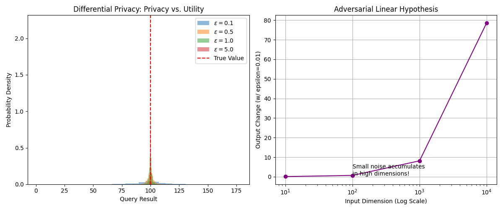

# [Appendix C] 安全数学：差分隐私与对抗鲁棒性

**摘要**：在 AI 走向落地应用的过程中，安全性成为了不可忽视的数学问题。本章探讨两个核心领域：**差分隐私 (Differential Privacy, DP)** —— 如何通过数学定义的噪声保护数据隐私；**对抗鲁棒性 (Adversarial Robustness)** —— 为什么高维空间中不可见的微小扰动足以摧毁深度神经网络的判断，以及其背后的几何原理。

---

## 1. 差分隐私 (Differential Privacy)

隐私不是一种感觉，而是一个严格的数学定义。DP 的核心思想是：**攻击者无法通过观察算法的输出，判断某个特定的样本是否存在于数据集中。**

### 1.1 $(\epsilon, \delta)$-DP 定义
设有两个**相邻数据集** $D$ 和 $D'$，它们之间仅相差一条记录（例如，$D$ 包含你的数据，$D'$ 不包含）。
随机算法 $\mathcal{M}$ 满足 $(\epsilon, \delta)$-差分隐私，当且仅当对于所有可能的输出集合 $S \subseteq \text{Range}(\mathcal{M})$：

$$ P[\mathcal{M}(D) \in S] \le e^\epsilon \cdot P[\mathcal{M}(D') \in S] + \delta $$

*   **$\epsilon$ (Privacy Budget)**：隐私预算。$\epsilon$ 越小，隐私保护越强（两个概率分布越接近），但数据可用性越差。
*   **$\delta$**：失败概率。通常要求 $\delta \ll 1/|D|$（小于样本量的倒数）。

### 1.2 灵敏度 (Sensitivity)
为了掩盖单条数据的影响，我们需要知道单条数据最大能对输出造成多大改变。
对于查询函数 $f$，其 $L_1$-灵敏度定义为：
$$ \Delta f = \max_{D, D'} ||f(D) - f(D')||_1 $$
例如：如果 $f$ 是“统计患病人数”，那么删掉一个人，结果最多变 1，故 $\Delta f = 1$。

### 1.3 拉普拉斯机制 (The Laplace Mechanism)
对于实数值函数 $f$，拉普拉斯机制通过加入服从拉普拉斯分布的噪声来实现 $\epsilon$-DP（此时 $\delta=0$）：

$$ \mathcal{M}(D) = f(D) + \eta, \quad \eta \sim \text{Lap}\left( \frac{\Delta f}{\epsilon} \right) $$

**数学证明（简述）**：
拉普拉斯分布的概率密度函数为 $p(x) = \frac{1}{2b} e^{-|x|/b}$，其中 $b = \Delta f / \epsilon$。
考虑最坏情况 $|f(D) - f(D')| = \Delta f$：
$$ \frac{P(x|D)}{P(x|D')} = \frac{e^{-|x - f(D)|/b}}{e^{-|x - f(D')|/b}} = e^{\frac{|x - f(D')| - |x - f(D)|}{b}} \le e^{\frac{|f(D) - f(D')|}{b}} = e^{\frac{\Delta f}{\Delta f / \epsilon}} = e^\epsilon $$
证毕。

### 1.4 深度学习中的 DP-SGD
在训练 LLM 时，我们不能直接加噪声到 Loss 上，而是加在**梯度**上。
**DP-SGD 算法步骤**：
1.  **计算梯度**：$g_i = \nabla_\theta \mathcal{L}(x_i)$。
2.  **梯度裁剪 (Clipping)**：限制单样本梯度的范数，强制设定灵敏度上界 $C$。
    $$ \bar{g}_i = g_i / \max(1, \frac{||g_i||_2}{C}) $$
3.  **加噪 (Noise Injection)**：使用高斯机制（因为高斯分布遵循中心极限定理，更适合多轮迭代组合）。
    $$ \tilde{g} = \frac{1}{B} \sum \bar{g}_i + \mathcal{N}(0, \sigma^2 C^2 I) $$

---

## 2. 对抗攻击的高维几何 (Adversarial Geometry)

为什么一张熊猫的照片，加上一点点人类肉眼看不见的噪声，机器就会以 99% 的置信度认为是长臂猿？

### 2.1 攻击形式化
对抗攻击是在 $\epsilon$-球内寻找损失函数最大的点：
$$ \max_{||\delta||_\infty \le \epsilon} \mathcal{L}(f_\theta(x + \delta), y) $$

### 2.2 线性解释 (The Linearity Hypothesis)
Ian Goodfellow 提出了一个极其直观的解释：**这种脆弱性并非来自非线性，恰恰来自神经网络的高度线性行为。**

考虑一个线性模型（或神经网络的一层）：$w^T x$。
加入扰动 $\eta$，且限制 $||\eta||_\infty \le \epsilon$（即每个像素改变不超过 $\epsilon$）。
为了最大化激活值的变化，攻击者应设定 $\eta = \epsilon \cdot \text{sign}(w)$。

此时激活值的变化量为：
$$ \Delta = w^T (x + \eta) - w^T x = w^T \eta = \epsilon \sum_{i=1}^n |w_i| $$

**高维诅咒**：
假设输入维度 $n$（例如图片像素）非常大。即使 $\epsilon$ 很小（不可察觉），如果 $n$ 是 1,000,000，且权重均值是 $m$，那么变化量 $\Delta \approx \epsilon \cdot n \cdot m$。
**微小的像素级扰动，经过高维度的累积，足以跨越决策边界。**

### 2.3 FGSM (Fast Gradient Sign Method)
基于上述线性假设，FGSM 攻击直接利用梯度方向生成对抗样本：
$$ x_{adv} = x + \epsilon \cdot \text{sign}(\nabla_x \mathcal{L}(\theta, x, y)) $$
这实际上是在损失函数的曲面上，沿着梯度的反方向（对于攻击者是上升方向）走了一大步。

### 2.4 几何视角的“鲁棒性与准确性权衡”
*   **流形分布**：真实数据分布在一个低维流形上。
*   **决策边界**：模型学习到的边界试图将不同类别的流形分开。
*   **对抗样本**：在于流形法线方向（Normal Direction）上的微小偏移。模型在流形上拟合得很好（准确率高），但在流形外的区域从未受过训练，因此决策边界在法线方向上极其脆弱。
*   **结论**：要提高鲁棒性（通过对抗训练），往往需要平滑决策边界，这可能会导致在干净数据上的准确率下降。

---

## 3. 代码实战：噪声的双刃剑

以下代码演示了两个极端的噪声应用：
1.  **Laplace Noise**：为了保护隐私，主动加噪声。
2.  **FGSM Attack**：为了欺骗模型，恶意加噪声。

```python
import numpy as np
import matplotlib.pyplot as plt
import torch
import torch.nn as nn

# ================================
# Part 1: 差分隐私 (Laplace Mechanism)
# ================================
def laplace_mechanism(true_value, sensitivity, epsilon):
    """
    f(x) + Lap(sensitivity / epsilon)
    """
    scale = sensitivity / epsilon
    noise = np.random.laplace(0, scale)
    return true_value + noise

# 模拟查询：统计某病患病人数 (True count = 100)
true_count = 100
sensitivity = 1 # 删掉一个人最多变 1
epsilons = [0.1, 0.5, 1.0, 5.0]

results = []
for eps in epsilons:
    # 模拟 1000 次查询
    noisy_counts = [laplace_mechanism(true_count, sensitivity, eps) for _ in range(1000)]
    results.append(noisy_counts)

# ================================
# Part 2: 对抗攻击 (FGSM Math Demo)
# ================================
def fgsm_linear_demo(dim=1000, epsilon=0.01):
    """
    演示高维空间中线性累积效应
    """
    # 模拟一个线性权重 w (随机)
    w = torch.randn(dim)
    # 模拟一个输入 x
    x = torch.randn(dim)
    
    # 原始输出
    original_output = torch.dot(w, x).item()
    
    # 构造对抗扰动：eta = epsilon * sign(w)
    # 目的：最大化 w^T (x + eta)
    perturbation = epsilon * torch.sign(w)
    
    # 对抗输出
    adv_x = x + perturbation
    adv_output = torch.dot(w, adv_x).item()
    
    # 变化量
    delta = adv_output - original_output
    theoretical_delta = epsilon * torch.sum(torch.abs(w)).item()
    
    return original_output, adv_output, delta, theoretical_delta

# ================================
# Visualization
# ================================
plt.figure(figsize=(12, 5))

# Plot 1: DP Noise Distribution
plt.subplot(1, 2, 1)
for i, eps in enumerate(epsilons):
    # Fix: 使用 rf'' (raw f-string) 来避免 \epsilon 被误判为转义字符
    plt.hist(results[i], bins=30, alpha=0.5, density=True, label=rf'$\epsilon={eps}$')
plt.axvline(true_count, color='r', linestyle='--', label='True Value')
plt.title("Differential Privacy: Privacy vs. Utility")
plt.xlabel("Query Result")
plt.ylabel("Probability Density")
plt.legend()

# Plot 2: Adversarial Dimension Effect
plt.subplot(1, 2, 2)
dims = [10, 100, 1000, 10000]
deltas = []
for d in dims:
    _, _, delta, _ = fgsm_linear_demo(dim=d, epsilon=0.01)
    deltas.append(delta)

plt.plot(dims, deltas, 'o-', color='purple')
plt.xscale('log')
plt.title("Adversarial Linear Hypothesis")
plt.xlabel("Input Dimension (Log Scale)")
plt.ylabel("Output Change (w/ epsilon=0.01)")
plt.grid(True)
plt.text(100, deltas[1], "Small noise accumulates\nin high dimensions!", fontsize=10)

plt.tight_layout()
plt.show()
```

**结果解析**



* 左图 (DP)：
    * 当 $\varepsilon=0.1$ (蓝色) 时，分布极其宽（方差大），攻击者很难猜出真实值是 100，但数据可用性很差。
    * 当 $\varepsilon=5.0$
 (红色) 时，分布尖锐地集中在 100 附近，数据很准，但隐私泄露风险大。
这就是 Privacy-Utility Tradeoff 的直观体现。
* 右图 (Adversarial)：
    * 横坐标是输入维度 $n$（对数坐标）。纵坐标是输出的变化量。
    * 注意 $\varepsilon=0.01$（微小扰动）。
    * 随着维度$n$从 10 增加到 10000，输出的变化量呈线性爆炸。
    * 这就是为什么 ImageNet ($224x224x3 \approx 15万维$) 模型如此脆弱的数学本质——维度本身就是攻击者的武器。

本附录揭示了数学的防御属性。无论是通过拉普拉斯噪声掩盖个体，还是通过对抗训练修补高维边界，安全数学都是现代 AI 信任体系的基石。