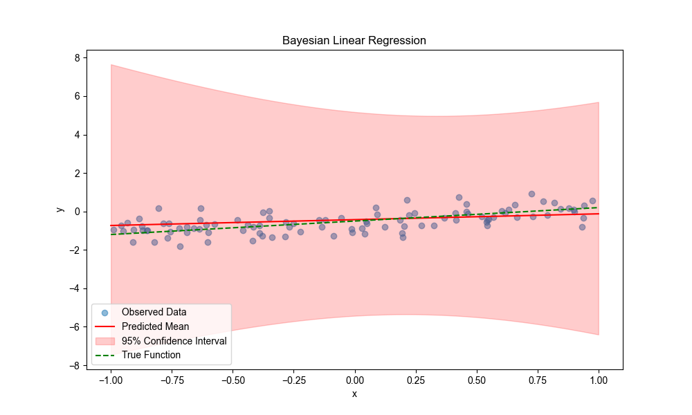
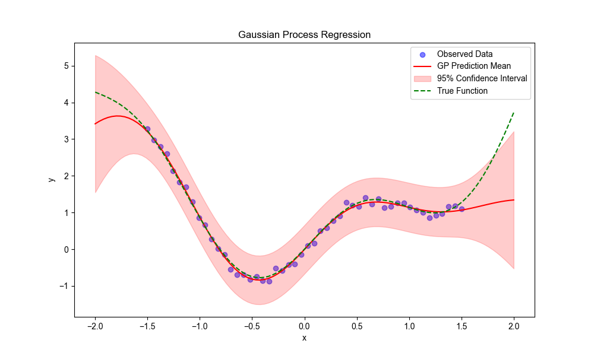
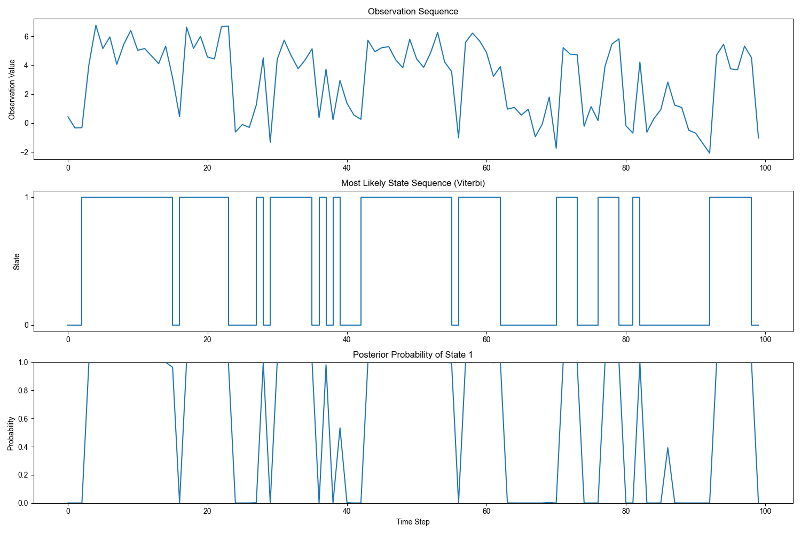

## Probabilistic TensorFlow

TensorFlow Probability (TFP) is a library built on TensorFlow for probabilistic inference and statistical analysis. The TFP library provides many functions and classes for probabilistic inference and statistical analysis, including:
- Probability distributions: The TFP library provides many probability distributions, including Gaussian distribution, Bernoulli distribution, Poisson distribution, etc.
- Probabilistic models: The TFP library provides many probabilistic models, including Bayesian networks, Hidden Markov Models, etc.
- Probabilistic inference: The TFP library provides many probabilistic inference algorithms, including variational inference, Markov Chain Monte Carlo, etc.

### 1. Basic Principles of TensorFlow Probability

TensorFlow Probability (TFP) is a probabilistic programming library built on top of TensorFlow, making it easier to build complex probabilistic models, perform Bayesian inference, and conduct statistical analysis. The core idea of probabilistic programming is to explicitly incorporate uncertainty into the model, rather than just outputting a single prediction value.

#### 1.1 Basic Concepts of Probabilistic Programming

- **Probability distribution**: Describes the probability distribution function of possible values of a random variable.
- **Random variable**: A variable whose value is determined by a random process.
- **Joint distribution**: The joint probability distribution of multiple random variables.
- **Conditional distribution**: The probability distribution of other variables given certain variable values.
- **Prior distribution**: The belief about parameters before observing data.
- **Posterior distribution**: The updated parameter distribution after observing data.
- **Likelihood function**: The probability of observing data given parameter values.

#### 1.2 Bayesian Inference

Bayesian inference is the core of probabilistic programming, based on Bayes' theorem:
$$
P(θ|D) = P(D|θ) × P(θ) / P(D)
$$
where:
- P(θ|D) is the posterior probability: the probability of parameter θ given data D.
- P(D|θ) is the likelihood function: the probability of observing data D given parameter θ.
- P(θ) is the prior probability: the initial belief about parameter θ.
- P(D) is the marginal likelihood: the probability of the data, serving as a normalization constant.

### 2. Main Components of TFP

#### 2.1 Probability Distributions (tfp.distributions)

TFP provides a rich implementation of probability distributions, each supporting the following operations:

```python
# Create a normal distribution
normal_dist = tfp.distributions.Normal(loc=0., scale=1.)

# Sampling
samples = normal_dist.sample(1000)  # Generate 1000 samples

# Calculate probability density/mass
prob = normal_dist.prob(0.5)  # P(X = 0.5)

# Calculate log probability
log_prob = normal_dist.log_prob(0.5)  # log(P(X = 0.5))

# Calculate cumulative distribution function
cdf = normal_dist.cdf(0.5)  # P(X <= 0.5)

# Calculate entropy
entropy = normal_dist.entropy()
```

Common distributions include:

- Continuous distributions ：Normal、Beta、Gamma、StudentT、Uniform etc
- Discrete distributions ：Bernoulli、Binomial、Categorical、Poissonetc
- Multivariate distributions ：MultivariateNormalDiag、Dirichlet（狄利克雷分布）etc
- Transformed distributions ：TransformedDistribution
- Mixture distributions ：Mixture 

#### 2.2 Hierarchical Models and Joint Distributions
TFP supports building complex hierarchical models using JointDistributionSequential or JointDistributionCoroutine to define dependencies between variables:
```python
# Define joint distribution using coroutine style
def model_fn():
    # Prior distribution
    weight = yield tfd.Normal(loc=0., scale=1.)
    bias = yield tfd.Normal(loc=0., scale=1.)
    
    # Likelihood function
    predictions = weight * x_data + bias
    yield tfd.Normal(loc=predictions, scale=0.1)

# Create joint distribution
model = tfd.JointDistributionCoroutine(model_fn)
```

#### Variational Inference (tfp.vi)
Variational inference is a technique for approximating posterior distributions, particularly suitable for complex models:
```python
# Define variational posterior distribution
def surrogate_posterior_fn():
    w_loc = tf.Variable(0.)
    w_scale = tf.Variable(1., constraint=lambda x: tf.nn.softplus(x))
    b_loc = tf.Variable(0.)
    b_scale = tf.Variable(1., constraint=lambda x: tf.nn.softplus(x))
    
    return [
        tfd.Normal(loc=w_loc, scale=w_scale),
        tfd.Normal(loc=b_loc, scale=b_scale)
    ]

# Create variational posterior
surrogate_posterior = surrogate_posterior_fn()

# Define loss function (negative ELBO)
def neg_elbo():
    return -tfp.vi.monte_carlo_variational_loss(
        model.log_prob, 
        surrogate_posterior, 
        model.dtype, 
        y_data
    )

# Optimize variational parameters
optimizer = tf.optimizers.Adam(learning_rate=0.1)
optimizer.minimize(neg_elbo, var_list=tf.trainable_variables())
```

#### 2.4 Markov Chain Monte Carlo (tfp.mcmc)
MCMC is a method for approximating posterior distributions through sampling:
```python
# Define log probability function of target distribution
def target_log_prob_fn(x):
    return model.log_prob(x, y_data)

# Initial state
initial_state = [tf.zeros([]), tf.zeros([])]

# Create transition kernel
hmc_kernel = tfp.mcmc.HamiltonianMonteCarlo(
    target_log_prob_fn=target_log_prob_fn,
    step_size=0.1,
    num_leapfrog_steps=10
)

# Add adaptive adjustment
adaptive_hmc = tfp.mcmc.SimpleStepSizeAdaptation(
    inner_kernel=hmc_kernel,
    num_adaptation_steps=1000
)

# Run MCMC
samples, [is_accepted] = tfp.mcmc.sample_chain(
    num_results=2000,
    num_burnin_steps=1000,
    current_state=initial_state,
    kernel=adaptive_hmc
)
```

### 3. Practical Application Examples 
#### 3.1 Bayesian Linear Regression
Bayesian linear regression is the probabilistic version of linear regression, estimating not only point values of parameters but also their uncertainty:
```python
import tensorflow as tf
import tensorflow_probability as tfp
import numpy as np
import matplotlib.pyplot as plt

tfd = tfp.distributions

# Generate synthetic data
def generate_data(n_samples=100, noise_std=0.5):
    np.random.seed(42)
    x = np.random.uniform(-1, 1, size=n_samples).astype(np.float32)
    true_w, true_b = 0.7, -0.5
    y = true_w * x + true_b + np.random.normal(0, noise_std, size=n_samples).astype(np.float32)
    return x, y, true_w, true_b

x_data, y_data, true_w, true_b = generate_data()
# Ensure data is a tensor
x_data = tf.convert_to_tensor(x_data, dtype=tf.float32)
y_data = tf.convert_to_tensor(y_data, dtype=tf.float32)

# Define model - using a simpler method
def bayesian_linear_regression():
    # Prior distribution
    w_prior = tfd.Normal(loc=0., scale=1.)
    b_prior = tfd.Normal(loc=0., scale=1.)
    
    # Variational posterior
    w_loc = tf.Variable(0., name='w_loc')
    w_scale = tf.Variable(1., name='w_scale', constraint=lambda x: tf.nn.softplus(x))
    w_posterior = tfd.Normal(loc=w_loc, scale=w_scale)
    
    b_loc = tf.Variable(0., name='b_loc')
    b_scale = tf.Variable(1., name='b_scale', constraint=lambda x: tf.nn.softplus(x))
    b_posterior = tfd.Normal(loc=b_loc, scale=b_scale)
    
    return (w_prior, b_prior), (w_posterior, b_posterior), [w_loc, w_scale, b_loc, b_scale]

# Get prior and posterior distributions
priors, posteriors, variational_params = bayesian_linear_regression()
w_prior, b_prior = priors
w_posterior, b_posterior = posteriors

# Define loss function (ELBO)
@tf.function
def elbo():
    # Sample from posterior distribution
    w_samples = w_posterior.sample(10)
    b_samples = b_posterior.sample(10)
    
    # Calculate likelihood
    predictions = tf.reshape(w_samples, [-1, 1]) * x_data + tf.reshape(b_samples, [-1, 1])
    log_likelihood = tf.reduce_mean(
        tfd.Normal(loc=predictions, scale=0.5).log_prob(y_data)
    )
    
    # Calculate KL divergence
    kl_w = tfd.kl_divergence(w_posterior, w_prior)
    kl_b = tfd.kl_divergence(b_posterior, b_prior)
    
    # Return ELBO (we want to maximize ELBO, so minimize -ELBO during training)
    return log_likelihood - (kl_w + kl_b)

# Train model
optimizer = tf.optimizers.Adam(learning_rate=0.1)

@tf.function
def train_step():
    with tf.GradientTape() as tape:
        loss = -elbo()  # Minimize negative ELBO
    gradients = tape.gradient(loss, variational_params)
    optimizer.apply_gradients(zip(gradients, variational_params))
    return loss

for i in range(1000):
    loss_value = train_step()
    if i % 200 == 0:
        print(f"Step {i}: ELBO = {-loss_value.numpy()}")

# Extract learned parameters
w_loc, w_scale, b_loc, b_scale = [p.numpy() for p in variational_params]
print(f"Learned weight: mean = {w_loc}, std = {w_scale}")
print(f"Learned bias: mean = {b_loc}, std = {b_scale}")
print(f"True weight: {true_w}, true bias: {true_b}")

# Visualize results
plt.figure(figsize=(10, 6))

# Set Chinese font support
plt.rcParams['font.sans-serif'] = ['Arial Unicode MS']  # Font supporting Chinese on macOS
plt.rcParams['axes.unicode_minus'] = False  # Correctly display minus sign

plt.scatter(x_data, y_data, alpha=0.5, label='Observed data')

# Plot regression line
x_test = np.linspace(-1, 1, 100).astype(np.float32)
y_pred_mean = w_loc * x_test + b_loc

# Plot uncertainty interval
num_samples = 100
w_samples = w_posterior.sample(num_samples).numpy()
b_samples = b_posterior.sample(num_samples).numpy()

y_samples = np.zeros((num_samples, len(x_test)))
for i in range(num_samples):
    y_samples[i, :] = w_samples[i] * x_test + b_samples[i]

y_mean = np.mean(y_samples, axis=0)
y_std = np.std(y_samples, axis=0)

plt.plot(x_test, y_pred_mean, 'r-', label="Predicted mean")
plt.fill_between(x_test, y_mean - 2*y_std, y_mean + 2*y_std, color='r', alpha=0.2, label='95% confidence interval')
plt.plot(x_test, true_w * x_test + true_b, 'g--', label="True function")
plt.legend()
plt.title("Bayesian Linear Regression")
plt.xlabel("x")
plt.ylabel("y")
plt.savefig('bayesian_linear_regression.png')
plt.show()
```

#### 3.2 Bayesian Neural Networks
Bayesian neural networks introduce uncertainty into the weights of neural networks:
```python
def bayesian_neural_network(features):
    def model_fn():
        # Prior for the first layer weights
        w1 = yield tfd.Independent(
            tfd.Normal(loc=tf.zeros([1, 10]), scale=1.),
            reinterpreted_batch_ndims=2
        )
        b1 = yield tfd.Independent(
            tfd.Normal(loc=tf.zeros([10]), scale=1.),
            reinterpreted_batch_ndims=1
        )
        
        # Prior for the second layer weights
        w2 = yield tfd.Independent(
            tfd.Normal(loc=tf.zeros([10, 1]), scale=1.),
            reinterpreted_batch_ndims=2
        )
        b2 = yield tfd.Independent(
            tfd.Normal(loc=tf.zeros([1]), scale=1.),
            reinterpreted_batch_ndims=1
        )
        
        # Forward propagation
        hidden = tf.nn.relu(tf.matmul(features[:, tf.newaxis], w1) + b1)
        predictions = tf.matmul(hidden, w2) + b2
        
        # Likelihood function
        yield tfd.Independent(
            tfd.Normal(loc=predictions[:, 0], scale=0.1),
            reinterpreted_batch_ndims=1
        )
    
    return tfd.JointDistributionCoroutine(model_fn)
```


he red solid line in the figure represents the predicted mean, the red shaded area represents the 95% confidence interval, the green dashed line represents the true function, and the blue scatter points represent the observed data. Bayesian methods not only provide point predictions but also quantify the uncertainty of predictions.


#### 3.3 Gaussian Process Regression
Gaussian processes are a non-parametric Bayesian method, particularly suitable for small datasets:
```python
import tensorflow_probability as tfp
import numpy as np

# Define kernel function
kernel = tfp.math.psd_kernels.ExponentiatedQuadratic(
    amplitude=tf.Variable(1., name='amplitude'),
    length_scale=tf.Variable(1., name='length_scale')
)

# Create Gaussian process regression model
gp = tfp.distributions.GaussianProcess(
    kernel=kernel,
    index_points=x_data[:, tf.newaxis],
    observation_noise_variance=0.1
)

# Calculate log likelihood
log_likelihood = gp.log_prob(y_data)

# Optimize kernel parameters
def loss_fn():
    return -gp.log_prob(y_data)

optimizer = tf.optimizers.Adam(learning_rate=0.01)
for i in range(1000):
    optimizer.minimize(loss_fn, var_list=[kernel.amplitude, kernel.length_scale])
    
# Prediction
x_test = np.linspace(-2, 2, 100).astype(np.float32)
gp_pred = tfp.distributions.GaussianProcessRegressionModel(
    kernel=kernel,
    index_points=x_test[:, tf.newaxis],
    observation_index_points=x_data[:, tf.newaxis],
    observations=y_data,
    observation_noise_variance=0.1
)

# Get predicted mean and variance
mean = gp_pred.mean()
stddev = tf.sqrt(gp_pred.variance())

# Calculate evaluation metrics
y_true_test = true_function(x_test)
mse = tf.reduce_mean(tf.square(mean - y_true_test))
rmse = tf.sqrt(mse)
mae = tf.reduce_mean(tf.abs(mean - y_true_test))

# Calculate R² score
ss_total = tf.reduce_sum(tf.square(y_true_test - tf.reduce_mean(y_true_test)))
ss_residual = tf.reduce_sum(tf.square(y_true_test - mean))
r2 = 1 - ss_residual / ss_total

# Calculate prediction interval coverage
in_interval = tf.reduce_mean(
    tf.cast(
        tf.logical_and(
            y_true_test >= mean - 2 * stddev,
            y_true_test <= mean + 2 * stddev
        ),
        tf.float32
    )
)

print(f"Model evaluation metrics:")
print(f"MSE: {mse.numpy():.4f}")
print(f"RMSE: {rmse.numpy():.4f}")
print(f"MAE: {mae.numpy():.4f}")
print(f"R²: {r2.numpy():.4f}")
print(f"95% confidence interval coverage: {in_interval.numpy():.4f}")
```


The red solid line in the figure represents the GP predicted mean, the red shaded area represents the 95% confidence interval, the green dashed line represents the true function, and the blue scatter points represent the observed data. Gaussian processes can effectively capture nonlinear relationships and provide reasonable uncertainty estimates in sparse data regions.


#### 3.4 valuation of Gaussian Process Regression Models
The evaluation of Gaussian process regression models focuses not only on prediction accuracy but also on the quality of uncertainty estimates. Common evaluation metrics include:

1. Prediction accuracy metrics:
   
   - Mean Squared Error (MSE): The average squared difference between predicted and true values, the smaller the better.
   - Root Mean Squared Error (RMSE): The square root of MSE, in the same unit as the original data, easy to interpret.
   - Mean Absolute Error (MAE): The average absolute difference between predicted and true values, insensitive to outliers.
   - Coefficient of Determination (R²): The proportion of variance explained by the model, close to 1 indicates good fit.
2. Uncertainty estimation metrics:
   
   - Prediction interval coverage: The proportion of true values falling within the prediction interval, should be close to the theoretical value (e.g., 95%).
   - Negative log likelihood: Evaluates the quality of probabilistic predictions, considering both prediction accuracy and uncertainty estimation.
   - Calibration curve: Tests the consistency between predicted probabilities and actual frequencies.
3. Kernel parameter evaluation:
   
   - Amplitude: Controls the amplitude of function value changes.
   - Length scale: Controls the smoothness of function changes, smaller values indicate faster function changes.
A major advantage of Gaussian processes is that they provide not only point predictions but also complete predictive distributions, allowing us to quantify the uncertainty of predictions. This is valuable in many applications, such as active learning, Bayesian optimization, and risk-sensitive decision-making.


### 4. Advanced Topics

#### 4.1 Variational Autoencoder (VAE)
VAE is a generative model that combines neural networks and variational inference:

```python
class VAE(tf.keras.Model):
    def __init__(self, latent_dim):
        super(VAE, self).__init__()
        self.latent_dim = latent_dim
        
        # Encoder
        self.encoder = tf.keras.Sequential([
            tf.keras.layers.InputLayer(input_shape=(28, 28, 1)),
            tf.keras.layers.Conv2D(32, 3, strides=2, padding='same', activation='relu'),
            tf.keras.layers.Conv2D(32, 3, strides=2, padding='same', activation='relu'),
            tf.keras.layers.Conv2D(64, 3, strides=2, padding='same', activation='relu'),
            tf.keras.layers.Flatten(),
            tf.keras.layers.Dense(latent_dim * 2)  # Output mean and log variance
        ])
        
        # Decoder
        self.decoder = tf.keras.Sequential([
            tf.keras.layers.InputLayer(input_shape=(latent_dim,)),
            tf.keras.layers.Dense(7 * 7 * 64, activation='relu'),
            tf.keras.layers.Reshape((7, 7, 64)),
            tf.keras.layers.Conv2DTranspose(64, 3, strides=2, padding='same', activation='relu'),
            tf.keras.layers.Conv2DTranspose(32, 3, strides=2, padding='same', activation='relu'),
            tf.keras.layers.Conv2DTranspose(1, 3, padding='same')  # Output reconstructed image
        ])
    
    def encode(self, x):
        mean_logvar = self.encoder(x)
        mean, logvar = tf.split(mean_logvar, num_or_size_splits=2, axis=1)
        return mean, logvar
    
    def reparameterize(self, mean, logvar):
        eps = tf.random.normal(shape=tf.shape(mean))
        return mean + tf.exp(logvar * 0.5) * eps
    
    def decode(self, z):
        return self.decoder(z)
    
    def call(self, x):
        mean, logvar = self.encode(x)
        z = self.reparameterize(mean, logvar)
        x_recon = self.decode(z)
        return x_recon, mean, logvar
    
    def compute_loss(self, x):
        # Reconstruction loss and KL divergence
        x_recon, mean, logvar = self(x)
        
        # Reconstruction loss (mean squared error)
        recon_loss = tf.reduce_mean(tf.square(x - x_recon))
        
        # KL divergence: KL divergence between N(mean, var) and N(0, 1)
        kl_loss = -0.5 * tf.reduce_mean(1 + logvar - tf.square(mean) - tf.exp(logvar))
        
        return recon_loss + kl_loss
```

#### 4.2 Hidden Markov Model (HMM)
Hidden Markov Model is a probabilistic model for sequence data:

```python
import tensorflow_probability as tfp
import tensorflow as tf
import numpy as np
import matplotlib.pyplot as plt

# Set random seed for reproducibility
tf.random.set_seed(42)

# Create HMM model
hmm = tfp.distributions.HiddenMarkovModel(
    # Initial state distribution
    initial_distribution=tfp.distributions.Categorical(probs=[0.8, 0.2]),
    # Transition matrix
    transition_distribution=tfp.distributions.Categorical(
        probs=[[0.7, 0.3],   # Transition probabilities for state 0
               [0.2, 0.8]]), # Transition probabilities for state 1
    # Observation distribution
    observation_distribution=tfp.distributions.Normal(
        loc=[0., 5.],        # Observation means for state 0 and state 1
        scale=[1.0, 1.0]),   # Observation standard deviations for state 0 and state 1
    num_steps=100            # Sequence length
)

# Set Chinese font support
plt.rcParams['font.sans-serif'] = ['Arial Unicode MS']  # Font supporting Chinese on macOS
plt.rcParams['axes.unicode_minus'] = False  # Correctly display minus sign

# Sample from model - only return observations
observations = hmm.sample()
print(f"Observation sequence shape: {observations.shape}")

# Forward algorithm to compute marginal likelihood
log_prob = hmm.log_prob(observations)
print(f"Sequence log likelihood: {log_prob.numpy()}")

# Viterbi algorithm to find most likely state sequence
posterior_mode = hmm.posterior_mode(observations)
print(f"Most likely state sequence shape: {posterior_mode.shape}")

# Compute posterior marginal probabilities
posterior_marginal = hmm.posterior_marginals(observations)
# Extract probabilities from Categorical distribution
posterior_probs = posterior_marginal.probs_parameter()
print(f"Posterior marginal probabilities shape: {posterior_probs.shape}")

# Visualize results
plt.figure(figsize=(15, 10))

# Plot observations
plt.subplot(3, 1, 1)
plt.plot(observations.numpy())
plt.title('Observation Sequence')
plt.ylabel('Observation Value')

# Plot most likely state sequence
plt.subplot(3, 1, 2)
plt.step(range(len(posterior_mode)), posterior_mode.numpy())
plt.title('Most Likely State Sequence (Viterbi)')
plt.ylabel('State')
plt.yticks([0, 1])

# Plot posterior probability of state 1
plt.subplot(3, 1, 3)
plt.plot(posterior_probs.numpy()[:, 1])
plt.title('Posterior Probability of State 1')
plt.xlabel('Time Step')
plt.ylabel('Probability')
plt.ylim(0, 1)

plt.tight_layout()
plt.savefig('hmm_results.png')
plt.show()

# Evaluate model performance
# Calculate proportion of correctly classified states (assuming posterior_mode is close to true states)
# In practical applications, you need true labels to calculate this metric
predicted_means = tf.gather(
    [0., 5.],  # Observation means for state 0 and state 1
    posterior_mode
)

# Calculate mean squared error between predicted means and observations
mse = tf.reduce_mean(tf.square(predicted_means - observations))
print(f"MSE between predicted means and observations: {mse.numpy()}")

# Calculate number of state transitions
state_changes = tf.reduce_sum(tf.cast(
    tf.not_equal(posterior_mode[:-1], posterior_mode[1:]),
    tf.int32
))
print(f"Number of state transitions: {state_changes.numpy()}")
print(f"Average state transition probability per time step: {state_changes.numpy() / (len(posterior_mode) - 1)}")
```



From the figure, we can see:

1. The top subplot shows the observation sequence, with data points switching between two different levels (around 0 and 5), corresponding to the observation distribution means of the two states.
2. The middle subplot shows the most likely hidden state sequence inferred by the Viterbi algorithm.
3. The bottom subplot shows the posterior probability of the system being in state 1.
This example demonstrates how HMM can infer hidden states from observation data, which is widely used in time series analysis, speech recognition, and biological sequence analysis.

#### 4.3 Dirichlet Process Mixture Model
Dirichlet process is a non-parametric Bayesian method for clustering and density estimation:
Example can be found in ../probabilistic_tf/dirichlet.py

The results of running the Dirichlet Process Mixture Model are shown in the figure below:

From the clustering result figure, we can see:

1. The left subplot shows that the model has divided the data points into 3 main clusters, each represented by a different color.
2. The right subplot shows the distribution of the 3 true components used to generate the data.
3. The clustering results of the model are very close to the distribution of the true data, indicating that the Dirichlet Process Mixture Model successfully discovered the underlying structure in the data.
The loss curve during the model training process is shown in the figure below:

The loss curve shows the change in negative log likelihood during the model training process:

1. The curve shows an overall downward trend, indicating that the model is continuously optimizing during training.
2. The loss decreases rapidly at the beginning and then gradually levels off, which is typical of the optimization process.
3. The final loss value is relatively stable, indicating that the model has found a good local optimum.
The main advantage of the Dirichlet Process Mixture Model is that it can automatically determine the appropriate number of clusters without needing to specify it in advance like K-means. This is very valuable in practical applications, especially when we are unsure how many natural groupings are present in the data. Additionally, as a Bayesian method, it can quantify the uncertainty of cluster assignments, providing the probability of each data point belonging to each cluster.


### 5 Principles of Variational Inference
Variational inference is a technique for approximating complex posterior distributions by transforming inference problems into optimization problems.
#### 5.1 Basic Principles of Variational Inference
The core idea of variational inference is to find a simple distribution q(θ) to approximate the complex posterior distribution p(θ|D) by minimizing the KL divergence between the two distributions:
$$
KL(q(θ) || p(θ|D))
$$

This is equivalent to maximizing the Evidence Lower Bound (ELBO):
$$
ELBO(q) = E_q[log p(D, θ)] - E_q[log q(θ)] \

ELBO can be decomposed into: \

ELBO(q) = E_q[log p(D|θ)] - KL(q(θ) || p(θ))
$$

Where the first term is the expected data likelihood, and the second term is the KL divergence between the prior and the variational posterior.
#### 5.2 Mean Field Variational Inference
The mean field assumption is the most commonly used simplification assumption in variational inference, assuming that the variational posterior can be decomposed into the product of independent distributions for each parameter:
$$
q(θ) = ∏_i q_i(θ_i)
$$

This assumption greatly simplifies computation but may fail to capture correlations between parameters.
#### 5.3 Stochastic Variational Inference
Stochastic variational inference uses stochastic gradient descent to optimize the ELBO by estimating gradients through sampling:
$$
∇_φ ELBO ≈ ∇_φ log p(D, θ) - ∇_φ log q(θ; φ)
$$

Where θ ~ q(θ; φ) is a sample drawn from the variational posterior, and φ is the parameter of the variational posterior.

### 6. Principles of MCMC Methods
Markov Chain Monte Carlo (MCMC) methods are a class of algorithms that sample from complex distributions by constructing Markov chains.
#### 6.1 Basic Principles of MCMC
The core idea of MCMC is to construct a Markov chain whose stationary distribution is the target posterior distribution p(θ|D). By performing a long random walk on this chain, we can obtain samples that follow the posterior distribution.
#### 6.2 Metropolis-Hastings Algorithm
The Metropolis-Hastings algorithm is one of the most basic MCMC methods:

1. Generate a candidate state θ* from the current state θ_t
2. Calculate the acceptance probability $$α = min(1, [p(θ*|D) q(θ_t|θ*)] / [p(θ_t|D) q(θ*|θ_t)])$$
3. Accept the candidate state with probability α, otherwise retain the current state
Where q(θ*|θ_t) is the proposal distribution used to generate candidate states.
#### 6.3 Hamiltonian Monte Carlo (HMC)
HMC is an MCMC method that uses Hamiltonian dynamics to generate candidate states, particularly suitable for high-dimensional continuous parameter spaces:

1. Introduce momentum variables p and construct the Hamiltonian function H(θ, p) = -log p(θ|D) + p^T p / 2
2. Use the Leapfrog integrator to simulate Hamiltonian dynamics and generate candidate states (θ*, p*)
3. Accept the candidate state with probability min(1, exp(-H(θ*, p*) + H(θ, p)))
HMC effectively explores the parameter space by utilizing gradient information, reducing random walk behavior.

### 7 Considerations in Practical Applications 
#### 7.1 Model Selection and Evaluation
In the Bayesian framework, model selection typically uses the following methods:

- Bayesian Factor: Compare the ratio of marginal likelihoods between two models
- Posterior Predictive Check: Use the posterior predictive distribution to evaluate the model's fit to the data
- Information Criteria: Such as WAIC (Widely Applicable Information Criterion) or DIC (Deviance Information Criterion) 

#### 7.2 Computational Efficiency Considerations
Computational efficiency issues in probabilistic programming:

- Variational Inference vs MCMC: Variational inference is usually faster but may be less accurate, while MCMC is more accurate but has higher computational costs
- Model Parameterization: Different parameterization methods may lead to different computational efficiency and convergence
- Gradient Calculation: Automatic differentiation is crucial for efficiently implementing variational inference and HMC 
#### 7.3 Diagnostics and Convergence Checks
Methods to ensure the correct convergence of inference algorithms:

- MCMC Diagnostics: Use R-hat statistics, effective sample size, autocorrelation analysis, etc.
- Variational Inference Diagnostics: Monitor the convergence of ELBO and check the reasonableness of the posterior
- Sensitivity Analysis: Examine the sensitivity of results to prior choices 


### 8 Comparison and Summary of Probabilistic Models
The table below summarizes the characteristics, advantages, disadvantages, and applicable scenarios of several major probabilistic models we have learned:

| Model Type | Core Idea | Advantages | Disadvantages | Suitable Scenarios | Uncertainty Representation |
| --- | --- | --- | --- | --- | --- |
| Bayesian Linear Regression | Introduce prior distributions to the parameters of the linear model | 1. Provide parameter uncertainty<br>2. Prevent overfitting<br>3. Suitable for small datasets | 1. Limited expressive power<br>2. Difficult to capture non - linear relationships | 1. Small amount of data<br>2. Require interpretability<br>3. Need to quantify parameter uncertainty | Parameter posterior distribution |
| Gaussian Process Regression | Consider the function as an implementation of an infinite - dimensional Gaussian distribution | 1. Non - parametric, high flexibility<br>2. Provide a complete predictive distribution<br>3. Good performance on small datasets | 1. High computational complexity O(n³)<br>2. Sensitive to the choice of kernel functions<br>3. Poor performance on high - dimensional data | 1. Small to medium - sized datasets<br>2. Smooth and continuous functions<br>3. Active learning and Bayesian optimization | Function posterior distribution |
| Hidden Markov Model | Generate observation sequences through a hidden state sequence | 1. Suitable for sequential data<br>2. Strong interpretability<br>3. Fast training | 1. Limited by the Markov assumption<br>2. The number of states needs to be specified in advance<br>3. Difficult to capture long - term dependencies | 1. Time series analysis<br>2. Speech recognition<br>3. Biological sequence analysis | State posterior probability |
| Variational Autoencoder | A generative model that combines neural networks and variational inference | 1. Powerful generative ability<br>2. Learn meaningful latent representations<br>3. Scalable to large datasets | 1. Unstable training<br>2. Posterior collapse problem<br>3. Generated samples are blurry | 1. Image generation<br>2. Representation learning<br>3. Anomaly detection | Latent variable posterior distribution |
| Dirichlet Process Mixture Model | A non - parametric Bayesian clustering method | 1. Automatically determine the number of clusters<br>2. Quantify clustering uncertainty<br>3. Avoid overfitting and underfitting | 1. High computational complexity<br>2. Slow convergence<br>3. Poor performance on high - dimensional data | 1. Clustering analysis<br>2. Density estimation<br>3. Topic modeling | Cluster assignment posterior probability |

### Guidelines for Choosing the Right Model
When choosing probabilistic models in practical applications, consider the following factors:

1. Data Characteristics :
   
   - Data size: Small datasets are suitable for Bayesian methods and Gaussian processes
   - Data dimension: High-dimensional data may require dimensionality reduction or specialized high-dimensional models
   - Data type: Sequence data is suitable for HMM, image data is suitable for VAE
2. Task Requirements :
   
   - Prediction accuracy: Need for high-precision point predictions or complete predictive distributions
   - Uncertainty quantification: Need for reliable uncertainty estimates
   - Interpretability: Requirements for model interpretability
3. Computational Resources :
   
   - Training time: MCMC methods are usually slower than variational inference
   - Memory requirements: Gaussian processes have high memory requirements for large datasets
   - Inference speed: Real-time applications require fast inference
4. Prior Knowledge :
   
   - Availability of reliable prior information to incorporate into the model
   - How to set the strength of the prior
By comprehensively considering these factors, you can choose the most suitable probabilistic model for specific application scenarios and fully leverage the advantages of probabilistic programming to solve uncertainty modeling problems.

