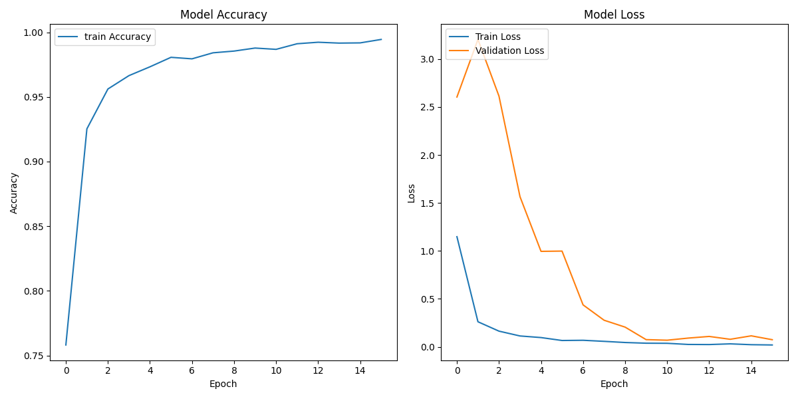
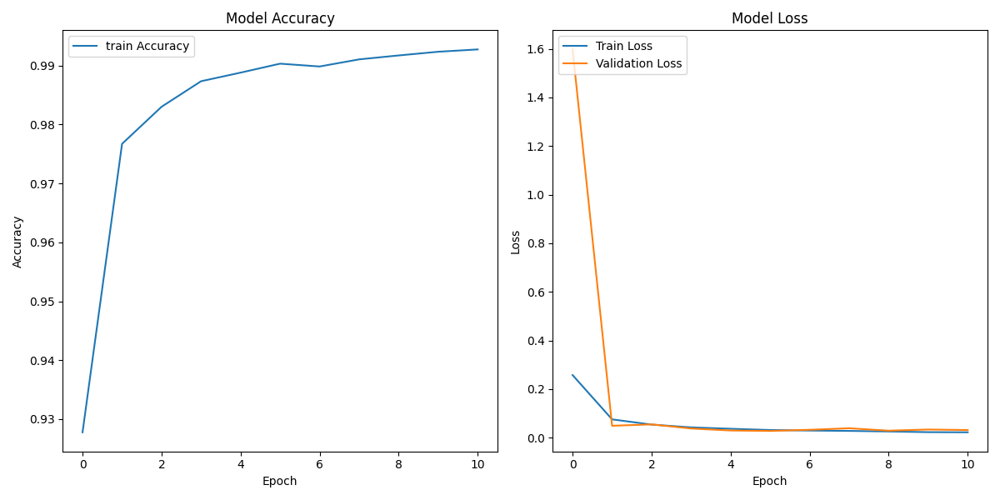

### Neural Network Model Optimization Steps





#### 1. Dataset Split Optimization
- **Validation Set Ratio Adjustment**: Adjust the validation set ratio from an excessively high 90% (`VALIDATION_SPLIT = 0.90`) to a more reasonable 20% (`VALIDATION_SPLIT = 0.2`).
- **Effect**: More data is used for training, improving the model's learning ability and generalization performance.

#### 2. Optimizer Selection and Configuration
- **Optimizer Adjustment**: Switch from RMSprop to Adam optimizer.
- **Learning Rate Setting**: Maintain exponential decay learning rate strategy with an initial value of 0.001.
- **Effect**: Adam generally provides more stable convergence performance, suitable for most deep learning tasks.

#### 3. Batch Size Optimization
- **Batch Adjustment**: Change batch size from 123 to 128 (power of 2).
- **Effect**: Improve GPU/memory utilization efficiency, accelerate the training process.

#### 4. Model Architecture Retention
- **Retain CNN Three-Layer Convolution Block Structure**:
  - Progressive feature extraction (32→64→128 convolution kernels)
  - Use BatchNormalization in each layer to stabilize training
  - Use increasing Dropout ratios (0.2→0.3→0.4) to prevent overfitting

#### 5. Optimization Effects
- **Training Accuracy**: Quickly increased from ~75% to over 99%.
- **Loss Convergence**: Training and validation loss rapidly decreased and became consistent within the first few epochs.
- **Training Stability**: Loss curve is smooth, with no significant oscillations.
- **Overfitting Control**: Training and validation loss curves are close, indicating good model generalization ability.

#### 6. Additional Optimization Directions to Try
- Data Augmentation: Apply random transformations to images to increase training sample diversity.
- Learning Rate Scheduling: Try other learning rate strategies such as cosine annealing.
- Regularization: Try L1/L2 regularization instead of or in conjunction with Dropout.
- Model Ensemble: Train multiple models and ensemble the prediction results.

Data Augmentation
```python
from tensorflow.keras.preprocessing.image import ImageDataGenerator  
# Data augmentation
datagen = ImageDataGenerator(
    # Image rotation angle ±30 degrees
    rotation_range=30,
    # Horizontal shift range is ±20% of width
    width_shift_range=0.2,
    # Vertical shift range is ±20% of height
    height_shift_range=0.2,
    # Randomly flip images
    horizontal_flip=True,
)
datagen.fit(X_train)
```